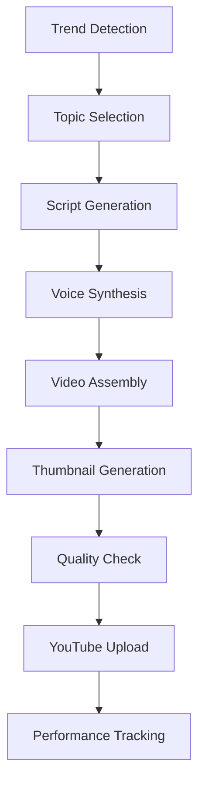

# YTEMPIRE AI/ML Pipeline Specifications

## Document Control
- **Version**: 1.0
- **Date**: January 2025
- **Author**: VP of AI
- **Audience**: Analytics Engineer, AI Team, Backend Team
- **Status**: FINAL - Ready for Implementation

---

## 1. Video Generation Pipeline Overview

### 1.1 Complete Pipeline Architecture



### 1.2 Pipeline Stages and Timing

```yaml
pipeline_stages:
  trend_detection:
    duration: "30 seconds"
    parallel: true
    gpu_required: false
    
  script_generation:
    duration: "45-90 seconds"
    model: "GPT-4"
    fallback: "GPT-3.5-turbo"
    cost: "$0.03-0.06"
    
  voice_synthesis:
    duration: "60-120 seconds"
    service: "ElevenLabs"
    fallback: "Google TTS"
    cost: "$0.15-0.30"
    
  video_assembly:
    duration: "180-300 seconds"
    processor: "FFmpeg"
    gpu_acceleration: true
    cost: "$0.10 compute"
    
  thumbnail_generation:
    duration: "20-30 seconds"
    model: "DALL-E 3"
    fallback: "Template-based"
    cost: "$0.04"
    
  total_pipeline:
    duration: "6-10 minutes"
    total_cost: "$0.32-0.50"
    success_rate_target: "95%"
```

---

## 2. AI Model Specifications

### 2.1 GPT-4 Script Generation

```python
class ScriptGenerator:
    """
    GPT-4 based script generation with quality control
    """
    
    # Prompt templates for different content types
    PROMPT_TEMPLATES = {
        'educational': """
        Create an engaging educational YouTube script about {topic}.
        
        Requirements:
        - Length: {duration} minutes ({word_count} words)
        - Hook: Compelling opening (first 5 seconds)
        - Structure: Problem → Solution → Examples → Summary
        - Style: {channel_style}
        - Include: 3-5 key points
        - CTA: Subscribe reminder at {cta_position}
        
        Audience: {target_audience}
        Tone: {tone}
        
        Script:
        """,
        
        'entertainment': """
        Write an entertaining YouTube script about {topic}.
        
        Requirements:
        - Length: {duration} minutes ({word_count} words)
        - Opening: Attention-grabbing hook
        - Pacing: Fast, energetic
        - Humor: {humor_level}
        - Story arc: Setup → Conflict → Resolution
        - Engagement: Ask questions to audience
        
        Style guide: {channel_style}
        References: {reference_videos}
        
        Script:
        """,
        
        'news_commentary': """
        Create a news commentary script about {topic}.
        
        Requirements:
        - Length: {duration} minutes ({word_count} words)
        - Structure: Summary → Analysis → Opinion → Conclusion
        - Tone: {tone} (balanced/opinionated)
        - Sources: Reference {source_count} sources
        - Controversy level: {controversy_level}/10
        
        Key points to cover: {key_points}
        Angle: {unique_angle}
        
        Script:
        """
    }
    
    async def generate_script(self, params: dict) -> dict:
        """
        Generate script with fallback and quality checks
        """
        # Calculate word count based on speaking rate
        word_count = params['duration'] * 150  # 150 words per minute average
        
        # Format prompt
        prompt = self.PROMPT_TEMPLATES[params['content_type']].format(
            topic=params['topic'],
            duration=params['duration'],
            word_count=word_count,
            channel_style=params['channel_style'],
            target_audience=params['audience'],
            tone=params['tone'],
            **params.get('extra_params', {})
        )
        
        # Try GPT-4 first
        try:
            response = await self.call_gpt4(prompt, params)
            quality_score = await self.check_quality(response)
            
            if quality_score < 0.7:
                # Regenerate with feedback
                response = await self.improve_script(response, quality_score)
            
            return {
                'script': response,
                'quality_score': quality_score,
                'model_used': 'gpt-4',
                'cost': self.calculate_cost(response, 'gpt-4')
            }
            
        except (RateLimitError, CostThresholdError):
            # Fallback to GPT-3.5-turbo
            return await self.generate_with_gpt35(prompt, params)
    
    def calculate_cost(self, text: str, model: str) -> float:
        """
        Calculate generation cost
        """
        tokens = len(text.split()) * 1.3  # Rough token estimation
        
        costs = {
            'gpt-4': {'input': 0.03, 'output': 0.06},  # per 1k tokens
            'gpt-3.5-turbo': {'input': 0.001, 'output': 0.002}
        }
        
        model_cost = costs[model]
        total_cost = (tokens / 1000) * model_cost['output']
        
        return round(total_cost, 4)
```

### 2.2 Voice Synthesis Pipeline

```python
class VoiceSynthesizer:
    """
    Multi-provider voice synthesis with quality optimization
    """
    
    VOICE_PROFILES = {
        'professional_male': {
            'elevenlabs_id': 'pNInz6obpgDQGcFmaJgB',  # Adam
            'google_voice': 'en-US-Neural2-D',
            'speed': 1.0,
            'pitch': 0
        },
        'professional_female': {
            'elevenlabs_id': 'EXAVITQu4vr4xnSDxMaL',  # Sarah
            'google_voice': 'en-US-Neural2-F',
            'speed': 1.0,
            'pitch': 0
        },
        'energetic_male': {
            'elevenlabs_id': 'VR6AewLTigWG4xSOukaG',  # Arnold
            'google_voice': 'en-US-Neural2-A',
            'speed': 1.1,
            'pitch': 0.5
        },
        'calm_female': {
            'elevenlabs_id': 'pFZP5JQG7iQjIQuC4Bku',  # Lily
            'google_voice': 'en-US-Neural2-C',
            'speed': 0.95,
            'pitch': -0.5
        }
    }
    
    async def synthesize_voice(self, script: str, voice_profile: str) -> dict:
        """
        Synthesize voice with provider fallback
        """
        profile = self.VOICE_PROFILES[voice_profile]
        
        # Split script into chunks for better processing
        chunks = self.split_script_intelligently(script)
        
        # Try ElevenLabs first (better quality)
        if await self.check_elevenlabs_quota():
            try:
                audio_chunks = []
                for chunk in chunks:
                    audio = await self.elevenlabs_synthesize(
                        text=chunk,
                        voice_id=profile['elevenlabs_id'],
                        settings={
                            'stability': 0.75,
                            'similarity_boost': 0.85,
                            'speed': profile['speed']
                        }
                    )
                    audio_chunks.append(audio)
                
                # Merge audio chunks
                final_audio = self.merge_audio_chunks(audio_chunks)
                
                return {
                    'audio_file': final_audio,
                    'duration': self.get_audio_duration(final_audio),
                    'provider': 'elevenlabs',
                    'cost': len(script) * 0.00015  # $0.15 per 1k chars
                }
                
            except ElevenLabsQuotaError:
                pass  # Fall through to Google TTS
        
        # Fallback to Google TTS
        return await self.google_tts_synthesize(script, profile)
    
    def split_script_intelligently(self, script: str) -> list:
        """
        Split script at natural breaks for better synthesis
        """
        # Split by paragraphs first
        paragraphs = script.split('\n\n')
        
        chunks = []
        current_chunk = ""
        
        for para in paragraphs:
            if len(current_chunk) + len(para) < 3000:  # 3k char limit
                current_chunk += para + "\n\n"
            else:
                if current_chunk:
                    chunks.append(current_chunk.strip())
                current_chunk = para + "\n\n"
        
        if current_chunk:
            chunks.append(current_chunk.strip())
        
        return chunks
```

### 2.3 Video Assembly Process

```python
class VideoAssembler:
    """
    FFmpeg-based video assembly with GPU acceleration
    """
    
    def __init__(self):
        self.ffmpeg_gpu = self.check_gpu_availability()
        self.stock_footage_api = StockFootageAPI()
        
    async def assemble_video(self, components: dict) -> dict:
        """
        Assemble video from components
        """
        # Video assembly configuration
        config = {
            'resolution': '1920x1080',
            'fps': 30,
            'codec': 'h264_nvenc' if self.ffmpeg_gpu else 'libx264',
            'bitrate': '4000k',
            'audio_codec': 'aac',
            'audio_bitrate': '192k'
        }
        
        # 1. Prepare visual content
        visuals = await self.prepare_visuals(components)
        
        # 2. Sync audio with visuals
        timeline = self.create_timeline(
            audio=components['audio'],
            visuals=visuals,
            script_timing=components['script_timing']
        )
        
        # 3. Generate FFmpeg command
        ffmpeg_cmd = self.build_ffmpeg_command(timeline, config)
        
        # 4. Execute video generation
        start_time = time.time()
        output_file = await self.execute_ffmpeg(ffmpeg_cmd)
        processing_time = time.time() - start_time
        
        # 5. Verify output
        video_info = self.verify_video_output(output_file)
        
        return {
            'video_file': output_file,
            'duration': video_info['duration'],
            'size_mb': video_info['size_mb'],
            'processing_time': processing_time,
            'gpu_used': self.ffmpeg_gpu,
            'cost': self.calculate_processing_cost(processing_time)
        }
    
    async def prepare_visuals(self, components: dict) -> list:
        """
        Prepare visual content based on script
        """
        visuals = []
        
        # Analyze script for visual cues
        visual_cues = self.extract_visual_cues(components['script'])
        
        for cue in visual_cues:
            if cue['type'] == 'stock_footage':
                # Search and download stock footage
                footage = await self.stock_footage_api.search_and_download(
                    keywords=cue['keywords'],
                    duration=cue['duration'],
                    style=components['channel_style']
                )
                visuals.append(footage)
                
            elif cue['type'] == 'text_overlay':
                # Generate text overlay
                overlay = self.generate_text_overlay(
                    text=cue['text'],
                    style=components['overlay_style'],
                    duration=cue['duration']
                )
                visuals.append(overlay)
                
            elif cue['type'] == 'chart':
                # Generate chart visualization
                chart = self.generate_chart(
                    data=cue['data'],
                    chart_type=cue['chart_type'],
                    duration=cue['duration']
                )
                visuals.append(chart)
        
        return visuals
    
    def build_ffmpeg_command(self, timeline: dict, config: dict) -> str:
        """
        Build complex FFmpeg command for video assembly
        """
        # Base command with GPU acceleration if available
        if config['codec'] == 'h264_nvenc':
            cmd = ['ffmpeg', '-hwaccel', 'cuda']
        else:
            cmd = ['ffmpeg']
        
        # Add inputs
        for input_file in timeline['inputs']:
            cmd.extend(['-i', input_file['path']])
        
        # Add complex filter for assembly
        filter_complex = self.build_filter_complex(timeline)
        cmd.extend(['-filter_complex', filter_complex])
        
        # Output settings
        cmd.extend([
            '-map', '[final_video]',
            '-map', '[final_audio]',
            '-c:v', config['codec'],
            '-preset', 'fast',
            '-b:v', config['bitrate'],
            '-c:a', config['audio_codec'],
            '-b:a', config['audio_bitrate'],
            '-movflags', '+faststart',  # For streaming
            '-y',  # Overwrite output
            timeline['output_path']
        ])
        
        return ' '.join(cmd)
```

### 2.4 Thumbnail Generation

```python
class ThumbnailGenerator:
    """
    AI-powered thumbnail generation with A/B testing support
    """
    
    THUMBNAIL_TEMPLATES = {
        'style_1': {
            'layout': 'hero_image_with_text',
            'text_area': {'x': 50, 'y': 50, 'w': 40, 'h': 30},
            'effects': ['drop_shadow', 'gradient_overlay']
        },
        'style_2': {
            'layout': 'split_screen',
            'text_area': {'x': 55, 'y': 20, 'w': 40, 'h': 60},
            'effects': ['blur_background', 'vignette']
        },
        'style_3': {
            'layout': 'minimal_center',
            'text_area': {'x': 10, 'y': 40, 'w': 80, 'h': 20},
            'effects': ['high_contrast', 'color_pop']
        }
    }
    
    async def generate_thumbnail(self, video_data: dict) -> dict:
        """
        Generate thumbnail with A/B testing variants
        """
        # Extract key frames from video
        key_frames = await self.extract_key_frames(video_data['video_file'])
        
        # Generate title text variations
        title_variations = self.generate_title_variations(video_data['title'])
        
        thumbnails = []
        
        # Generate 3 variants for A/B testing
        for i, (template_name, template) in enumerate(self.THUMBNAIL_TEMPLATES.items()):
            if i >= 3:  # Max 3 variants
                break
                
            # Select best key frame for this style
            best_frame = self.select_best_frame(key_frames, template['layout'])
            
            # Generate thumbnail
            thumbnail = await self.create_thumbnail(
                background=best_frame,
                title=title_variations[i % len(title_variations)],
                template=template,
                brand_elements=video_data.get('brand_elements', {})
            )
            
            # Calculate click probability (ML model)
            click_score = await self.predict_click_rate(thumbnail, video_data)
            
            thumbnails.append({
                'image': thumbnail,
                'variant': f'variant_{i+1}',
                'predicted_ctr': click_score,
                'template': template_name
            })
        
        # Sort by predicted CTR
        thumbnails.sort(key=lambda x: x['predicted_ctr'], reverse=True)
        
        return {
            'primary': thumbnails[0],
            'alternatives': thumbnails[1:],
            'generation_cost': 0.04  # DALL-E 3 cost
        }
    
    async def create_thumbnail(self, background, title, template, brand_elements):
        """
        Create thumbnail using template
        """
        # Use DALL-E 3 for complex generations
        if template['layout'] in ['hero_image_with_text', 'split_screen']:
            prompt = f"""
            Create a YouTube thumbnail:
            - Title: "{title}"
            - Style: {template['layout']}
            - Colors: Vibrant, high contrast
            - Include: Excited facial expression, bold text
            - Brand colors: {brand_elements.get('colors', 'blue and white')}
            """
            
            thumbnail = await self.dalle3_generate(prompt)
        else:
            # Use Pillow for simple template-based generation
            thumbnail = self.template_based_generation(
                background, title, template, brand_elements
            )
        
        # Apply effects
        for effect in template['effects']:
            thumbnail = self.apply_effect(thumbnail, effect)
        
        # Ensure proper dimensions (1280x720)
        thumbnail = self.resize_and_crop(thumbnail, (1280, 720))
        
        return thumbnail
```

---

## 3. Model Configuration and Management

### 3.1 Model Versioning and Selection

```python
class ModelManager:
    """
    Manages AI model versions and selection
    """
    
    MODELS = {
        'script_generation': {
            'primary': {
                'name': 'gpt-4-turbo-preview',
                'version': '2024-01-25',
                'cost_per_1k_tokens': {'input': 0.01, 'output': 0.03},
                'quality_score': 0.95,
                'latency_ms': 2000
            },
            'fallback': {
                'name': 'gpt-3.5-turbo',
                'version': '2024-01-25',
                'cost_per_1k_tokens': {'input': 0.0005, 'output': 0.0015},
                'quality_score': 0.80,
                'latency_ms': 800
            }
        },
        'voice_synthesis': {
            'primary': {
                'name': 'elevenlabs_multilingual_v2',
                'version': '2.0.2',
                'cost_per_1k_chars': 0.15,
                'quality_score': 0.98,
                'latency_ms': 3000
            },
            'fallback': {
                'name': 'google_tts_neural2',
                'version': '1.0',
                'cost_per_1k_chars': 0.016,
                'quality_score': 0.85,
                'latency_ms': 1000
            }
        },
        'thumbnail_generation': {
            'primary': {
                'name': 'dall-e-3',
                'version': 'latest',
                'cost_per_image': 0.04,
                'quality_score': 0.92,
                'latency_ms': 15000
            },
            'fallback': {
                'name': 'template_engine',
                'version': '1.0',
                'cost_per_image': 0.001,
                'quality_score': 0.70,
                'latency_ms': 500
            }
        }
    }
    
    def select_model(self, task: str, constraints: dict) -> dict:
        """
        Select appropriate model based on constraints
        """
        models = self.MODELS[task]
        
        # Check cost constraint
        if constraints.get('max_cost'):
            if models['primary']['cost_per_1k_tokens']['output'] > constraints['max_cost']:
                return models['fallback']
        
        # Check latency constraint
        if constraints.get('max_latency_ms'):
            if models['primary']['latency_ms'] > constraints['max_latency_ms']:
                return models['fallback']
        
        # Check quality requirement
        if constraints.get('min_quality', 0) <= models['fallback']['quality_score']:
            # Consider cost optimization
            if random.random() < 0.3:  # 30% use fallback for cost savings
                return models['fallback']
        
        return models['primary']
```

### 3.2 Prompt Engineering Framework

```python
class PromptEngineering:
    """
    Systematic prompt optimization
    """
    
    def __init__(self):
        self.prompt_performance = {}  # Track what works
        
    def build_optimized_prompt(self, task: str, params: dict) -> str:
        """
        Build optimized prompts based on performance data
        """
        base_elements = {
            'role': self.get_optimal_role(task),
            'context': self.get_context(params),
            'instructions': self.get_instructions(task, params),
            'constraints': self.get_constraints(params),
            'output_format': self.get_output_format(task),
            'examples': self.get_few_shot_examples(task, params)
        }
        
        # Combine elements
        prompt = f"""
{base_elements['role']}

Context: {base_elements['context']}

Instructions: {base_elements['instructions']}

Constraints:
{base_elements['constraints']}

Output Format:
{base_elements['output_format']}

Examples:
{base_elements['examples']}

Now, please complete the task:
"""
        
        return prompt
    
    def get_optimal_role(self, task: str) -> str:
        """
        Get optimal role definition for task
        """
        roles = {
            'script_writing': "You are an expert YouTube scriptwriter with 10 years of experience creating viral content. You understand engagement, retention, and the YouTube algorithm.",
            'title_generation': "You are a YouTube SEO expert specializing in clickable titles that rank well in search while maintaining high CTR.",
            'description_writing': "You are a YouTube optimization specialist who writes descriptions that maximize discoverability and engagement."
        }
        
        return roles.get(task, "You are a helpful AI assistant.")
```

---

## 4. Quality Control and Monitoring

### 4.1 Quality Metrics

```python
class QualityControl:
    """
    Comprehensive quality control for AI outputs
    """
    
    QUALITY_THRESHOLDS = {
        'script': {
            'readability_score': 0.7,  # Flesch reading ease
            'engagement_score': 0.75,  # Custom ML model
            'length_variance': 0.1,    # ±10% of target
            'keyword_density': 0.02    # 2% for SEO
        },
        'voice': {
            'clarity_score': 0.9,      # Audio clarity
            'pace_wpm': (140, 160),    # Words per minute range
            'silence_ratio': 0.15,     # Max 15% silence
            'noise_level': -40         # dB threshold
        },
        'video': {
            'resolution': (1920, 1080),
            'fps': 30,
            'bitrate_mbps': (4, 6),
            'audio_sync': 50,          # Max 50ms offset
            'compression_artifacts': 0.1
        },
        'thumbnail': {
            'contrast_ratio': 4.5,     # WCAG AA standard
            'text_visibility': 0.9,
            'face_detection': True,
            'brand_consistency': 0.8
        }
    }
    
    async def check_quality(self, output_type: str, content: any) -> dict:
        """
        Run quality checks on AI output
        """
        thresholds = self.QUALITY_THRESHOLDS[output_type]
        results = {}
        
        if output_type == 'script':
            results['readability'] = self.check_readability(content)
            results['engagement'] = await self.predict_engagement(content)
            results['length'] = self.check_length(content)
            results['keywords'] = self.check_keywords(content)
            
        elif output_type == 'voice':
            results['clarity'] = await self.analyze_audio_clarity(content)
            results['pace'] = self.analyze_speaking_pace(content)
            results['silence'] = self.detect_silence_ratio(content)
            results['noise'] = self.measure_noise_level(content)
            
        # Calculate overall score
        passed_checks = sum(1 for k, v in results.items() if v['passed'])
        total_checks = len(results)
        
        return {
            'passed': passed_checks == total_checks,
            'score': passed_checks / total_checks,
            'details': results,
            'recommendations': self.get_improvement_recommendations(results)
        }
```

### 4.2 Performance Monitoring

```yaml
# Metrics for Analytics Engineer's dashboards
ai_pipeline_metrics:
  generation_metrics:
    - metric: "script_generation_time_seconds"
      labels: ["model", "content_type"]
      threshold: 90
      
    - metric: "voice_synthesis_time_seconds"
      labels: ["provider", "voice_profile"]
      threshold: 120
      
    - metric: "video_assembly_time_seconds"
      labels: ["gpu_enabled", "resolution"]
      threshold: 300
      
  quality_metrics:
    - metric: "content_quality_score"
      labels: ["stage", "model"]
      threshold: 0.8
      
    - metric: "generation_failure_rate"
      labels: ["stage", "error_type"]
      threshold: 0.05
      
  cost_metrics:
    - metric: "cost_per_video_dollars"
      labels: ["channel_type", "video_length"]
      threshold: 0.50
      
    - metric: "api_cost_by_provider"
      labels: ["provider", "service"]
      threshold: 100  # Daily budget

  model_metrics:
    - metric: "model_latency_p95"
      labels: ["model", "operation"]
      threshold: 5000  # 5 seconds
      
    - metric: "model_fallback_rate"
      labels: ["primary_model", "fallback_model"]
      threshold: 0.2
```

---

## 5. Error Handling and Recovery

### 5.1 Pipeline Error Management

```python
class PipelineErrorHandler:
    """
    Comprehensive error handling for AI pipeline
    """
    
    ERROR_STRATEGIES = {
        'model_timeout': {
            'retry_count': 3,
            'backoff': 'exponential',
            'fallback': 'use_simpler_model'
        },
        'quality_failure': {
            'retry_count': 2,
            'strategy': 'regenerate_with_feedback',
            'fallback': 'use_template'
        },
        'api_error': {
            'retry_count': 3,
            'backoff': 'linear',
            'fallback': 'switch_provider'
        },
        'cost_exceeded': {
            'retry_count': 0,
            'strategy': 'immediate_fallback',
            'alert': 'high_priority'
        }
    }
    
    async def handle_pipeline_error(self, error: Exception, context: dict) -> dict:
        """
        Handle errors with appropriate recovery strategy
        """
        error_type = self.classify_error(error)
        strategy = self.ERROR_STRATEGIES.get(error_type)
        
        # Log error with full context
        await self.log_error(error, context, error_type)
        
        # Apply recovery strategy
        if strategy['retry_count'] > 0:
            return await self.retry_with_strategy(context, strategy)
        else:
            return await self.apply_fallback(context, strategy)
```

### 5.2 Circuit Breaker Implementation

```python
class AIServiceCircuitBreaker:
    """
    Prevent cascade failures in AI services
    """
    
    def __init__(self):
        self.breakers = {
            'openai': CircuitBreaker(failure_threshold=5, recovery_timeout=300),
            'elevenlabs': CircuitBreaker(failure_threshold=3, recovery_timeout=180),
            'dalle': CircuitBreaker(failure_threshold=3, recovery_timeout=300)
        }
    
    async def call_service(self, service: str, operation: callable, *args, **kwargs):
        """
        Call AI service through circuit breaker
        """
        breaker = self.breakers[service]
        
        if breaker.is_open():
            # Use fallback immediately
            return await self.use_fallback_service(service, *args, **kwargs)
        
        try:
            result = await operation(*args, **kwargs)
            breaker.record_success()
            return result
            
        except Exception as e:
            breaker.record_failure()
            
            if breaker.is_open():
                # Just opened, alert
                await self.alert_circuit_open(service)
            
            raise e
```

---

## 6. Integration Points for Analytics

### 6.1 Data Collection Points

```python
# Analytics data collection schema
ANALYTICS_SCHEMA = {
    'pipeline_events': {
        'table': 'ai_pipeline_events',
        'columns': {
            'event_id': 'UUID PRIMARY KEY',
            'pipeline_run_id': 'UUID',
            'stage': 'VARCHAR(50)',
            'status': 'VARCHAR(20)',
            'started_at': 'TIMESTAMP',
            'completed_at': 'TIMESTAMP',
            'duration_ms': 'INTEGER',
            'model_used': 'VARCHAR(100)',
            'cost_cents': 'INTEGER',
            'quality_score': 'DECIMAL(3,2)',
            'error_message': 'TEXT'
        }
    },
    
    'model_performance': {
        'table': 'ai_model_performance',
        'columns': {
            'model_name': 'VARCHAR(100)',
            'operation': 'VARCHAR(50)',
            'timestamp': 'TIMESTAMP',
            'latency_ms': 'INTEGER',
            'tokens_used': 'INTEGER',
            'cost_cents': 'INTEGER',
            'quality_score': 'DECIMAL(3,2)',
            'cache_hit': 'BOOLEAN'
        }
    },
    
    'cost_tracking': {
        'table': 'ai_cost_breakdown',
        'columns': {
            'video_id': 'UUID',
            'script_cost': 'DECIMAL(10,4)',
            'voice_cost': 'DECIMAL(10,4)',
            'thumbnail_cost': 'DECIMAL(10,4)',
            'processing_cost': 'DECIMAL(10,4)',
            'total_cost': 'DECIMAL(10,4)',
            'timestamp': 'TIMESTAMP'
        }
    }
}
```

### 6.2 Real-time Metrics Streaming

```python
class AIMetricsCollector:
    """
    Collect and stream AI metrics to analytics
    """
    
    def __init__(self):
        self.metrics_queue = RedisQueue('ai_metrics')
        self.batch_size = 100
        self.flush_interval = 5  # seconds
        
    async def record_metric(self, metric_type: str, data: dict):
        """
        Record metric for analytics consumption
        """
        metric = {
            'type': metric_type,
            'timestamp': datetime.utcnow().isoformat(),
            'data': data
        }
        
        await self.metrics_queue.push(metric)
        
        # Flush if batch is full
        if await self.metrics_queue.size() >= self.batch_size:
            await self.flush_metrics()
    
    async def flush_metrics(self):
        """
        Flush metrics to analytics database
        """
        batch = await self.metrics_queue.pop_batch(self.batch_size)
        
        if batch:
            # Insert into analytics database
            await self.insert_metrics_batch(batch)
            
            # Send to real-time dashboard
            await self.stream_to_dashboard(batch)
```

---

## Next Steps for Analytics Engineer

1. **Set up data collection tables** using schemas in section 6.1
2. **Create cost tracking views** aggregating all AI service costs
3. **Build quality monitoring dashboards** showing:
   - Script quality trends
   - Voice synthesis success rates
   - Video processing times
   - Model performance comparison

4. **Implement alerting rules** for:
   - Cost per video exceeding $0.45
   - Quality scores below 0.75
   - Pipeline failures above 5%
   - Model fallback rates above 20%

5. **Create optimization reports** showing:
   - Cost savings opportunities
   - Quality improvement areas
   - Performance bottlenecks
   - Model usage patterns

This document provides complete AI/ML pipeline specifications needed for MVP implementation. Focus on cost tracking, quality monitoring, and performance optimization to ensure we stay within the $3/video target while maintaining high quality.