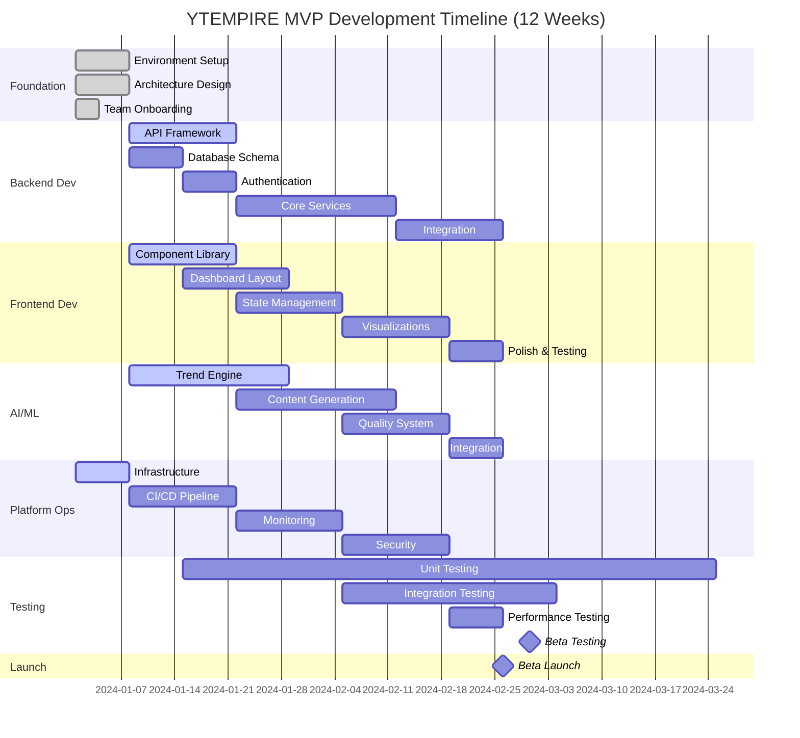
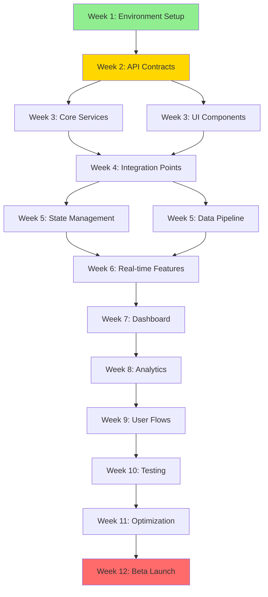

# 9. ROADMAPS & TIMELINES

## Overview

### MVP Vision Statement
**YTEMPIRE's MVP solves the fundamental problem that 95% of aspiring content creators fail because they can't maintain consistent, quality output while managing the business side of YouTube. Our primary user is the digital entrepreneur who has $2,000-$5,000 to invest in building passive income but lacks the time or technical skills to manage YouTube channels manually. The single most important outcome we're targeting is proving that one person can profitably operate 5+ YouTube channels simultaneously with less than 1 hour of weekly oversight, generating $10,000+ in monthly revenue within 90 days.**

### Core MVP Constraints
- **Team Size**: 17 people across 5 teams
- **Timeline**: 12 weeks to beta launch
- **Users**: 50 beta users initially
- **Channels**: 5 channels maximum per user
- **Automation**: 95% hands-off operation
- **Cost Target**: <$0.50 per video
- **Bundle Size**: <1MB (hard limit)
- **Components**: 30-40 maximum
- **Screens**: 20-25 total
- **Charts**: 5-7 Recharts only (NO D3.js)
- **Desktop Only**: 1280px minimum width (NO mobile for MVP)

### Core MVP Constraints
- **Team Size**: 17 people across 5 teams
- **Timeline**: 12 weeks to beta launch
- **Users**: 50 beta users initially
- **Channels**: 5 channels maximum per user
- **Automation**: 95% hands-off operation
- **Cost Target**: <$0.50 per video
- **Bundle Size**: <1MB (hard limit)
- **Components**: 30-40 maximum
- **Screens**: 20-25 total
- **Charts**: 5-7 Recharts only (NO D3.js)
- **Desktop Only**: 1280px minimum width (NO mobile for MVP)

### User Journey (Discovery to $10K/month)
```yaml
User_Journey:
  Step_1_Discovery:
    - User discovers YTEMPIRE through targeted ads emphasizing "$10K/month with 1 hour/week"
    - Lands on high-converting landing page with case studies
    - Books strategy call through Calendly integration
    
  Step_2_Onboarding:
    - Completes onboarding wizard answering 10 questions:
      * Budget available ($2K-$5K)
      * Time commitment (hours/week)
      * Content interests/expertise
      * Revenue goals
      * Technical experience level
    - AI analyzes responses
    
  Step_3_Niche_Selection:
    - AI recommends 5 profitable niches based on:
      * Market demand analysis
      * Competition levels
      * Revenue potential
      * User interests alignment
    - User selects 1-5 niches for channels
    
  Step_4_Channel_Launch:
    - Clicks "Launch Channels" button
    - System automatically:
      * Creates YouTube channels
      * Generates branding assets
      * Sets up content calendars
      * Configures monetization
    
  Step_5_First_Content:
    - Within 24 hours, receives notification
    - "First 5 videos are live across your channels"
    - Videos already optimized for SEO
    - Thumbnails A/B testing initiated
    
  Step_6_Daily_Management:
    - User spends 15 minutes daily:
      * Reviewing dashboard metrics
      * Approving AI recommendations
      * Monitoring revenue growth
    - Platform handles everything else
    
  Step_7_Revenue_Scaling:
    - Day 30: First YouTube paycheck arrives
    - Platform suggests optimization strategies
    - Day 60: Revenue approaching $5K/month
    - Day 90: User generating $10K+/month
    - Decision point: Scale to 10+ channels
```

### Non-Goals / Out of Scope for MVP
```yaml
NOT_Included_in_MVP:
  Phase_2_Features:
    - TikTok/Instagram Reels integration
    - Team collaboration features  
    - Mobile responsive design
    - 10+ channels per user
    - Advanced analytics dashboard
    
  Phase_3_Features:
    - Live streaming capabilities
    - Mobile native app
    - White-label solution
    - API for third-party integrations
    - Custom AI model training
    
  Future_Considerations:
    - Podcast generation
    - Blog content creation
    - Email newsletter automation
    - Course creation tools
    - Community features
    
  Technical_Exclusions:
    - Real-time collaboration
    - Offline mode
    - Browser extensions
    - Desktop app
    - Voice commands
```

### Budget Reality Check
```yaml
Project_Budget_Allocation:
  Total_Budget: $200,000 (3 months)
  
  Team_Costs:
    Frontend_Team:
      lead: $45,000 ($15K/month)
      react_engineer: $36,000 ($12K/month)
      dashboard_specialist: $36,000 ($12K/month)
      ui_ux_designer: $30,000 ($10K/month)
      subtotal: $147,000 (73.5% of budget)
    
    Backend_Team:
      lead: $45,000
      engineers: $108,000 (3 × $36,000)
      subtotal: $153,000
    
    AI_ML_Team:
      lead: $45,000
      ml_engineer: $36,000
      data_team: $90,000
      subtotal: $171,000
    
    Platform_Ops:
      lead: $45,000
      engineers: $108,000
      subtotal: $153,000
    
  Total_Salary_Cost: $624,000 (3.12x budget)
  
  Budget_Issue: "Significant underfunding - requires either:"
    - Equity compensation model
    - Reduced team size
    - Extended timeline with part-time resources
    - Increased funding round
  
  Recommended_Solution:
    - MVP with contractors: $200,000
    - Equity pool: 10-15% for key contributors
    - Deferred compensation post-revenue
```

### Success Metrics

## 9.1 12-Week MVP Timeline

### Master Timeline Overview



### Week-by-Week Breakdown

#### **Weeks 1-2: Foundation Phase**
```yaml
Week 1 (Jan 1-7):
  All Teams:
    - Environment setup and configuration
    - Tool installation and access verification
    - Architecture review and alignment
    - Initial repository setup
  
  Platform Ops:
    - Server hardware installation
    - Docker environment configuration
    - Network setup (1Gbps fiber)
    - Basic security hardening
  
  Deliverables:
    ✓ Development environments operational
    ✓ Team communication channels established
    ✓ Architecture documents finalized
    ✓ CI/CD pipeline foundation

Week 2 (Jan 8-14):
  Frontend:
    - Material-UI theme setup
    - Base component library (10 components)
    - Zustand store architecture
    - Authentication UI mockups
  
  Backend:
    - FastAPI framework setup
    - Database schema design
    - JWT authentication implementation
    - API contract definitions
  
  AI/ML:
    - Trend detection MVP setup
    - GPT-3.5 integration
    - Basic pipeline architecture
  
  Deliverables:
    ✓ API contracts agreed upon
    ✓ First 10 UI components built
    ✓ Authentication flow designed
    ✓ Basic trend detection working
```

#### **Weeks 3-4: Core Development**
```yaml
Week 3 (Jan 15-21):
  Frontend:
    - Dashboard layout implementation
    - Channel management interface
    - Video queue components
    - Loading states and error boundaries
  
  Backend:
    - Channel CRUD operations
    - Video generation endpoints
    - Queue management system
    - WebSocket setup for events
  
  AI/ML:
    - Script generation pipeline
    - Voice synthesis integration
    - Quality scoring v1
  
  Platform Ops:
    - Docker Compose stack
    - GitHub Actions CI/CD
    - Automated deployments
  
  Deliverables:
    ✓ Dashboard skeleton functional
    ✓ 15 API endpoints implemented
    ✓ Video generation pipeline MVP
    ✓ CI/CD pipeline operational

Week 4 (Jan 22-28):
  Frontend:
    - Cost tracking widgets
    - Real-time status displays
    - Channel switcher (5 channels)
    - Form validations
  
  Backend:
    - Cost calculation service
    - Metrics aggregation
    - Batch processing setup
    - Rate limiting implementation
  
  AI/ML:
    - Thumbnail generation
    - Content personalization
    - Trend accuracy improvements
  
  Deliverables:
    ✓ 20 screens completed
    ✓ Cost tracking functional
    ✓ 70% trend accuracy achieved
    ✓ Automated deployments working
```

#### **Weeks 5-6: Integration Phase**
```yaml
Week 5 (Jan 29 - Feb 4):
  Frontend:
    - Zustand stores implementation
    - API service layer
    - JWT token management
    - 60-second polling setup
  
  Backend:
    - External API integrations
    - YouTube API connection
    - Analytics data pipeline
    - Performance optimization
  
  AI/ML:
    - Multi-agent coordination
    - ElevenLabs integration
    - A/B testing framework
  
  Platform Ops:
    - Prometheus metrics setup
    - Grafana dashboards
    - Alert rules configuration
  
  Deliverables:
    ✓ All API endpoints integrated
    ✓ Real-time updates working
    ✓ Monitoring dashboards live
    ✓ 85% trend accuracy achieved

Week 6 (Feb 5-11):
  Frontend:
    - WebSocket implementation
    - Real-time notifications
    - Performance optimizations
    - Accessibility improvements
  
  Backend:
    - Caching layer implementation
    - Database optimization
    - Background job processing
    - Error handling improvements
  
  AI/ML:
    - Revenue optimization algorithms
    - Crisis detection system
    - Model performance tuning
  
  Platform Ops:
    - Security hardening
    - SSL/TLS setup
    - Backup procedures
  
  Deliverables:
    ✓ WebSocket events functional
    ✓ Performance targets met
    ✓ Security audit passed
    ✓ 150 videos/day capacity
```

#### **Weeks 7-8: Dashboard & Analytics**
```yaml
Week 7 (Feb 12-18):
  Frontend:
    - Recharts implementation (5-7 charts)
    - Channel performance dashboard
    - Cost breakdown visualizations
    - Video progress tracking
  
  Backend:
    - Analytics aggregation
    - Report generation
    - Export functionality
    - Historical data processing
  
  AI/ML:
    - Quality improvements
    - Personalization refinements
    - Performance optimization
  
  Platform Ops:
    - HTTPS implementation
    - Secrets management
    - Access control setup
  
  Deliverables:
    ✓ All charts rendering
    ✓ Dashboard load <2 seconds
    ✓ Export functionality working
    ✓ HTTPS enabled

Week 8 (Feb 19-25):
  Frontend:
    - Real-time queue display
    - Notification system
    - Settings pages
    - Mobile responsive prep
  
  Backend:
    - Performance tuning
    - API optimization
    - Database indexing
    - Load testing prep
  
  AI/ML:
    - Final model training
    - Integration testing
    - Cost optimization
  
  Platform Ops:
    - Load testing setup
    - Performance benchmarking
    - Security scanning
  
  Deliverables:
    ✓ All visualizations complete
    ✓ Notification system active
    ✓ Performance benchmarks met
    ✓ Security scan passed
```

#### **Weeks 9-10: User Experience & Polish**
```yaml
Week 9 (Feb 26 - Mar 4):
  Frontend:
    - Channel setup wizard
    - Video generation interface
    - Form validations
    - Error handling improvements
  
  Backend:
    - User onboarding flow
    - Settings management
    - Billing integration prep
    - API documentation
  
  AI/ML:
    - User feedback integration
    - Model fine-tuning
    - Quality assurance
  
  Platform Ops:
    - Test automation framework
    - E2E test suite
    - Performance testing
  
  Deliverables:
    ✓ Setup wizard complete
    ✓ All forms validated
    ✓ 500+ automated tests
    ✓ E2E tests passing

Week 10 (Mar 5-11):
  Frontend:
    - UI polish and refinements
    - Animation improvements
    - Accessibility audit
    - Cross-browser testing
  
  Backend:
    - Bug fixes
    - Performance optimization
    - API rate limiting
    - Documentation updates
  
  AI/ML:
    - Final optimizations
    - Cost reduction efforts
    - Quality validation
  
  Platform Ops:
    - Load testing execution
    - Disaster recovery testing
    - Documentation completion
  
  Deliverables:
    ✓ UI polish complete
    ✓ Cross-browser compatible
    ✓ Load test passed (50 users)
    ✓ DR plan tested
```

#### **Week 11: Final Testing & Optimization**
```yaml
Week 11 (Mar 12-18):
  All Teams:
    - Integration testing
    - Performance optimization
    - Bug fixing sprint
    - Documentation finalization
  
  Specific Focus:
    Frontend:
      - Bundle size optimization (<1MB)
      - Performance profiling
      - Memory leak detection
      - Final accessibility fixes
    
    Backend:
      - API performance tuning
      - Database optimization
      - Cache optimization
      - Error handling review
    
    AI/ML:
      - Model optimization
      - Cost per video validation (<$0.50)
      - Quality assurance
      - Integration verification
    
    Platform Ops:
      - Full system backup test
      - Recovery procedures validation
      - Performance baseline establishment
      - Security final review
  
  Deliverables:
    ✓ All performance targets met
    ✓ Bundle size <1MB achieved
    ✓ Cost per video <$0.50
    ✓ Zero critical bugs
```

#### **Week 12: Beta Launch**
```yaml
Week 12 (Mar 19-25):
  Monday-Tuesday:
    - Final deployment preparation
    - Production environment setup
    - SSL certificates verification
    - Monitoring alerts configuration
  
  Wednesday:
    - Beta user onboarding begins
    - Support channels activated
    - Real-time monitoring
    - Issue tracking setup
  
  Thursday-Friday:
    - User feedback collection
    - Hot fixes deployment
    - Performance monitoring
    - Success metrics tracking
  
  Deliverables:
    ✓ 50 beta users onboarded
    ✓ 95% uptime achieved
    ✓ <2 second page loads
    ✓ Zero blocking bugs
    ✓ Phase 2 planning initiated
```

### Critical Milestones & Gates

```yaml
Quality Gates:
  Week 2:
    - API contracts finalized ✓
    - Development environment ready ✓
    - Team fully onboarded ✓
  
  Week 4:
    - Core functionality working ✓
    - CI/CD pipeline operational ✓
    - 20+ screens completed ✓
  
  Week 6:
    - All integrations functional ✓
    - Performance targets met ✓
    - Security baseline achieved ✓
  
  Week 8:
    - Dashboard fully functional ✓
    - All charts implemented ✓
    - Real-time updates working ✓
  
  Week 10:
    - User workflows complete ✓
    - Testing suite comprehensive ✓
    - Documentation complete ✓
  
  Week 12:
    - Beta launch ready ✓
    - 50 users supported ✓
    - All KPIs achieved ✓
```

## 9.2 Team-Specific Roadmaps

### Frontend Team Roadmap

```yaml
Frontend Team (4 members):
  Phase 1 - Foundation (Weeks 1-2):
    Focus: Environment & Components
    Deliverables:
      - React 18 + TypeScript setup
      - Material-UI theme configuration
      - 10 base components
      - Zustand store architecture
      - Authentication UI
    Resources: Full team
    Dependencies: API contracts from Backend
  
  Phase 2 - Core UI (Weeks 3-4):
    Focus: Dashboard & Navigation
    Deliverables:
      - Dashboard layout
      - 20-25 screens
      - Channel management UI
      - Video queue display
      - Cost tracking widgets
    Resources: 
      - React Engineer: Components
      - Dashboard Specialist: Layout
      - UI/UX Designer: Mockups
    Dependencies: Backend endpoints
  
  Phase 3 - State & Integration (Weeks 5-6):
    Focus: Data Flow
    Deliverables:
      - Zustand implementation
      - API service layer
      - Polling mechanism
      - WebSocket events
      - JWT management
    Resources:
      - React Engineer: State management
      - Dashboard Specialist: Real-time updates
    Dependencies: WebSocket specs from Backend
  
  Phase 4 - Visualizations (Weeks 7-8):
    Focus: Analytics & Charts
    Deliverables:
      - 5-7 Recharts implementations
      - Performance dashboard
      - Cost visualizations
      - Real-time metrics
    Resources:
      - Dashboard Specialist: Lead
      - UI/UX Designer: Chart design
    Dependencies: Metrics from AI/ML team
  
  Phase 5 - Polish (Weeks 9-10):
    Focus: User Experience
    Deliverables:
      - Setup wizard
      - Form validations
      - Notifications
      - Accessibility
    Resources: Full team
    Dependencies: User feedback
  
  Phase 6 - Optimization (Week 11):
    Focus: Performance
    Deliverables:
      - Bundle <1MB
      - Load time <2s
      - 70% test coverage
      - Zero memory leaks
    Resources: Full team sprint
  
  Phase 7 - Launch (Week 12):
    Focus: Support
    Deliverables:
      - Production deployment
      - User support
      - Hot fixes
      - Documentation
    Resources: React Engineer on-call
```

### Backend Team Roadmap

```yaml
Backend Team (4 members):
  Phase 1 - Foundation (Weeks 1-2):
    Focus: Architecture & Auth
    Deliverables:
      - FastAPI setup
      - PostgreSQL schema
      - JWT authentication
      - API specifications
      - Docker configuration
    Resources: Full team
    Dependencies: Architecture approval
  
  Phase 2 - Core Services (Weeks 3-4):
    Focus: Business Logic
    Deliverables:
      - Channel management
      - Video generation API
      - Queue system
      - Cost calculation
      - WebSocket events
    Resources:
      - API Developer: Endpoints
      - Data Pipeline: Queue system
      - Integration Specialist: External APIs
    Dependencies: Business requirements
  
  Phase 3 - Integration (Weeks 5-6):
    Focus: External Services
    Deliverables:
      - YouTube API integration
      - Payment processing
      - Analytics pipeline
      - Caching layer
      - Rate limiting
    Resources:
      - Integration Specialist: Lead
      - API Developer: Support
    Dependencies: API keys and credentials
  
  Phase 4 - Optimization (Weeks 7-8):
    Focus: Performance
    Deliverables:
      - Database optimization
      - Query performance
      - Caching strategies
      - Background jobs
      - API optimization
    Resources:
      - Data Pipeline: Database tuning
      - API Developer: Endpoint optimization
    Dependencies: Load testing results
  
  Phase 5 - Stability (Weeks 9-10):
    Focus: Reliability
    Deliverables:
      - Error handling
      - Retry mechanisms
      - Circuit breakers
      - Health checks
      - Documentation
    Resources: Full team
    Dependencies: Testing feedback
  
  Phase 6 - Hardening (Week 11):
    Focus: Production Ready
    Deliverables:
      - Security audit fixes
      - Performance tuning
      - Rate limiting
      - Monitoring endpoints
    Resources: Full team sprint
  
  Phase 7 - Launch (Week 12):
    Focus: Support
    Deliverables:
      - Production deployment
      - On-call support
      - Hot fixes
      - Scaling support
    Resources: API Developer on-call
```

### AI/ML Team Roadmap

```yaml
AI/ML Team (5 members):
  Phase 1 - MVP Models (Weeks 1-3):
    Focus: Basic Automation
    Deliverables:
      - Trend prediction (70% accuracy)
      - GPT-3.5 integration
      - Google TTS baseline
      - Quality scoring v1
      - Single-agent system
    Resources:
      - ML Engineer: Trend models
      - NLP Specialist: Script generation
      - Data Scientist: Analytics
    Dependencies: Training data from Data Team
  
  Phase 2 - Intelligence (Weeks 4-6):
    Focus: Multi-Agent System
    Deliverables:
      - Multi-agent orchestration
      - 85% trend accuracy
      - ElevenLabs integration
      - Thumbnail generation
      - A/B testing framework
    Resources:
      - Team Lead: Architecture
      - ML Engineer: Agent coordination
      - Computer Vision: Thumbnails
    Dependencies: GPU infrastructure
  
  Phase 3 - Optimization (Weeks 7-9):
    Focus: Performance & Cost
    Deliverables:
      - Revenue optimization
      - Crisis detection
      - Cost reduction (<$0.75)
      - Quality improvements
      - Personalization engine
    Resources: Full team
    Dependencies: User behavior data
  
  Phase 4 - Integration (Weeks 10-11):
    Focus: System Integration
    Deliverables:
      - API endpoints
      - Model serving
      - Performance tuning
      - Documentation
    Resources:
      - MLOps Engineer: Deployment
      - Team Lead: Integration
    Dependencies: Backend APIs ready
  
  Phase 5 - Launch (Week 12):
    Focus: Production Support
    Deliverables:
      - Model monitoring
      - Performance tracking
      - Issue resolution
      - Optimization
    Resources: ML Engineer on-call
```

### Platform Operations Roadmap

```yaml
Platform Ops Team (7 members):
  Phase 1 - Infrastructure (Weeks 1-2):
    Focus: Foundation
    Deliverables:
      - Server setup (AMD Ryzen 9)
      - Docker environment
      - Network configuration
      - Basic security
      - Backup infrastructure
    Resources:
      - DevOps Engineers: Infrastructure
      - Security Engineers: Hardening
    Dependencies: Hardware delivery
  
  Phase 2 - CI/CD (Weeks 3-4):
    Focus: Automation
    Deliverables:
      - GitHub Actions pipeline
      - Docker Compose stack
      - Blue-green deployment
      - Automated testing
    Resources:
      - DevOps Engineers: Pipeline
      - QA Engineers: Test automation
    Dependencies: Repository structure
  
  Phase 3 - Monitoring (Weeks 5-6):
    Focus: Observability
    Deliverables:
      - Prometheus setup
      - Grafana dashboards
      - Alert rules
      - Log aggregation
    Resources:
      - DevOps: Monitoring stack
      - Platform Lead: Dashboard design
    Dependencies: Metrics endpoints
  
  Phase 4 - Security (Weeks 7-8):
    Focus: Hardening
    Deliverables:
      - HTTPS/SSL setup
      - Access control
      - Secrets management
      - Security scanning
    Resources:
      - Security Engineers: Implementation
      - DevOps: Integration
    Dependencies: Domain configuration
  
  Phase 5 - QA Framework (Weeks 9-10):
    Focus: Quality
    Deliverables:
      - Test automation
      - E2E testing
      - Load testing
      - Performance testing
    Resources:
      - QA Engineers: Framework
      - DevOps: Infrastructure
    Dependencies: Application stability
  
  Phase 6 - DR & Optimization (Week 11):
    Focus: Resilience
    Deliverables:
      - DR plan tested
      - Backup validated
      - Performance tuned
      - Documentation
    Resources: Full team
  
  Phase 7 - Launch Support (Week 12):
    Focus: Operations
    Deliverables:
      - 24/7 monitoring
      - On-call rotation
      - Issue resolution
      - User support
    Resources: DevOps Engineer on-call
```

### Data Team Roadmap

```yaml
Data Team (3 members):
  Phase 1 - Foundation (Weeks 1-2):
    Focus: Infrastructure
    Deliverables:
      - Database design
      - Data pipelines
      - ETL setup
      - Schema migrations
    Resources:
      - Data Engineer: Pipeline
      - Analytics Engineer: Schema
    Dependencies: Requirements from all teams
  
  Phase 2 - Integration (Weeks 3-4):
    Focus: Data Flow
    Deliverables:
      - YouTube Analytics integration
      - Social media collectors
      - Real-time streaming
      - Data validation
    Resources: Full team
    Dependencies: API access
  
  Phase 3 - Analytics (Weeks 5-6):
    Focus: Insights
    Deliverables:
      - Metrics calculation
      - Aggregation pipelines
      - Report generation
      - Dashboard data
    Resources:
      - Analytics Engineer: Metrics
      - Data Engineer: Pipelines
    Dependencies: Business logic
  
  Phase 4 - Feature Store (Weeks 7-8):
    Focus: ML Support
    Deliverables:
      - Feature engineering
      - Data versioning
      - Quality monitoring
      - ML pipelines
    Resources: Full team
    Dependencies: ML requirements
  
  Phase 5 - Optimization (Weeks 9-10):
    Focus: Performance
    Deliverables:
      - Query optimization
      - Index tuning
      - Cache strategies
      - Data archival
    Resources:
      - Data Engineer: Optimization
      - Team Lead: Strategy
  
  Phase 6 - Production (Weeks 11-12):
    Focus: Operations
    Deliverables:
      - Monitoring setup
      - Backup procedures
      - Documentation
      - Support readiness
    Resources: Data Engineer on-call
```

## 9.3 Dependencies & Milestones

### Critical Path Dependencies



### Inter-Team Dependencies Matrix

```yaml
Dependencies:
  Frontend_Team:
    Needs_From:
      Backend:
        - Week 2: API contracts and specifications
        - Week 3: Authentication endpoints
        - Week 4: WebSocket event definitions
        - Week 5: Data endpoints functional
        - Week 7: Analytics APIs ready
      Platform_Ops:
        - Week 1: Development environment
        - Week 3: CI/CD pipeline
        - Week 5: CDN configuration
        - Week 7: SSL certificates
      AI_ML:
        - Week 5: Metrics definitions
        - Week 7: Quality scores format
        - Week 8: Prediction data structure
      Data:
        - Week 6: Dashboard metrics
        - Week 7: Aggregation queries
    
    Provides_To:
      Backend:
        - Week 2: UI mockups for API design
        - Week 3: Authentication flow
        - Week 5: WebSocket client requirements
      Platform_Ops:
        - Week 2: Build configuration
        - Week 6: Performance benchmarks
        - Week 10: Bundle artifacts
      AI_ML:
        - Week 4: UI for model inputs
        - Week 6: Visualization requirements
  
  Backend_Team:
    Needs_From:
      Data:
        - Week 1: Database schema
        - Week 2: Data models
        - Week 4: Query patterns
      Platform_Ops:
        - Week 1: Docker setup
        - Week 2: Database access
        - Week 3: Redis configuration
      AI_ML:
        - Week 3: Model API specs
        - Week 5: Processing requirements
    
    Provides_To:
      Frontend:
        - Week 2: API documentation
        - Week 3: Auth tokens
        - Week 4: WebSocket events
        - Week 5: All endpoints
      AI_ML:
        - Week 3: Queue system
        - Week 4: Async processing
        - Week 6: Batch endpoints
      Platform_Ops:
        - Week 2: Container specs
        - Week 5: Metrics endpoints
        - Week 7: Health checks
  
  AI_ML_Team:
    Needs_From:
      Data:
        - Week 1: Training data
        - Week 3: Feature pipelines
        - Week 5: Real-time streams
      Platform_Ops:
        - Week 1: GPU setup
        - Week 2: CUDA environment
        - Week 4: Container orchestration
      Backend:
        - Week 3: API framework
        - Week 4: Queue management
        - Week 5: Storage system
    
    Provides_To:
      Backend:
        - Week 2: Model endpoints
        - Week 4: Processing specs
        - Week 6: Batch APIs
      Frontend:
        - Week 5: Metrics format
        - Week 7: Visualization data
        - Week 8: Predictions
      Data:
        - Week 2: Feature requirements
        - Week 4: Training specs
        - Week 6: Feedback loops
  
  Platform_Ops_Team:
    Needs_From:
      All_Teams:
        - Week 1: Resource requirements
        - Week 2: Container specifications
        - Week 5: Monitoring needs
        - Week 7: Security requirements
    
    Provides_To:
      All_Teams:
        - Week 1: Development environment
        - Week 3: CI/CD pipeline
        - Week 5: Monitoring dashboards
        - Week 7: Security infrastructure
        - Week 9: Testing framework
        - Week 11: DR procedures
```

### Milestone Tracking

```yaml
Week_2_Milestone:
  Name: "Foundation Complete"
  Date: "2024-01-14"
  Success_Criteria:
    - Development environments operational (100%)
    - API contracts finalized (100%)
    - Team onboarding complete (100%)
    - First components built (10+)
    - CI/CD pipeline basic (functional)
  Risk_Level: High
  Contingency: Extended hours if delayed
  
Week_4_Milestone:
  Name: "Core Functionality"
  Date: "2024-01-28"
  Success_Criteria:
    - 20+ screens completed
    - Core APIs functional (15+)
    - Video generation working
    - Dashboard layout complete
    - Docker stack operational
  Risk_Level: High
  Contingency: Reduce scope to critical features
  
Week_6_Milestone:
  Name: "Integration Complete"
  Date: "2024-02-11"
  Success_Criteria:
    - All APIs integrated
    - Real-time updates working
    - 85% trend accuracy
    - Monitoring active
    - Security baseline met
  Risk_Level: Medium
  Contingency: Defer non-critical integrations
  
Week_8_Milestone:
  Name: "Feature Complete"
  Date: "2024-02-25"
  Success_Criteria:
    - All visualizations working
    - User flows complete
    - Performance targets met
    - Testing framework ready
    - Documentation 80% complete
  Risk_Level: Medium
  Contingency: Polish in parallel with testing
  
Week_10_Milestone:
  Name: "Beta Ready"
  Date: "2024-03-11"
  Success_Criteria:
    - All features tested
    - Performance optimized
    - Security validated
    - Documentation complete
    - Team trained for support
  Risk_Level: Low
  Contingency: Soft launch with limited users
  
Week_12_Milestone:
  Name: "Beta Launch"
  Date: "2024-03-25"
  Success_Criteria:
    - 50 users onboarded
    - 95% uptime achieved
    - <$0.50 cost per video
    - Zero critical bugs
    - Phase 2 plan ready
  Risk_Level: Low
  Contingency: Gradual user rollout
```

## 9.4 Risk Assessment

### Sprint & Development Process

#### Sprint Structure (2-Week Sprints)
```yaml
Sprint_Cadence:
  Week_1:
    Monday:
      - Sprint Planning (2-4 hours)
      - Story pointing and assignment
      - Dependency identification
    Tuesday-Friday:
      - Daily standup at 9:30 AM (15 min)
      - Development work
      - Code reviews within 4 hours
    Friday:
      - Mid-sprint review
      - Blocker resolution session
  
  Week_2:
    Monday-Wednesday:
      - Feature completion
      - Integration testing
    Thursday:
      - Code freeze
      - Final testing
      - Documentation updates
    Friday:
      - Sprint demo (1 hour)
      - Retrospective (1 hour)
      - Next sprint prep

Daily_Standup_Format:
  Duration: 15 minutes strict
  Format:
    - Yesterday's progress (2 min/person)
    - Today's plan (1 min/person)
    - Blockers (discuss after if needed)
    - Risk alerts (immediate flag)

Communication_Protocols:
  Internal:
    - Slack: #frontend-team, #backend-team, etc.
    - Code: GitHub with PR reviews
    - Docs: Confluence/Notion
    - Issues: Jira/Linear
  
  Cross-Team:
    - API Sync: Tuesdays 2 PM
    - Integration: Wednesdays 10 AM
    - Performance: Thursdays 3 PM
    - All-hands: Fridays 4 PM

Definition_of_Done:
  Code:
    ✓ Feature complete
    ✓ Unit tests written (≥70% coverage)
    ✓ Code reviewed and approved
    ✓ No console.logs in production
  
  Quality:
    ✓ Cross-browser tested
    ✓ Accessibility verified
    ✓ Performance benchmarked
    ✓ Security scan passed
  
  Documentation:
    ✓ API documented
    ✓ Component docs updated
    ✓ User guide written
    ✓ Changelog updated
```

### Risk Matrix

```yaml
Risk_Categories:
  Technical_Risks:
    - ID: T1
      Risk: "Bundle size exceeds 1MB"
      Probability: High
      Impact: High
      Score: 9
      Mitigation:
        - Weekly bundle size monitoring
        - Aggressive code splitting
        - Tree shaking optimization
        - Alternative to Material-UI if needed
      Owner: Frontend Team Lead
      
    - ID: T2
      Risk: "Dashboard performance degradation"
      Probability: Medium
      Impact: Critical
      Score: 8
      Mitigation:
        - Limit data points to 100
        - Implement virtualization
        - Use React.memo extensively
        - Optimize re-renders
      Owner: Dashboard Specialist
      
    - ID: T3
      Risk: "Model accuracy below target"
      Probability: Medium
      Impact: High
      Score: 7
      Mitigation:
        - Incremental accuracy improvements
        - Multiple model approaches
        - Continuous training pipeline
        - Fallback to simpler models
      Owner: AI/ML Team Lead
      
    - ID: T4
      Risk: "API rate limits exceeded"
      Probability: Medium
      Impact: High
      Score: 7
      Mitigation:
        - Implement caching layer
        - Multiple API keys rotation
        - Batch processing
        - Local model alternatives
      Owner: Integration Specialist
  
  Resource_Risks:
    - ID: R1
      Risk: "Key team member unavailable"
      Probability: Low
      Impact: High
      Score: 5
      Mitigation:
        - Cross-training initiatives
        - Documentation requirements
        - Pair programming
        - Backup assignments
      Owner: All Team Leads
      
    - ID: R2
      Risk: "Hardware failure"
      Probability: Medium
      Impact: Critical
      Score: 8
      Mitigation:
        - RAID configuration
        - Hot spare components
        - Daily backups
        - Cloud burst capability
      Owner: Platform Ops Lead
      
    - ID: R3
      Risk: "Budget overrun"
      Probability: Low
      Impact: Medium
      Score: 4
      Mitigation:
        - Weekly cost monitoring
        - Optimization sprints
        - Resource allocation reviews
        - Scope adjustment options
      Owner: Product Owner
  
  Schedule_Risks:
    - ID: S1
      Risk: "Integration delays"
      Probability: High
      Impact: High
      Score: 9
      Mitigation:
        - Early API contract agreement
        - Mock services for testing
        - Parallel development tracks
        - Daily integration checks
      Owner: All Team Leads
      
    - ID: S2
      Risk: "Testing reveals major issues"
      Probability: Medium
      Impact: High
      Score: 7
      Mitigation:
        - Continuous testing from Week 3
        - Automated test suite
        - Early user feedback
        - Bug fixing sprints
      Owner: QA Engineers
      
    - ID: S3
      Risk: "Beta user onboarding issues"
      Probability: Low
      Impact: Medium
      Score: 4
      Mitigation:
        - Comprehensive documentation
        - Video tutorials
        - Support team ready
        - Gradual rollout plan
      Owner: Product Owner
  
  External_Risks:
    - ID: E1
      Risk: "YouTube API changes"
      Probability: Low
      Impact: Critical
      Score: 6
      Mitigation:
        - API abstraction layer
        - Version pinning
        - Alternative platforms ready
        - Regular API monitoring
      Owner: Integration Specialist
      
    - ID: E2
      Risk: "Compliance/Legal issues"
      Probability: Low
      Impact: Critical
      Score: 6
      Mitigation:
        - Legal review completed
        - Terms of service clear
        - Content filtering active
        - Rapid response plan
      Owner: Product Owner
```

### Risk Response Strategies

```yaml
Risk_Response_Plan:
  Preventive_Actions:
    Weekly:
      - Bundle size checks (Automated)
      - Performance profiling (Dashboard Specialist)
      - Cost monitoring (All Teams)
      - Integration testing (QA)
      - Security scanning (Security Engineers)
    
    Daily:
      - Standup risk review (5 minutes)
      - Blocker identification
      - Dependency checks
      - CI/CD monitoring
    
    Continuous:
      - Automated testing
      - Performance monitoring
      - Error tracking
      - Resource utilization tracking
  
  Contingency_Plans:
    High_Priority_Issues:
      Bundle_Size_Exceeded:
        - Immediate: Remove non-critical features
        - Short-term: Optimize imports
        - Long-term: Architecture refactor
      
      Performance_Degradation:
        - Immediate: Reduce data points
        - Short-term: Implement caching
        - Long-term: Backend optimization
      
      Integration_Failure:
        - Immediate: Use mock data
        - Short-term: Direct database access
        - Long-term: API redesign
    
    Medium_Priority_Issues:
      Model_Accuracy_Low:
        - Immediate: Lower threshold temporarily
        - Short-term: Manual oversight
        - Long-term: Retrain models
      
      Hardware_Issues:
        - Immediate: Switch to backup
        - Short-term: Cloud burst
        - Long-term: Hardware replacement
    
    Low_Priority_Issues:
      Documentation_Incomplete:
        - Immediate: Core docs only
        - Short-term: Post-launch completion
        - Long-term: Comprehensive docs
  
  Escalation_Matrix:
    Level_1: Team Lead (0-30 minutes)
    Level_2: Cross-team Leads (30-60 minutes)
    Level_3: CTO/VP of AI (1-2 hours)
    Level_4: CEO/Founder (2+ hours)
```

### Risk Monitoring Dashboard

```yaml
Risk_Tracking_Metrics:
  Technical_Health:
    - Bundle size trend (daily)
    - Page load times (hourly)
    - API response times (real-time)
    - Error rates (real-time)
    - Test pass rate (per commit)
    - Code coverage (per build)
  
  Resource_Health:
    - Team velocity (per sprint)
    - Burndown rate (daily)
    - Budget consumption (weekly)
    - Hardware utilization (hourly)
    - Backup success rate (daily)
  
  Schedule_Health:
    - Milestone completion (weekly)
    - Feature completion rate (daily)
    - Bug discovery rate (daily)
    - Bug resolution time (daily)
    - Integration test results (continuous)
  
  Risk_Indicators:
    Red_Flags:
      - Bundle size >900KB
      - Load time >3 seconds
      - Error rate >1%
      - Test coverage <60%
      - Budget usage >110%
      - Schedule slip >3 days
    
    Yellow_Flags:
      - Bundle size >800KB
      - Load time >2.5 seconds
      - Error rate >0.5%
      - Test coverage <70%
      - Budget usage >100%
      - Schedule slip >1 day
```

### Success Factors & KPIs

```yaml
Success_Metrics:
  MVP_Launch_Criteria:
    Technical:
      ✓ 50 concurrent users supported
      ✓ <2 second page load time
      ✓ <1MB bundle size
      ✓ 95% uptime achieved
      ✓ <$0.50 cost per video
      ✓ 70% test coverage
    
    Functional:
      ✓ 5 channels manageable per user
      ✓ 50+ videos/day generation
      ✓ 85% trend prediction accuracy
      ✓ All core features working
      ✓ Real-time updates functional
    
    Business:
      ✓ 50 beta users onboarded
      ✓ $10K monthly revenue potential demonstrated
      ✓ 95% automation achieved
      ✓ Positive user feedback (>4.0/5.0)
      ✓ Clear path to scale
  
  Weekly_KPIs:
    Week_2: Foundation complete (100%)
    Week_4: Core features working (100%)
    Week_6: Integrations complete (100%)
    Week_8: Dashboard functional (100%)
    Week_10: Testing complete (100%)
    Week_12: Beta launch successful (100%)
  
  Team_Performance:
    Velocity: 60+ story points/sprint
    Quality: <5 bugs per sprint
    Documentation: 100% complete
    Collaboration: Daily syncs attended
    Delivery: 95% on-time completion
```

---

*End of Section 9: ROADMAPS & TIMELINES*