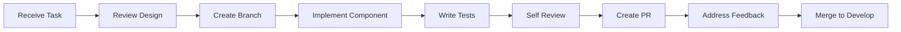

# YTEMPIRE React Engineer Documentation
## Project Overview & Quick Start Guide

**Document Version**: 1.0  
**Date**: January 2025  
**Role**: React Engineer  
**Reporting To**: Frontend Team Lead  

---

## 🎯 Project Overview

### Mission Statement
YTEMPIRE is building an automated YouTube content platform that enables users to manage 5 YouTube channels with 95% automation. As a React Engineer, you'll be developing the frontend interface that makes complex automation feel effortless for our users.

### Your Impact
- Build intuitive interfaces for managing multiple YouTube channels
- Create real-time dashboards showing video performance and costs
- Develop components that handle complex operations with simple interactions
- Enable users to achieve $10K/month revenue with just 1 hour/week oversight

### MVP Scope (12 Weeks)
- **Users**: 50 beta users
- **Channels**: 5 per user (250 total)
- **Platform**: Desktop-only (1280px minimum)
- **Components**: 30-40 total
- **Screens**: 20-25 total

---

## 🏗️ Technical Architecture

### Core Technology Stack
```typescript
const techStack = {
  framework: "React 18.2.0",
  language: "TypeScript 5.3",
  bundler: "Vite 5.0",
  stateManagement: "Zustand 4.4",  // ⚠️ NOT Redux
  routing: "React Router 6.20",
  ui: "Material-UI 5.14",
  charts: "Recharts 2.10",  // ⚠️ NOT D3.js
  testing: "Jest + React Testing Library"
};
```

### Critical Technical Decisions
1. **Zustand over Redux**: Simpler state management for MVP
2. **Recharts only**: No D3.js complexity for MVP
3. **Polling over WebSockets**: 60-second intervals for most updates
4. **Desktop-only**: No mobile responsiveness for MVP
5. **Material-UI**: Pre-built components to accelerate development

---

## 📁 Project Structure

```
frontend/
├── src/
│   ├── stores/              # Zustand state management
│   │   ├── useAuthStore.ts
│   │   ├── useChannelStore.ts
│   │   ├── useVideoStore.ts
│   │   └── useDashboardStore.ts
│   │
│   ├── pages/               # Route components (lazy loaded)
│   │   ├── Dashboard/
│   │   ├── Channels/
│   │   ├── Videos/
│   │   ├── Analytics/
│   │   └── Settings/
│   │
│   ├── components/          # Reusable components
│   │   ├── common/          # Button, Input, Modal, etc.
│   │   ├── layout/          # Header, Sidebar, Layout
│   │   ├── charts/          # Recharts wrappers
│   │   └── business/        # ChannelCard, VideoRow, etc.
│   │
│   ├── services/            # API integration
│   │   ├── api.ts           # Base API client
│   │   ├── auth.ts          # Authentication
│   │   └── channels.ts      # Channel operations
│   │
│   ├── hooks/               # Custom React hooks
│   │   ├── usePolling.ts
│   │   ├── useWebSocket.ts
│   │   └── useAuth.ts
│   │
│   ├── utils/               # Helper functions
│   │   ├── formatters.ts
│   │   ├── validators.ts
│   │   └── constants.ts
│   │
│   └── types/               # TypeScript definitions
│       ├── api.ts
│       ├── models.ts
│       └── components.ts
```

---

## 🚀 Getting Started

### Day 1 Setup
```bash
# 1. Clone repository
git clone https://github.com/ytempire/frontend.git
cd frontend

# 2. Install dependencies
npm ci

# 3. Setup environment
cp .env.example .env.local
# Edit .env.local with your local config

# 4. Start development server
npm run dev

# 5. Run tests in watch mode
npm run test:watch
```

### Essential Scripts
```json
{
  "dev": "vite",                    // Start dev server
  "build": "tsc && vite build",     // Production build
  "test": "jest",                   // Run tests
  "test:watch": "jest --watch",     // Watch mode
  "test:coverage": "jest --coverage", // Coverage report
  "lint": "eslint src --ext .ts,.tsx", // Lint code
  "type-check": "tsc --noEmit"      // Type checking
}
```

---

## 🎯 Your Primary Responsibilities

### 1. Component Development (60% of time)
- Build 30-40 reusable React components
- Implement Material-UI with tree-shaking
- Ensure all components are TypeScript-typed
- Write tests for 70% code coverage minimum

### 2. State Management (20% of time)
- Implement Zustand stores (NOT Redux)
- Handle data persistence where needed
- Manage API state with React Query
- Implement 60-second polling updates

### 3. Performance Optimization (10% of time)
- Keep bundle size under 1MB
- Ensure page load under 2 seconds
- Implement code splitting
- Optimize re-renders

### 4. Testing & Quality (10% of time)
- Write unit tests for all components
- Achieve 70% code coverage minimum
- Ensure accessibility standards
- Fix bugs and refactor code

---

## 📊 Key Metrics You Impact

### Performance Targets
- **Page Load**: < 2 seconds
- **Bundle Size**: < 1MB total
- **Time to Interactive**: < 3 seconds
- **API Response Display**: < 1 second

### Quality Targets
- **Test Coverage**: ≥ 70%
- **TypeScript Coverage**: 100%
- **Accessibility**: WCAG 2.1 A
- **Browser Support**: Chrome, Firefox, Safari (latest)

### Delivery Targets
- **Components per Week**: 5-7
- **Bug Fix Time**: < 24 hours
- **PR Review Time**: < 4 hours
- **Documentation**: Updated with each PR

---

## 🤝 Team Collaboration

### Your Team
- **Frontend Team Lead**: Your direct manager
- **Dashboard Specialist**: Works on data visualizations
- **UI/UX Designer**: Provides designs and specs

### Communication
- **Daily Standup**: 10:00 AM (15 min)
- **PR Reviews**: Tag team lead for architectural changes
- **Slack Channel**: #frontend-team
- **Design Handoff**: Figma Dev Mode

### Code Review Process
1. Create feature branch from `develop`
2. Write tests alongside implementation
3. Ensure all checks pass
4. Create PR with description template
5. Address feedback within 24 hours

---

## 🔧 Development Workflow

### Feature Development Flow


### Branch Naming
- Features: `feature/YTE-123-channel-card`
- Bugs: `fix/YTE-456-api-timeout`
- Refactor: `refactor/YTE-789-optimize-renders`

### Commit Messages
```bash
feat(channels): add channel creation modal
fix(auth): resolve token refresh race condition
refactor(dashboard): optimize metric calculations
test(api): add channel service unit tests
```

---

## 📚 Quick Reference

### Material-UI Import Pattern
```typescript
// ✅ CORRECT - Tree-shaking friendly
import Button from '@mui/material/Button';
import TextField from '@mui/material/TextField';

// ❌ WRONG - Imports entire library
import { Button, TextField } from '@mui/material';
```

### Zustand Store Pattern
```typescript
// ✅ CORRECT - Simple Zustand store
export const useChannelStore = create<ChannelStore>((set) => ({
  channels: [],
  loading: false,
  
  fetchChannels: async () => {
    set({ loading: true });
    const channels = await api.getChannels();
    set({ channels, loading: false });
  }
}));

// ❌ WRONG - Don't use Redux patterns
// No actions, reducers, or middleware complexity
```

### Component Pattern
```typescript
// ✅ CORRECT - Functional component with TypeScript
interface ChannelCardProps {
  channel: Channel;
  onEdit: (id: string) => void;
}

export const ChannelCard: React.FC<ChannelCardProps> = ({ 
  channel, 
  onEdit 
}) => {
  // Component implementation
};

// ❌ WRONG - No class components (except Error Boundaries)
```

---

## 🚨 Critical Warnings

### Things NOT to Do
1. **No Redux** - Use Zustand only
2. **No D3.js** - Use Recharts only
3. **No Class Components** - Functional only (except Error Boundaries)
4. **No Mobile Styles** - Desktop only for MVP
5. **No Complex Animations** - Keep it simple
6. **No Real-time WebSockets** - Use polling (except 3 critical events)

### MVP Constraints
- Maximum 40 components total
- Maximum 25 screens total
- Desktop only (1280px minimum)
- 5 channels per user maximum
- 60-second polling for updates

---

## 📞 Getting Help

### Resources
- **Documentation**: This guide + team wiki
- **Design Specs**: Figma (ask for access)
- **API Docs**: `/docs/api` (local)
- **Team Lead**: Direct questions via Slack

### Escalation Path
1. Check documentation first
2. Ask in #frontend-team Slack
3. Schedule 1:1 with Team Lead
4. Escalate to CTO if blocking

---

## 🎯 Week 1 Goals

### Your First Week Checklist
- [ ] Environment setup complete
- [ ] First PR submitted
- [ ] 2-3 components built
- [ ] Tests written for components
- [ ] Zustand store implemented
- [ ] Attended all team meetings
- [ ] Documentation reviewed

### Expected Deliverables
1. Authentication flow components
2. Basic layout structure
3. Channel list component
4. Loading states and error handling

---

## 💡 Pro Tips

### Development Speed
- Use Material-UI components, don't reinvent
- Copy patterns from existing components
- Ask questions early, not after struggling
- Test as you code, not after

### Code Quality
- TypeScript everything - no `any` types
- Name variables clearly
- Comment complex logic only
- Keep components under 200 lines

### Performance
- Lazy load all routes
- Memoize expensive computations
- Use React.memo sparingly
- Profile before optimizing

---

**Welcome to YTEMPIRE! Let's build something amazing together. 🚀**