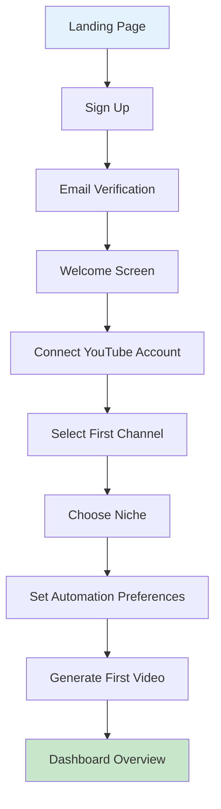

# YTEMPIRE UI Design Specifications & User Flows
## Complete Design System, Mockups, and Interaction Patterns

**Document Version**: 1.0  
**Role**: React Engineer  
**Purpose**: Visual design guide and user interaction specifications

---

## 🎨 Design System Foundation

### Brand Colors
```scss
// Primary Palette
$primary-50: #E3F2FD;
$primary-100: #BBDEFB;
$primary-200: #90CAF9;
$primary-300: #64B5F6;
$primary-400: #42A5F5;
$primary-500: #2196F3; // Main brand color
$primary-600: #1E88E5;
$primary-700: #1976D2;
$primary-800: #1565C0;
$primary-900: #0D47A1;

// Secondary Palette
$secondary-50: #F3E5F5;
$secondary-100: #E1BEE7;
$secondary-200: #CE93D8;
$secondary-300: #BA68C8;
$secondary-400: #AB47BC;
$secondary-500: #9C27B0; // Accent color
$secondary-600: #8E24AA;
$secondary-700: #7B1FA2;
$secondary-800: #6A1B9A;
$secondary-900: #4A148C;

// Semantic Colors
$success: #4CAF50;
$warning: #FF9800;
$error: #F44336;
$info: #00BCD4;

// Neutral Colors
$gray-50: #FAFAFA;
$gray-100: #F5F5F5;
$gray-200: #EEEEEE;
$gray-300: #E0E0E0;
$gray-400: #BDBDBD;
$gray-500: #9E9E9E;
$gray-600: #757575;
$gray-700: #616161;
$gray-800: #424242;
$gray-900: #212121;

// Cost Alert Colors
$cost-safe: #4CAF50;      // Under 60%
$cost-warning: #FF9800;   // 60-80%
$cost-danger: #F44336;    // 80-95%
$cost-critical: #B71C1C;  // Over 95%

// Dark Mode Colors
$dark-bg: #121212;
$dark-surface: #1E1E1E;
$dark-surface-2: #2C2C2C;
$dark-primary: #90CAF9;
$dark-secondary: #CE93D8;
```

### Typography
```scss
// Font Family
$font-primary: 'Inter', -apple-system, BlinkMacSystemFont, 'Segoe UI', Roboto, sans-serif;
$font-mono: 'JetBrains Mono', 'Courier New', monospace;

// Font Sizes
$font-size-xs: 0.75rem;    // 12px
$font-size-sm: 0.875rem;   // 14px
$font-size-base: 1rem;     // 16px
$font-size-lg: 1.125rem;   // 18px
$font-size-xl: 1.25rem;    // 20px
$font-size-2xl: 1.5rem;    // 24px
$font-size-3xl: 1.875rem;  // 30px
$font-size-4xl: 2.25rem;   // 36px
$font-size-5xl: 3rem;      // 48px

// Font Weights
$font-light: 300;
$font-normal: 400;
$font-medium: 500;
$font-semibold: 600;
$font-bold: 700;

// Line Heights
$line-height-tight: 1.25;
$line-height-normal: 1.5;
$line-height-relaxed: 1.75;

// Typography Scale
h1 { font-size: $font-size-4xl; font-weight: $font-bold; }
h2 { font-size: $font-size-3xl; font-weight: $font-semibold; }
h3 { font-size: $font-size-2xl; font-weight: $font-semibold; }
h4 { font-size: $font-size-xl; font-weight: $font-medium; }
h5 { font-size: $font-size-lg; font-weight: $font-medium; }
h6 { font-size: $font-size-base; font-weight: $font-medium; }
```

### Spacing System
```scss
// 8px Grid System
$space-0: 0;
$space-1: 0.25rem;  // 4px
$space-2: 0.5rem;   // 8px
$space-3: 0.75rem;  // 12px
$space-4: 1rem;     // 16px
$space-5: 1.25rem;  // 20px
$space-6: 1.5rem;   // 24px
$space-8: 2rem;     // 32px
$space-10: 2.5rem;  // 40px
$space-12: 3rem;    // 48px
$space-16: 4rem;    // 64px
$space-20: 5rem;    // 80px
$space-24: 6rem;    // 96px
```

### Shadows & Elevation
```scss
// Material Design Inspired Shadows
$shadow-sm: 0 1px 2px 0 rgba(0, 0, 0, 0.05);
$shadow-base: 0 1px 3px 0 rgba(0, 0, 0, 0.1), 0 1px 2px 0 rgba(0, 0, 0, 0.06);
$shadow-md: 0 4px 6px -1px rgba(0, 0, 0, 0.1), 0 2px 4px -1px rgba(0, 0, 0, 0.06);
$shadow-lg: 0 10px 15px -3px rgba(0, 0, 0, 0.1), 0 4px 6px -2px rgba(0, 0, 0, 0.05);
$shadow-xl: 0 20px 25px -5px rgba(0, 0, 0, 0.1), 0 10px 10px -5px rgba(0, 0, 0, 0.04);
$shadow-2xl: 0 25px 50px -12px rgba(0, 0, 0, 0.25);

// Elevation Levels
$elevation-0: none;
$elevation-1: $shadow-sm;
$elevation-2: $shadow-base;
$elevation-3: $shadow-md;
$elevation-4: $shadow-lg;
$elevation-5: $shadow-xl;
```

### Border Radius
```scss
$radius-none: 0;
$radius-sm: 0.125rem;   // 2px
$radius-base: 0.25rem;  // 4px
$radius-md: 0.375rem;   // 6px
$radius-lg: 0.5rem;     // 8px
$radius-xl: 0.75rem;    // 12px
$radius-2xl: 1rem;      // 16px
$radius-full: 9999px;   // Pill shape
```

### Breakpoints (Desktop Only for MVP)
```scss
$breakpoint-sm: 640px;   // Not used in MVP
$breakpoint-md: 768px;   // Not used in MVP
$breakpoint-lg: 1024px;  // Not used in MVP
$breakpoint-xl: 1280px;  // MVP minimum
$breakpoint-2xl: 1536px; // Large screens
```

---

## 🖼️ Screen Mockups & Layouts

### 1. Login Screen
```
┌─────────────────────────────────────────────────────────┐
│                                                         │
│                                                         │
│                    ┌─────────────┐                      │
│                    │   YTEMPIRE   │                      │
│                    │    [Logo]    │                      │
│                    └─────────────┘                      │
│                                                         │
│              ┌─────────────────────────┐               │
│              │                         │               │
│              │   Welcome Back!         │               │
│              │                         │               │
│              │  ┌─────────────────┐   │               │
│              │  │ Email           │   │               │
│              │  └─────────────────┘   │               │
│              │                         │               │
│              │  ┌─────────────────┐   │               │
│              │  │ Password        │   │               │
│              │  └─────────────────┘   │               │
│              │                         │               │
│              │  [✓] Remember me        │               │
│              │                         │               │
│              │  ┌─────────────────┐   │               │
│              │  │   Sign In       │   │               │
│              │  └─────────────────┘   │               │
│              │                         │               │
│              │  Forgot password?       │               │
│              │  Create account         │               │
│              └─────────────────────────┘               │
│                                                         │
└─────────────────────────────────────────────────────────┘
```

### 2. Dashboard Layout
```
┌─────────────────────────────────────────────────────────────────┐
│ Header                                                          │
│ ┌───────────────────────────────────────────────────────────┐ │
│ │ YTEMPIRE  [Search...]            [🔔] [User ▼]           │ │
│ └───────────────────────────────────────────────────────────┘ │
├─────────────┬───────────────────────────────────────────────────┤
│ Sidebar     │ Main Content                                      │
│             │                                                    │
│ [📊] Dash   │ Dashboard                                         │
│ [📺] Chan   │ ┌─────┬─────┬─────┬─────┐                       │
│ [📈] Anal   │ │ 5   │ 23  │$456 │$0.45│                       │
│ [💰] Cost   │ │Chan │Vid  │Rev  │Cost │                       │
│ [⚙️] Sett   │ └─────┴─────┴─────┴─────┘                       │
│             │                                                    │
│ Channels    │ ┌─────────────────────────┬─────────────────┐   │
│ ┌─────────┐ │ │ Revenue Chart           │ Channel Stats   │   │
│ │ 3 / 5   │ │ │    📈                   │ │ Ch1 ████ 45% │   │
│ └─────────┘ │ │      📊                 │ │ Ch2 ███  30% │   │
│             │ │        📉               │ │ Ch3 ██   25% │   │
│             │ └─────────────────────────┴─────────────────┘   │
│             │                                                    │
│             │ Recent Videos                                     │
│             │ ┌─────────────────────────────────────────────┐ │
│             │ │ [▶️] Video Title 1     ✓ Completed  1h ago  │ │
│             │ │ [⏸️] Video Title 2     ⟳ Processing 45%     │ │
│             │ │ [▶️] Video Title 3     ✓ Completed  3h ago  │ │
│             │ └─────────────────────────────────────────────┘ │
└─────────────┴───────────────────────────────────────────────────┘
```

### 3. Channel Management Screen
```
┌─────────────────────────────────────────────────────────────────┐
│ Channels                                    [+ Add Channel]     │
├─────────────────────────────────────────────────────────────────┤
│                                                                 │
│ ┌─────────────────────────┐ ┌─────────────────────────┐       │
│ │ Tech Reviews Channel    │ │ Gaming Highlights      │       │
│ │ [Thumbnail]             │ │ [Thumbnail]            │       │
│ │                         │ │                        │       │
│ │ Status: ● Active        │ │ Status: ⏸ Paused      │       │
│ │ Videos: 142            │ │ Videos: 89             │       │
│ │ Views: 1.2M            │ │ Views: 890K            │       │
│ │ Revenue: $3,456        │ │ Revenue: $2,134        │       │
│ │                         │ │                        │       │
│ │ Automation: [ON ▼]     │ │ Automation: [OFF ▼]    │       │
│ │ [Edit] [Videos] [⋮]    │ │ [Edit] [Videos] [⋮]    │       │
│ └─────────────────────────┘ └─────────────────────────┘       │
│                                                                 │
│ ┌─────────────────────────┐ ┌─────────────────────────┐       │
│ │ Educational Content     │ │ + Add New Channel      │       │
│ │ [Thumbnail]             │ │                        │       │
│ │                         │ │ [Large + Icon]         │       │
│ │ Status: ● Active        │ │                        │       │
│ │ Videos: 67             │ │ Create your next       │       │
│ │ Views: 450K            │ │ YouTube channel        │       │
│ │ Revenue: $1,234        │ │                        │       │
│ │                         │ │                        │       │
│ │ Automation: [ON ▼]     │ │                        │       │
│ │ [Edit] [Videos] [⋮]    │ │                        │       │
│ └─────────────────────────┘ └─────────────────────────┘       │
└─────────────────────────────────────────────────────────────────┘
```

### 4. Video Generation Interface
```
┌─────────────────────────────────────────────────────────────────┐
│ Generate New Video                                              │
├─────────────────────────────────────────────────────────────────┤
│                                                                 │
│ ┌─────────────────────────────────────────────────────────┐   │
│ │ Select Channel                                           │   │
│ │ ┌─────────────────────────────────────────────────┐     │   │
│ │ │ [▼] Tech Reviews Channel                        │     │   │
│ │ └─────────────────────────────────────────────────┘     │   │
│ │                                                           │   │
│ │ Topic (Optional)                                          │   │
│ │ ┌─────────────────────────────────────────────────┐     │   │
│ │ │ [🤖] Leave empty for AI-selected trending topic │     │   │
│ │ └─────────────────────────────────────────────────┘     │   │
│ │                                                           │   │
│ │ Video Settings                                            │   │
│ │ ┌──────────────────┐ ┌──────────────────┐              │   │
│ │ │ Style            │ │ Length           │              │   │
│ │ │ [▼] Educational │ │ [▼] Medium       │              │   │
│ │ └──────────────────┘ └──────────────────┘              │   │
│ │                                                           │   │
│ │ Advanced Options [▼]                                      │   │
│ │                                                           │   │
│ │ Cost Estimate                                             │   │
│ │ ┌─────────────────────────────────────────────────┐     │   │
│ │ │ Script:    $0.12                                 │     │   │
│ │ │ Voice:     $0.18                                 │     │   │
│ │ │ Video:     $0.13                                 │     │   │
│ │ │ Thumbnail: $0.02                                 │     │   │
│ │ │ ─────────────────                                │     │   │
│ │ │ Total:     $0.45                                 │     │   │
│ │ └─────────────────────────────────────────────────┘     │   │
│ │                                                           │   │
│ │ Daily Budget: $27.50 / $50.00 (55%)                      │   │
│ │ [████████████░░░░░░░░░░░░]                               │   │
│ │                                                           │   │
│ │        [Cancel]  [Generate Video →]                       │   │
│ └─────────────────────────────────────────────────────────┘   │
└─────────────────────────────────────────────────────────────────┘
```

### 5. Video Queue & Status
```
┌─────────────────────────────────────────────────────────────────┐
│ Video Generation Queue                                          │
├─────────────────────────────────────────────────────────────────┤
│                                                                 │
│ Currently Processing (2)                                        │
│ ┌─────────────────────────────────────────────────────────┐   │
│ │ 🎬 "Top 10 Gaming Monitors 2024"                         │   │
│ │ Channel: Tech Reviews                                     │   │
│ │ Stage: Video Rendering                                    │   │
│ │ [████████████████░░░░] 85% • ~2 min remaining           │   │
│ │                                                           │   │
│ │ ✓ Script    ✓ Audio    ⟳ Video    ○ Upload              │   │
│ └─────────────────────────────────────────────────────────┘   │
│                                                                 │
│ ┌─────────────────────────────────────────────────────────┐   │
│ │ 🎮 "Speedrun Techniques Explained"                       │   │
│ │ Channel: Gaming Highlights                                │   │
│ │ Stage: Audio Generation                                   │   │
│ │ [██████░░░░░░░░░░░░░░] 30% • ~5 min remaining           │   │
│ │                                                           │   │
│ │ ✓ Script    ⟳ Audio    ○ Video    ○ Upload              │   │
│ └─────────────────────────────────────────────────────────┘   │
│                                                                 │
│ In Queue (3)                                                    │
│ ┌─────────────────────────────────────────────────────────┐   │
│ │ ⏳ "Python Tutorial Part 5" - Position 1 • ~7 min        │   │
│ │ ⏳ "Morning Routine Tips" - Position 2 • ~12 min         │   │
│ │ ⏳ "Budget Smartphone Review" - Position 3 • ~17 min     │   │
│ └─────────────────────────────────────────────────────────┘   │
└─────────────────────────────────────────────────────────────────┘
```

### 6. Analytics Dashboard
```
┌─────────────────────────────────────────────────────────────────┐
│ Analytics              [All Channels ▼] [Last 30 Days ▼]       │
├─────────────────────────────────────────────────────────────────┤
│                                                                 │
│ ┌──────────┬──────────┬──────────┬──────────┐                │
│ │ 342      │ 2.4M     │ $12,456  │ 87%      │                │
│ │ Videos   │ Views    │ Revenue  │ Success  │                │
│ │ +23% ↑   │ +45% ↑   │ +67% ↑   │ +5% ↑    │                │
│ └──────────┴──────────┴──────────┴──────────┘                │
│                                                                 │
│ Performance Trends                                              │
│ ┌─────────────────────────────────────────────────────────┐   │
│ │     Revenue vs Cost                                      │   │
│ │     │                                                     │   │
│ │ 15k │    ╱╲      Revenue                                │   │
│ │     │   ╱  ╲    ╱                                       │   │
│ │ 10k │  ╱    ╲__╱                                        │   │
│ │     │ ╱                                                  │   │
│ │  5k │╱- - - - - - - - - Cost                            │   │
│ │     │                                                     │   │
│ │  0  └─────────────────────────────────────               │   │
│ │     1w    2w    3w    4w                                 │   │
│ └─────────────────────────────────────────────────────────┘   │
│                                                                 │
│ Top Performing Videos                                           │
│ ┌─────────────────────────────────────────────────────────┐   │
│ │ 1. "Gaming Setup 2024"      890K views  $2,345  ROI 521%│   │
│ │ 2. "Python Crash Course"    670K views  $1,890  ROI 420%│   │
│ │ 3. "Morning Productivity"   540K views  $1,234  ROI 274%│   │
│ └─────────────────────────────────────────────────────────┘   │
└─────────────────────────────────────────────────────────────────┘
```

### 7. Cost Management Screen
```
┌─────────────────────────────────────────────────────────────────┐
│ Cost Management                                                 │
├─────────────────────────────────────────────────────────────────┤
│                                                                 │
│ Today's Spending                                                │
│ ┌─────────────────────────────────────────────────────────┐   │
│ │ $37.85 / $50.00 daily limit                              │   │
│ │ [████████████████████░░░░░░] 76%                         │   │
│ │                                                           │   │
│ │ ⚠️ Warning: Approaching daily limit                       │   │
│ └─────────────────────────────────────────────────────────┘   │
│                                                                 │
│ Cost Breakdown                    Monthly Projection            │
│ ┌─────────────────────┐          ┌─────────────────────┐     │
│ │ AI Generation  35%  │          │ Current:  $782      │     │
│ │ █████████           │          │ Projected: $1,156   │     │
│ │                     │          │ Budget:   $1,500    │     │
│ │ Voice         30%   │          │                     │     │
│ │ ████████            │          │ [████████░░░░] 77%  │     │
│ │                     │          │                     │     │
│ │ Rendering     25%   │          │ 12 days remaining   │     │
│ │ ██████              │          └─────────────────────┘     │
│ │                     │                                       │
│ │ Other         10%   │                                       │
│ │ ███                 │                                       │
│ └─────────────────────┘                                       │
│                                                                 │
│ Cost Alerts                                                     │
│ ┌─────────────────────────────────────────────────────────┐   │
│ │ [!] Set alert when daily spending exceeds: [$40.00]     │   │
│ │ [!] Set alert when cost per video exceeds: [$0.60]      │   │
│ │ [!] Set alert for unusual cost spikes:     [ON ▼]       │   │
│ └─────────────────────────────────────────────────────────┘   │
└─────────────────────────────────────────────────────────────────┘
```

---

## 🎯 User Flows

### 1. New User Onboarding Flow


**Step-by-Step Details:**

1. **Sign Up (2 min)**
   - Email & Password
   - Accept Terms
   - Verify email

2. **YouTube Connection (1 min)**
   - OAuth consent
   - Select channel
   - Grant permissions

3. **Channel Setup (3 min)**
   - Name channel
   - Select niche
   - Set video frequency
   - Choose content style

4. **First Video (5 min)**
   - Optional topic
   - Review cost
   - Generate video
   - Watch progress

5. **Success State**
   - Video published
   - View on YouTube
   - Check analytics

### 2. Daily Usage Flow
```
Morning Check (2 min)
├── Open Dashboard
├── Check overnight videos
├── Review costs
└── Check any alerts

Content Planning (5 min)
├── Review trending topics
├── Select channels to update
├── Queue 3-5 videos
└── Set priorities

Monitoring (Throughout day)
├── Get notifications
├── Check completions
├── Review performance
└── Adjust if needed

Evening Review (3 min)
├── Check daily revenue
├── Review video metrics
├── Plan tomorrow
└── Adjust automation
```

### 3. Video Generation Flow
```
1. SELECT CHANNEL
   └── Choose from dropdown
   
2. CONFIGURE VIDEO
   ├── Enter topic (optional)
   ├── Select style
   └── Choose length
   
3. REVIEW COST
   ├── See breakdown
   ├── Check daily budget
   └── Confirm generation
   
4. MONITOR PROGRESS
   ├── Script writing (30s)
   ├── Voice synthesis (60s)
   ├── Video rendering (3-5min)
   └── YouTube upload (30s)
   
5. COMPLETION
   ├── Success notification
   ├── View on YouTube
   └── Check early metrics
```

---

## 🖱️ Interaction Patterns

### Button States
```scss
// Primary Button
.btn-primary {
  // Default
  background: $primary-500;
  color: white;
  
  // Hover
  &:hover {
    background: $primary-600;
    transform: translateY(-1px);
    box-shadow: $shadow-md;
  }
  
  // Active
  &:active {
    background: $primary-700;
    transform: translateY(0);
  }
  
  // Disabled
  &:disabled {
    background: $gray-300;
    color: $gray-500;
    cursor: not-allowed;
  }
  
  // Loading
  &.loading {
    position: relative;
    color: transparent;
    
    &::after {
      content: '';
      position: absolute;
      width: 16px;
      height: 16px;
      margin: auto;
      border: 2px solid transparent;
      border-top-color: white;
      border-radius: 50%;
      animation: spin 0.8s linear infinite;
    }
  }
}
```

### Form Inputs
```scss
// Text Input States
.input {
  // Default
  border: 1px solid $gray-300;
  background: white;
  
  // Focus
  &:focus {
    border-color: $primary-500;
    box-shadow: 0 0 0 3px rgba($primary-500, 0.1);
    outline: none;
  }
  
  // Error
  &.error {
    border-color: $error;
    
    &:focus {
      box-shadow: 0 0 0 3px rgba($error, 0.1);
    }
  }
  
  // Success
  &.success {
    border-color: $success;
    background-image: url('checkmark-icon.svg');
    background-position: right 12px center;
    background-repeat: no-repeat;
  }
  
  // Disabled
  &:disabled {
    background: $gray-100;
    color: $gray-500;
    cursor: not-allowed;
  }
}
```

### Card Interactions
```scss
.channel-card {
  transition: all 0.2s ease;
  cursor: pointer;
  
  &:hover {
    transform: translateY(-2px);
    box-shadow: $shadow-lg;
    
    .card-actions {
      opacity: 1;
    }
  }
  
  &.selected {
    border: 2px solid $primary-500;
    background: rgba($primary-500, 0.05);
  }
  
  .card-actions {
    opacity: 0;
    transition: opacity 0.2s ease;
  }
}
```

### Loading States
```typescript
// Skeleton Loading Pattern
const ChannelCardSkeleton = () => (
  <Card>
    <Skeleton variant="rectangular" height={120} />
    <CardContent>
      <Skeleton variant="text" width="60%" />
      <Skeleton variant="text" width="40%" />
      <Box sx={{ display: 'flex', gap: 2, mt: 2 }}>
        <Skeleton variant="circular" width={40} height={40} />
        <Skeleton variant="circular" width={40} height={40} />
      </Box>
    </CardContent>
  </Card>
);

// Progress Indicators
const VideoProgress = ({ stage, percentage }) => (
  <Box>
    <LinearProgress 
      variant="determinate" 
      value={percentage}
      sx={{
        height: 8,
        borderRadius: 4,
        backgroundColor: 'grey.200',
        '& .MuiLinearProgress-bar': {
          borderRadius: 4,
          background: `linear-gradient(90deg, ${primary[400]} 0%, ${primary[600]} 100%)`,
        }
      }}
    />
    <Box sx={{ display: 'flex', justifyContent: 'space-between', mt: 1 }}>
      <Typography variant="caption">{stage}</Typography>
      <Typography variant="caption">{percentage}%</Typography>
    </Box>
  </Box>
);
```

### Notification Patterns
```typescript
// Toast Notifications
const NotificationStyles = {
  success: {
    background: '#4CAF50',
    icon: '✓',
    duration: 3000,
  },
  error: {
    background: '#F44336',
    icon: '✕',
    duration: 5000,
  },
  warning: {
    background: '#FF9800',
    icon: '⚠',
    duration: 4000,
  },
  info: {
    background: '#2196F3',
    icon: 'ℹ',
    duration: 3000,
  },
};

// In-app Alert Banners
const CostAlert = ({ level, message, action }) => (
  <Alert
    severity={level}
    action={
      <Button size="small" onClick={action}>
        View Details
      </Button>
    }
    sx={{
      mb: 2,
      '& .MuiAlert-icon': {
        fontSize: 28,
      },
    }}
  >
    <AlertTitle>Cost Warning</AlertTitle>
    {message}
  </Alert>
);
```

### Micro-interactions
```scss
// Checkbox Animation
.checkbox {
  &:checked + .checkmark {
    animation: checkmark 0.3s ease;
    
    @keyframes checkmark {
      0% {
        transform: scale(0);
      }
      50% {
        transform: scale(1.2);
      }
      100% {
        transform: scale(1);
      }
    }
  }
}

// Counter Animation
.metric-value {
  &.updating {
    animation: pulse 0.5s ease;
    
    @keyframes pulse {
      0% {
        transform: scale(1);
      }
      50% {
        transform: scale(1.05);
        color: $primary-500;
      }
      100% {
        transform: scale(1);
      }
    }
  }
}

// Toggle Switch
.toggle-automation {
  transition: all 0.3s ease;
  
  &.enabled {
    background: $success;
    
    .toggle-thumb {
      transform: translateX(24px);
    }
  }
  
  &.disabled {
    background: $gray-400;
  }
}
```

---

## 📐 Component Specifications

### MetricCard Component
```typescript
interface MetricCardProps {
  title: string;
  value: number | string;
  change?: number;
  changeType?: 'increase' | 'decrease';
  icon?: IconType;
  color?: 'primary' | 'secondary' | 'success' | 'warning' | 'error';
  loading?: boolean;
  format?: 'number' | 'currency' | 'percentage';
  total?: number; // For progress display
}

// Visual Specs
const MetricCardSpecs = {
  height: 120,
  padding: 24,
  iconSize: 48,
  valueSize: 32,
  titleSize: 14,
  changeSize: 12,
  
  colors: {
    increaseGood: '#4CAF50',
    increaseBad: '#F44336',
    decreaseGood: '#4CAF50',
    decreaseBad: '#F44336',
  },
  
  animations: {
    valueChange: 'pulse 0.5s ease',
    hoverScale: 'scale(1.02)',
  },
};
```

### ChannelCard Component
```typescript
interface ChannelCardProps {
  channel: Channel;
  onEdit: (id: string) => void;
  onToggleAutomation: (id: string, enabled: boolean) => void;
  onViewVideos: (id: string) => void;
  selected?: boolean;
  compact?: boolean;
}

// Visual Layout
const ChannelCardLayout = {
  standard: {
    width: '100%',
    height: 280,
    thumbnailHeight: 120,
    padding: 16,
    actionBarHeight: 48,
  },
  
  compact: {
    width: '100%',
    height: 80,
    thumbnailWidth: 80,
    padding: 12,
  },
  
  sections: {
    header: {
      height: 120, // Thumbnail
    },
    body: {
      padding: 16,
      gap: 8,
    },
    footer: {
      height: 48,
      padding: '8px 16px',
      background: 'rgba(0,0,0,0.02)',
    },
  },
};
```

### VideoQueue Component
```typescript
interface VideoQueueItemProps {
  video: QueuedVideo;
  position: number;
  onCancel?: (id: string) => void;
  onPriorityChange?: (id: string, priority: number) => void;
}

// Progress Visualization
const VideoProgressStages = [
  { key: 'script', label: 'Script', duration: 30, color: '#2196F3' },
  { key: 'audio', label: 'Audio', duration: 60, color: '#9C27B0' },
  { key: 'video', label: 'Video', duration: 180, color: '#FF9800' },
  { key: 'upload', label: 'Upload', duration: 30, color: '#4CAF50' },
];

// Visual States
const QueueItemStates = {
  queued: {
    background: '#F5F5F5',
    border: '1px solid #E0E0E0',
    opacity: 0.8,
  },
  processing: {
    background: '#E3F2FD',
    border: '1px solid #2196F3',
    opacity: 1,
    animation: 'pulse-border 2s infinite',
  },
  completed: {
    background: '#E8F5E9',
    border: '1px solid #4CAF50',
    opacity: 1,
  },
  failed: {
    background: '#FFEBEE',
    border: '1px solid #F44336',
    opacity: 1,
  },
};
```

---

## 🎨 Empty States & Illustrations

### No Channels Empty State
```
    ┌─────────────────┐
    │                 │
    │    📺 🎬 🎮     │
    │                 │
    │  ───────────    │
    │  ───────────    │
    │  ───────────    │
    └─────────────────┘
    
    No channels yet!
    
    Create your first channel to start
    generating amazing YouTube content
    
    [+ Create Channel]
```

### No Videos Empty State
```
      ┌───────────┐
      │ ┌─┐ ┌─┐  │
      │ │▶│ │▶│  │
      │ └─┘ └─┘  │
      │ ┌─┐ ┌─┐  │
      │ │▶│ │▶│  │
      │ └─┘ └─┘  │
      └───────────┘
      
    No videos generated yet
    
    Your AI is ready to create
    engaging content for your channel
    
    [Generate First Video]
```

### Error States
```
       ⚠️
    ┌─────┐
    │ 404 │
    └─────┘
    
    Oops! Something went wrong
    
    We couldn't load your data.
    Please try again.
    
    [Retry] [Go to Dashboard]
```

---

## 🌈 Dark Mode Specifications

### Color Adjustments
```scss
// Dark Mode Palette
$dark-mode: (
  // Backgrounds
  bg-primary: #121212,
  bg-secondary: #1E1E1E,
  bg-tertiary: #2C2C2C,
  
  // Surfaces
  surface-1: #1E1E1E,
  surface-2: #252525,
  surface-3: #2C2C2C,
  
  // Text
  text-primary: rgba(255, 255, 255, 0.87),
  text-secondary: rgba(255, 255, 255, 0.60),
  text-disabled: rgba(255, 255, 255, 0.38),
  
  // Borders
  border: rgba(255, 255, 255, 0.12),
  
  // Primary colors (adjusted for dark)
  primary: #90CAF9,
  primary-dark: #42A5F5,
  
  // Status colors (adjusted for dark)
  success: #66BB6A,
  warning: #FFA726,
  error: #EF5350,
  info: #29B6F6,
);

// Elevation in dark mode
$dark-elevation: (
  0: transparent,
  1: rgba(255, 255, 255, 0.05),
  2: rgba(255, 255, 255, 0.07),
  3: rgba(255, 255, 255, 0.08),
  4: rgba(255, 255, 255, 0.09),
  5: rgba(255, 255, 255, 0.11),
);
```

---

## 🎯 Responsive Behavior (Post-MVP)

### Breakpoint Behaviors
```scss
// Desktop First (MVP is desktop only)
// These are for future mobile support

@media (max-width: 1279px) {
  // Show message for MVP
  .app-container {
    display: none;
  }
  
  .desktop-required {
    display: flex;
    align-items: center;
    justify-content: center;
    height: 100vh;
    text-align: center;
    
    &::after {
      content: 'YTEMPIRE requires a desktop browser (1280px+ width)';
    }
  }
}

// Future responsive grid
.dashboard-grid {
  display: grid;
  grid-template-columns: repeat(4, 1fr);
  gap: 24px;
  
  @media (max-width: 1536px) {
    grid-template-columns: repeat(3, 1fr);
  }
  
  @media (max-width: 1280px) {
    grid-template-columns: repeat(2, 1fr);
  }
}
```

---

## 🎨 Animation Specifications

### Timing Functions
```scss
// Easing curves
$ease-in: cubic-bezier(0.4, 0, 1, 1);
$ease-out: cubic-bezier(0, 0, 0.2, 1);
$ease-in-out: cubic-bezier(0.4, 0, 0.2, 1);
$ease-bounce: cubic-bezier(0.68, -0.55, 0.265, 1.55);

// Durations
$duration-instant: 100ms;
$duration-fast: 200ms;
$duration-normal: 300ms;
$duration-slow: 500ms;
$duration-slower: 800ms;
```

### Common Animations
```scss
// Fade in
@keyframes fadeIn {
  from {
    opacity: 0;
    transform: translateY(10px);
  }
  to {
    opacity: 1;
    transform: translateY(0);
  }
}

// Slide in
@keyframes slideIn {
  from {
    transform: translateX(-100%);
  }
  to {
    transform: translateX(0);
  }
}

// Progress pulse
@keyframes progressPulse {
  0% {
    box-shadow: 0 0 0 0 rgba($primary-500, 0.4);
  }
  70% {
    box-shadow: 0 0 0 10px rgba($primary-500, 0);
  }
  100% {
    box-shadow: 0 0 0 0 rgba($primary-500, 0);
  }
}

// Loading spinner
@keyframes spin {
  to {
    transform: rotate(360deg);
  }
}
```

---

This completes the UI Design Specifications document with all the visual design details, mockups, user flows, and interaction patterns needed for implementation!