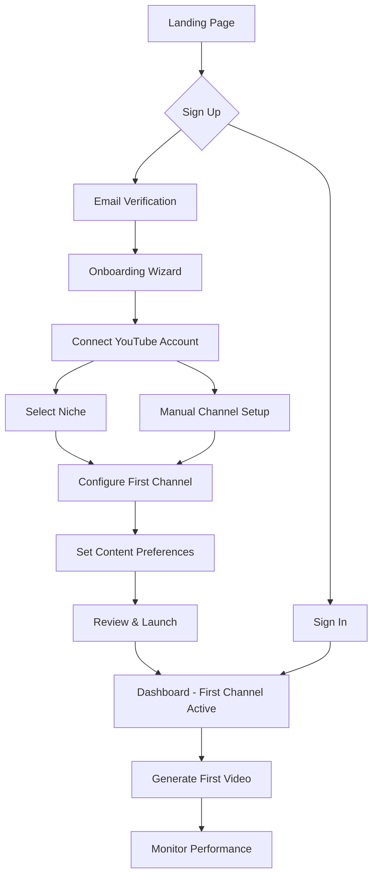
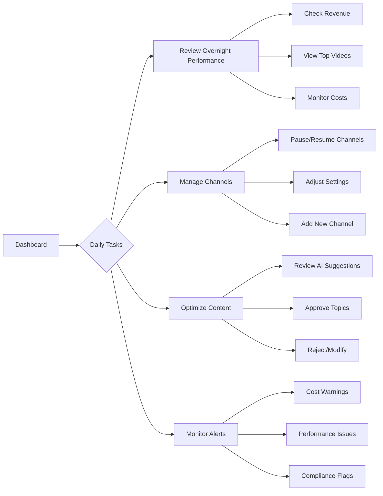

# YTEMPIRE User Experience Patterns & Guidelines

**Version**: 1.0  
**Date**: January 2025  
**Owner**: UI/UX Designer  
**Approved By**: Frontend Team Lead  
**Status**: MVP Implementation Ready

---

## Table of Contents

1. [User Flow Diagrams](#1-user-flow-diagrams)
2. [Interaction Patterns Library](#2-interaction-patterns-library)
3. [Information Architecture](#3-information-architecture)
4. [Wireframes & Page Layouts](#4-wireframes--page-layouts)
5. [Content Guidelines](#5-content-guidelines)
6. [Error Handling & Feedback](#6-error-handling--feedback)
7. [Empty States & Onboarding](#7-empty-states--onboarding)
8. [Performance Considerations](#8-performance-considerations)

---

## 1. User Flow Diagrams

### 1.1 Primary User Journey - First Time Setup



### 1.2 Daily Workflow - Power User



### 1.3 Critical User Flows

#### Video Generation Flow

```yaml
video_generation_flow:
  trigger: User clicks "Generate Video" or automated schedule
  
  steps:
    1_topic_selection:
      automatic: AI suggests based on trends
      manual: User can override with custom topic
      
    2_review_plan:
      display: Script outline, thumbnail preview
      actions: [Approve, Modify, Regenerate, Cancel]
      
    3_generation_progress:
      stages: [Script, Audio, Video, Thumbnail, Upload]
      display: Real-time progress with stage indicators
      time_estimate: Show remaining time
      
    4_completion:
      notification: Toast + Dashboard update
      actions: [View on YouTube, Share, Analyze]
      
  error_handling:
    cost_exceeded: Show alert, pause generation
    youtube_api_error: Retry options, manual upload
    quality_failure: Regenerate with different parameters
```

#### Channel Management Flow

```yaml
channel_management_flow:
  entry_points:
    - Dashboard channel cards
    - Sidebar channel list
    - Channels management page
    
  actions:
    quick_actions:
      - Pause/Resume (one-click)
      - View Analytics (opens modal)
      - Generate Video (immediate)
      
    settings_management:
      - Edit channel name
      - Change niche
      - Adjust automation settings
      - Set content preferences
      - Configure monetization
      
    bulk_operations:
      - Select multiple channels
      - Pause/Resume all
      - Apply settings to multiple
      - Export analytics
```

---

## 2. Interaction Patterns Library

### 2.1 Core Interaction Patterns

#### Pattern: Progressive Disclosure

```scss
// Implementation for complex data
.data-panel {
  .summary {
    display: block;
    cursor: pointer;
    
    .expand-icon {
      transition: transform 200ms ease;
    }
  }
  
  .details {
    max-height: 0;
    overflow: hidden;
    transition: max-height 300ms ease;
    
    &.expanded {
      max-height: 500px; // Adjust based on content
    }
  }
  
  &.expanded {
    .expand-icon {
      transform: rotate(180deg);
    }
  }
}
```

**Usage Guidelines:**
- Use for channel details, video analytics, cost breakdowns
- Always show most important info in summary
- Smooth animations for state changes
- Remember expanded state per session

#### Pattern: Inline Editing

```typescript
// Interaction states
interface InlineEditStates {
  default: 'Display value with edit icon on hover';
  hover: 'Show edit icon prominently';
  editing: 'Replace with input field, show save/cancel';
  saving: 'Show loading indicator';
  success: 'Brief success feedback, return to default';
  error: 'Show error message, keep in edit mode';
}
```

**Implementation:**
- Double-click or edit icon to trigger
- ESC to cancel, Enter to save
- Auto-save after 2 seconds of inactivity
- Validation happens real-time

#### Pattern: Bulk Selection

```scss
// Visual feedback for selection
.selectable-item {
  position: relative;
  transition: all 200ms ease;
  
  .selection-checkbox {
    position: absolute;
    top: 12px;
    left: 12px;
    opacity: 0;
    transition: opacity 200ms ease;
  }
  
  &:hover .selection-checkbox,
  &.selected .selection-checkbox {
    opacity: 1;
  }
  
  &.selected {
    background: rgba($primary-500, 0.08);
    border: 2px solid $primary-500;
  }
}

// Bulk actions bar
.bulk-actions-bar {
  position: fixed;
  bottom: 24px;
  left: 50%;
  transform: translateX(-50%);
  background: $gray-900;
  color: white;
  padding: 12px 24px;
  border-radius: 8px;
  box-shadow: $shadow-3;
  
  display: flex;
  align-items: center;
  gap: 16px;
  
  // Slide up animation
  animation: slideUp 300ms ease;
}
```

### 2.2 Data Display Patterns

#### Pattern: Real-time Updates

```typescript
// Visual indicators for real-time data
interface RealtimeIndicators {
  updating: {
    style: 'Subtle pulse animation';
    color: 'Primary blue';
    duration: '1s infinite';
  };
  
  new_data: {
    style: 'Highlight briefly';
    color: 'Success green';
    duration: '2s fade out';
  };
  
  stale_data: {
    style: 'Opacity reduction';
    color: 'Gray out';
    indicator: 'Clock icon with last update time';
  };
}
```

**Implementation Rules:**
- Never jump/shift content unexpectedly
- Use animations to draw attention to changes
- Show "Last updated" timestamp for transparency
- Provide manual refresh option

#### Pattern: Data Tables

```scss
// Responsive data table pattern
.data-table {
  width: 100%;
  background: white;
  border-radius: 8px;
  overflow: hidden;
  box-shadow: $shadow-1;
  
  thead {
    background: $gray-100;
    
    th {
      padding: 12px 16px;
      text-align: left;
      font-weight: $weight-semibold;
      color: $gray-700;
      font-size: 12px;
      text-transform: uppercase;
      
      &.sortable {
        cursor: pointer;
        user-select: none;
        
        &:hover {
          color: $gray-900;
        }
        
        .sort-icon {
          margin-left: 4px;
          opacity: 0.5;
          
          &.active {
            opacity: 1;
            color: $primary-500;
          }
        }
      }
    }
  }
  
  tbody {
    tr {
      border-bottom: 1px solid $gray-200;
      transition: background 200ms ease;
      
      &:hover {
        background: $gray-50;
      }
      
      &:last-child {
        border-bottom: none;
      }
    }
    
    td {
      padding: 16px;
      color: $gray-900;
      
      &.numeric {
        text-align: right;
        font-family: $font-mono;
      }
      
      &.actions {
        text-align: right;
        
        .btn {
          margin-left: 8px;
        }
      }
    }
  }
}
```

### 2.3 Navigation Patterns

#### Pattern: Contextual Actions

```typescript
// Action visibility rules
const actionVisibilityRules = {
  primary_action: {
    visibility: 'Always visible';
    position: 'Top right of context';
    style: 'Primary button';
    example: 'Generate Video';
  },
  
  secondary_actions: {
    visibility: 'Visible on hover or in menu';
    position: 'Inline or dropdown';
    style: 'Secondary/text button';
    example: 'Edit, Duplicate, Archive';
  },
  
  destructive_actions: {
    visibility: 'Behind confirmation';
    position: 'Separated from other actions';
    style: 'Danger styling';
    example: 'Delete channel';
  }
};
```

#### Pattern: Breadcrumb Navigation

```scss
.breadcrumb {
  display: flex;
  align-items: center;
  font-size: 14px;
  color: $gray-700;
  margin-bottom: 24px;
  
  .breadcrumb-item {
    display: flex;
    align-items: center;
    
    a {
      color: $gray-700;
      text-decoration: none;
      transition: color 200ms ease;
      
      &:hover {
        color: $primary-500;
      }
    }
    
    &:not(:last-child) {
      &::after {
        content: '/';
        margin: 0 8px;
        color: $gray-400;
      }
    }
    
    &:last-child {
      color: $gray-900;
      font-weight: $weight-medium;
    }
  }
}
```

---

## 3. Information Architecture

### 3.1 Navigation Structure

```yaml
primary_navigation:
  dashboard:
    label: "Dashboard"
    icon: "grid"
    path: "/"
    description: "Overview of all channels and metrics"
    
  channels:
    label: "Channels"
    icon: "tv"
    path: "/channels"
    subnav:
      - All Channels
      - Add New Channel
      - Channel Settings
      - Bulk Operations
      
  videos:
    label: "Videos"
    icon: "video"
    path: "/videos"
    subnav:
      - Video Queue
      - Published Videos
      - Video Analytics
      - Generation History
      
  analytics:
    label: "Analytics"
    icon: "chart"
    path: "/analytics"
    subnav:
      - Revenue Reports
      - Performance Metrics
      - Cost Analysis
      - ROI Calculator
      
  settings:
    label: "Settings"
    icon: "settings"
    path: "/settings"
    subnav:
      - Account Settings
      - API Configuration
      - Billing & Usage
      - Team Management
```

### 3.2 Page Hierarchy

```yaml
page_hierarchy:
  depth_1_pages: 5  # Dashboard, Channels, Videos, Analytics, Settings
  depth_2_pages: 15 # Subpages under main sections
  depth_3_pages: 0  # No deeper navigation in MVP
  
  total_pages: 20   # Within MVP limit of 20-25
```

### 3.3 Content Organization Principles

```typescript
// Information grouping rules
const contentOrganization = {
  
  related_items_together: {
    example: 'Channel metrics grouped with channel info';
    implementation: 'Card-based layouts with clear sections';
  },
  
  importance_hierarchy: {
    primary: 'Revenue, Active Channels, Videos Today';
    secondary: 'Detailed analytics, Historical data';
    tertiary: 'Settings, Configuration options';
  },
  
  progressive_complexity: {
    level_1: 'Summary metrics and quick actions';
    level_2: 'Detailed views and configurations';
    level_3: 'Advanced settings and raw data';
  },
  
  context_preservation: {
    rule: 'User always knows where they are';
    implementation: [
      'Breadcrumbs on all pages',
      'Active nav highlighting',
      'Page titles match navigation'
    ];
  }
};
```

---

## 4. Wireframes & Page Layouts

### 4.1 Dashboard Layout

```
┌─────────────────────────────────────────────────────────────┐
│ Header (64px)                                               │
│ [Logo] [Search]                    [Alerts] [User] [Menu]   │
├─────────────┬───────────────────────────────────────────────┤
│             │                                               │
│   Sidebar   │  Key Metrics Row (4 cards)                   │
│   (240px)   │  ┌─────────┐ ┌─────────┐ ┌─────────┐ ┌─────┐│
│             │  │Revenue  │ │Channels │ │Videos   │ │Cost ││
│ ┌─────────┐ │  │$12,458  │ │5 Active │ │142 Today│ │$0.32││
│ │Dashboard│ │  └─────────┘ └─────────┘ └─────────┘ └─────┘│
│ │Channels │ │                                               │
│ │Videos   │ │  Channel Performance (Grid)                   │
│ │Analytics│ │  ┌─────────────┐ ┌─────────────┐ ┌─────────┐│
│ │Settings │ │  │Channel Card 1│ │Channel Card 2│ │Channel 3││
│ └─────────┘ │  │[Preview]     │ │[Preview]     │ │[Preview]││
│             │  │Status: Active│ │Status: Active│ │Status...││
│             │  │Videos: 28    │ │Videos: 31    │ │Videos...││
│             │  │Revenue: $2.5K│ │Revenue: $3.1K│ │Revenue..││
│             │  └─────────────┘ └─────────────┘ └─────────┘│
│             │                                               │
│             │  Activity Timeline                            │
│             │  ┌─────────────────────────────────────────┐ │
│             │  │ • Video published - Tech News Today      │ │
│             │  │ • Cost alert - Approaching daily limit   │ │
│             │  │ • Video completed - Gaming Reviews #42   │ │
│             │  └─────────────────────────────────────────┘ │
└─────────────┴───────────────────────────────────────────────┘
```

### 4.2 Channel Management Page

```
┌─────────────────────────────────────────────────────────────┐
│ Channels > All Channels                                     │
├─────────────┬───────────────────────────────────────────────┤
│   Sidebar   │  Page Header                                  │
│             │  ┌─────────────────────────────────────────┐ │
│             │  │ All Channels (5)    [Add Channel] [Bulk] │ │
│             │  └─────────────────────────────────────────┘ │
│             │                                               │
│             │  Filters & Search                            │
│             │  ┌─────────────────────────────────────────┐ │
│             │  │ [Search...] [Status ▼] [Niche ▼] [Sort ▼]│ │
│             │  └─────────────────────────────────────────┘ │
│             │                                               │
│             │  Channel List                                │
│             │  ┌─────────────────────────────────────────┐ │
│             │  │ □ │ Channel    │ Status │ Videos │ Rev. ││
│             │  ├───┼────────────┼────────┼────────┼──────┤│
│             │  │ □ │ Tech Today │ Active │ 142    │ $2.5K││
│             │  │ □ │ Gaming Pro │ Active │ 89     │ $1.8K││
│             │  │ □ │ Cooking   │ Paused │ 67     │ $1.2K││
│             │  └─────────────────────────────────────────┘ │
└─────────────┴───────────────────────────────────────────────┘
```

### 4.3 Video Generation Modal

```
┌─────────────────────────────────────────────────────────────┐
│ Generate New Video                                      [X] │
├─────────────────────────────────────────────────────────────┤
│                                                             │
│  Select Channel                                             │
│  ┌─────────────────────────────────────────────────┐       │
│  │ [Dropdown: Select Channel                      ▼]│       │
│  └─────────────────────────────────────────────────┘       │
│                                                             │
│  Topic Selection                                            │
│  ○ AI Suggested (Recommended)                              │
│     Based on trending topics in your niche                 │
│  ○ Custom Topic                                            │
│     ┌───────────────────────────────────────────┐         │
│     │ Enter your topic...                        │         │
│     └───────────────────────────────────────────┘         │
│                                                             │
│  Video Settings                                             │
│  Length:    [Short ▼]  Style: [Educational ▼]              │
│  Priority:  [Normal ▼]                                      │
│                                                             │
│  Cost Estimate                                              │
│  ┌─────────────────────────────────────────────────┐       │
│  │ Estimated Cost: $0.35                           │       │
│  │ Script: $0.02 | Audio: $0.08 | Video: $0.25    │       │
│  └─────────────────────────────────────────────────┘       │
│                                                             │
│  [Cancel]                            [Generate Video]       │
└─────────────────────────────────────────────────────────────┘
```

### 4.4 Component Spacing Guidelines

```scss
// Consistent spacing across all layouts
$layout-spacing: (
  page-padding: 24px,
  section-gap: 32px,
  card-gap: 16px,
  element-gap: 8px,
  
  // Specific contexts
  header-height: 64px,
  sidebar-width: 240px,
  
  // Content areas
  content-max-width: 1200px,
  card-min-width: 300px,
  
  // Modal sizes
  modal-small: 400px,
  modal-medium: 600px,
  modal-large: 800px
);
```

---

## 5. Content Guidelines

### 5.1 Voice & Tone

```yaml
voice_attributes:
  professional:
    description: "Expert but approachable"
    example: "Your channel is performing 23% above average"
    not: "Ur channel is doing gr8!"
    
  encouraging:
    description: "Positive and supportive"
    example: "Great progress! You're on track to hit your goals"
    not: "Performance is acceptable"
    
  clear:
    description: "Simple, jargon-free language"
    example: "Videos created today"
    not: "Daily content generation instances"
    
  actionable:
    description: "Focus on what users can do"
    example: "Increase revenue by optimizing upload times"
    not: "Revenue could be higher"
```

### 5.2 Microcopy Standards

```typescript
// Button Labels
const buttonLabels = {
  primary_actions: {
    create: "Add Channel",        // Not "Create New Channel Entity"
    generate: "Generate Video",   // Not "Initialize Generation"
    save: "Save Changes",        // Not "Submit"
    
  },
  
  secondary_actions: {
    cancel: "Cancel",            // Always "Cancel", not "Close"
    edit: "Edit",               // Not "Modify"
    delete: "Delete",           // Not "Remove"
  },
  
  confirmations: {
    delete: "Delete Channel",    // Repeat action in confirmation
    pause: "Pause Channel",      // Be specific
    proceed: "Yes, Continue",    // Clear affirmation
  }
};

// Status Messages
const statusMessages = {
  success: {
    saved: "Changes saved successfully",
    generated: "Video generation started",
    deleted: "Channel deleted"
  },
  
  error: {
    generic: "Something went wrong. Please try again.",
    specific: "YouTube API limit reached. Try again in {time}",
    validation: "Please select at least one channel"
  },
  
  loading: {
    quick: "Loading...",                    // <3 seconds
    medium: "This might take a moment...",  // 3-10 seconds
    long: "Still working on it..."          // >10 seconds
  }
};
```

### 5.3 Empty States

```typescript
// Empty State Patterns
interface EmptyStateContent {
  illustration: 'Simple, friendly graphic';
  headline: 'Clear statement of what\'s missing';
  description: 'Brief explanation or benefit';
  action: 'Primary CTA to resolve state';
  
  examples: {
    no_channels: {
      headline: "No channels yet",
      description: "Create your first channel to start generating videos",
      action: "Create First Channel"
    },
    
    no_videos: {
      headline: "No videos in queue",
      description: "Your channels will automatically generate videos based on your schedule",
      action: "Generate Video Now"
    },
    
    no_data: {
      headline: "Not enough data yet",
      description: "Check back in 24 hours for analytics",
      action: "Learn About Analytics"
    }
  }
}
```

---

## 6. Error Handling & Feedback

### 6.1 Error Message Patterns

```scss
// Error Message Hierarchy
.error-message {
  &.inline {
    // For form validation
    color: $error-500;
    font-size: 12px;
    margin-top: 4px;
  }
  
  &.toast {
    // For transient errors
    position: fixed;
    bottom: 24px;
    right: 24px;
    background: $error-500;
    color: white;
    padding: 16px 24px;
    border-radius: 8px;
    box-shadow: $shadow-3;
  }
  
  &.banner {
    // For system-wide issues
    background: $error-50;
    border: 1px solid $error-200;
    color: $error-700;
    padding: 16px;
    margin-bottom: 24px;
    border-radius: 8px;
  }
  
  &.modal {
    // For critical errors requiring action
    // Full modal treatment
  }
}
```

### 6.2 Feedback Timing

```typescript
// Response Time Expectations
const feedbackTiming = {
  immediate: {
    threshold: '<100ms',
    feedback: 'State change only',
    example: 'Button press, checkbox toggle'
  },
  
  fast: {
    threshold: '100ms - 1s',
    feedback: 'Loading spinner',
    example: 'Form submission, data fetch'
  },
  
  moderate: {
    threshold: '1s - 3s',
    feedback: 'Progress indicator',
    example: 'File upload, complex calculation'
  },
  
  slow: {
    threshold: '>3s',
    feedback: 'Detailed progress with steps',
    example: 'Video generation, bulk operations'
  }
};
```

### 6.3 Validation Patterns

```typescript
// Form Validation Strategy
const validationStrategy = {
  timing: {
    on_blur: 'Validate when user leaves field',
    on_submit: 'Final validation before submission',
    real_time: 'Only for critical fields (passwords)'
  },
  
  visual_feedback: {
    error: {
      border: '2px solid $error-500',
      background: '$error-50',
      icon: 'error-circle'
    },
    
    success: {
      border: '2px solid $success-500',
      icon: 'check-circle'
    },
    
    warning: {
      border: '2px solid $warning-500',
      icon: 'warning-triangle'
    }
  },
  
  message_placement: {
    below_field: 'Default for single fields',
    grouped: 'For related fields',
    summary: 'At form top for multiple errors'
  }
};
```

---

## 7. Empty States & Onboarding

### 7.1 Onboarding Flow

```yaml
onboarding_steps:
  welcome:
    duration: "1 screen"
    content:
      - Welcome message
      - Value proposition
      - "Get Started" CTA
      
  account_setup:
    duration: "2-3 screens"
    content:
      - YouTube connection
      - Basic preferences
      - Billing setup
      
  first_channel:
    duration: "3-4 screens"
    content:
      - Niche selection wizard
      - Channel naming
      - Initial settings
      - First video generation
      
  success:
    duration: "1 screen"
    content:
      - Congratulations
      - What happens next
      - Link to dashboard
```

### 7.2 Progressive Onboarding

```typescript
// In-app guidance after initial setup
const progressiveOnboarding = {
  dashboard_tour: {
    trigger: 'First dashboard visit',
    elements: [
      {
        target: '.metric-cards',
        message: 'Your key metrics at a glance'
      },
      {
        target: '.channel-grid',
        message: 'All your channels in one place'
      },
      {
        target: '.generate-button',
        message: 'Generate videos with one click'
      }
    ]
  },
  
  feature_discovery: {
    bulk_operations: 'Shown after 3+ channels',
    analytics_deep_dive: 'Shown after 7 days',
    optimization_tips: 'Shown after 30 videos'
  }
};
```

### 7.3 Empty State Illustrations

```scss
// Empty State Visual Guidelines
.empty-state {
  text-align: center;
  padding: 60px 24px;
  
  .illustration {
    width: 200px;
    height: 150px;
    margin: 0 auto 24px;
    
    // Use simple, geometric shapes
    // Grayscale with single accent color
    // Friendly, not technical
  }
  
  .empty-state-title {
    font-size: 20px;
    font-weight: $weight-semibold;
    color: $gray-900;
    margin-bottom: 8px;
  }
  
  .empty-state-description {
    font-size: 14px;
    color: $gray-700;
    max-width: 400px;
    margin: 0 auto 24px;
  }
  
  .empty-state-action {
    @extend .btn-primary;
  }
}
```

---

## 8. Performance Considerations

### 8.1 Perceived Performance

```typescript
// Strategies for feeling fast
const performancePatterns = {
  
  skeleton_screens: {
    use_for: ['Initial page loads', 'Data fetching'],
    implementation: 'Match exact layout of loaded content',
    duration: 'Remove immediately when content ready'
  },
  
  optimistic_updates: {
    use_for: ['Status toggles', 'Simple edits'],
    implementation: 'Update UI immediately, sync in background',
    rollback: 'Revert with error message if failed'
  },
  
  progressive_loading: {
    use_for: ['Dashboard', 'Analytics pages'],
    implementation: 'Load critical data first, enhance progressively',
    priority: ['Key metrics', 'Recent items', 'Historical data']
  },
  
  lazy_loading: {
    use_for: ['Images', 'Charts', 'Below-fold content'],
    implementation: 'Intersection Observer API',
    placeholder: 'Blur-up or skeleton'
  }
};
```

### 8.2 Animation Performance

```scss
// Performance-friendly animations
@mixin gpu-accelerated {
  will-change: transform;
  transform: translateZ(0);
}

// Good - Uses transform
.slide-in {
  @include gpu-accelerated;
  transform: translateX(-100%);
  transition: transform 300ms ease;
  
  &.active {
    transform: translateX(0);
  }
}

// Bad - Avoid animating these
.bad-animation {
  // width, height, padding, margin
  // top, right, bottom, left
  // font-size, border-width
}

// Animation frame budget
$animation-budget: (
  interaction: 100ms,  // Immediate response
  transition: 300ms,   // State changes
  complex: 500ms,      // Multi-step animations
  max: 1000ms         // Absolute maximum
);
```

### 8.3 Data Density Optimization

```typescript
// Strategies for displaying large datasets
const dataDensityPatterns = {
  
  virtualization: {
    use_for: 'Lists with >100 items',
    library: 'react-window',
    render: 'Only visible items + buffer'
  },
  
  pagination: {
    use_for: 'Tables, video lists',
    default_size: 25,
    options: [25, 50, 100]
  },
  
  aggregation: {
    use_for: 'Charts with >1000 points',
    methods: ['Sampling', 'Averaging', 'Grouping'],
    maintain: 'Data accuracy indicators'
  },
  
  filtering: {
    use_for: 'All data views',
    persist: 'User preferences',
    performance: 'Filter server-side when possible'
  }
};
```

---

## Implementation Checklist

### Phase 1: Foundation (Week 1-2)
- [ ] Set up design tokens in Figma
- [ ] Create component library structure
- [ ] Design core components (buttons, cards, forms)
- [ ] Establish color and typography systems

### Phase 2: Page Designs (Week 3-4)
- [ ] Dashboard layout and components
- [ ] Channel management interfaces
- [ ] Video generation flow
- [ ] Analytics displays

### Phase 3: Interactions (Week 5)
- [ ] Micro-interactions and transitions
- [ ] Loading and empty states
- [ ] Error handling patterns
- [ ] Responsive behaviors

### Phase 4: Handoff (Week 6)
- [ ] Export all assets
- [ ] Complete documentation
- [ ] Developer annotation
- [ ] Review and iterate

---

## Appendix: Quick Reference

### Component States
Every interactive component should have designs for:
1. Default
2. Hover
3. Active/Pressed
4. Focus
5. Disabled
6. Loading
7. Error
8. Success

### Responsive Breakpoints (Post-MVP)
```scss
// For future mobile support
$breakpoints: (
  mobile: 320px,
  tablet: 768px,
  desktop: 1280px,  // MVP minimum
  wide: 1920px
);
```

### Animation Timing Functions
```scss
$easing: (
  standard: cubic-bezier(0.4, 0.0, 0.2, 1),
  decelerate: cubic-bezier(0.0, 0.0, 0.2, 1),
  accelerate: cubic-bezier(0.4, 0.0, 1, 1),
  bounce: cubic-bezier(0.68, -0.55, 0.265, 1.55)
);
```

---

**Remember**: Every design decision should support our core mission - making complex YouTube automation feel simple and intuitive. When in doubt, choose clarity over cleverness.