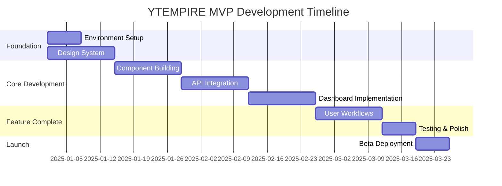

# YTEMPIRE Project Management

## 6.1 Team Structure

### Organizational Hierarchy

```
CEO/Founder
├── Product Owner
├── CTO/Technical Director
│   ├── Frontend Team Lead (4 members)
│   │   ├── React Engineer (1)
│   │   ├── Dashboard Specialist (1)
│   │   └── UI/UX Designer (1)
│   ├── Backend Team Lead (4 members)
│   │   ├── API Developer Engineer (1)
│   │   ├── Data Pipeline Engineer (1)
│   │   └── Integration Specialist (1)
│   └── Platform Ops Lead (4 members)
│       ├── DevOps Engineer (1)
│       ├── Security Engineer (1)
│       └── QA Engineer (1)
└── VP of AI
    ├── AI/ML Team Lead (2 members)
    │   └── ML Engineer (1)
    └── Data Team Lead (3 members)
        ├── Data Engineer (1)
        └── Analytics Engineer (1)
```

### Team Composition Summary

```yaml
total_team_size: 17 people
breakdown:
  leadership: 4
    - CEO/Founder
    - Product Owner
    - CTO/Technical Director
    - VP of AI
  
  technical_teams: 13
    frontend: 4
      - Frontend Team Lead
      - React Engineer
      - Dashboard Specialist
      - UI/UX Designer
    
    backend: 4
      - Backend Team Lead
      - API Developer Engineer
      - Data Pipeline Engineer
      - Integration Specialist
    
    platform_ops: 4
      - Platform Ops Lead
      - DevOps Engineer
      - Security Engineer
      - QA Engineer
    
    ai_ml: 2
      - AI/ML Team Lead
      - ML Engineer
    
    data: 3
      - Data Team Lead
      - Data Engineer
      - Analytics Engineer

budget_allocation:
  total: $200,000
  frontend: $147,000 (73.5%)
  remaining: $53,000 (26.5%)
  
  note: "Budget constraint acknowledged - requires executive resolution"
```

### Role Responsibilities Matrix

| Role | Primary Responsibilities | Key Deliverables | Success Metrics |
|------|-------------------------|------------------|-----------------|
| **Frontend Team Lead** | Architecture, team management, code review | Technical decisions, sprint planning | On-time delivery, quality standards |
| **React Engineer** | Component development, state management | 35 components, API integration | 70% test coverage, <2s load time |
| **Dashboard Specialist** | Charts, real-time updates, performance | 5-7 Recharts, WebSocket events | <500ms chart render, 60s polling |
| **UI/UX Designer** | Design system, mockups, user testing | 20-25 screens, Figma library | WCAG AA compliance, 4/5 satisfaction |
| **Backend Team Lead** | API design, service architecture | REST APIs, WebSocket server | 99.9% uptime, <1s response |
| **API Developer** | Endpoint implementation, validation | CRUD operations, auth system | 100% test coverage, OpenAPI docs |
| **Data Pipeline Engineer** | Queue management, video processing | Video generation pipeline | <5min generation, <$3/video |
| **Integration Specialist** | Third-party APIs, YouTube integration | YouTube API, payment processing | Zero integration failures |
| **Platform Ops Lead** | Infrastructure, deployment, monitoring | CI/CD pipeline, monitoring | 99.9% availability, <5min deploy |
| **DevOps Engineer** | Cloud infrastructure, automation | Docker, Kubernetes setup | Auto-scaling, disaster recovery |
| **Security Engineer** | Security audits, compliance | Security protocols, PCI compliance | Zero breaches, OWASP compliance |
| **QA Engineer** | Testing strategy, automation | Test suites, bug tracking | <5% bug escape rate |
| **AI/ML Team Lead** | ML models, AI pipeline | Niche selection, quality scoring | 80% accuracy, <2s inference |
| **ML Engineer** | Model training, optimization | Trained models, API endpoints | Model performance metrics |
| **Data Team Lead** | Analytics, data pipeline | Data warehouse, dashboards | Real-time analytics, reports |
| **Data Engineer** | ETL processes, data quality | Data pipelines, schemas | 99% data accuracy |
| **Analytics Engineer** | Business metrics, reporting | KPI dashboards, insights | Actionable recommendations |

## 6.2 12-Week Timeline

### Phase Overview



### Week-by-Week Breakdown

#### **Weeks 1-2: Foundation & Setup**
```yaml
week_1:
  focus: "Environment and architecture setup"
  deliverables:
    - Development environment configured
    - Git repository structure
    - CI/CD pipeline basic setup
    - Design tokens created
    - Authentication UI mockups
  
  team_allocation:
    frontend: "Full team - setup and planning"
    backend: "API contract definition"
    platform_ops: "Infrastructure provisioning"
    ai_ml: "Model architecture planning"

week_2:
  focus: "Core systems establishment"
  deliverables:
    - Material-UI theme configured
    - Zustand stores structured
    - API contracts finalized
    - Database schema designed
    - First 10 components built
  
  dependencies:
    critical:
      - API contracts must be agreed
      - Design system must be approved
```

#### **Weeks 3-4: Core UI Components**
```yaml
week_3:
  focus: "Component library development"
  deliverables:
    - 15 additional components (25 total)
    - Dashboard layout complete
    - Navigation system working
    - Form components ready
  
  blockers_risk:
    - Design approval delays
    - Component complexity underestimated

week_4:
  focus: "Business logic components"
  deliverables:
    - Channel cards complete
    - Video queue interface
    - Cost tracking widgets
    - Loading/error states
  
  milestone: "UI component library complete (35 components)"
```

#### **Weeks 5-6: State Management & API Integration**
```yaml
week_5:
  focus: "State management implementation"
  deliverables:
    - All Zustand stores complete
    - API service layer built
    - JWT authentication working
    - Polling mechanism implemented
  
  dependencies:
    - Backend APIs must be available
    - WebSocket server running

week_6:
  focus: "Integration testing"
  deliverables:
    - All API endpoints integrated
    - Real-time updates working
    - Error handling complete
    - Performance baselines met
  
  milestone: "Frontend-backend integration complete"
```

#### **Weeks 7-8: Dashboard & Visualization**
```yaml
week_7:
  focus: "Dashboard implementation"
  deliverables:
    - Main dashboard complete
    - All charts implemented (5-7)
    - Metrics calculations working
    - Real-time updates visible
  
  technical_challenges:
    - Chart performance optimization
    - Data aggregation complexity

week_8:
  focus: "Polish and optimization"
  deliverables:
    - Performance optimized
    - Loading states smooth
    - Animations implemented
    - Mobile viewport blocked (desktop only)
  
  milestone: "Feature-complete dashboard"
```

#### **Weeks 9-10: User Workflows & Polish**
```yaml
week_9:
  focus: "Critical user journeys"
  deliverables:
    - Channel creation wizard
    - Video generation flow
    - Settings pages
    - Onboarding flow
  
  user_testing:
    - 5 beta testers recruited
    - Feedback sessions scheduled

week_10:
  focus: "Refinement and fixes"
  deliverables:
    - User feedback incorporated
    - Bug fixes completed
    - Performance tuning
    - Documentation updated
  
  milestone: "Beta-ready application"
```

#### **Week 11: Testing & Optimization**
```yaml
week_11:
  focus: "Quality assurance sprint"
  activities:
    - Comprehensive testing
    - Performance optimization
    - Security audit
    - Accessibility review
  
  deliverables:
    - 70% test coverage achieved
    - Bundle size <1MB
    - Load time <2 seconds
    - Zero critical bugs
  
  go_no_go_decision: "Thursday Week 11"
```

#### **Week 12: Beta Launch**
```yaml
week_12:
  focus: "Production deployment and support"
  activities:
    - Production deployment
    - Beta user onboarding
    - Monitoring setup
    - Support documentation
  
  success_criteria:
    - 50 beta users onboarded
    - 99.9% uptime maintained
    - <5% error rate
    - All channels operational
  
  milestone: "MVP successfully launched"
```

## 6.3 Sprint Planning

### Sprint Structure

```yaml
sprint_configuration:
  duration: 2 weeks
  ceremony_schedule:
    sprint_planning:
      when: "Monday Week 1, 9:00 AM"
      duration: "2 hours"
      attendees: "Full team"
      
    daily_standup:
      when: "Daily 9:30 AM"
      duration: "15 minutes"
      format: "Yesterday, Today, Blockers"
      
    sprint_review:
      when: "Friday Week 2, 2:00 PM"
      duration: "1 hour"
      attendees: "Team + Stakeholders"
      
    retrospective:
      when: "Friday Week 2, 3:30 PM"
      duration: "1 hour"
      attendees: "Team only"

velocity_targets:
  frontend_team: 150 points
  backend_team: 140 points
  platform_ops: 100 points
  ai_ml_team: 80 points
```

### Sprint Goals by Phase

```typescript
const sprintGoals = {
  sprint_1: {
    weeks: "1-2",
    theme: "Foundation",
    goals: [
      "Development environment ready",
      "Component library started",
      "API contracts defined",
      "CI/CD pipeline operational"
    ]
  },
  
  sprint_2: {
    weeks: "3-4",
    theme: "Core Components",
    goals: [
      "35 components complete",
      "Navigation working",
      "Basic API integration",
      "Design system finalized"
    ]
  },
  
  sprint_3: {
    weeks: "5-6",
    theme: "Integration",
    goals: [
      "All APIs connected",
      "State management complete",
      "Real-time updates working",
      "Authentication flows done"
    ]
  },
  
  sprint_4: {
    weeks: "7-8",
    theme: "Dashboard",
    goals: [
      "Dashboard fully functional",
      "Charts rendering data",
      "Performance optimized",
      "Cost tracking accurate"
    ]
  },
  
  sprint_5: {
    weeks: "9-10",
    theme: "User Flows",
    goals: [
      "All user journeys complete",
      "Onboarding tested",
      "Settings functional",
      "Beta feedback incorporated"
    ]
  },
  
  sprint_6: {
    weeks: "11-12",
    theme: "Launch",
    goals: [
      "All tests passing",
      "Performance targets met",
      "Production deployed",
      "Beta users onboarded"
    ]
  }
};
```

### Definition of Done

```yaml
story_completion_criteria:
  code:
    - Feature implemented per acceptance criteria
    - Code reviewed and approved
    - Unit tests written (70% coverage minimum)
    - Integration tests passing
    
  quality:
    - No console errors
    - Performance benchmarks met
    - Accessibility standards met (WCAG AA)
    - Cross-browser tested (Chrome, Firefox, Safari)
    
  documentation:
    - Code comments added
    - README updated if needed
    - API documentation current
    - User-facing changes documented
    
  deployment:
    - Merged to main branch
    - Deployed to staging
    - Smoke tests passing
    - Product owner approval
```

## 6.4 Risk Assessment

### Risk Matrix

| Risk | Probability | Impact | Mitigation | Contingency |
|------|------------|--------|------------|-------------|
| **Bundle size >1MB** | High | High | Aggressive code splitting, tree shaking | Remove MUI for critical components |
| **API delays** | Medium | Critical | Parallel development with mocks | Extend timeline by 1 week |
| **Cost per video >$3** | Medium | High | Optimize API calls, cache aggressively | Reduce video quality/length |
| **User onboarding failure** | Low | High | Extensive testing, clear documentation | Provide manual onboarding support |
| **Performance degradation** | Medium | High | Continuous monitoring, optimization sprints | Reduce feature scope |
| **Security breach** | Low | Critical | Security audits, penetration testing | Incident response plan ready |
| **YouTube API changes** | Low | Critical | Monitor API changelog, version pinning | Quick patch deployment process |
| **Team member loss** | Medium | Medium | Knowledge sharing, documentation | Cross-training, contractor backup |
| **Scope creep** | High | Medium | Strict change control, clear MVP definition | Push features to Phase 2 |
| **Budget overrun** | High | High | Weekly budget tracking, resource optimization | Reduce team size or timeline |

### Risk Mitigation Strategies

```yaml
technical_risks:
  bundle_size:
    monitoring: "Check bundle size on every PR"
    threshold: "Alert at 800KB, block at 1MB"
    optimization:
      - Lazy load all routes
      - Dynamic import heavy components
      - Use production builds for testing
      - Regular bundle analysis
  
  performance:
    monitoring: "Lighthouse CI on every deploy"
    threshold: "Page load must be <2 seconds"
    optimization:
      - Virtual scrolling for lists
      - Debounce all searches
      - Optimize re-renders
      - Cache API responses
  
  api_reliability:
    monitoring: "Health checks every minute"
    backup: "Implement circuit breakers"
    fallback:
      - Queue failed requests
      - Show cached data
      - Graceful degradation
      - Manual retry options

project_risks:
  timeline_slippage:
    early_warning: "Daily burndown tracking"
    escalation: "Alert if behind by >2 days"
    recovery:
      - Overtime approval
      - Scope reduction
      - Resource reallocation
      - Parallel work streams
  
  quality_issues:
    prevention: "Automated testing, code reviews"
    detection: "User feedback, error tracking"
    resolution:
      - Hotfix process defined
      - Rollback procedures ready
      - Communication plan
      - Post-mortem process
```

### Dependency Management

```typescript
interface CriticalDependencies {
  week2: {
    dependency: "API contracts",
    owner: "Backend Team",
    impact: "Blocks all integration",
    mitigation: "Use mock data if delayed"
  },
  
  week4: {
    dependency: "Design approval",
    owner: "Product Owner",
    impact: "Blocks UI development",
    mitigation: "Proceed with 80% confidence designs"
  },
  
  week6: {
    dependency: "WebSocket server",
    owner: "Backend Team",
    impact: "Blocks real-time features",
    mitigation: "Use polling exclusively"
  },
  
  week8: {
    dependency: "ML models deployed",
    owner: "AI Team",
    impact: "Blocks niche selection",
    mitigation: "Use simplified algorithm"
  },
  
  week10: {
    dependency: "Payment processing",
    owner: "Backend Team",
    impact: "Blocks billing features",
    mitigation: "Manual billing for beta"
  },
  
  week11: {
    dependency: "Production infrastructure",
    owner: "Platform Ops",
    impact: "Blocks deployment",
    mitigation: "Deploy to staging environment"
  }
}
```

## 6.5 Success Criteria

### MVP Launch Criteria

```yaml
technical_requirements:
  ✅ performance:
    - Page load time: <2 seconds
    - Time to interactive: <3 seconds
    - Bundle size: <1MB
    - Memory usage: <200MB
    - API response time: <1 second
    
  ✅ quality:
    - Test coverage: ≥70%
    - Zero critical bugs
    - <5 minor bugs
    - Error rate: <1%
    - Crash rate: 0%
    
  ✅ functionality:
    - All 35 components working
    - 20-25 screens complete
    - 5 channels per user functional
    - Video generation working
    - Cost tracking accurate (<$3)

user_requirements:
  ✅ capacity:
    - 50 beta users supported
    - 250 channels total (5 per user)
    - 50 videos/day generation
    - 100 concurrent users
    
  ✅ experience:
    - Onboarding: <10 minutes
    - Daily tasks: <5 minutes
    - Video generation: <5 minutes
    - Dashboard refresh: 60 seconds
    
  ✅ business_metrics:
    - Cost per video: <$3
    - Channel profitability demonstrated
    - 95% automation achieved
    - Revenue tracking functional

operational_requirements:
  ✅ availability:
    - Uptime: 99.9%
    - Deployment time: <5 minutes
    - Rollback capability: <2 minutes
    - Backup frequency: Daily
    
  ✅ monitoring:
    - Error tracking active
    - Performance monitoring live
    - User analytics configured
    - Cost alerts functional
    
  ✅ support:
    - Documentation complete
    - Help system integrated
    - Support ticket system ready
    - FAQ published
```

### Success Metrics Dashboard

```typescript
const successMetrics = {
  week12_targets: {
    users: {
      target: 50,
      minimum: 40,
      stretch: 75
    },
    
    channels: {
      target: 250,
      minimum: 200,
      stretch: 375
    },
    
    videos_generated: {
      target: 500,
      minimum: 400,
      stretch: 750
    },
    
    system_metrics: {
      uptime: "99.9%",
      error_rate: "<1%",
      page_load: "<2s",
      cost_per_video: "<$3"
    },
    
    user_satisfaction: {
      onboarding_completion: ">80%",
      daily_active_users: ">70%",
      nps_score: ">40",
      support_tickets: "<10% of users"
    }
  },
  
  phase2_indicators: {
    user_demand: ">100 waitlist",
    revenue_potential: ">$50K MRR path",
    technical_stability: "Zero critical issues for 7 days",
    team_readiness: "Retrospective indicates readiness"
  }
};
```

### Post-Launch Success Monitoring

```yaml
week_13_and_beyond:
  daily_monitoring:
    - Active users count
    - Videos generated
    - Revenue tracked
    - Cost per video
    - Error rates
    - Support tickets
    
  weekly_reviews:
    - User feedback analysis
    - Performance trends
    - Cost optimization opportunities
    - Feature request prioritization
    - Team velocity assessment
    
  monthly_evaluation:
    - Revenue targets vs actual
    - User growth rate
    - Platform stability
    - Technical debt assessment
    - Phase 2 planning
    
  success_indicators:
    - Users requesting more channels
    - Positive user testimonials
    - Low churn rate (<10%)
    - Referral sign-ups
    - Revenue exceeding costs
```