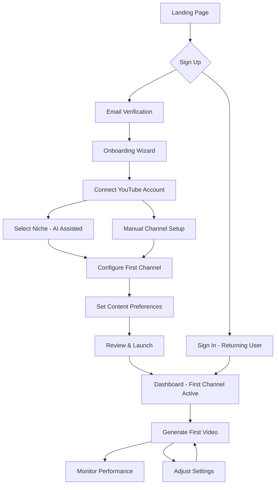

# YTEMPIRE User Experience

## 4.1 User Journeys

### Primary User Journey: First-Time Setup



### Daily Power User Workflow

```yaml
morning_routine:
  duration: "5-10 minutes"
  
  steps:
    1_dashboard_review:
      action: "Check overnight performance"
      focus: 
        - Total revenue
        - New videos published
        - Cost per video (<$3)
        - Channel health status
      
    2_alerts_check:
      action: "Review system notifications"
      items:
        - Cost warnings (approaching $3)
        - Failed video generations
        - YouTube API issues
        - Performance anomalies
      
    3_quick_decisions:
      action: "Make operational adjustments"
      decisions:
        - Pause underperforming channels
        - Approve AI-suggested topics
        - Adjust generation schedule
        - Review flagged content
      
    4_verify_automation:
      action: "Confirm systems running"
      checks:
        - Queue processing
        - Upload schedule
        - Cost tracking
        - Revenue updates

evening_check:
  duration: "2-3 minutes"
  
  steps:
    1_metrics_review:
      - Daily video count
      - Total cost spent
      - Revenue generated
      - ROI calculation
    
    2_next_day_prep:
      - Queue tomorrow's videos
      - Set priority channels
      - Review content calendar
```

### Critical User Flows

#### Video Generation Flow

```typescript
interface VideoGenerationFlow {
  trigger: 'manual' | 'scheduled' | 'ai_suggested';
  
  steps: {
    1_initiation: {
      entry_points: ['Dashboard button', 'Channel card', 'Schedule trigger'];
      validation: 'Check channel status and quotas';
    };
    
    2_topic_selection: {
      automatic: {
        source: 'AI trend analysis';
        approval: 'Optional user review';
      };
      manual: {
        input: 'Custom topic entry';
        assistance: 'AI suggestions';
      };
    };
    
    3_configuration: {
      video_length: ['Short (3-5 min)', 'Medium (8-10 min)', 'Long (15+ min)'];
      style: ['Educational', 'Entertainment', 'News', 'Review'];
      priority: ['High', 'Normal', 'Low'];
    };
    
    4_cost_preview: {
      breakdown: {
        script_generation: '$0.02';
        voice_synthesis: '$0.08';
        video_assembly: '$0.15';
        thumbnail_creation: '$0.05';
        total: '$0.30';
      };
      warning: 'Alert if >$2.50';
    };
    
    5_generation_progress: {
      stages: ['Script', 'Audio', 'Video', 'Thumbnail', 'Upload'];
      duration: '3-5 minutes total';
      updates: 'Real-time progress bar';
    };
    
    6_completion: {
      notifications: ['Toast message', 'Dashboard update', 'Email (optional)'];
      actions: ['View on YouTube', 'Share link', 'View analytics'];
    };
  };
  
  error_handling: {
    cost_exceeded: 'Pause and notify';
    api_failure: 'Retry with exponential backoff';
    quality_failure: 'Flag for manual review';
  };
}
```

#### Channel Management Flow

```yaml
channel_operations:
  quick_actions:
    location: "Channel card hover menu"
    actions:
      - pause_resume: "Single click toggle"
      - view_analytics: "Opens modal overlay"
      - generate_video: "Immediate queue addition"
      - edit_settings: "Inline edit mode"
  
  bulk_operations:
    trigger: "Select multiple channels"
    actions:
      - pause_all: "Immediate effect"
      - resume_all: "Immediate effect"
      - apply_settings: "Modal for configuration"
      - export_data: "CSV download"
  
  channel_creation:
    duration: "3-5 minutes"
    steps:
      1_niche_selection:
        method: "AI-powered wizard"
        inputs: "Interests, budget, goals"
        output: "Ranked niche options"
      
      2_channel_setup:
        name: "Auto-generated or custom"
        description: "AI-assisted writing"
        branding: "Template selection"
      
      3_content_strategy:
        schedule: "Videos per week"
        topics: "Content categories"
        monetization: "Ad types, affiliates"
      
      4_launch:
        verification: "Settings review"
        activation: "Start content generation"
```

## 4.2 Information Architecture

### Navigation Structure

```yaml
primary_navigation:
  dashboard:
    label: "Dashboard"
    icon: "GridView"
    path: "/"
    badge: "Updates count"
    priority: 1
    
  channels:
    label: "Channels"
    icon: "LiveTv"
    path: "/channels"
    badge: "Active count"
    priority: 2
    subnav:
      - all_channels: "/channels/all"
      - add_channel: "/channels/new"
      - bulk_edit: "/channels/bulk"
    
  videos:
    label: "Videos"
    icon: "VideoLibrary"
    path: "/videos"
    badge: "Queue count"
    priority: 3
    subnav:
      - queue: "/videos/queue"
      - published: "/videos/published"
      - failed: "/videos/failed"
    
  analytics:
    label: "Analytics"
    icon: "Analytics"
    path: "/analytics"
    priority: 4
    subnav:
      - overview: "/analytics/overview"
      - revenue: "/analytics/revenue"
      - costs: "/analytics/costs"
    
  settings:
    label: "Settings"
    icon: "Settings"
    path: "/settings"
    priority: 5
    subnav:
      - account: "/settings/account"
      - billing: "/settings/billing"
      - api_keys: "/settings/api"
```

### Page Hierarchy

```
YTEMPIRE
├── Dashboard (/)
│   ├── Metrics Overview
│   ├── Channel Grid (5 max)
│   ├── Recent Activity
│   └── Quick Actions
│
├── Channels (/channels)
│   ├── All Channels
│   │   ├── List View
│   │   ├── Grid View
│   │   └── Bulk Actions
│   ├── Add Channel
│   │   ├── Niche Wizard
│   │   ├── Setup Form
│   │   └── Launch Review
│   └── Channel Detail
│       ├── Performance
│       ├── Videos
│       └── Settings
│
├── Videos (/videos)
│   ├── Generation Queue
│   │   ├── Pending
│   │   ├── Processing
│   │   └── Scheduled
│   ├── Published
│   │   ├── Recent
│   │   ├── Top Performing
│   │   └── By Channel
│   └── Failed/Review
│       ├── Quality Issues
│       ├── API Errors
│       └── Cost Exceeded
│
├── Analytics (/analytics)
│   ├── Overview
│   │   ├── Revenue Trends
│   │   ├── Cost Analysis
│   │   └── ROI Metrics
│   ├── Channel Performance
│   │   ├── Comparative
│   │   ├── Individual
│   │   └── Predictions
│   └── Reports
│       ├── Export Data
│       ├── Scheduled Reports
│       └── Custom Queries
│
└── Settings (/settings)
    ├── Account
    │   ├── Profile
    │   ├── Password
    │   └── Preferences
    ├── Billing
    │   ├── Subscription
    │   ├── Usage
    │   └── Invoices
    └── Integrations
        ├── YouTube API
        ├── AI Services
        └── Webhooks
```

### Content Organization Principles

```typescript
const organizationPrinciples = {
  grouping: {
    rule: "Related items together",
    implementation: "Channels with their videos, costs with revenue"
  },
  
  hierarchy: {
    primary: "Revenue, Active Channels, Cost/Video",
    secondary: "Detailed analytics, Historical data",
    tertiary: "Settings, Configuration"
  },
  
  progressive_disclosure: {
    level1: "Summary metrics, Quick actions",
    level2: "Detailed views, Configurations", 
    level3: "Advanced settings, Raw data"
  },
  
  findability: {
    methods: ["Navigation menu", "Search", "Breadcrumbs", "Related links"],
    max_clicks: 3 // Any feature within 3 clicks
  }
};
```

## 4.3 Wireframes & Layouts

### Dashboard Layout (1280px minimum)

```
┌─────────────────────────────────────────────────────────────┐
│ Header (64px)                                               │
│ [Logo] [Search]                    [Alerts] [User] [Menu]   │
├─────────────┬───────────────────────────────────────────────┤
│             │                                               │
│   Sidebar   │  Key Metrics Row (4 cards)                   │
│   (240px)   │  ┌─────────┐ ┌─────────┐ ┌─────────┐ ┌─────┐│
│             │  │Revenue  │ │Channels │ │Videos   │ │Cost ││
│ ┌─────────┐ │  │$12,458  │ │5 Active │ │142 Today│ │$2.45││
│ │Dashboard│ │  │+23% ▲   │ │100%     │ │On Track │ │Safe ││
│ │Channels │ │  └─────────┘ └─────────┘ └─────────┘ └─────┘│
│ │Videos   │ │                                               │
│ │Analytics│ │  Channel Performance Grid                     │
│ │Settings │ │  ┌───────────────┐ ┌───────────────┐        │
│ └─────────┘ │  │ Channel Card  │ │ Channel Card  │        │
│             │  │ ┌───────────┐ │ │ ┌───────────┐ │        │
│             │  │ │Thumbnail  │ │ │ │Thumbnail  │ │        │
│             │  │ └───────────┘ │ │ └───────────┘ │        │
│             │  │ Tech Reviews  │ │ Gaming News   │        │
│             │  │ Status: Active│ │ Status: Active│        │
│             │  │ Videos: 28    │ │ Videos: 31    │        │
│             │  │ Revenue: $2.5K│ │ Revenue: $3.1K│        │
│             │  │ [Generate][⚙] │ │ [Generate][⚙] │        │
│             │  └───────────────┘ └───────────────┘        │
│             │                                               │
│             │  Recent Activity & Queue Status               │
│             │  ┌─────────────────────────────────────────┐ │
│             │  │ • Video published - Tech News Today      │ │
│             │  │ • Cost alert - Approaching $3 limit     │ │
│             │  │ • Generation complete - Gaming #42       │ │
│             │  │ • 3 videos in queue for tomorrow         │ │
│             │  └─────────────────────────────────────────┘ │
└─────────────┴───────────────────────────────────────────────┘
```

### Channel Management Page

```
┌─────────────────────────────────────────────────────────────┐
│ Channels > All Channels                          [← Back]   │
├─────────────┬───────────────────────────────────────────────┤
│   Sidebar   │  Page Header                                  │
│             │  ┌─────────────────────────────────────────┐ │
│             │  │ My Channels (5)    [+ Add] [⚙ Bulk Edit] │ │
│             │  └─────────────────────────────────────────┘ │
│             │                                               │
│             │  Filters & Actions                            │
│             │  ┌─────────────────────────────────────────┐ │
│             │  │ [Search...] [Status ▼] [Sort ▼] [View ▼]│ │
│             │  └─────────────────────────────────────────┘ │
│             │                                               │
│             │  Channel Table                                │
│             │  ┌─────────────────────────────────────────┐ │
│             │  │ □ │ Channel    │ Status │ Videos │ Rev. ││
│             │  ├───┼────────────┼────────┼────────┼──────┤│
│             │  │ □ │ Tech Today │ Active │ 142    │$2.5K ││
│             │  │   │ Subscribers: 5.2K  Views: 125K        ││
│             │  │   │ [Pause][Generate][Analytics][Edit]    ││
│             │  ├───┼────────────┼────────┼────────┼──────┤│
│             │  │ □ │ Gaming Pro │ Active │ 89     │$1.8K ││
│             │  │   │ Subscribers: 3.1K  Views: 89K         ││
│             │  │   │ [Pause][Generate][Analytics][Edit]    ││
│             │  └─────────────────────────────────────────┘ │
│             │                                               │
│             │  [Showing 1-5 of 5]        [Items per page ▼]│
└─────────────┴───────────────────────────────────────────────┘
```

### Video Generation Modal

```
┌─────────────────────────────────────────────────────────────┐
│ Generate New Video                                      [X] │
├─────────────────────────────────────────────────────────────┤
│                                                             │
│  Step 1: Select Channel                                     │
│  ┌─────────────────────────────────────────────────┐       │
│  │ ○ Tech Today - Last video: 2 hours ago          │       │
│  │ ● Gaming Pro - Last video: 5 hours ago          │       │
│  │ ○ Cooking Tips - Last video: 1 day ago          │       │
│  └─────────────────────────────────────────────────┘       │
│                                                             │
│  Step 2: Topic Selection                                    │
│  ┌─────────────────────────────────────────────────┐       │
│  │ ● AI Suggested (Recommended)                    │       │
│  │   "Top 10 Gaming Mice of 2025" - High trend    │       │
│  │                                                  │       │
│  │ ○ Custom Topic                                  │       │
│  │   [Enter your topic...]                         │       │
│  └─────────────────────────────────────────────────┘       │
│                                                             │
│  Step 3: Configuration                                      │
│  ┌─────────────────────────────────────────────────┐       │
│  │ Length:    [Medium (8-10 min) ▼]                │       │
│  │ Style:     [Review ▼]                           │       │
│  │ Priority:  [Normal ▼]                           │       │
│  └─────────────────────────────────────────────────┘       │
│                                                             │
│  Cost Estimate                                              │
│  ┌─────────────────────────────────────────────────┐       │
│  │ 💰 Estimated Cost: $2.35                        │       │
│  │ ├─ Script: $0.02                                │       │
│  │ ├─ Voice: $0.08                                 │       │
│  │ ├─ Video: $1.20                                 │       │
│  │ └─ Thumbnail: $0.05                             │       │
│  │                                                  │       │
│  │ ✓ Within budget (<$3.00)                        │       │
│  └─────────────────────────────────────────────────┘       │
│                                                             │
│  [Cancel]                            [Generate Video]       │
└─────────────────────────────────────────────────────────────┘
```

## 4.4 Content Guidelines

### Voice & Tone

```yaml
voice_attributes:
  professional:
    description: "Expert but approachable"
    do: "Your channel is performing 23% above average"
    dont: "ur channel is killing it!!!"
    
  encouraging:
    description: "Positive and supportive"
    do: "Great progress! You're on track to hit $10K this month"
    dont: "Performance is acceptable"
    
  clear:
    description: "Simple, jargon-free language"
    do: "Videos created today: 5"
    dont: "Content generation instances initiated: 5"
    
  actionable:
    description: "Focus on what users can do"
    do: "Increase revenue by uploading at 2 PM EST"
    dont: "Revenue could be higher"
    
  transparent:
    description: "Honest about costs and limitations"
    do: "This video will cost $2.35 to generate"
    dont: "Generate video" (without cost info)
```

### Microcopy Standards

```typescript
// Button Labels
const buttonLabels = {
  primary_actions: {
    create: "Add Channel",          // Not "Create New Channel Entity"
    generate: "Generate Video",     // Not "Initialize Generation Process"
    save: "Save Changes",          // Not "Submit Modifications"
    delete: "Delete",              // Not "Remove Permanently"
  },
  
  secondary_actions: {
    cancel: "Cancel",              // Always "Cancel", never "Close"
    edit: "Edit",                 // Not "Modify"
    view: "View Details",         // Not "See More Information"
    export: "Export",             // Not "Download Data"
  },
  
  confirmations: {
    delete_channel: "Delete Channel", // Repeat the action
    pause_channel: "Pause Channel",   // Be specific
    generate_video: "Generate Video",  // Include cost in description
    bulk_action: "Apply to {n} Channels", // Show scope
  }
};

// Status Messages
const statusMessages = {
  success: {
    saved: "Changes saved successfully",
    video_started: "Video generation started - Ready in ~5 minutes",
    channel_created: "Channel created and ready for videos",
    bulk_complete: "{n} channels updated"
  },
  
  error: {
    generic: "Something went wrong. Please try again.",
    api_limit: "YouTube API limit reached. Try again in {time}",
    cost_exceeded: "Video cost would exceed $3 limit",
    validation: "Please fill in all required fields"
  },
  
  warning: {
    cost_high: "This video will cost ${amount} (above usual)",
    api_quota: "80% of daily API quota used",
    storage: "Approaching storage limit"
  },
  
  info: {
    processing: "Processing... This usually takes 3-5 minutes",
    queue_position: "Position {n} in queue",
    next_video: "Next video scheduled for {time}"
  }
};

// Empty States
const emptyStates = {
  no_channels: {
    icon: "AddCircle",
    heading: "No channels yet",
    description: "Create your first channel to start generating videos automatically",
    action: "Create First Channel"
  },
  
  no_videos: {
    icon: "VideoLibrary",
    heading: "No videos in queue",
    description: "Videos will appear here when scheduled or manually generated",
    action: "Generate Video Now"
  },
  
  no_data: {
    icon: "Timeline",
    heading: "Not enough data yet",
    description: "Analytics will appear after your first 24 hours of activity",
    action: "Learn About Analytics"
  },
  
  all_paused: {
    icon: "PauseCircle",
    heading: "All channels paused",
    description: "Resume a channel to start generating videos again",
    action: "Resume a Channel"
  }
};
```

### Form Labels & Help Text

```typescript
const formGuidance = {
  channel_name: {
    label: "Channel Name",
    placeholder: "e.g., Tech Reviews Pro",
    helper: "Choose a memorable name for your niche",
    error: "Channel name must be 3-50 characters"
  },
  
  video_topic: {
    label: "Video Topic (Optional)",
    placeholder: "Leave blank for AI suggestions",
    helper: "AI will choose trending topics if left empty",
    error: "Topic must be under 100 characters"
  },
  
  upload_schedule: {
    label: "Upload Schedule",
    helper: "Videos will be distributed across this schedule",
    options: [
      { value: "daily", label: "Daily (1 video/day)" },
      { value: "frequent", label: "Frequent (5 videos/week)" },
      { value: "moderate", label: "Moderate (3 videos/week)" },
      { value: "light", label: "Light (1 video/week)" }
    ]
  },
  
  cost_limit: {
    label: "Daily Cost Limit",
    helper: "Prevents exceeding budget (max $3/video)",
    default: "$15",
    error: "Minimum $3 (one video)"
  }
};
```

## 4.5 Usability Testing

### Testing Protocol

```yaml
methodology:
  type: "Moderated remote testing"
  participants: "5-8 per round"
  duration: "45-60 minutes"
  frequency: "Every 2 weeks during MVP"
  tools: "Zoom + Figma prototype"

recruitment_criteria:
  must_have:
    - YouTube content creator or aspiring
    - Basic computer literacy
    - Desktop/laptop access
    - Stable internet connection
  
  nice_to_have:
    - Managing multiple channels
    - Experience with automation tools
    - Online business experience
  
  demographics:
    age: "25-45"
    location: "US, UK, Canada"
    income: "$30K+"
```

### Test Scenarios

```yaml
scenario_1_first_channel:
  goal: "Create and configure first channel"
  tasks:
    1: "Sign up for account"
    2: "Connect YouTube account"
    3: "Complete niche selection wizard"
    4: "Configure channel settings"
    5: "Generate first video"
  
  success_metrics:
    - Time to complete: <10 minutes
    - Error rate: <10%
    - Assistance needed: <2 times
    - Satisfaction: >4/5

scenario_2_daily_monitoring:
  goal: "Check performance and make decisions"
  tasks:
    1: "Review dashboard metrics"
    2: "Identify best performing video"
    3: "Check cost per video"
    4: "Pause underperforming channel"
    5: "Queue tomorrow's videos"
  
  success_metrics:
    - Time to complete: <5 minutes
    - Information found: 100%
    - Actions completed: 100%
    - Confidence level: >4/5

scenario_3_bulk_operations:
  goal: "Manage multiple channels efficiently"
  tasks:
    1: "Select 3 channels"
    2: "Apply same upload schedule"
    3: "Bulk pause selected channels"
    4: "Export performance data"
  
  success_metrics:
    - Feature discovery: >80%
    - Task completion: 100%
    - Time saved vs individual: >50%

scenario_4_cost_management:
  goal: "Monitor and control costs"
  tasks:
    1: "Find current cost per video"
    2: "Identify highest cost channel"
    3: "Set daily cost limit"
    4: "View cost breakdown for video"
  
  success_metrics:
    - Cost visibility: Clear
    - Understanding of charges: 100%
    - Limit setting success: 100%
    - Comfort with costs: >4/5
```

### Testing Script Template

```markdown
## Introduction (5 minutes)
"Hi [Name], thanks for joining today. I'm testing a new platform that helps people manage YouTube channels. I'm interested in your honest feedback - there are no right or wrong answers. Please think out loud as you work through tasks. Remember, we're testing the design, not you."

## Background Questions (5 minutes)
1. Tell me about your experience with YouTube
2. Have you ever wanted to create content but found it too time-consuming?
3. What tools do you currently use for content creation?
4. What's your biggest challenge with YouTube?

## Task Scenarios (30 minutes)

### Task 1: First Channel Setup
"Imagine you want to start a YouTube channel about [their interest]. Please create your first channel using our platform."

Observe:
- Navigation clarity
- Wizard comprehension
- Decision confidence
- Error recovery

### Task 2: Daily Dashboard Review
"It's the next morning. Check how your channel performed overnight and make any necessary adjustments."

Observe:
- Metric understanding
- Action discovery
- Cost awareness
- Time to decision

### Task 3: Generate a Video
"Your channel needs a new video. Please generate one."

Observe:
- Process understanding
- Cost perception
- Option selection
- Completion confidence

## Post-Test Questions (10 minutes)
1. What was your overall impression?
2. What was most confusing?
3. What did you like most?
4. How likely would you use this? (1-10)
5. What would you change?
6. Was the $3/video cost clear?

## Debrief (5 minutes)
"Thank you so much for your feedback. Your input will help us improve the platform. You'll receive your compensation within 24 hours."
```

### Analysis Framework

```yaml
data_collection:
  quantitative_metrics:
    - Task completion rate (%)
    - Time on task (seconds)
    - Error frequency (#)
    - Click/tap count (#)
    - Help requests (#)
  
  qualitative_observations:
    - Verbal feedback quotes
    - Facial expressions
    - Hesitation points
    - Confusion moments
    - Delight reactions
  
  severity_ratings:
    critical: "Prevents task completion"
    major: "Causes significant friction"
    minor: "Noticeable but manageable"
    enhancement: "Would improve experience"

analysis_process:
  1_review: "Watch all recordings"
  2_tag: "Mark issues with severity"
  3_pattern: "Identify common problems"
  4_prioritize: "Rank by impact"
  5_recommend: "Create actionable fixes"
```

### Success Criteria

```typescript
interface UsabilityMetrics {
  task_success: {
    target: '>90%',
    minimum: '80%',
    measurement: 'Binary completion'
  };
  
  time_on_task: {
    first_channel: '<10 minutes',
    daily_check: '<5 minutes',
    video_generation: '<3 minutes'
  };
  
  user_satisfaction: {
    overall: '>4.0/5.0',
    ease_of_use: '>4.0/5.0',
    would_recommend: '>7/10'
  };
  
  error_rates: {
    critical_errors: '0 per session',
    minor_errors: '<3 per session',
    recovery_success: '>90%'
  };
  
  comprehension: {
    cost_understanding: '100%',
    automation_understanding: '>90%',
    value_proposition: '>80%'
  };
}
```

### Common Issues & Solutions

```yaml
anticipated_issues:
  cost_confusion:
    problem: "Users don't understand per-video costs"
    solution: "Add cost preview before every generation"
    implementation: "Modal with breakdown"
  
  niche_selection_paralysis:
    problem: "Too many options in wizard"
    solution: "Limit to top 5 AI recommendations"
    implementation: "Progressive disclosure"
  
  channel_limit_surprise:
    problem: "Users expect unlimited channels"
    solution: "Clear messaging about 5-channel limit"
    implementation: "Onboarding explanation"
  
  automation_trust:
    problem: "Users worried about content quality"
    solution: "Show sample videos and quality scores"
    implementation: "Preview in wizard"
  
  dashboard_overload:
    problem: "Too much information at once"
    solution: "Progressive disclosure with expand/collapse"
    implementation: "Collapsible sections"
```

### Reporting Template

```markdown
# Usability Test Report - [Date]

## Executive Summary
- Participants: X
- Overall Success Rate: X%
- Critical Issues: X
- Key Recommendations: [List]

## Methodology
- Remote moderated testing
- [X] participants
- [Date range]

## Key Findings

### 1. [Finding Title]
- Severity: [Critical/Major/Minor]
- Frequency: X/X participants
- Description: [What happened]
- User Quote: "[Relevant quote]"
- Recommendation: [Specific fix]
- Screenshot: [Annotated image]

## Success Metrics
| Metric | Target | Actual | Status |
|--------|--------|--------|--------|
| Task Success | >90% | X% | ✓/✗ |
| Time on Task | <5min | Xmin | ✓/✗ |
| Satisfaction | >4/5 | X/5 | ✓/✗ |

## Recommendations Priority
1. [Critical fix]
2. [Major improvement]
3. [Enhancement]

## Next Steps
- [ ] Address critical issues
- [ ] Update designs
- [ ] Retest problem areas
```