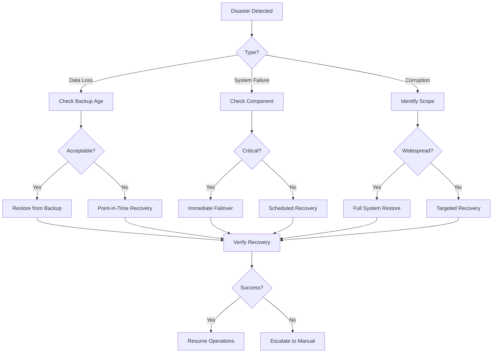

# YTEMPIRE DevOps Guide: Backup, Recovery & Disaster Response
**Version 1.0 | January 2025**  
**Owner: DevOps Engineering Team**  
**Approved By: Platform Operations Lead**

---

## Table of Contents
1. [Executive Summary](#executive-summary)
2. [Backup Strategy](#backup-strategy)
3. [Backup Implementation Scripts](#backup-implementation-scripts)
4. [Recovery Procedures](#recovery-procedures)
5. [Disaster Recovery Planning](#disaster-recovery-planning)
6. [Database Backup & Recovery](#database-backup-recovery)
7. [Application State Recovery](#application-state-recovery)
8. [Testing & Validation](#testing-validation)
9. [Monitoring & Alerting](#monitoring-alerting)

---

## Executive Summary

This document provides comprehensive backup and disaster recovery procedures for YTEMPIRE's infrastructure. As a DevOps Engineer, you'll implement and maintain these systems to ensure business continuity and data protection for our platform processing 100M+ daily operations.

### Key Recovery Objectives
- **RPO (Recovery Point Objective)**: Maximum 15 minutes data loss
- **RTO (Recovery Time Objective)**: Maximum 4 hours downtime
- **Backup Retention**: 30 days standard, 1 year for compliance
- **Geographic Redundancy**: Multi-region backup storage
- **Automation Level**: 95% automated recovery procedures

---

## Backup Strategy

### 1. Comprehensive Backup Architecture

```yaml
# backup-architecture.yaml
backup_strategy:
  tiers:
    tier_1_critical:
      description: "Mission-critical data requiring immediate recovery"
      components:
        - PostgreSQL databases
        - User authentication data
        - Financial transactions
        - YouTube channel configurations
      backup_frequency: Every 15 minutes
      retention: 30 days
      storage_locations:
        - Primary: GCS Regional
        - Secondary: GCS Multi-Regional
        - Tertiary: AWS S3 Cross-Region
      
    tier_2_important:
      description: "Important data with standard recovery requirements"
      components:
        - Video metadata
        - Analytics data
        - Application configurations
        - Container images
      backup_frequency: Every 4 hours
      retention: 14 days
      storage_locations:
        - Primary: GCS Regional
        - Secondary: GCS Nearline
    
    tier_3_standard:
      description: "Standard data with relaxed recovery requirements"
      components:
        - Logs
        - Temporary processing data
        - Development data
      backup_frequency: Daily
      retention: 7 days
      storage_locations:
        - Primary: GCS Standard
```

### 2. 3-2-1 Backup Rule Implementation

```hcl
# terraform/backup-storage.tf
# 3 copies of data, 2 different storage types, 1 offsite

# Primary backup bucket (Copy 1 - GCS)
resource "google_storage_bucket" "primary_backup" {
  name          = "ytempire-backup-primary"
  location      = "US-CENTRAL1"
  storage_class = "STANDARD"
  
  versioning {
    enabled = true
  }
  
  lifecycle_rule {
    condition {
      age = 30
    }
    action {
      type          = "SetStorageClass"
      storage_class = "NEARLINE"
    }
  }
  
  lifecycle_rule {
    condition {
      age = 90
    }
    action {
      type          = "SetStorageClass"
      storage_class = "COLDLINE"
    }
  }
  
  encryption {
    default_kms_key_name = google_kms_crypto_key.backup_key.id
  }
}

# Secondary backup bucket (Copy 2 - Different region)
resource "google_storage_bucket" "secondary_backup" {
  name          = "ytempire-backup-secondary"
  location      = "US-EAST1"
  storage_class = "STANDARD"
  
  versioning {
    enabled = true
  }
  
  uniform_bucket_level_access = true
}

# Tertiary backup (Copy 3 - AWS S3 for vendor diversity)
resource "aws_s3_bucket" "tertiary_backup" {
  bucket = "ytempire-backup-tertiary"
  region = "us-west-2"
  
  versioning {
    enabled = true
  }
  
  server_side_encryption_configuration {
    rule {
      apply_server_side_encryption_by_default {
        sse_algorithm = "AES256"
      }
    }
  }
  
  lifecycle_rule {
    enabled = true
    
    transition {
      days          = 30
      storage_class = "INTELLIGENT_TIERING"
    }
    
    transition {
      days          = 90
      storage_class = "GLACIER"
    }
  }
}
```

---

## Backup Implementation Scripts

### 1. Master Backup Orchestrator

```python
#!/usr/bin/env python3
# backup-orchestrator.py

import os
import sys
import json
import logging
import asyncio
import hashlib
from datetime import datetime, timedelta
from typing import List, Dict, Any
import boto3
from google.cloud import storage as gcs
from kubernetes import client, config
import psycopg2
from prometheus_client import Counter, Gauge, Histogram

# Metrics
backup_counter = Counter('backup_operations_total', 'Total backup operations', ['type', 'status'])
backup_duration = Histogram('backup_duration_seconds', 'Backup operation duration', ['type'])
backup_size = Gauge('backup_size_bytes', 'Size of backups', ['type'])

class BackupOrchestrator:
    """Master backup orchestration for all YTEMPIRE components"""
    
    def __init__(self):
        self.logger = self._setup_logging()
        self.config = self._load_config()
        self.gcs_client = gcs.Client()
        self.s3_client = boto3.client('s3')
        
        # Load Kubernetes config
        try:
            config.load_incluster_config()
        except:
            config.load_kube_config()
        self.k8s_client = client.ApiClient()
        
    def _setup_logging(self):
        """Configure logging"""
        logger = logging.getLogger('BackupOrchestrator')
        logger.setLevel(logging.INFO)
        
        # Console handler
        ch = logging.StreamHandler()
        ch.setLevel(logging.INFO)
        
        # File handler
        fh = logging.FileHandler('/var/log/backup-orchestrator.log')
        fh.setLevel(logging.DEBUG)
        
        # Formatter
        formatter = logging.Formatter(
            '%(asctime)s - %(name)s - %(levelname)s - %(message)s'
        )
        ch.setFormatter(formatter)
        fh.setFormatter(formatter)
        
        logger.addHandler(ch)
        logger.addHandler(fh)
        
        return logger
    
    def _load_config(self) -> Dict[str, Any]:
        """Load backup configuration"""
        with open('/etc/backup/config.json', 'r') as f:
            return json.load(f)
    
    async def run_backup(self, backup_type: str = 'scheduled'):
        """Run complete backup procedure"""
        start_time = datetime.now()
        backup_id = self._generate_backup_id()
        
        self.logger.info(f"Starting backup {backup_id} - Type: {backup_type}")
        
        try:
            # Create backup manifest
            manifest = {
                'backup_id': backup_id,
                'timestamp': start_time.isoformat(),
                'type': backup_type,
                'components': {},
                'status': 'in_progress'
            }
            
            # Run backups in parallel
            tasks = [
                self._backup_databases(backup_id),
                self._backup_persistent_volumes(backup_id),
                self._backup_configurations(backup_id),
                self._backup_secrets(backup_id),
                self._backup_container_images(backup_id)
            ]
            
            results = await asyncio.gather(*tasks, return_exceptions=True)
            
            # Process results
            for idx, result in enumerate(results):
                component = ['databases', 'volumes', 'configs', 'secrets', 'images'][idx]
                if isinstance(result, Exception):
                    self.logger.error(f"Backup failed for {component}: {result}")
                    manifest['components'][component] = {
                        'status': 'failed',
                        'error': str(result)
                    }
                    backup_counter.labels(type=component, status='failed').inc()
                else:
                    manifest['components'][component] = result
                    backup_counter.labels(type=component, status='success').inc()
            
            # Upload manifest
            manifest['status'] = 'completed'
            manifest['duration'] = (datetime.now() - start_time).total_seconds()
            self._upload_manifest(backup_id, manifest)
            
            # Cleanup old backups
            await self._cleanup_old_backups()
            
            self.logger.info(f"Backup {backup_id} completed in {manifest['duration']} seconds")
            backup_duration.labels(type=backup_type).observe(manifest['duration'])
            
            return manifest
            
        except Exception as e:
            self.logger.error(f"Backup {backup_id} failed: {e}")
            backup_counter.labels(type='total', status='failed').inc()
            raise
    
    async def _backup_databases(self, backup_id: str) -> Dict[str, Any]:
        """Backup all PostgreSQL databases"""
        self.logger.info("Starting database backup")
        
        databases = self.config['databases']
        results = {}
        
        for db_name, db_config in databases.items():
            try:
                # Create backup filename
                timestamp = datetime.now().strftime('%Y%m%d-%H%M%S')
                filename = f"db-{db_name}-{timestamp}.sql.gz"
                local_path = f"/tmp/{filename}"
                
                # Run pg_dump
                dump_cmd = f"""
                PGPASSWORD={db_config['password']} pg_dump \
                    -h {db_config['host']} \
                    -p {db_config['port']} \
                    -U {db_config['user']} \
                    -d {db_config['database']} \
                    --no-owner \
                    --clean \
                    --if-exists \
                    | gzip > {local_path}
                """
                
                process = await asyncio.create_subprocess_shell(
                    dump_cmd,
                    stdout=asyncio.subprocess.PIPE,
                    stderr=asyncio.subprocess.PIPE
                )
                
                stdout, stderr = await process.communicate()
                
                if process.returncode != 0:
                    raise Exception(f"pg_dump failed: {stderr.decode()}")
                
                # Calculate checksum
                checksum = self._calculate_checksum(local_path)
                
                # Upload to all storage locations
                upload_locations = await self._upload_to_all_storage(
                    local_path,
                    f"databases/{backup_id}/{filename}"
                )
                
                # Record metadata
                results[db_name] = {
                    'filename': filename,
                    'size': os.path.getsize(local_path),
                    'checksum': checksum,
                    'locations': upload_locations,
                    'timestamp': timestamp
                }
                
                # Cleanup local file
                os.remove(local_path)
                
                self.logger.info(f"Database {db_name} backed up successfully")
                
            except Exception as e:
                self.logger.error(f"Failed to backup database {db_name}: {e}")
                results[db_name] = {'error': str(e)}
        
        return results
    
    async def _backup_persistent_volumes(self, backup_id: str) -> Dict[str, Any]:
        """Backup Kubernetes persistent volumes"""
        self.logger.info("Starting persistent volume backup")
        
        v1 = client.CoreV1Api()
        results = {}
        
        # Get all PVCs
        pvcs = v1.list_persistent_volume_claim_for_all_namespaces()
        
        for pvc in pvcs.items:
            pvc_name = f"{pvc.metadata.namespace}/{pvc.metadata.name}"
            
            try:
                # Create volume snapshot
                snapshot_name = f"backup-{backup_id}-{pvc.metadata.name}"
                
                snapshot_manifest = {
                    "apiVersion": "snapshot.storage.k8s.io/v1",
                    "kind": "VolumeSnapshot",
                    "metadata": {
                        "name": snapshot_name,
                        "namespace": pvc.metadata.namespace
                    },
                    "spec": {
                        "volumeSnapshotClassName": "csi-gce-pd-snapshot-class",
                        "source": {
                            "persistentVolumeClaimName": pvc.metadata.name
                        }
                    }
                }
                
                # Create snapshot
                custom_api = client.CustomObjectsApi()
                custom_api.create_namespaced_custom_object(
                    group="snapshot.storage.k8s.io",
                    version="v1",
                    namespace=pvc.metadata.namespace,
                    plural="volumesnapshots",
                    body=snapshot_manifest
                )
                
                # Wait for snapshot to be ready
                await self._wait_for_snapshot(
                    pvc.metadata.namespace,
                    snapshot_name
                )
                
                results[pvc_name] = {
                    'snapshot_name': snapshot_name,
                    'status': 'completed',
                    'timestamp': datetime.now().isoformat()
                }
                
            except Exception as e:
                self.logger.error(f"Failed to backup PVC {pvc_name}: {e}")
                results[pvc_name] = {'error': str(e)}
        
        return results
    
    async def _backup_configurations(self, backup_id: str) -> Dict[str, Any]:
        """Backup Kubernetes configurations"""
        self.logger.info("Starting configuration backup")
        
        timestamp = datetime.now().strftime('%Y%m%d-%H%M%S')
        backup_file = f"/tmp/k8s-config-{timestamp}.tar.gz"
        
        # Resources to backup
        resources = [
            "configmaps",
            "secrets",
            "deployments",
            "statefulsets",
            "services",
            "ingresses",
            "networkpolicies",
            "horizontalpodautoscalers",
            "poddisruptionbudgets"
        ]
        
        # Export all resources
        export_cmd = f"""
        mkdir -p /tmp/k8s-backup
        for resource in {' '.join(resources)}; do
            echo "Backing up $resource"
            kubectl get $resource --all-namespaces -o yaml > /tmp/k8s-backup/$resource.yaml
        done
        tar czf {backup_file} -C /tmp/k8s-backup .
        rm -rf /tmp/k8s-backup
        """
        
        process = await asyncio.create_subprocess_shell(
            export_cmd,
            stdout=asyncio.subprocess.PIPE,
            stderr=asyncio.subprocess.PIPE
        )
        
        await process.communicate()
        
        # Upload backup
        upload_locations = await self._upload_to_all_storage(
            backup_file,
            f"configurations/{backup_id}/k8s-config-{timestamp}.tar.gz"
        )
        
        # Cleanup
        os.remove(backup_file)
        
        return {
            'filename': os.path.basename(backup_file),
            'size': os.path.getsize(backup_file),
            'locations': upload_locations,
            'timestamp': timestamp
        }
    
    async def _upload_to_all_storage(self, local_path: str, remote_path: str) -> List[str]:
        """Upload file to all configured storage locations"""
        locations = []
        
        # Upload to GCS primary
        try:
            bucket = self.gcs_client.bucket(self.config['storage']['gcs_primary'])
            blob = bucket.blob(remote_path)
            blob.upload_from_filename(local_path)
            locations.append(f"gs://{self.config['storage']['gcs_primary']}/{remote_path}")
        except Exception as e:
            self.logger.error(f"Failed to upload to GCS primary: {e}")
        
        # Upload to GCS secondary
        try:
            bucket = self.gcs_client.bucket(self.config['storage']['gcs_secondary'])
            blob = bucket.blob(remote_path)
            blob.upload_from_filename(local_path)
            locations.append(f"gs://{self.config['storage']['gcs_secondary']}/{remote_path}")
        except Exception as e:
            self.logger.error(f"Failed to upload to GCS secondary: {e}")
        
        # Upload to S3
        try:
            self.s3_client.upload_file(
                local_path,
                self.config['storage']['s3_bucket'],
                remote_path
            )
            locations.append(f"s3://{self.config['storage']['s3_bucket']}/{remote_path}")
        except Exception as e:
            self.logger.error(f"Failed to upload to S3: {e}")
        
        if not locations:
            raise Exception("Failed to upload to any storage location")
        
        return locations
    
    def _calculate_checksum(self, filepath: str) -> str:
        """Calculate SHA256 checksum of file"""
        sha256_hash = hashlib.sha256()
        with open(filepath, "rb") as f:
            for byte_block in iter(lambda: f.read(4096), b""):
                sha256_hash.update(byte_block)
        return sha256_hash.hexdigest()
    
    def _generate_backup_id(self) -> str:
        """Generate unique backup ID"""
        timestamp = datetime.now().strftime('%Y%m%d-%H%M%S')
        random_suffix = os.urandom(4).hex()
        return f"backup-{timestamp}-{random_suffix}"
    
    async def _cleanup_old_backups(self):
        """Remove backups older than retention period"""
        self.logger.info("Starting backup cleanup")
        
        retention_days = self.config['retention']['standard_days']
        cutoff_date = datetime.now() - timedelta(days=retention_days)
        
        # Cleanup GCS
        for bucket_name in [self.config['storage']['gcs_primary'], 
                           self.config['storage']['gcs_secondary']]:
            bucket = self.gcs_client.bucket(bucket_name)
            blobs = bucket.list_blobs()
            
            for blob in blobs:
                if blob.time_created < cutoff_date:
                    self.logger.info(f"Deleting old backup: {blob.name}")
                    blob.delete()

if __name__ == "__main__":
    orchestrator = BackupOrchestrator()
    asyncio.run(orchestrator.run_backup(sys.argv[1] if len(sys.argv) > 1 else 'scheduled'))
```

### 2. Database-Specific Backup Script

```bash
#!/bin/bash
# backup-postgres.sh - PostgreSQL backup with point-in-time recovery

set -euo pipefail

# Configuration
BACKUP_DIR="/backup/postgres"
BACKUP_BUCKET="gs://ytempire-backup-primary/databases"
DB_HOST="${DB_HOST:-ytempire-postgres}"
DB_PORT="${DB_PORT:-5432}"
DB_NAME="${DB_NAME:-ytempire}"
DB_USER="${DB_USER:-postgres}"
RETENTION_DAYS="${RETENTION_DAYS:-30}"

# Logging
log() {
    echo "[$(date +'%Y-%m-%d %H:%M:%S')] $1" | tee -a /var/log/backup-postgres.log
}

# Create backup directory
mkdir -p ${BACKUP_DIR}/{base,wal}

# Function to perform base backup
perform_base_backup() {
    local backup_label="base-$(date +%Y%m%d-%H%M%S)"
    local backup_path="${BACKUP_DIR}/base/${backup_label}"
    
    log "Starting base backup: ${backup_label}"
    
    # Use pg_basebackup for consistent backup
    PGPASSWORD="${DB_PASSWORD}" pg_basebackup \
        -h ${DB_HOST} \
        -p ${DB_PORT} \
        -U ${DB_USER} \
        -D ${backup_path} \
        -Ft \
        -z \
        -Xs \
        -P \
        -v \
        -c fast
    
    # Calculate checksum
    local checksum=$(sha256sum ${backup_path}/base.tar.gz | awk '{print $1}')
    
    # Create metadata
    cat > ${backup_path}/metadata.json <<EOF
{
    "backup_label": "${backup_label}",
    "timestamp": "$(date -u +%Y-%m-%dT%H:%M:%SZ)",
    "db_host": "${DB_HOST}",
    "db_name": "${DB_NAME}",
    "checksum": "${checksum}",
    "size": $(stat -c%s ${backup_path}/base.tar.gz),
    "wal_start": "$(psql -h ${DB_HOST} -U ${DB_USER} -d ${DB_NAME} -tAc "SELECT pg_current_wal_lsn();")"
}
EOF
    
    # Upload to GCS
    log "Uploading base backup to GCS"
    gsutil -m cp -r ${backup_path} ${BACKUP_BUCKET}/base/
    
    # Verify upload
    gsutil hash ${backup_path}/base.tar.gz | grep -q ${checksum}
    
    log "Base backup completed: ${backup_label}"
}

# Function to archive WAL files
archive_wal() {
    local wal_file=$1
    local wal_path=$2
    
    log "Archiving WAL file: ${wal_file}"
    
    # Compress WAL file
    gzip -c ${wal_path} > ${BACKUP_DIR}/wal/${wal_file}.gz
    
    # Upload to GCS
    gsutil cp ${BACKUP_DIR}/wal/${wal_file}.gz ${BACKUP_BUCKET}/wal/
    
    # Cleanup local copy
    rm -f ${BACKUP_DIR}/wal/${wal_file}.gz
}

# Function to cleanup old backups
cleanup_old_backups() {
    log "Cleaning up backups older than ${RETENTION_DAYS} days"
    
    # List and delete old base backups
    gsutil ls -l ${BACKUP_BUCKET}/base/ | \
        awk -v cutoff="$(date -d "${RETENTION_DAYS} days ago" +%s)" \
        '$1 < cutoff {print $3}' | \
        xargs -r gsutil -m rm -r
    
    # List and delete old WAL files
    gsutil ls -l ${BACKUP_BUCKET}/wal/ | \
        awk -v cutoff="$(date -d "${RETENTION_DAYS} days ago" +%s)" \
        '$1 < cutoff {print $3}' | \
        xargs -r gsutil -m rm
}

# Main execution
main() {
    case "${1:-base}" in
        "base")
            perform_base_backup
            cleanup_old_backups
            ;;
        "wal")
            archive_wal "$2" "$3"
            ;;
        *)
            echo "Usage: $0 {base|wal <filename> <path>}"
            exit 1
            ;;
    esac
}

main "$@"
```

### 3. Application State Backup

```python
#!/usr/bin/env python3
# backup-application-state.py

import os
import json
import redis
import pymongo
from datetime import datetime
from typing import Dict, Any
import asyncio
import aiofiles
from minio import Minio
from kubernetes import client, config

class ApplicationStateBackup:
    """Backup application state including cache, sessions, and queues"""
    
    def __init__(self):
        self.redis_client = redis.Redis(
            host=os.getenv('REDIS_HOST', 'localhost'),
            port=int(os.getenv('REDIS_PORT', 6379)),
            decode_responses=True
        )
        
        self.mongo_client = pymongo.MongoClient(
            os.getenv('MONGO_URI', 'mongodb://localhost:27017/')
        )
        
        self.minio_client = Minio(
            os.getenv('MINIO_ENDPOINT', 'localhost:9000'),
            access_key=os.getenv('MINIO_ACCESS_KEY'),
            secret_key=os.getenv('MINIO_SECRET_KEY'),
            secure=False
        )
    
    async def backup_redis_state(self, backup_id: str) -> Dict[str, Any]:
        """Backup Redis state including cache and queues"""
        print("Backing up Redis state...")
        
        timestamp = datetime.now().strftime('%Y%m%d-%H%M%S')
        backup_file = f"/tmp/redis-backup-{timestamp}.rdb"
        
        # Trigger Redis BGSAVE
        self.redis_client.bgsave()
        
        # Wait for backup to complete
        while self.redis_client.info()['rdb_bgsave_in_progress']:
            await asyncio.sleep(1)
        
        # Get Redis data directory
        redis_dir = self.redis_client.config_get('dir')['dir']
        redis_dbfilename = self.redis_client.config_get('dbfilename')['dbfilename']
        source_file = os.path.join(redis_dir, redis_dbfilename)
        
        # Copy RDB file
        os.system(f"cp {source_file} {backup_file}")
        
        # Also export important keys as JSON for partial restore
        important_keys = {
            'sessions': self.redis_client.keys('session:*'),
            'cache': self.redis_client.keys('cache:*'),
            'queues': self.redis_client.keys('queue:*'),
            'rate_limits': self.redis_client.keys('rate_limit:*')
        }
        
        key_backup = {}
        for category, keys in important_keys.items():
            key_backup[category] = {}
            for key in keys:
                key_type = self.redis_client.type(key)
                
                if key_type == 'string':
                    key_backup[category][key] = self.redis_client.get(key)
                elif key_type == 'hash':
                    key_backup[category][key] = self.redis_client.hgetall(key)
                elif key_type == 'list':
                    key_backup[category][key] = self.redis_client.lrange(key, 0, -1)
                elif key_type == 'set':
                    key_backup[category][key] = list(self.redis_client.smembers(key))
                elif key_type == 'zset':
                    key_backup[category][key] = self.redis_client.zrange(
                        key, 0, -1, withscores=True
                    )
        
        # Save key backup
        key_backup_file = f"/tmp/redis-keys-{timestamp}.json"
        async with aiofiles.open(key_backup_file, 'w') as f:
            await f.write(json.dumps(key_backup, indent=2))
        
        # Upload both files
        self.minio_client.fput_object(
            'backups',
            f'redis/{backup_id}/redis-backup-{timestamp}.rdb',
            backup_file
        )
        
        self.minio_client.fput_object(
            'backups',
            f'redis/{backup_id}/redis-keys-{timestamp}.json',
            key_backup_file
        )
        
        # Cleanup
        os.remove(backup_file)
        os.remove(key_backup_file)
        
        return {
            'rdb_file': f'redis-backup-{timestamp}.rdb',
            'keys_file': f'redis-keys-{timestamp}.json',
            'key_count': sum(len(keys) for keys in important_keys.values()),
            'timestamp': timestamp
        }
    
    async def backup_mongodb_state(self, backup_id: str) -> Dict[str, Any]:
        """Backup MongoDB collections"""
        print("Backing up MongoDB state...")
        
        timestamp = datetime.now().strftime('%Y%m%d-%H%M%S')
        backup_dir = f"/tmp/mongo-backup-{timestamp}"
        
        # Create backup using mongodump
        dump_cmd = f"""
        mongodump \
            --uri="{os.getenv('MONGO_URI')}" \
            --out={backup_dir} \
            --gzip
        """
        
        process = await asyncio.create_subprocess_shell(
            dump_cmd,
            stdout=asyncio.subprocess.PIPE,
            stderr=asyncio.subprocess.PIPE
        )
        
        await process.communicate()
        
        # Create tar archive
        archive_file = f"/tmp/mongo-backup-{timestamp}.tar.gz"
        os.system(f"tar czf {archive_file} -C /tmp mongo-backup-{timestamp}")
        
        # Upload to storage
        self.minio_client.fput_object(
            'backups',
            f'mongodb/{backup_id}/mongo-backup-{timestamp}.tar.gz',
            archive_file
        )
        
        # Cleanup
        os.system(f"rm -rf {backup_dir} {archive_file}")
        
        return {
            'backup_file': f'mongo-backup-{timestamp}.tar.gz',
            'databases': list(self.mongo_client.list_database_names()),
            'timestamp': timestamp
        }
    
    async def backup_application_files(self, backup_id: str) -> Dict[str, Any]:
        """Backup application files and uploads"""
        print("Backing up application files...")
        
        timestamp = datetime.now().strftime('%Y%m%d-%H%M%S')
        
        # Directories to backup
        backup_dirs = {
            'uploads': '/app/uploads',
            'generated': '/app/generated',
            'temp': '/app/temp'
        }
        
        results = {}
        
        for name, path in backup_dirs.items():
            if os.path.exists(path):
                archive_file = f"/tmp/{name}-backup-{timestamp}.tar.gz"
                
                # Create archive
                os.system(f"tar czf {archive_file} -C {os.path.dirname(path)} {os.path.basename(path)}")
                
                # Upload
                self.minio_client.fput_object(
                    'backups',
                    f'files/{backup_id}/{name}-backup-{timestamp}.tar.gz',
                    archive_file
                )
                
                # Get size
                size = os.path.getsize(archive_file)
                
                # Cleanup
                os.remove(archive_file)
                
                results[name] = {
                    'file': f'{name}-backup-{timestamp}.tar.gz',
                    'size': size,
                    'path': path
                }
        
        return results

async def main():
    backup_id = f"app-state-{datetime.now().strftime('%Y%m%d-%H%M%S')}"
    backup = ApplicationStateBackup()
    
    results = await asyncio.gather(
        backup.backup_redis_state(backup_id),
        backup.backup_mongodb_state(backup_id),
        backup.backup_application_files(backup_id)
    )
    
    # Save manifest
    manifest = {
        'backup_id': backup_id,
        'timestamp': datetime.now().isoformat(),
        'redis': results[0],
        'mongodb': results[1],
        'files': results[2]
    }
    
    print(json.dumps(manifest, indent=2))

if __name__ == "__main__":
    asyncio.run(main())
```

---

## Recovery Procedures

### 1. Database Recovery Script

```bash
#!/bin/bash
# restore-postgres.sh - PostgreSQL point-in-time recovery

set -euo pipefail

# Configuration
RESTORE_DIR="/restore/postgres"
BACKUP_BUCKET="gs://ytempire-backup-primary/databases"
TARGET_TIME="${TARGET_TIME:-latest}"
DB_HOST="${DB_HOST:-ytempire-postgres}"
DB_PORT="${DB_PORT:-5432}"
DB_NAME="${DB_NAME:-ytempire}"

# Logging
log() {
    echo "[$(date +'%Y-%m-%d %H:%M:%S')] RESTORE: $1" | tee -a /var/log/restore-postgres.log
}

# Function to find appropriate base backup
find_base_backup() {
    local target_time=$1
    
    if [ "$target_time" == "latest" ]; then
        # Get latest backup
        gsutil ls -l ${BACKUP_BUCKET}/base/ | \
            grep -E "base-[0-9]{8}-[0-9]{6}/$" | \
            sort -k1 -r | \
            head -1 | \
            awk '{print $3}'
    else
        # Find backup before target time
        gsutil ls -l ${BACKUP_BUCKET}/base/ | \
            grep -E "base-[0-9]{8}-[0-9]{6}/$" | \
            awk -v target="$(date -d "$target_time" +%s)" '$1 <= target {print $3}' | \
            sort -k1 -r | \
            head -1
    fi
}

# Function to restore base backup
restore_base_backup() {
    local backup_path=$1
    local restore_path="${RESTORE_DIR}/data"
    
    log "Restoring base backup: ${backup_path}"
    
    # Create restore directory
    rm -rf ${restore_path}
    mkdir -p ${restore_path}
    
    # Download backup
    gsutil -m cp -r ${backup_path} ${RESTORE_DIR}/base/
    
    # Extract backup
    local backup_name=$(basename ${backup_path})
    tar -xzf ${RESTORE_DIR}/base/${backup_name}/base.tar.gz -C ${restore_path}
    
    # Verify checksum
    local metadata=$(cat ${RESTORE_DIR}/base/${backup_name}/metadata.json)
    local expected_checksum=$(echo $metadata | jq -r '.checksum')
    local actual_checksum=$(sha256sum ${RESTORE_DIR}/base/${backup_name}/base.tar.gz | awk '{print $1}')
    
    if [ "$expected_checksum" != "$actual_checksum" ]; then
        log "ERROR: Checksum mismatch!"
        exit 1
    fi
    
    log "Base backup restored successfully"
}

# Function to restore WAL files for PITR
restore_wal_files() {
    local wal_start=$1
    local target_time=$2
    local wal_dir="${RESTORE_DIR}/data/pg_wal"
    
    log "Restoring WAL files from ${wal_start} to ${target_time}"
    
    # Create WAL directory
    mkdir -p ${wal_dir}
    
    # Download relevant WAL files
    if [ "$target_time" == "latest" ]; then
        gsutil -m cp ${BACKUP_BUCKET}/wal/*.gz ${RESTORE_DIR}/wal/
    else
        # Download WAL files up to target time
        gsutil ls -l ${BACKUP_BUCKET}/wal/ | \
            awk -v target="$(date -d "$target_time" +%s)" '$1 <= target {print $3}' | \
            xargs -r gsutil -m cp ${RESTORE_DIR}/wal/
    fi
    
    # Extract WAL files
    for wal_file in ${RESTORE_DIR}/wal/*.gz; do
        gunzip -c $wal_file > ${wal_dir}/$(basename $wal_file .gz)
    done
    
    log "WAL files restored"
}

# Function to create recovery configuration
create_recovery_conf() {
    local target_time=$1
    local recovery_conf="${RESTORE_DIR}/data/recovery.conf"
    
    log "Creating recovery configuration"
    
    cat > ${recovery_conf} <<EOF
# PostgreSQL Point-in-Time Recovery Configuration
restore_command = 'gunzip < ${RESTORE_DIR}/wal/%f.gz > %p'
recovery_target_time = '${target_time}'
recovery_target_action = 'promote'
recovery_target_timeline = 'latest'
EOF
    
    # For PostgreSQL 12+, also create standby.signal
    touch ${RESTORE_DIR}/data/standby.signal
}

# Function to perform the restore
perform_restore() {
    local target_time=$1
    
    log "Starting PostgreSQL restore to time: ${target_time}"
    
    # Find appropriate base backup
    local base_backup=$(find_base_backup "$target_time")
    if [ -z "$base_backup" ]; then
        log "ERROR: No suitable base backup found"
        exit 1
    fi
    
    # Stop PostgreSQL if running
    log "Stopping PostgreSQL service"
    systemctl stop postgresql || true
    
    # Backup current data directory
    if [ -d "/var/lib/postgresql/data" ]; then
        log "Backing up current data directory"
        mv /var/lib/postgresql/data /var/lib/postgresql/data.backup.$(date +%Y%m%d-%H%M%S)
    fi
    
    # Restore base backup
    restore_base_backup "$base_backup"
    
    # Get WAL start position from metadata
    local metadata_file="${RESTORE_DIR}/base/$(basename $base_backup)/metadata.json"
    local wal_start=$(jq -r '.wal_start' $metadata_file)
    
    # Restore WAL files
    restore_wal_files "$wal_start" "$target_time"
    
    # Create recovery configuration
    if [ "$target_time" != "latest" ]; then
        create_recovery_conf "$target_time"
    fi
    
    # Copy restored data to PostgreSQL directory
    log "Copying restored data to PostgreSQL directory"
    cp -r ${RESTORE_DIR}/data /var/lib/postgresql/
    chown -R postgres:postgres /var/lib/postgresql/data
    
    # Start PostgreSQL
    log "Starting PostgreSQL service"
    systemctl start postgresql
    
    # Wait for recovery to complete
    log "Waiting for recovery to complete..."
    while systemctl is-active postgresql && [ -f "/var/lib/postgresql/data/recovery.conf" ]; do
        sleep 5
    done
    
    log "PostgreSQL restore completed successfully"
}

# Main execution
main() {
    # Create restore directories
    mkdir -p ${RESTORE_DIR}/{base,wal,data}
    
    # Parse arguments
    case "${1:-restore}" in
        "restore")
            perform_restore "${TARGET_TIME}"
            ;;
        "verify")
            # Verify backup integrity
            verify_backups
            ;;
        "list")
            # List available backups
            list_backups
            ;;
        *)
            echo "Usage: $0 {restore|verify|list}"
            exit 1
            ;;
    esac
}

main "$@"
```

### 2. Kubernetes Cluster Recovery

```yaml
# k8s-recovery-job.yaml
apiVersion: batch/v1
kind: Job
metadata:
  name: cluster-recovery
  namespace: kube-system
spec:
  template:
    spec:
      serviceAccountName: cluster-recovery
      containers:
      - name: recovery
        image: gcr.io/ytempire-production/k8s-recovery:latest
        env:
        - name: BACKUP_BUCKET
          value: "gs://ytempire-backup-primary"
        - name: RECOVERY_MODE
          value: "full"  # full, partial, or config-only
        - name: TARGET_TIME
          value: "latest"
        command: ["/scripts/recover-cluster.sh"]
        volumeMounts:
        - name: recovery-scripts
          mountPath: /scripts
        - name: kubeconfig
          mountPath: /root/.kube
      volumes:
      - name: recovery-scripts
        configMap:
          name: recovery-scripts
          defaultMode: 0755
      - name: kubeconfig
        secret:
          secretName: recovery-kubeconfig
      restartPolicy: OnFailure
---
apiVersion: v1
kind: ConfigMap
metadata:
  name: recovery-scripts
  namespace: kube-system
data:
  recover-cluster.sh: |
    #!/bin/bash
    set -euo pipefail
    
    log() {
        echo "[$(date +'%Y-%m-%d %H:%M:%S')] $1"
    }
    
    # Find latest configuration backup
    find_latest_backup() {
        gsutil ls -l ${BACKUP_BUCKET}/configurations/ | \
            grep -E "k8s-config-[0-9]{8}-[0-9]{6}.tar.gz" | \
            sort -k1 -r | \
            head -1 | \
            awk '{print $3}'
    }
    
    # Restore Kubernetes resources
    restore_resources() {
        local backup_file=$1
        local temp_dir="/tmp/k8s-restore"
        
        log "Restoring from backup: ${backup_file}"
        
        # Download and extract backup
        mkdir -p ${temp_dir}
        gsutil cp ${backup_file} ${temp_dir}/
        tar xzf ${temp_dir}/$(basename ${backup_file}) -C ${temp_dir}
        
        # Restore in order
        local resources=(
            "namespaces"
            "configmaps"
            "secrets"
            "persistentvolumes"
            "persistentvolumeclaims"
            "services"
            "deployments"
            "statefulsets"
            "horizontalpodautoscalers"
            "networkpolicies"
            "ingresses"
        )
        
        for resource in "${resources[@]}"; do
            if [ -f "${temp_dir}/${resource}.yaml" ]; then
                log "Restoring ${resource}..."
                kubectl apply -f ${temp_dir}/${resource}.yaml || true
            fi
        done
        
        # Cleanup
        rm -rf ${temp_dir}
    }
    
    # Main recovery process
    main() {
        log "Starting Kubernetes cluster recovery"
        
        # Find backup to restore
        local backup_file
        if [ "${TARGET_TIME}" == "latest" ]; then
            backup_file=$(find_latest_backup)
        else
            # Find backup closest to target time
            backup_file=$(gsutil ls -l ${BACKUP_BUCKET}/configurations/ | \
                grep -E "k8s-config-[0-9]{8}-[0-9]{6}.tar.gz" | \
                awk -v target="$(date -d "${TARGET_TIME}" +%s)" '$1 <= target {print $3}' | \
                sort -k1 -r | \
                head -1)
        fi
        
        if [ -z "${backup_file}" ]; then
            log "ERROR: No suitable backup found"
            exit 1
        fi
        
        # Perform recovery based on mode
        case "${RECOVERY_MODE}" in
            "full")
                log "Performing full cluster recovery"
                restore_resources "${backup_file}"
                ;;
            "partial")
                log "Performing partial recovery"
                # Implement selective restore logic
                ;;
            "config-only")
                log "Restoring configurations only"
                # Restore only ConfigMaps and Secrets
                ;;
        esac
        
        log "Cluster recovery completed"
    }
    
    main
```

---

## Disaster Recovery Planning

### 1. Disaster Recovery Runbook

```markdown
# YTEMPIRE Disaster Recovery Runbook

## Scenario 1: Complete Database Failure

### Detection
- PostgreSQL primary and all replicas are down
- Application cannot connect to database
- Monitoring alerts triggered

### Response Steps

1. **Immediate Actions (0-5 minutes)**
   ```bash
   # Verify database status
   kubectl get pods -n database -l app=postgresql
   kubectl describe pod <postgres-pod> -n database
   
   # Check for data corruption
   kubectl exec -it <postgres-pod> -n database -- pg_controldata /var/lib/postgresql/data
   ```

2. **Assess Damage (5-15 minutes)**
   ```bash
   # Check last successful backup
   gsutil ls -l gs://ytempire-backup-primary/databases/base/ | tail -5
   
   # Verify backup integrity
   ./scripts/verify-backup.sh --type=database --latest
   ```

3. **Initiate Recovery (15-30 minutes)**
   ```bash
   # Stop all application pods to prevent writes
   kubectl scale deployment ytempire-api --replicas=0 -n ytempire-core
   
   # Start database recovery
   kubectl apply -f disaster-recovery/database-recovery-job.yaml
   ```

4. **Monitor Recovery (30-120 minutes)**
   ```bash
   # Watch recovery progress
   kubectl logs -f job/database-recovery -n database
   
   # Verify database is accessible
   kubectl exec -it <new-postgres-pod> -n database -- psql -U postgres -c "SELECT version();"
   ```

5. **Resume Operations (120-240 minutes)**
   ```bash
   # Scale applications back up
   kubectl scale deployment ytempire-api --replicas=5 -n ytempire-core
   
   # Verify application connectivity
   curl https://api.ytempire.com/health
   ```

## Scenario 2: Kubernetes Cluster Failure

### Detection
- Control plane unresponsive
- Nodes NotReady
- API server timeout

### Response Steps

1. **Immediate Actions (0-5 minutes)**
   ```bash
   # Try alternative kubeconfig
   export KUBECONFIG=/backup/kubeconfig
   kubectl get nodes
   
   # Check GCP console for cluster status
   gcloud container clusters describe ytempire-prod-cluster
   ```

2. **Failover to Backup Cluster (5-30 minutes)**
   ```bash
   # Switch to DR cluster
   gcloud container clusters get-credentials ytempire-dr-cluster --region=us-east1
   
   # Deploy applications to DR cluster
   kubectl apply -f dr-manifests/
   ```

3. **Data Recovery (30-60 minutes)**
   ```bash
   # Restore latest database backup to DR region
   ./scripts/restore-to-dr.sh --component=database
   
   # Sync storage buckets
   gsutil -m rsync -r gs://ytempire-prod-videos gs://ytempire-dr-videos
   ```

4. **DNS Failover (60-90 minutes)**
   ```bash
   # Update DNS to point to DR cluster
   gcloud dns record-sets transaction start --zone=ytempire-com
   gcloud dns record-sets transaction add --name=api.ytempire.com. \
     --ttl=60 --type=A --zone=ytempire-com 35.186.0.0
   gcloud dns record-sets transaction execute --zone=ytempire-com
   ```

## Scenario 3: Data Corruption

### Detection
- Application errors indicating invalid data
- Database constraint violations
- Checksum mismatches in backups

### Response Steps

1. **Isolate Corruption (0-15 minutes)**
   ```sql
   -- Identify corrupted tables
   SELECT schemaname, tablename 
   FROM pg_tables 
   WHERE schemaname NOT IN ('pg_catalog', 'information_schema')
   ORDER BY schemaname, tablename;
   
   -- Check for corruption
   SELECT pg_relation_filepath('table_name');
   ```

2. **Point-in-Time Recovery (15-60 minutes)**
   ```bash
   # Determine corruption time
   grep -i error /var/log/postgresql/*.log | grep -i corrupt
   
   # Restore to point before corruption
   TARGET_TIME="2025-01-20 14:30:00" ./scripts/restore-postgres.sh restore
   ```
```

### 2. Automated Disaster Recovery

```python
#!/usr/bin/env python3
# disaster-recovery-automation.py

import os
import sys
import json
import time
import logging
from datetime import datetime
from typing import Dict, List, Any
import asyncio
from enum import Enum
from kubernetes import client, config
import google.cloud.monitoring_v3 as monitoring
from slack_sdk.webhook.async_client import AsyncWebhookClient

class DisasterType(Enum):
    DATABASE_FAILURE = "database_failure"
    CLUSTER_FAILURE = "cluster_failure"
    REGION_FAILURE = "region_failure"
    DATA_CORRUPTION = "data_corruption"
    SECURITY_BREACH = "security_breach"

class DisasterRecoveryOrchestrator:
    """Automated disaster recovery orchestration"""
    
    def __init__(self):
        self.logger = self._setup_logging()
        self.config = self._load_config()
        self.monitoring_client = monitoring.MetricServiceClient()
        self.slack_client = AsyncWebhookClient(url=os.getenv('SLACK_WEBHOOK_URL'))
        
        # Load Kubernetes config
        try:
            config.load_incluster_config()
        except:
            config.load_kube_config()
        
        self.k8s_apps = client.AppsV1Api()
        self.k8s_core = client.CoreV1Api()
        
        # Recovery state
        self.recovery_state = {
            'active': False,
            'type': None,
            'start_time': None,
            'steps_completed': [],
            'steps_remaining': []
        }
    
    def _setup_logging(self):
        """Configure logging for DR operations"""
        logger = logging.getLogger('DisasterRecovery')
        logger.setLevel(logging.INFO)
        
        # File handler with rotation
        from logging.handlers import RotatingFileHandler
        fh = RotatingFileHandler(
            '/var/log/disaster-recovery.log',
            maxBytes=100*1024*1024,  # 100MB
            backupCount=10
        )
        fh.setLevel(logging.DEBUG)
        
        # Console handler
        ch = logging.StreamHandler()
        ch.setLevel(logging.INFO)
        
        # Formatter
        formatter = logging.Formatter(
            '%(asctime)s - %(name)s - %(levelname)s - %(message)s'
        )
        fh.setFormatter(formatter)
        ch.setFormatter(formatter)
        
        logger.addHandler(fh)
        logger.addHandler(ch)
        
        return logger
    
    async def detect_disaster(self) -> DisasterType:
        """Detect type of disaster based on monitoring metrics"""
        
        # Check database health
        db_health = await self._check_database_health()
        if not db_health['healthy']:
            return DisasterType.DATABASE_FAILURE
        
        # Check cluster health
        cluster_health = await self._check_cluster_health()
        if not cluster_health['healthy']:
            return DisasterType.CLUSTER_FAILURE
        
        # Check for data corruption
        if await self._detect_data_corruption():
            return DisasterType.DATA_CORRUPTION
        
        # Check region availability
        if not await self._check_region_health():
            return DisasterType.REGION_FAILURE
        
        return None
    
    async def _check_database_health(self) -> Dict[str, Any]:
        """Check PostgreSQL database health"""
        try:
            # Check database pods
            db_pods = self.k8s_core.list_namespaced_pod(
                namespace='database',
                label_selector='app=postgresql'
            )
            
            ready_pods = sum(1 for pod in db_pods.items 
                           if pod.status.phase == 'Running')
            
            # Check database connectivity
            test_query = """
            kubectl exec -n database postgresql-0 -- \
                psql -U postgres -c "SELECT 1" 2>/dev/null
            """
            
            process = await asyncio.create_subprocess_shell(
                test_query,
                stdout=asyncio.subprocess.PIPE,
                stderr=asyncio.subprocess.PIPE
            )
            
            stdout, stderr = await process.communicate()
            
            return {
                'healthy': ready_pods > 0 and process.returncode == 0,
                'ready_pods': ready_pods,
                'total_pods': len(db_pods.items),
                'connectivity': process.returncode == 0
            }
        except Exception as e:
            self.logger.error(f"Database health check failed: {e}")
            return {'healthy': False, 'error': str(e)}
    
    async def _check_cluster_health(self) -> Dict[str, Any]:
        """Check Kubernetes cluster health"""
        try:
            # Check nodes
            nodes = self.k8s_core.list_node()
            ready_nodes = sum(1 for node in nodes.items 
                            if any(condition.type == 'Ready' and 
                                 condition.status == 'True' 
                                 for condition in node.status.conditions))
            
            # Check critical deployments
            critical_deployments = [
                ('ytempire-core', 'ytempire-api'),
                ('ytempire-processing', 'video-processor'),
                ('ingress-nginx', 'ingress-nginx-controller')
            ]
            
            unhealthy_deployments = []
            for namespace, name in critical_deployments:
                try:
                    deployment = self.k8s_apps.read_namespaced_deployment(
                        name=name,
                        namespace=namespace
                    )
                    if deployment.status.available_replicas < deployment.spec.replicas:
                        unhealthy_deployments.append(f"{namespace}/{name}")
                except:
                    unhealthy_deployments.append(f"{namespace}/{name}")
            
            return {
                'healthy': ready_nodes > 0 and len(unhealthy_deployments) == 0,
                'ready_nodes': ready_nodes,
                'total_nodes': len(nodes.items),
                'unhealthy_deployments': unhealthy_deployments
            }
        except Exception as e:
            self.logger.error(f"Cluster health check failed: {e}")
            return {'healthy': False, 'error': str(e)}
    
    async def execute_recovery(self, disaster_type: DisasterType):
        """Execute recovery procedure based on disaster type"""
        
        self.logger.warning(f"Starting disaster recovery for: {disaster_type.value}")
        
        # Update recovery state
        self.recovery_state = {
            'active': True,
            'type': disaster_type,
            'start_time': datetime.now(),
            'steps_completed': [],
            'steps_remaining': self._get_recovery_steps(disaster_type)
        }
        
        # Notify team
        await self._send_notification(
            f"🚨 DISASTER RECOVERY INITIATED\n"
            f"Type: {disaster_type.value}\n"
            f"Time: {datetime.now().isoformat()}\n"
            f"Automated recovery in progress..."
        )
        
        # Execute recovery steps
        recovery_functions = {
            DisasterType.DATABASE_FAILURE: self._recover_database,
            DisasterType.CLUSTER_FAILURE: self._recover_cluster,
            DisasterType.REGION_FAILURE: self._recover_region,
            DisasterType.DATA_CORRUPTION: self._recover_from_corruption,
            DisasterType.SECURITY_BREACH: self._recover_from_breach
        }
        
        try:
            await recovery_functions[disaster_type]()
            
            # Mark recovery complete
            self.recovery_state['active'] = False
            recovery_time = (datetime.now() - self.recovery_state['start_time']).total_seconds()
            
            await self._send_notification(
                f"✅ DISASTER RECOVERY COMPLETED\n"
                f"Type: {disaster_type.value}\n"
                f"Duration: {recovery_time:.2f} seconds\n"
                f"Status: All systems operational"
            )
            
        except Exception as e:
            self.logger.error(f"Recovery failed: {e}")
            await self._send_notification(
                f"❌ DISASTER RECOVERY FAILED\n"
                f"Type: {disaster_type.value}\n"
                f"Error: {str(e)}\n"
                f"Manual intervention required!"
            )
            raise
    
    async def _recover_database(self):
        """Automated database recovery procedure"""
        
        self.logger.info("Starting database recovery")
        
        # Step 1: Stop application traffic
        await self._complete_step("Stopping application traffic")
        await self._scale_deployments(0, namespace='ytempire-core')
        
        # Step 2: Delete failed database pods
        await self._complete_step("Removing failed database pods")
        self.k8s_core.delete_collection_namespaced_pod(
            namespace='database',
            label_selector='app=postgresql'
        )
        
        # Step 3: Create recovery job
        await self._complete_step("Creating database recovery job")
        recovery_job = {
            "apiVersion": "batch/v1",
            "kind": "Job",
            "metadata": {
                "name": f"db-recovery-{int(time.time())}",
                "namespace": "database"
            },
            "spec": {
                "template": {
                    "spec": {
                        "containers": [{
                            "name": "recovery",
                            "image": "gcr.io/ytempire-production/db-recovery:latest",
                            "env": [
                                {"name": "RECOVERY_MODE", "value": "latest"},
                                {"name": "BACKUP_BUCKET", "value": "gs://ytempire-backup-primary"}
                            ]
                        }],
                        "restartPolicy": "OnFailure"
                    }
                }
            }
        }
        
        batch_v1 = client.BatchV1Api()
        batch_v1.create_namespaced_job(
            namespace='database',
            body=recovery_job
        )
        
        # Step 4: Wait for recovery completion
        await self._complete_step("Waiting for database recovery")
        await self._wait_for_job_completion('database', recovery_job['metadata']['name'])
        
        # Step 5: Verify database health
        await self._complete_step("Verifying database health")
        max_retries = 30
        for i in range(max_retries):
            health = await self._check_database_health()
            if health['healthy']:
                break
            await asyncio.sleep(10)
        else:
            raise Exception("Database failed to become healthy after recovery")
        
        # Step 6: Resume application traffic
        await self._complete_step("Resuming application traffic")
        await self._scale_deployments(5, namespace='ytempire-core')
        
        self.logger.info("Database recovery completed successfully")
    
    async def _recover_cluster(self):
        """Automated cluster recovery procedure"""
        
        self.logger.info("Starting cluster recovery")
        
        # Step 1: Failover to DR cluster
        await self._complete_step("Activating DR cluster")
        
        # Update kubeconfig to DR cluster
        os.system("gcloud container clusters get-credentials ytempire-dr-cluster --region=us-east1")
        
        # Reload Kubernetes client
        config.load_kube_config()
        self.k8s_apps = client.AppsV1Api()
        self.k8s_core = client.CoreV1Api()
        
        # Step 2: Deploy applications to DR cluster
        await self._complete_step("Deploying applications to DR cluster")
        
        deploy_cmd = """
        kubectl apply -f /disaster-recovery/dr-manifests/ --recursive
        """
        
        process = await asyncio.create_subprocess_shell(
            deploy_cmd,
            stdout=asyncio.subprocess.PIPE,
            stderr=asyncio.subprocess.PIPE
        )
        
        await process.communicate()
        
        # Step 3: Restore data to DR region
        await self._complete_step("Restoring data to DR region")
        
        restore_tasks = [
            self._restore_database_dr(),
            self._sync_storage_buckets_dr()
        ]
        
        await asyncio.gather(*restore_tasks)
        
        # Step 4: Update DNS
        await self._complete_step("Updating DNS to DR cluster")
        await self._update_dns_dr()
        
        # Step 5: Verify DR cluster health
        await self._complete_step("Verifying DR cluster health")
        await self._verify_dr_health()
        
        self.logger.info("Cluster recovery completed successfully")
    
    async def _complete_step(self, step: str):
        """Mark a recovery step as completed"""
        self.recovery_state['steps_completed'].append(step)
        if step in self.recovery_state['steps_remaining']:
            self.recovery_state['steps_remaining'].remove(step)
        
        self.logger.info(f"Recovery step completed: {step}")
        
        # Update progress notification
        progress = len(self.recovery_state['steps_completed']) / \
                  (len(self.recovery_state['steps_completed']) + 
                   len(self.recovery_state['steps_remaining']))
        
        await self._send_notification(
            f"🔄 Recovery Progress: {progress*100:.1f}%\n"
            f"Current Step: {step}\n"
            f"Steps Remaining: {len(self.recovery_state['steps_remaining'])}"
        )
    
    async def _send_notification(self, message: str):
        """Send notification to Slack"""
        try:
            await self.slack_client.send(
                text=message,
                username="Disaster Recovery Bot",
                icon_emoji=":warning:"
            )
        except Exception as e:
            self.logger.error(f"Failed to send notification: {e}")

async def main():
    """Main disaster recovery monitoring loop"""
    orchestrator = DisasterRecoveryOrchestrator()
    
    while True:
        try:
            # Check for disasters
            disaster_type = await orchestrator.detect_disaster()
            
            if disaster_type and not orchestrator.recovery_state['active']:
                # Initiate recovery
                await orchestrator.execute_recovery(disaster_type)
            
            # Sleep between checks
            await asyncio.sleep(30)
            
        except Exception as e:
            logging.error(f"DR monitoring error: {e}")
            await asyncio.sleep(60)

if __name__ == "__main__":
    asyncio.run(main())
```

---

## Database Backup & Recovery

### 1. Advanced PostgreSQL Backup Strategy

```sql
-- backup-procedures.sql
-- PostgreSQL backup procedures and functions

-- Function to create consistent backup point
CREATE OR REPLACE FUNCTION create_backup_point(backup_name TEXT)
RETURNS TEXT AS $
DECLARE
    backup_label TEXT;
    wal_location TEXT;
BEGIN
    -- Create a named restore point
    backup_label := 'backup_' || backup_name || '_' || to_char(now(), 'YYYYMMDD_HH24MISS');
    PERFORM pg_create_restore_point(backup_label);
    
    -- Force WAL switch to ensure restore point is archived
    PERFORM pg_switch_wal();
    
    -- Get current WAL location
    wal_location := pg_current_wal_lsn()::TEXT;
    
    -- Log backup information
    INSERT INTO backup_history (
        backup_name,
        backup_label,
        wal_location,
        created_at
    ) VALUES (
        backup_name,
        backup_label,
        wal_location,
        now()
    );
    
    RETURN backup_label;
END;
$ LANGUAGE plpgsql;

-- Table to track backup history
CREATE TABLE IF NOT EXISTS backup_history (
    id SERIAL PRIMARY KEY,
    backup_name VARCHAR(255) NOT NULL,
    backup_label VARCHAR(255) UNIQUE NOT NULL,
    wal_location VARCHAR(255) NOT NULL,
    size_bytes BIGINT,
    duration_seconds FLOAT,
    status VARCHAR(50) DEFAULT 'in_progress',
    error_message TEXT,
    created_at TIMESTAMP WITH TIME ZONE DEFAULT now(),
    completed_at TIMESTAMP WITH TIME ZONE
);

-- Function to validate backup integrity
CREATE OR REPLACE FUNCTION validate_backup(backup_label TEXT)
RETURNS BOOLEAN AS $
DECLARE
    is_valid BOOLEAN := true;
    table_name TEXT;
    check_result RECORD;
BEGIN
    -- Check all tables for corruption
    FOR table_name IN 
        SELECT tablename 
        FROM pg_tables 
        WHERE schemaname = 'public'
    LOOP
        BEGIN
            EXECUTE format('SELECT COUNT(*) FROM %I', table_name);
        EXCEPTION
            WHEN OTHERS THEN
                is_valid := false;
                RAISE NOTICE 'Table % failed validation: %', table_name, SQLERRM;
        END;
    END LOOP;
    
    -- Update backup status
    UPDATE backup_history 
    SET status = CASE WHEN is_valid THEN 'validated' ELSE 'corrupted' END
    WHERE backup_label = backup_label;
    
    RETURN is_valid;
END;
$ LANGUAGE plpgsql;
```

### 2. Incremental Backup System

```python
#!/usr/bin/env python3
# incremental-backup.py

import os
import subprocess
import json
import hashlib
from datetime import datetime, timedelta
from typing import Dict, List, Optional
import psycopg2
from google.cloud import storage

class IncrementalBackupManager:
    """Manage incremental backups using WAL archiving"""
    
    def __init__(self):
        self.db_config = {
            'host': os.getenv('DB_HOST', 'localhost'),
            'port': os.getenv('DB_PORT', '5432'),
            'database': os.getenv('DB_NAME', 'ytempire'),
            'user': os.getenv('DB_USER', 'postgres'),
            'password': os.getenv('DB_PASSWORD')
        }
        
        self.gcs_client = storage.Client()
        self.backup_bucket = self.gcs_client.bucket('ytempire-backup-primary')
        
    def perform_base_backup(self) -> Dict[str, any]:
        """Perform a base backup using pg_basebackup"""
        
        backup_id = f"base-{datetime.now().strftime('%Y%m%d-%H%M%S')}"
        backup_path = f"/backup/postgres/base/{backup_id}"
        
        print(f"Starting base backup: {backup_id}")
        
        # Create backup directory
        os.makedirs(backup_path, exist_ok=True)
        
        # Run pg_basebackup
        cmd = [
            'pg_basebackup',
            '-h', self.db_config['host'],
            '-p', str(self.db_config['port']),
            '-U', self.db_config['user'],
            '-D', backup_path,
            '-Ft',  # Tar format
            '-z',   # Gzip compression
            '-Xs',  # Stream WAL
            '-P',   # Progress
            '-v',   # Verbose
            '-c', 'fast'  # Fast checkpoint
        ]
        
        env = os.environ.copy()
        env['PGPASSWORD'] = self.db_config['password']
        
        start_time = datetime.now()
        result = subprocess.run(cmd, env=env, capture_output=True, text=True)
        
        if result.returncode != 0:
            raise Exception(f"pg_basebackup failed: {result.stderr}")
        
        duration = (datetime.now() - start_time).total_seconds()
        
        # Calculate backup size
        total_size = sum(
            os.path.getsize(os.path.join(dirpath, filename))
            for dirpath, dirnames, filenames in os.walk(backup_path)
            for filename in filenames
        )
        
        # Create manifest
        manifest = {
            'backup_id': backup_id,
            'type': 'base',
            'timestamp': datetime.now().isoformat(),
            'duration_seconds': duration,
            'size_bytes': total_size,
            'files': os.listdir(backup_path),
            'db_config': {
                'host': self.db_config['host'],
                'database': self.db_config['database']
            }
        }
        
        # Save manifest
        manifest_path = os.path.join(backup_path, 'manifest.json')
        with open(manifest_path, 'w') as f:
            json.dump(manifest, f, indent=2)
        
        # Upload to GCS
        self._upload_to_gcs(backup_path, f"base/{backup_id}")
        
        # Update backup history in database
        self._update_backup_history(backup_id, 'base', total_size, duration)
        
        print(f"Base backup completed: {backup_id} ({total_size/1024/1024:.2f} MB)")
        
        return manifest
    
    def archive_wal(self, wal_file: str, wal_path: str) -> bool:
        """Archive a WAL file to GCS"""
        
        try:
            # Compress WAL file
            compressed_path = f"{wal_path}.gz"
            subprocess.run(
                ['gzip', '-c', wal_path],
                stdout=open(compressed_path, 'wb'),
                check=True
            )
            
            # Upload to GCS
            blob = self.backup_bucket.blob(f"wal/{wal_file}.gz")
            blob.upload_from_filename(compressed_path)
            
            # Verify upload
            if blob.exists():
                os.remove(compressed_path)
                return True
            else:
                print(f"Failed to verify WAL upload: {wal_file}")
                return False
                
        except Exception as e:
            print(f"WAL archiving failed for {wal_file}: {e}")
            return False
    
    def create_incremental_backup(self) -> Dict[str, any]:
        """Create an incremental backup based on WAL files"""
        
        # Find last base backup
        last_base = self._find_last_base_backup()
        if not last_base:
            print("No base backup found, creating new base backup")
            return self.perform_base_backup()
        
        backup_id = f"incr-{datetime.now().strftime('%Y%m%d-%H%M%S')}"
        
        # Get WAL files since last backup
        wal_files = self._get_wal_files_since(last_base['timestamp'])
        
        manifest = {
            'backup_id': backup_id,
            'type': 'incremental',
            'base_backup': last_base['backup_id'],
            'timestamp': datetime.now().isoformat(),
            'wal_files': wal_files,
            'wal_count': len(wal_files)
        }
        
        # Save manifest
        manifest_json = json.dumps(manifest, indent=2)
        blob = self.backup_bucket.blob(f"incremental/{backup_id}/manifest.json")
        blob.upload_from_string(manifest_json)
        
        print(f"Incremental backup created: {backup_id} ({len(wal_files)} WAL files)")
        
        return manifest
    
    def restore_to_point_in_time(self, target_time: datetime) -> bool:
        """Restore database to specific point in time"""
        
        print(f"Starting point-in-time recovery to: {target_time}")
        
        # Find appropriate base backup
        base_backup = self._find_base_backup_before(target_time)
        if not base_backup:
            raise Exception("No suitable base backup found")
        
        # Download base backup
        restore_path = f"/restore/postgres/{base_backup['backup_id']}"
        self._download_from_gcs(f"base/{base_backup['backup_id']}", restore_path)
        
        # Extract base backup
        for file in os.listdir(restore_path):
            if file.endswith('.tar.gz'):
                subprocess.run(
                    ['tar', '-xzf', os.path.join(restore_path, file), '-C', restore_path],
                    check=True
                )
        
        # Create recovery configuration
        recovery_conf = f"""
# Point-in-Time Recovery Configuration
restore_command = 'gsutil cp gs://ytempire-backup-primary/wal/%f.gz - | gunzip > %p'
recovery_target_time = '{target_time.isoformat()}'
recovery_target_action = 'promote'
recovery_target_timeline = 'latest'
"""
        
        with open(os.path.join(restore_path, 'recovery.signal'), 'w') as f:
            f.write("")
        
        with open(os.path.join(restore_path, 'postgresql.auto.conf'), 'a') as f:
            f.write(recovery_conf)
        
        print(f"Recovery configuration created for target time: {target_time}")
        
        return True
    
    def _upload_to_gcs(self, local_path: str, remote_prefix: str):
        """Upload directory to GCS"""
        for root, dirs, files in os.walk(local_path):
            for file in files:
                local_file = os.path.join(root, file)
                relative_path = os.path.relpath(local_file, local_path)
                blob_name = f"{remote_prefix}/{relative_path}"
                
                blob = self.backup_bucket.blob(blob_name)
                blob.upload_from_filename(local_file)
                
                print(f"Uploaded: {blob_name}")
    
    def _update_backup_history(self, backup_id: str, backup_type: str, 
                             size_bytes: int, duration: float):
        """Update backup history in database"""
        conn = psycopg2.connect(**self.db_config)
        try:
            with conn.cursor() as cur:
                cur.execute("""
                    INSERT INTO backup_history 
                    (backup_name, backup_label, size_bytes, duration_seconds, status)
                    VALUES (%s, %s, %s, %s, 'completed')
                """, (backup_type, backup_id, size_bytes, duration))
            conn.commit()
        finally:
            conn.close()

if __name__ == "__main__":
    manager = IncrementalBackupManager()
    
    import sys
    if len(sys.argv) > 1 and sys.argv[1] == 'base':
        manager.perform_base_backup()
    elif len(sys.argv) > 1 and sys.argv[1] == 'incremental':
        manager.create_incremental_backup()
    else:
        print("Usage: python incremental-backup.py {base|incremental}")
```

---

## Application State Recovery

### 1. Distributed State Recovery

```yaml
# distributed-state-recovery.yaml
apiVersion: v1
kind: ConfigMap
metadata:
  name: state-recovery-scripts
  namespace: ytempire-core
data:
  recover-redis.sh: |
    #!/bin/bash
    set -euo pipefail
    
    REDIS_BACKUP_BUCKET="gs://ytempire-backup-primary/redis"
    RECOVERY_MODE="${RECOVERY_MODE:-latest}"
    
    # Find appropriate backup
    if [ "$RECOVERY_MODE" == "latest" ]; then
        BACKUP_FILE=$(gsutil ls -l $REDIS_BACKUP_BUCKET/*.rdb | 
                     sort -k1 -r | head -1 | awk '{print $3}')
    else
        # Find backup closest to target time
        BACKUP_FILE=$(gsutil ls -l $REDIS_BACKUP_BUCKET/*.rdb |
                     awk -v target="$(date -d "$RECOVERY_MODE" +%s)" '$1 <= target {print $3}' |
                     sort -k1 -r | head -1)
    fi
    
    if [ -z "$BACKUP_FILE" ]; then
        echo "No suitable Redis backup found"
        exit 1
    fi
    
    echo "Recovering Redis from: $BACKUP_FILE"
    
    # Stop Redis
    redis-cli SHUTDOWN NOSAVE
    
    # Download backup
    gsutil cp $BACKUP_FILE /data/dump.rdb
    
    # Set permissions
    chown redis:redis /data/dump.rdb
    chmod 644 /data/dump.rdb
    
    # Start Redis
    redis-server /etc/redis/redis.conf
    
    # Wait for Redis to load data
    while ! redis-cli ping; do
        sleep 1
    done
    
    # Verify data loaded
    KEY_COUNT=$(redis-cli DBSIZE | awk '{print $1}')
    echo "Redis recovered with $KEY_COUNT keys"
    
  recover-queues.py: |
    #!/usr/bin/env python3
    import json
    import redis
    import sys
    from datetime import datetime
    
    def recover_queues(backup_file):
        """Recover queue state from backup"""
        
        r = redis.Redis(host='localhost', port=6379, decode_responses=True)
        
        # Load backup
        with open(backup_file, 'r') as f:
            backup_data = json.load(f)
        
        # Recover queues
        for queue_name, items in backup_data.get('queues', {}).items():
            print(f"Recovering queue: {queue_name}")
            
            # Clear existing queue
            r.delete(queue_name)
            
            # Restore items
            if isinstance(items, list):
                for item in items:
                    r.rpush(queue_name, json.dumps(item) if isinstance(item, dict) else item)
            
            print(f"  Restored {len(items)} items to {queue_name}")
        
        # Recover other data structures
        for key, value in backup_data.get('cache', {}).items():
            r.set(key, value)
        
        for key, hash_data in backup_data.get('sessions', {}).items():
            r.hset(key, mapping=hash_data)
        
        print(f"Queue recovery completed at {datetime.now()}")
    
    if __name__ == "__main__":
        if len(sys.argv) > 1:
            recover_queues(sys.argv[1])
        else:
            print("Usage: recover-queues.py <backup_file>")
```

### 2. Stateful Service Recovery

```python
#!/usr/bin/env python3
# stateful-service-recovery.py

import asyncio
import json
import os
from typing import Dict, List, Any
from kubernetes import client, config
import aiohttp

class StatefulServiceRecovery:
    """Coordinate recovery of stateful services"""
    
    def __init__(self):
        config.load_incluster_config()
        self.k8s_apps = client.AppsV1Api()
        self.k8s_core = client.CoreV1Api()
        
        self.stateful_services = {
            'redis': {
                'namespace': 'ytempire-core',
                'statefulset': 'redis-cluster',
                'recovery_script': '/scripts/recover-redis.sh',
                'health_check': self._check_redis_health
            },
            'elasticsearch': {
                'namespace': 'ytempire-monitoring',
                'statefulset': 'elasticsearch',
                'recovery_script': '/scripts/recover-elasticsearch.sh',
                'health_check': self._check_elasticsearch_health
            },
            'kafka': {
                'namespace': 'ytempire-processing',
                'statefulset': 'kafka',
                'recovery_script': '/scripts/recover-kafka.sh',
                'health_check': self._check_kafka_health
            }
        }
    
    async def recover_all_services(self):
        """Recover all stateful services"""
        
        print("Starting stateful service recovery")
        
        recovery_tasks = []
        for service_name, service_config in self.stateful_services.items():
            recovery_tasks.append(
                self.recover_service(service_name, service_config)
            )
        
        results = await asyncio.gather(*recovery_tasks, return_exceptions=True)
        
        # Summary
        successful = sum(1 for r in results if not isinstance(r, Exception))
        failed = len(results) - successful
        
        print(f"Recovery completed: {successful} successful, {failed} failed")
        
        return results
    
    async def recover_service(self, service_name: str, config: Dict[str, Any]):
        """Recover a single stateful service"""
        
        print(f"Recovering {service_name}...")
        
        try:
            # Scale down statefulset
            await self._scale_statefulset(
                config['namespace'],
                config['statefulset'],
                0
            )
            
            # Wait for pods to terminate
            await self._wait_for_pod_count(
                config['namespace'],
                f"app={service_name}",
                0
            )
            
            # Delete PVCs if corrupted
            if await self._detect_corruption(service_name):
                await self._delete_pvcs(
                    config['namespace'],
                    config['statefulset']
                )
            
            # Scale back up
            await self._scale_statefulset(
                config['namespace'],
                config['statefulset'],
                3  # Default replicas
            )
            
            # Wait for pods to be ready
            await self._wait_for_pod_count(
                config['namespace'],
                f"app={service_name}",
                3,
                ready=True
            )
            
            # Run recovery script
            await self._run_recovery_script(
                config['namespace'],
                config['statefulset'],
                config['recovery_script']
            )
            
            # Verify health
            if await config['health_check']():
                print(f"{service_name} recovery successful")
                return True
            else:
                raise Exception(f"{service_name} health check failed after recovery")
                
        except Exception as e:
            print(f"{service_name} recovery failed: {e}")
            raise
    
    async def _check_redis_health(self) -> bool:
        """Check Redis cluster health"""
        try:
            # Port-forward to Redis
            async with aiohttp.ClientSession() as session:
                async with session.get('http://redis-cluster:6379/ping') as resp:
                    return resp.status == 200
        except:
            return False
    
    async def _check_elasticsearch_health(self) -> bool:
        """Check Elasticsearch cluster health"""
        try:
            async with aiohttp.ClientSession() as session:
                async with session.get('http://elasticsearch:9200/_cluster/health') as resp:
                    data = await resp.json()
                    return data['status'] in ['green', 'yellow']
        except:
            return False
    
    async def _check_kafka_health(self) -> bool:
        """Check Kafka cluster health"""
        try:
            # Check via Kafka admin API
            cmd = "kafka-broker-api-versions --bootstrap-server localhost:9092"
            process = await asyncio.create_subprocess_shell(
                cmd,
                stdout=asyncio.subprocess.PIPE,
                stderr=asyncio.subprocess.PIPE
            )
            stdout, stderr = await process.communicate()
            return process.returncode == 0
        except:
            return False

if __name__ == "__main__":
    recovery = StatefulServiceRecovery()
    asyncio.run(recovery.recover_all_services())
```

---

## Testing & Validation

### 1. Backup Verification System

```python
#!/usr/bin/env python3
# backup-verification.py

import os
import json
import hashlib
import random
from datetime import datetime, timedelta
from typing import Dict, List, Tuple
import asyncio
import psycopg2
from google.cloud import storage
import prometheus_client

# Metrics
verification_counter = prometheus_client.Counter(
    'backup_verifications_total',
    'Total backup verifications',
    ['type', 'result']
)

verification_duration = prometheus_client.Histogram(
    'backup_verification_duration_seconds',
    'Duration of backup verification',
    ['type']
)

class BackupVerificationSystem:
    """Automated backup verification and testing"""
    
    def __init__(self):
        self.gcs_client = storage.Client()
        self.backup_bucket = self.gcs_client.bucket('ytempire-backup-primary')
        self.test_results = []
        
    async def run_verification_suite(self):
        """Run complete backup verification suite"""
        
        print("Starting backup verification suite")
        start_time = datetime.now()
        
        # Test different backup types
        test_cases = [
            ('database', self._verify_database_backup),
            ('redis', self._verify_redis_backup),
            ('kubernetes', self._verify_k8s_backup),
            ('files', self._verify_file_backup)
        ]
        
        for backup_type, verify_func in test_cases:
            try:
                with verification_duration.labels(type=backup_type).time():
                    result = await verify_func()
                
                self.test_results.append({
                    'type': backup_type,
                    'status': 'passed' if result else 'failed',
                    'timestamp': datetime.now().isoformat()
                })
                
                verification_counter.labels(
                    type=backup_type,
                    result='success' if result else 'failure'
                ).inc()
                
            except Exception as e:
                print(f"Verification failed for {backup_type}: {e}")
                self.test_results.append({
                    'type': backup_type,
                    'status': 'error',
                    'error': str(e),
                    'timestamp': datetime.now().isoformat()
                })
                
                verification_counter.labels(
                    type=backup_type,
                    result='error'
                ).inc()
        
        # Generate report
        duration = (datetime.now() - start_time).total_seconds()
        report = self._generate_report(duration)
        
        # Save report
        report_path = f"/reports/backup-verification-{datetime.now().strftime('%Y%m%d-%H%M%S')}.json"
        with open(report_path, 'w') as f:
            json.dump(report, f, indent=2)
        
        print(f"Verification completed in {duration:.2f} seconds")
        
        return report
    
    async def _verify_database_backup(self) -> bool:
        """Verify PostgreSQL backup integrity"""
        
        print("Verifying database backups...")
        
        # Get latest backup
        backups = list(self.backup_bucket.list_blobs(prefix='databases/base/'))
        if not backups:
            raise Exception("No database backups found")
        
        latest_backup = sorted(backups, key=lambda x: x.time_created, reverse=True)[0]
        
        # Download backup manifest
        manifest_blob = self.backup_bucket.blob(
            latest_backup.name.replace('base.tar.gz', 'manifest.json')
        )
        manifest = json.loads(manifest_blob.download_as_text())
        
        # Verify checksum
        backup_blob = self.backup_bucket.blob(latest_backup.name)
        backup_data = backup_blob.download_as_bytes()
        
        calculated_checksum = hashlib.sha256(backup_data).hexdigest()
        expected_checksum = manifest.get('checksum')
        
        if calculated_checksum != expected_checksum:
            print(f"Checksum mismatch: {calculated_checksum} != {expected_checksum}")
            return False
        
        # Test restore to temporary database
        test_db_name = f"test_restore_{int(datetime.now().timestamp())}"
        
        try:
            # Create test database
            conn = psycopg2.connect(
                host='localhost',
                database='postgres',
                user='postgres'
            )
            conn.autocommit = True
            
            with conn.cursor() as cur:
                cur.execute(f"CREATE DATABASE {test_db_name}")
            
            # Restore backup to test database
            restore_cmd = f"""
            gunzip -c /tmp/test_backup.tar.gz | 
            pg_restore -d {test_db_name} -v
            """
            
            with open('/tmp/test_backup.tar.gz', 'wb') as f:
                f.write(backup_data)
            
            process = await asyncio.create_subprocess_shell(
                restore_cmd,
                stdout=asyncio.subprocess.PIPE,
                stderr=asyncio.subprocess.PIPE
            )
            
            stdout, stderr = await process.communicate()
            
            if process.returncode != 0:
                print(f"Restore failed: {stderr.decode()}")
                return False
            
            # Verify restored data
            test_conn = psycopg2.connect(
                host='localhost',
                database=test_db_name,
                user='postgres'
            )
            
            with test_conn.cursor() as cur:
                # Check table count
                cur.execute("""
                    SELECT COUNT(*) 
                    FROM information_schema.tables 
                    WHERE table_schema = 'public'
                """)
                table_count = cur.fetchone()[0]
                
                if table_count == 0:
                    print("No tables found in restored database")
                    return False
                
                print(f"Restored database has {table_count} tables")
            
            return True
            
        finally:
            # Cleanup test database
            try:
                with conn.cursor() as cur:
                    cur.execute(f"DROP DATABASE IF EXISTS {test_db_name}")
            except:
                pass
            
            # Cleanup temp file
            if os.path.exists('/tmp/test_backup.tar.gz'):
                os.remove('/tmp/test_backup.tar.gz')
    
    async def _verify_redis_backup(self) -> bool:
        """Verify Redis backup integrity"""
        
        print("Verifying Redis backups...")
        
        # Get latest Redis backup
        backups = list(self.backup_bucket.list_blobs(prefix='redis/'))
        if not backups:
            print("No Redis backups found")
            return True  # Not critical
        
        rdb_backups = [b for b in backups if b.name.endswith('.rdb')]
        if not rdb_backups:
            return False
        
        latest_backup = sorted(rdb_backups, key=lambda x: x.time_created, reverse=True)[0]
        
        # Download and verify RDB file
        rdb_data = latest_backup.download_as_bytes()
        
        # Check RDB file header
        if not rdb_data.startswith(b'REDIS'):
            print("Invalid RDB file format")
            return False
        
        # Could do more extensive RDB validation here
        print(f"Redis backup {latest_backup.name} appears valid")
        
        return True
    
    def _generate_report(self, duration: float) -> Dict[str, Any]:
        """Generate verification report"""
        
        passed = sum(1 for r in self.test_results if r['status'] == 'passed')
        failed = sum(1 for r in self.test_results if r['status'] == 'failed')
        errors = sum(1 for r in self.test_results if r['status'] == 'error')
        
        report = {
            'timestamp': datetime.now().isoformat(),
            'duration_seconds': duration,
            'summary': {
                'total_tests': len(self.test_results),
                'passed': passed,
                'failed': failed,
                'errors': errors,
                'success_rate': passed / len(self.test_results) if self.test_results else 0
            },
            'results': self.test_results,
            'recommendations': []
        }
        
        # Add recommendations based on results
        if failed > 0 or errors > 0:
            report['recommendations'].append(
                "Investigate failed backup verifications immediately"
            )
        
        if report['summary']['success_rate'] < 0.95:
            report['recommendations'].append(
                "Backup success rate below 95%, review backup procedures"
            )
        
        return report

async def main():
    verifier = BackupVerificationSystem()
    
    # Run verification
    report = await verifier.run_verification_suite()
    
    # Print summary
    print("\n=== Verification Summary ===")
    print(f"Total Tests: {report['summary']['total_tests']}")
    print(f"Passed: {report['summary']['passed']}")
    print(f"Failed: {report['summary']['failed']}")
    print(f"Errors: {report['summary']['errors']}")
    print(f"Success Rate: {report['summary']['success_rate']*100:.1f}%")
    
    if report['recommendations']:
        print("\nRecommendations:")
        for rec in report['recommendations']:
            print(f"- {rec}")

if __name__ == "__main__":
    asyncio.run(main())
```

### 2. Disaster Recovery Testing

```yaml
# dr-test-job.yaml
apiVersion: batch/v1
kind: CronJob
metadata:
  name: dr-test-weekly
  namespace: kube-system
spec:
  schedule: "0 2 * * 0"  # Weekly on Sunday at 2 AM
  jobTemplate:
    spec:
      template:
        spec:
          serviceAccountName: dr-test
          containers:
          - name: dr-test
            image: gcr.io/ytempire-production/dr-test:latest
            env:
            - name: TEST_MODE
              value: "full"  # full, database, application
            - name: SLACK_WEBHOOK
              valueFrom:
                secretKeyRef:
                  name: dr-test-secrets
                  key: slack-webhook
            command: ["/scripts/dr-test.sh"]
            resources:
              requests:
                cpu: 500m
                memory: 1Gi
              limits:
                cpu: 2000m
                memory: 4Gi
          restartPolicy: OnFailure
```

---

## Monitoring & Alerting

### 1. Backup Monitoring Dashboard

```python
# backup-monitoring.py
from prometheus_client import Counter, Gauge, Histogram, start_http_server
import time
import json
from datetime import datetime, timedelta

# Metrics
backup_last_success = Gauge(
    'backup_last_success_timestamp',
    'Timestamp of last successful backup',
    ['backup_type']
)

backup_size_bytes = Gauge(
    'backup_size_bytes',
    'Size of backup in bytes',
    ['backup_type']
)

backup_duration_seconds = Histogram(
    'backup_duration_seconds',
    'Duration of backup operation',
    ['backup_type'],
    buckets=[30, 60, 300, 600, 1800, 3600, 7200]
)

backup_failures = Counter(
    'backup_failures_total',
    'Total number of backup failures',
    ['backup_type', 'reason']
)

recovery_time_seconds = Histogram(
    'recovery_time_seconds',
    'Time taken to recover from backup',
    ['recovery_type'],
    buckets=[60, 300, 600, 1800, 3600, 7200, 14400]
)

class BackupMonitor:
    """Monitor backup and recovery operations"""
    
    def __init__(self):
        self.metrics_port = 9090
        
    def start_metrics_server(self):
        """Start Prometheus metrics server"""
        start_http_server(self.metrics_port)
        print(f"Metrics server started on port {self.metrics_port}")
    
    def record_backup_success(self, backup_type: str, size_bytes: int, duration: float):
        """Record successful backup"""
        backup_last_success.labels(backup_type=backup_type).set(time.time())
        backup_size_bytes.labels(backup_type=backup_type).set(size_bytes)
        backup_duration_seconds.labels(backup_type=backup_type).observe(duration)
    
    def record_backup_failure(self, backup_type: str, reason: str):
        """Record backup failure"""
        backup_failures.labels(backup_type=backup_type, reason=reason).inc()
    
    def record_recovery_time(self, recovery_type: str, duration: float):
        """Record recovery duration"""
        recovery_time_seconds.labels(recovery_type=recovery_type).observe(duration)
    
    def check_backup_freshness(self):
        """Check if backups are fresh"""
        alerts = []
        
        # Define freshness thresholds
        thresholds = {
            'database': timedelta(hours=4),
            'redis': timedelta(hours=24),
            'files': timedelta(days=1),
            'kubernetes': timedelta(days=1)
        }
        
        for backup_type, threshold in thresholds.items():
            # Get last backup time from metrics
            # In real implementation, query Prometheus or check backup storage
            last_backup_time = datetime.now() - timedelta(hours=25)  # Example
            
            if datetime.now() - last_backup_time > threshold:
                alerts.append({
                    'type': 'backup_stale',
                    'backup_type': backup_type,
                    'last_backup': last_backup_time.isoformat(),
                    'threshold': str(threshold)
                })
        
        return alerts
```

### 2. Alerting Rules

```yaml
# prometheus-alerts.yaml
apiVersion: monitoring.coreos.com/v1
kind: PrometheusRule
metadata:
  name: backup-alerts
  namespace: monitoring
spec:
  groups:
  - name: backup.rules
    interval: 60s
    rules:
    # Backup freshness alerts
    - alert: BackupStale
      expr: |
        (time() - backup_last_success_timestamp) > 14400  # 4 hours
      for: 30m
      labels:
        severity: warning
        team: platform-ops
      annotations:
        summary: "Backup is stale for {{ $labels.backup_type }}"
        description: "No successful backup for {{ $labels.backup_type }} in {{ $value | humanizeDuration }}"
    
    # Backup failure rate
    - alert: HighBackupFailureRate
      expr: |
        rate(backup_failures_total[1h]) > 0.1
      for: 15m
      labels:
        severity: critical
        team: platform-ops
      annotations:
        summary: "High backup failure rate for {{ $labels.backup_type }}"
        description: "Backup failure rate is {{ $value }} per hour"
    
    # Recovery time SLO
    - alert: RecoveryTimeSLOBreach
      expr: |
        histogram_quantile(0.95, rate(recovery_time_seconds_bucket[24h])) > 14400  # 4 hours
      for: 15m
      labels:
        severity: critical
        team: platform-ops
      annotations:
        summary: "Recovery time SLO breach"
        description: "95th percentile recovery time is {{ $value | humanizeDuration }}"
    
    # Backup size anomaly
    - alert: BackupSizeAnomaly
      expr: |
        abs(backup_size_bytes - avg_over_time(backup_size_bytes[7d])) 
        / avg_over_time(backup_size_bytes[7d]) > 0.5
      for: 30m
      labels:
        severity: warning
        team: platform-ops
      annotations:
        summary: "Backup size anomaly detected for {{ $labels.backup_type }}"
        description: "Backup size deviates by {{ $value | humanizePercentage }} from 7-day average"
```

---

## Best Practices and Guidelines

### 1. Backup Best Practices Checklist

```markdown
## YTEMPIRE Backup Best Practices

### Planning
- [ ] Define RPO/RTO for each data tier
- [ ] Document all data sources requiring backup
- [ ] Establish backup retention policies
- [ ] Plan for backup storage growth
- [ ] Define backup verification procedures

### Implementation
- [ ] Automate all backup procedures
- [ ] Implement backup encryption at rest and in transit
- [ ] Use incremental backups where possible
- [ ] Maintain multiple backup copies (3-2-1 rule)
- [ ] Test backup scripts in non-production first

### Verification
- [ ] Automated backup integrity checks
- [ ] Regular restore testing (weekly minimum)
- [ ] Monitor backup completion rates
- [ ] Track backup/restore performance metrics
- [ ] Document verification results

### Security
- [ ] Encrypt all backups with strong keys
- [ ] Implement access controls on backup storage
- [ ] Audit backup access regularly
- [ ] Use immutable storage where possible
- [ ] Separate backup credentials from production

### Documentation
- [ ] Maintain runbooks for all recovery scenarios
- [ ] Document backup schedules and retention
- [ ] Keep recovery procedures up to date
- [ ] Train team on recovery procedures
- [ ] Regular DR drills and updates
```

### 2. Recovery Decision Tree



---

## Document Information

**Version**: 1.0  
**Last Updated**: January 2025  
**Next Review**: February 2025  
**Owner**: DevOps Engineering Team  
**Approved By**: Platform Operations Lead

### Revision History

| Version | Date | Author | Changes |
|---------|------|--------|---------|
| 1.0 | Jan 2025 | DevOps Team | Initial document creation |

---

**Critical Note**: This document contains sensitive backup and recovery procedures. Access should be restricted to authorized personnel only. All scripts and procedures must be tested in non-production environments before implementation.