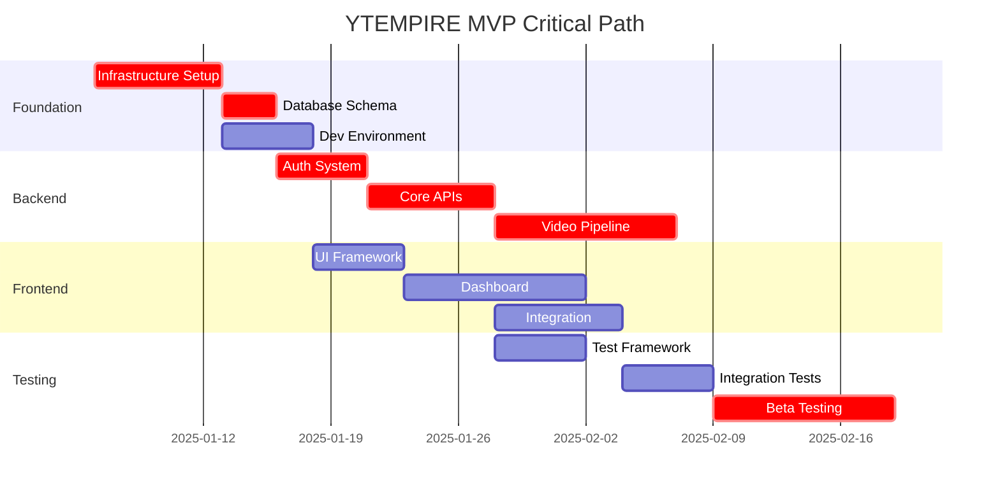

# YTEMPIRE Implementation Roadmaps

## 5.1 Master Timeline

### 12-Week MVP Development Schedule

```
Week 1-2: Foundation Phase
├── Infrastructure setup
├── Development environment
├── Core database schema
└── Team onboarding

Week 3-4: Core Services
├── Authentication system
├── Basic APIs
├── Frontend scaffolding
└── CI/CD pipeline

Week 5-6: Integration Layer
├── External API integrations
├── YouTube OAuth
├── Payment processing
└── Monitoring setup

Week 7-8: Pipeline Development
├── Video generation pipeline
├── Queue system
├── Progress tracking
└── Error handling

Week 9-10: Optimization
├── Performance tuning
├── Security hardening
├── Testing framework
└── Quality assurance

Week 11-12: Beta Launch
├── Beta user onboarding
├── Production deployment
├── Monitoring & support
└── Iteration based on feedback
```

### Critical Path Dependencies



### Milestone Definitions

#### Week 2: Foundation Complete ✓
- Development environment operational
- Database schema implemented
- Docker containers running
- All team members productive

#### Week 4: Core Services Ready ✓
- Authentication working
- Basic CRUD operations
- Frontend connected to backend
- CI/CD pipeline functional

#### Week 6: Integrations Live ✓
- YouTube API connected
- Payment processing tested
- External APIs integrated
- Monitoring dashboards active

#### Week 8: Pipeline Operational ✓
- End-to-end video generation
- Queue processing videos
- Cost tracking accurate
- Error recovery working

#### Week 10: Quality Assured ✓
- 70% test coverage achieved
- Performance targets met
- Security audit passed
- Documentation complete

#### Week 12: Beta Launch ✓
- 50 beta users onboarded
- Platform stable at 95% uptime
- Feedback loop established
- Iteration plan created

## 5.2 Backend Engineering Roadmap

### Phase 1: Foundation (Weeks 1-2)

#### Deliverables
- FastAPI application structure
- PostgreSQL schema implementation
- Redis cache configuration
- Docker containerization
- Basic API endpoints (health, status)

#### Technical Tasks
```python
# Core application structure
ytempire-backend/
├── app/
│   ├── api/
│   │   ├── v1/
│   │   │   ├── auth.py
│   │   │   ├── users.py
│   │   │   ├── channels.py
│   │   │   └── videos.py
│   ├── core/
│   │   ├── config.py
│   │   ├── security.py
│   │   └── database.py
│   ├── models/
│   ├── schemas/
│   ├── services/
│   └── workers/
├── tests/
├── migrations/
└── requirements.txt
```

#### Success Criteria
- API responds to health checks
- Database migrations run successfully
- Redis connection established
- Docker build completes

### Phase 2: Core Services (Weeks 3-4)

#### Deliverables
- JWT authentication system
- User management APIs
- Channel CRUD operations
- Video metadata management
- Cost tracking foundation

#### Key APIs
```python
# Authentication endpoints
POST /api/v1/auth/register
POST /api/v1/auth/login
POST /api/v1/auth/refresh
POST /api/v1/auth/logout

# User management
GET  /api/v1/users/profile
PUT  /api/v1/users/profile
POST /api/v1/users/subscription

# Channel operations
GET  /api/v1/channels
POST /api/v1/channels
PUT  /api/v1/channels/{id}
DELETE /api/v1/channels/{id}
```

### Phase 3: Integration Layer (Weeks 5-6)

#### Deliverables
- YouTube OAuth implementation
- OpenAI API integration
- Google TTS integration
- Stripe payment processing
- Webhook handlers

#### Integration Priority
1. **YouTube API** (Critical)
   - OAuth flow
   - Channel verification
   - Video upload
   - Analytics retrieval

2. **OpenAI API** (Critical)
   - Script generation
   - Content optimization
   - Prompt management

3. **Payment Processing** (High)
   - Subscription management
   - Webhook handling
   - Invoice generation

### Phase 4: Pipeline Development (Weeks 7-8)

#### Deliverables
- Video generation pipeline
- Celery task queue
- Progress tracking
- Error recovery
- Batch processing

#### Pipeline Architecture
```python
# Video generation workflow
1. receive_request()
2. validate_inputs()
3. generate_script()      # OpenAI API
4. synthesize_voice()     # ElevenLabs/Google TTS
5. fetch_media_assets()   # Stock footage
6. render_video()         # FFmpeg
7. generate_thumbnail()   # AI generation
8. upload_to_youtube()    # YouTube API
9. track_analytics()      # Internal tracking
```

### Phase 5: Optimization (Weeks 9-10)

#### Focus Areas
- Query optimization
- Caching strategy
- API response times
- Batch processing
- Cost optimization

#### Performance Targets
- API response: <500ms p95
- Video generation: <10 minutes
- Database queries: <150ms
- Cache hit rate: >60%
- Cost per video: <$3.00

## 5.3 Frontend Engineering Roadmap

### Phase 1: Foundation (Weeks 1-2)

#### Deliverables
- React application setup
- Routing configuration
- Component library selection
- Development environment
- Build pipeline

#### Core Structure
```javascript
ytempire-frontend/
├── src/
│   ├── components/
│   │   ├── common/
│   │   ├── dashboard/
│   │   ├── channels/
│   │   └── videos/
│   ├── pages/
│   ├── services/
│   ├── store/
│   ├── utils/
│   └── App.tsx
├── public/
└── package.json
```

### Phase 2: Core UI (Weeks 3-4)

#### Deliverables
- Authentication UI
- Dashboard layout
- Channel management interface
- Video library view
- Navigation system

#### Key Components
- Login/Register forms
- Dashboard widgets
- Channel cards
- Video grid
- Settings panels

### Phase 3: Integration (Weeks 5-6)

#### Deliverables
- API integration layer
- State management
- Real-time updates
- Error handling
- Loading states

### Phase 4: Advanced Features (Weeks 7-8)

#### Deliverables
- Video generation wizard
- Analytics dashboards
- Content calendar
- Bulk operations
- Export functionality

### Phase 5: Polish (Weeks 9-10)

#### Focus Areas
- Performance optimization
- Mobile responsiveness
- Accessibility
- Error boundaries
- Progressive enhancement

## 5.4 AI/ML Team Roadmap

### Phase 1: Model Selection (Weeks 1-2)

#### Deliverables
- GPT model evaluation
- Voice synthesis comparison
- Cost analysis
- Performance benchmarks
- API setup

### Phase 2: Prompt Engineering (Weeks 3-4)

#### Deliverables
- Script generation prompts
- Title optimization
- Description templates
- Tag generation
- Thumbnail prompts

### Phase 3: Quality Systems (Weeks 5-6)

#### Deliverables
- Content scoring algorithm
- Bias detection
- Quality thresholds
- A/B testing framework
- Feedback loops

### Phase 4: Optimization (Weeks 7-8)

#### Focus Areas
- Token optimization
- Batch processing
- Cache strategies
- Model selection logic
- Cost reduction

### Phase 5: Advanced Features (Weeks 9-10)

#### Deliverables
- Trend detection
- Content recommendations
- Performance prediction
- Automated optimization
- Learning systems

## 5.5 Data Engineering Roadmap

### Phase 1: Foundation (Weeks 1-2)

#### Deliverables
- Database schema design
- ETL pipeline setup
- Data warehouse structure
- Backup procedures
- Migration scripts

### Phase 2: Analytics Pipeline (Weeks 3-4)

#### Deliverables
- YouTube data ingestion
- Metrics calculation
- Aggregation jobs
- Report generation
- Data validation

### Phase 3: Real-time Processing (Weeks 5-6)

#### Deliverables
- Stream processing
- Event tracking
- Real-time dashboards
- Alert systems
- Performance monitoring

### Phase 4: Business Intelligence (Weeks 7-8)

#### Deliverables
- KPI dashboards
- Revenue reports
- User analytics
- Predictive models
- Export capabilities

### Phase 5: Optimization (Weeks 9-10)

#### Focus Areas
- Query performance
- Data compression
- Archival strategies
- Cost optimization
- Scale preparation

## 5.6 Platform Operations Roadmap

### Phase 1: Infrastructure (Weeks 1-2)

#### Deliverables
- Server setup and configuration
- Docker environment
- Network configuration
- Security baseline
- Backup infrastructure

#### Critical Tasks
```bash
# Server setup checklist
□ Ubuntu 22.04 LTS installation
□ Docker and Docker Compose setup
□ Network configuration (1Gbps)
□ Firewall rules (UFW)
□ SSH key-only access
□ Backup drives mounted
□ Monitoring agents installed
```

### Phase 2: CI/CD Pipeline (Weeks 3-4)

#### Deliverables
- GitHub Actions setup
- Docker registry
- Deployment scripts
- Rollback procedures
- Environment management

### Phase 3: Monitoring (Weeks 5-6)

#### Deliverables
- Prometheus setup
- Grafana dashboards
- Alert rules
- Log aggregation
- Health checks

#### Monitoring Stack
```yaml
Metrics Collection:
  - System metrics (CPU, RAM, Disk, Network)
  - Application metrics (API, Queue, Cache)
  - Business metrics (Videos, Users, Revenue)
  
Dashboards:
  - System Overview
  - Application Performance
  - Business KPIs
  - Cost Tracking
```

### Phase 4: Security (Weeks 7-8)

#### Deliverables
- SSL/TLS certificates
- Security scanning
- Access controls
- Audit logging
- Incident response

### Phase 5: Operations (Weeks 9-10)

#### Deliverables
- Runbook documentation
- Disaster recovery plan
- Performance optimization
- Cost optimization
- Team training

### Phase 6: Beta Support (Weeks 11-12)

#### Deliverables
- 24/7 monitoring
- On-call rotation
- User support
- Issue tracking
- Performance reports

## Cross-Team Dependencies

### Critical Handoffs

#### Week 1-2
- **Platform Ops → All**: Development environment ready
- **Backend → Frontend**: API specifications
- **AI → Backend**: Model endpoints

#### Week 3-4
- **Backend → Frontend**: Authentication APIs
- **Platform Ops → All**: CI/CD pipeline
- **Data → Backend**: Database schema

#### Week 5-6
- **Backend → All**: Integration points
- **Frontend → QA**: Testing requirements
- **AI → Backend**: Quality metrics

#### Week 7-8
- **All → QA**: Feature complete for testing
- **Platform Ops → All**: Monitoring active
- **Backend → Frontend**: WebSocket events

#### Week 9-10
- **QA → All**: Test results and bugs
- **All → Platform Ops**: Performance data
- **Platform Ops → All**: Optimization recommendations

#### Week 11-12
- **All → Product**: Beta ready
- **Platform Ops → All**: Production support
- **All → Users**: Documentation complete

---

*Document Status: Version 1.0 - January 2025*
*Owner: CTO/Technical Director*
*Review Cycle: Weekly during MVP*