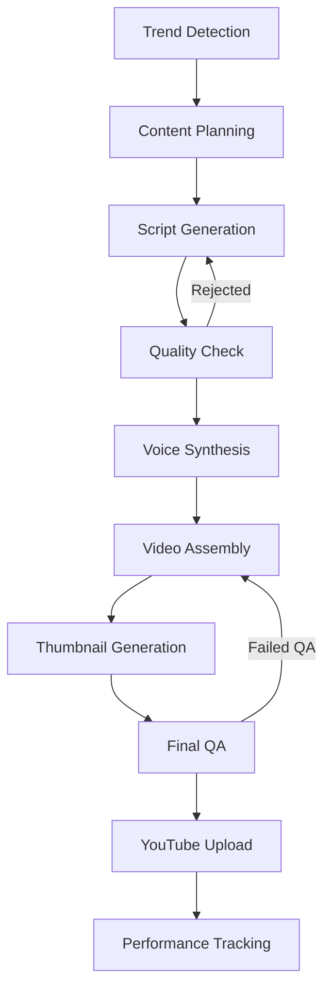

# YTEMPIRE AI/ML Pipeline & Video Generation Specification
**Version 1.0 | January 2025**  
**Owner: VP of AI / AI Team Lead**  
**Approved By: CTO/Technical Director**  
**Status: Ready for Implementation**

---

## Executive Summary

This document defines the complete AI/ML pipeline and video generation architecture for YTEMPIRE's automated content creation system. The pipeline orchestrates multiple AI services and processing steps to generate high-quality YouTube videos with minimal human intervention.

**Core Capabilities:**
- **Fully Automated**: From trend detection to publishing
- **Cost Optimized**: <$1 per video guaranteed
- **Quality Assured**: AI-driven quality scoring
- **Scalable**: 150+ videos/day capacity
- **Multi-modal**: Text, voice, video, thumbnails

---

## 1. Pipeline Architecture Overview

### 1.1 Technology Stack

```yaml
ai_ml_stack:
  llm_providers:
    primary:
      provider: OpenAI
      models:
        - gpt-3.5-turbo (script generation)
        - gpt-4 (quality review)
      fallback: Anthropic Claude
      
  voice_synthesis:
    primary:
      provider: Google Cloud TTS
      voices: 50+ languages/variants
      cost: $0.10 per video
    secondary:
      provider: ElevenLabs
      voices: Premium voices
      cost: $0.30 per video
      
  video_processing:
    engine: FFmpeg
    gpu_acceleration: NVIDIA CUDA
    formats: MP4, WebM
    resolution: 1080p default, 4K optional
    
  image_generation:
    thumbnails: Stable Diffusion XL
    backgrounds: Pexels API
    overlays: Canvas API
    
  ml_frameworks:
    training: PyTorch 2.0
    inference: ONNX Runtime
    serving: TorchServe
    
  orchestration:
    workflow: N8N
    queue: Redis + Bull
    scheduling: Cron
```

### 1.2 Pipeline Flow Diagram



### 1.3 Cost Breakdown Model

```python
class VideoCostCalculator:
    """Calculate and track costs per video"""
    
    COST_STRUCTURE = {
        'script_generation': {
            'tokens': 1500,
            'model': 'gpt-3.5-turbo',
            'cost_per_1k': 0.002,
            'total': 0.20
        },
        'voice_synthesis': {
            'provider': 'Google TTS',
            'characters': 5000,
            'cost_per_1m_chars': 20.00,
            'total': 0.10
        },
        'video_processing': {
            'gpu_time_minutes': 3,
            'cost_per_minute': 0.02,
            'total': 0.06
        },
        'thumbnail_generation': {
            'model': 'SDXL',
            'iterations': 4,
            'cost_per_image': 0.01,
            'total': 0.04
        },
        'storage': {
            'size_gb': 0.1,
            'monthly_per_gb': 0.23,
            'daily_cost': 0.01
        },
        'api_calls': {
            'youtube': 0.01,
            'analytics': 0.01,
            'total': 0.02
        }
    }
    
    @classmethod
    def calculate_total(cls) -> float:
        """Calculate total cost per video"""
        total = sum(
            component.get('total', 0) 
            for component in cls.COST_STRUCTURE.values()
        )
        return round(total, 2)  # $0.43 per video
```

---

## 2. Content Intelligence System

### 2.1 Trend Detection Engine

```python
class TrendDetectionEngine:
    """Identify trending topics and opportunities"""
    
    def __init__(self):
        self.sources = [
            'google_trends',
            'youtube_trending',
            'reddit_hot',
            'twitter_trending',
            'news_apis'
        ]
        
    async def detect_trends(self, niche: str) -> List[Trend]:
        """Detect trends for a specific niche"""
        
        trends = []
        
        # Google Trends API
        google_trends = await self.fetch_google_trends(niche)
        trends.extend(self.parse_google_trends(google_trends))
        
        # YouTube Analytics
        youtube_data = await self.fetch_youtube_trending(niche)
        trends.extend(self.analyze_youtube_gaps(youtube_data))
        
        # Reddit Discussions
        reddit_topics = await self.fetch_reddit_topics(niche)
        trends.extend(self.extract_reddit_trends(reddit_topics))
        
        # Score and rank trends
        scored_trends = self.score_trends(trends)
        
        return sorted(scored_trends, key=lambda x: x.score, reverse=True)[:10]
    
    def score_trends(self, trends: List[Trend]) -> List[Trend]:
        """Score trends based on multiple factors"""
        
        for trend in trends:
            trend.score = self.calculate_score(
                search_volume=trend.search_volume,
                competition=trend.competition,
                growth_rate=trend.growth_rate,
                monetization_potential=trend.cpm_estimate,
                relevance=trend.niche_relevance
            )
        
        return trends
```

### 2.2 Content Planning AI

```python
class ContentPlanningAI:
    """Plan content strategy and calendar"""
    
    def generate_content_calendar(
        self,
        channel: Channel,
        days: int = 30
    ) -> ContentCalendar:
        """Generate optimized content calendar"""
        
        calendar = ContentCalendar()
        
        # Analyze channel performance
        best_performing = self.analyze_channel_history(channel)
        
        # Get trending topics
        trends = self.trend_engine.detect_trends(channel.niche)
        
        # Mix content types
        content_mix = {
            'trending': 0.4,  # 40% trending topics
            'evergreen': 0.3,  # 30% evergreen content
            'series': 0.2,    # 20% series content
            'experimental': 0.1  # 10% experimental
        }
        
        # Generate schedule
        for day in range(days):
            video_idea = self.generate_video_idea(
                channel=channel,
                trends=trends,
                content_mix=content_mix,
                day_of_week=day % 7
            )
            
            calendar.add_video(
                date=datetime.now() + timedelta(days=day),
                idea=video_idea,
                optimal_time=self.calculate_optimal_time(channel, day % 7)
            )
        
        return calendar
```

---

## 3. Script Generation Pipeline

### 3.1 Multi-Stage Script Generation

```python
class ScriptGenerationPipeline:
    """Generate high-quality video scripts"""
    
    def __init__(self):
        self.openai_client = OpenAI(api_key=OPENAI_API_KEY)
        self.script_templates = self.load_templates()
        
    async def generate_script(
        self,
        topic: str,
        video_type: str,
        target_duration: int = 10  # minutes
    ) -> VideoScript:
        """Generate complete video script"""
        
        # Stage 1: Research
        research = await self.research_topic(topic)
        
        # Stage 2: Outline
        outline = await self.generate_outline(
            topic=topic,
            research=research,
            video_type=video_type
        )
        
        # Stage 3: Script Writing
        script = await self.write_script(
            outline=outline,
            target_duration=target_duration
        )
        
        # Stage 4: Optimization
        optimized = await self.optimize_script(script)
        
        # Stage 5: Fact Checking
        verified = await self.fact_check(optimized)
        
        return VideoScript(
            content=verified,
            duration_estimate=self.estimate_duration(verified),
            word_count=len(verified.split()),
            quality_score=self.calculate_quality_score(verified)
        )
    
    async def generate_outline(
        self,
        topic: str,
        research: dict,
        video_type: str
    ) -> str:
        """Generate video outline"""
        
        prompt = f"""
        Create a detailed outline for a {video_type} YouTube video about {topic}.
        
        Research data: {json.dumps(research)}
        
        Structure:
        1. Hook (0-15 seconds)
        2. Introduction (15-30 seconds)
        3. Main Content (3-8 minutes)
        4. Conclusion (30 seconds)
        5. Call to Action (15 seconds)
        
        Make it engaging, informative, and optimized for retention.
        """
        
        response = await self.openai_client.chat.completions.create(
            model="gpt-3.5-turbo",
            messages=[{"role": "user", "content": prompt}],
            temperature=0.7,
            max_tokens=1000
        )
        
        return response.choices[0].message.content
    
    async def write_script(
        self,
        outline: str,
        target_duration: int
    ) -> str:
        """Write full script from outline"""
        
        words_per_minute = 150
        target_words = target_duration * words_per_minute
        
        prompt = f"""
        Write a complete YouTube video script based on this outline:
        
        {outline}
        
        Requirements:
        - Target length: {target_words} words ({target_duration} minutes)
        - Conversational and engaging tone
        - Include timestamps
        - Add emphasis markers for voice synthesis
        - Include B-roll suggestions
        
        Format:
        [00:00] Script text here...
        [B-ROLL: Description of visual]
        """
        
        response = await self.openai_client.chat.completions.create(
            model="gpt-3.5-turbo-16k",
            messages=[{"role": "user", "content": prompt}],
            temperature=0.8,
            max_tokens=4000
        )
        
        return response.choices[0].message.content
```

### 3.2 Script Templates

```python
SCRIPT_TEMPLATES = {
    'product_review': """
    [00:00] What's up everyone! Today we're diving deep into {product_name}.
    [00:05] Is it worth your money? Let's find out!
    
    [00:15] Quick Overview
    - Price: {price}
    - Key Features: {features}
    - Competition: {competitors}
    
    [00:45] Unboxing and First Impressions
    {unboxing_section}
    
    [02:00] Deep Dive into Features
    {features_section}
    
    [05:00] Performance Testing
    {performance_section}
    
    [07:00] Pros and Cons
    Pros:
    {pros_list}
    
    Cons:
    {cons_list}
    
    [08:30] Final Verdict
    {conclusion}
    
    [09:00] Don't forget to subscribe for more reviews!
    """,
    
    'tutorial': """
    [00:00] In this video, I'll show you exactly how to {task}.
    [00:05] By the end, you'll be able to {outcome}.
    
    [00:15] What You'll Need
    {requirements}
    
    [00:30] Step 1: {step1_title}
    {step1_content}
    
    [02:00] Step 2: {step2_title}
    {step2_content}
    
    [04:00] Step 3: {step3_title}
    {step3_content}
    
    [06:00] Common Mistakes to Avoid
    {mistakes_section}
    
    [07:30] Pro Tips
    {tips_section}
    
    [08:30] Quick Recap
    {summary}
    
    [09:00] If this helped, hit that like button!
    """,
    
    'listicle': """
    [00:00] Here are the top {number} {items} you need to know about!
    
    [00:10] But first, make sure you're subscribed!
    
    {list_items}
    
    [08:00] Which one was your favorite? Let me know in the comments!
    
    [08:30] Check out this video next!
    """
}
```

---

## 4. Voice Synthesis System

### 4.1 Multi-Provider Voice Engine

```python
class VoiceSynthesisEngine:
    """Handle voice generation across multiple providers"""
    
    def __init__(self):
        self.google_tts = texttospeech.TextToSpeechClient()
        self.elevenlabs = ElevenLabs(api_key=ELEVENLABS_KEY)
        self.voice_cache = {}
        
    async def synthesize_voice(
        self,
        script: str,
        voice_settings: VoiceSettings
    ) -> AudioFile:
        """Generate voice audio from script"""
        
        # Check cache first
        cache_key = self.generate_cache_key(script, voice_settings)
        if cache_key in self.voice_cache:
            return self.voice_cache[cache_key]
        
        # Parse script for segments
        segments = self.parse_script_segments(script)
        
        # Generate audio for each segment
        audio_segments = []
        for segment in segments:
            audio = await self.generate_segment(
                text=segment.text,
                voice=voice_settings,
                emphasis=segment.emphasis,
                speed=segment.speed
            )
            audio_segments.append(audio)
        
        # Combine segments
        final_audio = self.combine_audio_segments(audio_segments)
        
        # Post-process
        processed = await self.post_process_audio(
            audio=final_audio,
            normalize=True,
            remove_silence=True,
            add_background_music=voice_settings.background_music
        )
        
        # Cache result
        self.voice_cache[cache_key] = processed
        
        return processed
    
    async def generate_segment(
        self,
        text: str,
        voice: VoiceSettings,
        emphasis: str = None,
        speed: float = 1.0
    ) -> bytes:
        """Generate audio for a text segment"""
        
        if voice.provider == 'google':
            return await self.google_tts_generate(
                text=text,
                voice_name=voice.voice_id,
                speaking_rate=speed,
                pitch=voice.pitch
            )
        elif voice.provider == 'elevenlabs':
            return await self.elevenlabs_generate(
                text=text,
                voice_id=voice.voice_id,
                stability=voice.stability,
                clarity=voice.clarity
            )
    
    async def google_tts_generate(
        self,
        text: str,
        voice_name: str,
        speaking_rate: float = 1.0,
        pitch: float = 0.0
    ) -> bytes:
        """Generate voice using Google TTS"""
        
        synthesis_input = texttospeech.SynthesisInput(text=text)
        
        voice = texttospeech.VoiceSelectionParams(
            language_code="en-US",
            name=voice_name,
            ssml_gender=texttospeech.SsmlVoiceGender.NEUTRAL
        )
        
        audio_config = texttospeech.AudioConfig(
            audio_encoding=texttospeech.AudioEncoding.MP3,
            speaking_rate=speaking_rate,
            pitch=pitch
        )
        
        response = self.google_tts.synthesize_speech(
            input=synthesis_input,
            voice=voice,
            audio_config=audio_config
        )
        
        return response.audio_content
```

### 4.2 Voice Selection Algorithm

```python
class VoiceSelector:
    """Select optimal voice for content"""
    
    VOICE_PROFILES = {
        'technology': {
            'primary': 'en-US-Neural2-J',  # Professional male
            'secondary': 'en-US-Neural2-C',  # Professional female
            'characteristics': ['clear', 'authoritative', 'modern']
        },
        'gaming': {
            'primary': 'en-US-Neural2-D',  # Energetic male
            'secondary': 'en-US-Neural2-F',  # Energetic female
            'characteristics': ['enthusiastic', 'young', 'dynamic']
        },
        'education': {
            'primary': 'en-US-Neural2-H',  # Warm female
            'secondary': 'en-US-Neural2-I',  # Warm male
            'characteristics': ['friendly', 'patient', 'clear']
        },
        'finance': {
            'primary': 'en-US-Neural2-A',  # Professional male
            'secondary': 'en-US-Neural2-E',  # Professional female
            'characteristics': ['trustworthy', 'serious', 'articulate']
        }
    }
    
    def select_voice(
        self,
        channel_niche: str,
        video_type: str,
        target_audience: dict
    ) -> str:
        """Select best voice for content"""
        
        # Get voice profile for niche
        profile = self.VOICE_PROFILES.get(
            channel_niche,
            self.VOICE_PROFILES['technology']
        )
        
        # Consider audience demographics
        if target_audience.get('age_range') == '18-24':
            # Younger voices for younger audience
            return profile['secondary']
        elif target_audience.get('age_range') == '35+':
            # More mature voices for older audience
            return profile['primary']
        
        # Default selection
        return profile['primary']
```

---

## 5. Video Generation Pipeline

### 5.1 FFmpeg Video Assembly

```python
class VideoAssemblyPipeline:
    """Assemble final video using FFmpeg"""
    
    def __init__(self):
        self.ffmpeg_path = '/usr/local/bin/ffmpeg'
        self.templates_path = '/opt/ytempire/video_templates'
        
    async def generate_video(
        self,
        audio_file: str,
        script: VideoScript,
        style_settings: VideoStyle
    ) -> str:
        """Generate complete video"""
        
        # Parse script for visual cues
        scenes = self.parse_scenes(script)
        
        # Generate scene visuals
        video_segments = []
        for scene in scenes:
            segment = await self.create_scene(
                scene=scene,
                style=style_settings
            )
            video_segments.append(segment)
        
        # Combine video segments
        video_track = await self.combine_video_segments(video_segments)
        
        # Add audio track
        with_audio = await self.add_audio_track(video_track, audio_file)
        
        # Add overlays
        with_overlays = await self.add_overlays(
            video=with_audio,
            overlays=style_settings.overlays
        )
        
        # Add subtitles
        with_subtitles = await self.add_subtitles(
            video=with_overlays,
            script=script
        )
        
        # Final encoding
        final_video = await self.encode_final(
            video=with_subtitles,
            format='mp4',
            quality=style_settings.quality
        )
        
        return final_video
    
    async def create_scene(
        self,
        scene: Scene,
        style: VideoStyle
    ) -> str:
        """Create visual for a scene"""
        
        if scene.type == 'title':
            return await self.create_title_scene(scene, style)
        elif scene.type == 'content':
            return await self.create_content_scene(scene, style)
        elif scene.type == 'transition':
            return await self.create_transition(scene, style)
    
    async def create_content_scene(
        self,
        scene: Scene,
        style: VideoStyle
    ) -> str:
        """Create content scene with visuals"""
        
        # Get background video/image
        background = await self.get_background(
            keywords=scene.keywords,
            duration=scene.duration
        )
        
        # Create text overlays
        text_overlay = self.create_text_overlay(
            text=scene.text,
            position=style.text_position,
            font=style.font
        )
        
        # Combine using FFmpeg
        output_path = f"/tmp/scene_{scene.id}.mp4"
        
        ffmpeg_cmd = [
            self.ffmpeg_path,
            '-i', background,
            '-vf', f"{text_overlay}",
            '-c:v', 'libx264',
            '-preset', 'fast',
            '-crf', '23',
            output_path
        ]
        
        await self.run_ffmpeg(ffmpeg_cmd)
        
        return output_path
    
    def create_text_overlay(
        self,
        text: str,
        position: str,
        font: dict
    ) -> str:
        """Create FFmpeg text overlay filter"""
        
        return (
            f"drawtext="
            f"text='{text}':"
            f"fontfile={font['file']}:"
            f"fontsize={font['size']}:"
            f"fontcolor={font['color']}:"
            f"box=1:"
            f"boxcolor=black@0.5:"
            f"boxborderw=5:"
            f"x=(w-text_w)/2:"
            f"y={position}"
        )
```

### 5.2 GPU-Accelerated Processing

```python
class GPUVideoProcessor:
    """GPU-accelerated video processing"""
    
    def __init__(self):
        self.cuda_available = torch.cuda.is_available()
        self.device = 'cuda' if self.cuda_available else 'cpu'
        
    async def process_video_gpu(
        self,
        input_path: str,
        operations: List[str]
    ) -> str:
        """Process video using GPU acceleration"""
        
        output_path = f"/tmp/processed_{uuid.uuid4()}.mp4"
        
        # Build FFmpeg command with CUDA
        cmd = [
            'ffmpeg',
            '-hwaccel', 'cuda',
            '-hwaccel_output_format', 'cuda',
            '-i', input_path
        ]
        
        # Add GPU-accelerated filters
        filters = []
        for op in operations:
            if op == 'scale':
                filters.append('scale_cuda=1920:1080')
            elif op == 'denoise':
                filters.append('nlmeans_cuda')
            elif op == 'sharpen':
                filters.append('unsharp_cuda')
        
        if filters:
            cmd.extend(['-vf', ','.join(filters)])
        
        # Output settings
        cmd.extend([
            '-c:v', 'h264_nvenc',  # NVIDIA encoder
            '-preset', 'fast',
            '-b:v', '5M',
            output_path
        ])
        
        # Execute
        process = await asyncio.create_subprocess_exec(
            *cmd,
            stdout=asyncio.subprocess.PIPE,
            stderr=asyncio.subprocess.PIPE
        )
        
        stdout, stderr = await process.communicate()
        
        if process.returncode != 0:
            raise Exception(f"FFmpeg error: {stderr.decode()}")
        
        return output_path
```

---

## 6. Thumbnail Generation

### 6.1 AI Thumbnail Creator

```python
class ThumbnailGenerator:
    """Generate eye-catching thumbnails"""
    
    def __init__(self):
        self.sd_pipeline = StableDiffusionPipeline.from_pretrained(
            "stabilityai/stable-diffusion-xl-base-1.0",
            torch_dtype=torch.float16
        ).to("cuda")
        
    async def generate_thumbnail(
        self,
        video_title: str,
        video_type: str,
        style_preferences: dict
    ) -> str:
        """Generate thumbnail for video"""
        
        # Generate base image with SDXL
        base_image = await self.generate_base_image(
            title=video_title,
            style=style_preferences
        )
        
        # Add text overlay
        with_text = await self.add_text_overlay(
            image=base_image,
            title=video_title,
            style=style_preferences
        )
        
        # Add effects
        final = await self.add_effects(
            image=with_text,
            effects=['shadow', 'border', 'contrast']
        )
        
        # Optimize for YouTube
        optimized = await self.optimize_for_youtube(final)
        
        return optimized
    
    async def generate_base_image(
        self,
        title: str,
        style: dict
    ) -> Image:
        """Generate base image with Stable Diffusion"""
        
        # Create prompt
        prompt = self.create_image_prompt(title, style)
        
        # Generate image
        with torch.autocast("cuda"):
            image = self.sd_pipeline(
                prompt=prompt,
                negative_prompt="blurry, low quality, text, watermark",
                num_inference_steps=30,
                guidance_scale=7.5,
                width=1280,
                height=720
            ).images[0]
        
        return image
    
    def create_image_prompt(
        self,
        title: str,
        style: dict
    ) -> str:
        """Create optimized prompt for thumbnail"""
        
        # Extract keywords from title
        keywords = self.extract_keywords(title)
        
        # Build prompt
        prompt_parts = [
            "YouTube thumbnail",
            "high quality",
            "eye-catching",
            "professional",
            style.get('mood', 'vibrant'),
            style.get('color_scheme', 'colorful'),
            *keywords
        ]
        
        return ", ".join(prompt_parts)
    
    async def add_text_overlay(
        self,
        image: Image,
        title: str,
        style: dict
    ) -> Image:
        """Add text to thumbnail"""
        
        draw = ImageDraw.Draw(image)
        
        # Load font
        font_size = style.get('font_size', 72)
        font = ImageFont.truetype(
            style.get('font_path', 'Arial-Bold.ttf'),
            font_size
        )
        
        # Calculate text position
        text_bbox = draw.textbbox((0, 0), title, font=font)
        text_width = text_bbox[2] - text_bbox[0]
        text_height = text_bbox[3] - text_bbox[1]
        
        x = (image.width - text_width) // 2
        y = image.height - text_height - 50
        
        # Add shadow
        shadow_offset = 3
        draw.text(
            (x + shadow_offset, y + shadow_offset),
            title,
            font=font,
            fill='black'
        )
        
        # Add main text
        draw.text(
            (x, y),
            title,
            font=font,
            fill=style.get('text_color', 'white'),
            stroke_width=2,
            stroke_fill='black'
        )
        
        return image
```

---

## 7. Quality Assurance AI

### 7.1 Automated Quality Checks

```python
class QualityAssuranceAI:
    """AI-powered quality checks"""
    
    def __init__(self):
        self.quality_model = self.load_quality_model()
        self.copyright_checker = CopyrightChecker()
        
    async def check_video_quality(
        self,
        video_path: str,
        script: str,
        metadata: dict
    ) -> QualityReport:
        """Comprehensive quality check"""
        
        report = QualityReport()
        
        # Technical quality
        technical = await self.check_technical_quality(video_path)
        report.add_section('technical', technical)
        
        # Content quality
        content = await self.check_content_quality(script, metadata)
        report.add_section('content', content)
        
        # Copyright check
        copyright = await self.copyright_checker.check(video_path)
        report.add_section('copyright', copyright)
        
        # YouTube compliance
        compliance = await self.check_youtube_compliance(
            video_path,
            metadata
        )
        report.add_section('compliance', compliance)
        
        # Calculate overall score
        report.overall_score = self.calculate_overall_score(report)
        
        # Determine pass/fail
        report.passed = report.overall_score >= 80
        
        return report
    
    async def check_technical_quality(
        self,
        video_path: str
    ) -> dict:
        """Check technical aspects of video"""
        
        checks = {}
        
        # Resolution check
        probe = ffmpeg.probe(video_path)
        video_stream = next(
            s for s in probe['streams'] 
            if s['codec_type'] == 'video'
        )
        
        width = video_stream['width']
        height = video_stream['height']
        checks['resolution'] = {
            'value': f"{width}x{height}",
            'passed': width >= 1920 and height >= 1080,
            'score': 100 if width >= 1920 else 50
        }
        
        # Bitrate check
        bitrate = int(video_stream.get('bit_rate', 0))
        checks['bitrate'] = {
            'value': bitrate,
            'passed': bitrate >= 5000000,  # 5 Mbps
            'score': min(100, (bitrate / 5000000) * 100)
        }
        
        # Audio quality
        audio_stream = next(
            s for s in probe['streams']
            if s['codec_type'] == 'audio'
        )
        
        audio_bitrate = int(audio_stream.get('bit_rate', 0))
        checks['audio'] = {
            'value': audio_bitrate,
            'passed': audio_bitrate >= 128000,  # 128 kbps
            'score': min(100, (audio_bitrate / 128000) * 100)
        }
        
        return checks
    
    async def check_content_quality(
        self,
        script: str,
        metadata: dict
    ) -> dict:
        """Check content quality using AI"""
        
        checks = {}
        
        # Grammar and spelling
        grammar_score = await self.check_grammar(script)
        checks['grammar'] = {
            'score': grammar_score,
            'passed': grammar_score >= 90
        }
        
        # Engagement potential
        engagement = await self.predict_engagement(script, metadata)
        checks['engagement'] = {
            'score': engagement,
            'passed': engagement >= 70
        }
        
        # SEO optimization
        seo_score = await self.check_seo(
            title=metadata['title'],
            description=metadata['description'],
            tags=metadata['tags']
        )
        checks['seo'] = {
            'score': seo_score,
            'passed': seo_score >= 80
        }
        
        return checks
```

---

## 8. N8N Workflow Automation

### 8.1 Video Generation Workflow

```json
{
  "name": "Video Generation Workflow",
  "nodes": [
    {
      "id": "1",
      "type": "trigger",
      "typeVersion": 1,
      "position": [250, 300],
      "parameters": {
        "rule": {
          "interval": [
            {
              "field": "hours",
              "hoursInterval": 4
            }
          ]
        }
      }
    },
    {
      "id": "2",
      "type": "postgres",
      "typeVersion": 1,
      "position": [450, 300],
      "parameters": {
        "operation": "select",
        "table": "youtube_channels",
        "where": "automation_enabled = true AND videos_today < videos_per_day"
      }
    },
    {
      "id": "3",
      "type": "function",
      "typeVersion": 1,
      "position": [650, 300],
      "parameters": {
        "functionCode": "// Select channels needing videos\nconst channels = items[0].json;\nconst selected = channels.filter(ch => {\n  const lastVideo = new Date(ch.last_video_at);\n  const hoursSince = (Date.now() - lastVideo) / 3600000;\n  return hoursSince >= 24 / ch.videos_per_day;\n});\nreturn selected.map(ch => ({json: ch}));"
      }
    },
    {
      "id": "4",
      "type": "http-request",
      "typeVersion": 1,
      "position": [850, 300],
      "parameters": {
        "url": "http://localhost:8000/api/trends/detect",
        "method": "POST",
        "bodyParameters": {
          "channel_id": "={{$json[\"id\"]}}",
          "niche": "={{$json[\"niche\"]}}"
        }
      }
    },
    {
      "id": "5",
      "type": "http-request",
      "typeVersion": 1,
      "position": [1050, 300],
      "parameters": {
        "url": "http://localhost:8000/api/scripts/generate",
        "method": "POST",
        "bodyParameters": {
          "topic": "={{$json[\"trending_topic\"]}}",
          "channel_id": "={{$json[\"channel_id\"]}}",
          "duration": 10
        }
      }
    },
    {
      "id": "6",
      "type": "http-request",
      "typeVersion": 1,
      "position": [1250, 300],
      "parameters": {
        "url": "http://localhost:8000/api/voice/synthesize",
        "method": "POST",
        "bodyParameters": {
          "script": "={{$json[\"script\"]}}",
          "voice_id": "={{$json[\"voice_settings\"][\"voice_id\"]}}"
        }
      }
    },
    {
      "id": "7",
      "type": "http-request",
      "typeVersion": 1,
      "position": [1450, 300],
      "parameters": {
        "url": "http://localhost:8000/api/video/generate",
        "method": "POST",
        "bodyParameters": {
          "audio_url": "={{$json[\"audio_url\"]}}",
          "script": "={{$json[\"script\"]}}",
          "style": "={{$json[\"video_style\"]}}"
        }
      }
    },
    {
      "id": "8",
      "type": "http-request",
      "typeVersion": 1,
      "position": [1650, 300],
      "parameters": {
        "url": "http://localhost:8000/api/youtube/upload",
        "method": "POST",
        "bodyParameters": {
          "video_url": "={{$json[\"video_url\"]}}",
          "title": "={{$json[\"title\"]}}",
          "description": "={{$json[\"description\"]}}",
          "tags": "={{$json[\"tags\"]}}",
          "channel_id": "={{$json[\"channel_id\"]}}"
        }
      }
    }
  ],
  "connections": {
    "1": {"main": [[{"node": "2"}]]},
    "2": {"main": [[{"node": "3"}]]},
    "3": {"main": [[{"node": "4"}]]},
    "4": {"main": [[{"node": "5"}]]},
    "5": {"main": [[{"node": "6"}]]},
    "6": {"main": [[{"node": "7"}]]},
    "7": {"main": [[{"node": "8"}]]}
  }
}
```

### 8.2 Workflow Management API

```python
class N8NWorkflowManager:
    """Manage N8N workflows programmatically"""
    
    def __init__(self):
        self.n8n_url = "http://localhost:5678"
        self.api_key = N8N_API_KEY
        
    async def create_workflow(
        self,
        name: str,
        nodes: List[dict],
        connections: dict
    ) -> str:
        """Create new N8N workflow"""
        
        workflow = {
            "name": name,
            "nodes": nodes,
            "connections": connections,
            "active": True,
            "settings": {
                "saveDataErrorExecution": "all",
                "saveDataSuccessExecution": "all",
                "saveExecutionProgress": True,
                "saveManualExecutions": True,
                "executionTimeout": 3600
            }
        }
        
        response = await self.http_client.post(
            f"{self.n8n_url}/api/v1/workflows",
            json=workflow,
            headers={"X-N8N-API-KEY": self.api_key}
        )
        
        return response.json()["data"]["id"]
    
    async def execute_workflow(
        self,
        workflow_id: str,
        data: dict = None
    ) -> dict:
        """Execute workflow with data"""
        
        response = await self.http_client.post(
            f"{self.n8n_url}/api/v1/workflows/{workflow_id}/execute",
            json={"data": data} if data else {},
            headers={"X-N8N-API-KEY": self.api_key}
        )
        
        return response.json()["data"]
    
    async def monitor_execution(
        self,
        execution_id: str
    ) -> ExecutionStatus:
        """Monitor workflow execution"""
        
        while True:
            response = await self.http_client.get(
                f"{self.n8n_url}/api/v1/executions/{execution_id}",
                headers={"X-N8N-API-KEY": self.api_key}
            )
            
            execution = response.json()["data"]
            
            if execution["finished"]:
                return ExecutionStatus(
                    id=execution_id,
                    status=execution["status"],
                    data=execution["data"],
                    error=execution.get("error")
                )
            
            await asyncio.sleep(5)  # Check every 5 seconds
```

---

## 9. Performance & Monitoring

### 9.1 ML Pipeline Monitoring

```python
class MLPipelineMonitor:
    """Monitor AI/ML pipeline performance"""
    
    def __init__(self):
        self.metrics_client = PrometheusClient()
        
    async def track_generation_metrics(
        self,
        video_id: str,
        metrics: dict
    ):
        """Track video generation metrics"""
        
        # Track timing
        self.metrics_client.histogram(
            'video_generation_duration',
            metrics['total_duration'],
            labels={'video_id': video_id}
        )
        
        # Track costs
        self.metrics_client.gauge(
            'video_generation_cost',
            metrics['total_cost'],
            labels={'video_id': video_id}
        )
        
        # Track quality
        self.metrics_client.gauge(
            'video_quality_score',
            metrics['quality_score'],
            labels={'video_id': video_id}
        )
        
        # Track AI usage
        for service, usage in metrics['ai_usage'].items():
            self.metrics_client.counter(
                f'ai_service_usage_{service}',
                usage['requests'],
                labels={'video_id': video_id}
            )
            
            self.metrics_client.histogram(
                f'ai_service_latency_{service}',
                usage['latency'],
                labels={'video_id': video_id}
            )
    
    async def alert_on_anomaly(
        self,
        metric: str,
        value: float,
        threshold: float
    ):
        """Alert on metric anomalies"""
        
        if value > threshold:
            await self.send_alert(
                title=f"AI Pipeline Alert: {metric}",
                message=f"Value {value} exceeds threshold {threshold}",
                severity="warning"
            )
```

### 9.2 Cost Optimization Engine

```python
class CostOptimizationEngine:
    """Optimize AI/ML costs"""
    
    def __init__(self):
        self.cost_history = []
        self.optimization_rules = self.load_rules()
        
    async def optimize_pipeline(
        self,
        current_config: dict
    ) -> dict:
        """Optimize pipeline configuration for cost"""
        
        optimized = current_config.copy()
        
        # Analyze recent costs
        avg_cost = np.mean([c['total'] for c in self.cost_history[-100:]])
        
        if avg_cost > 0.50:  # If exceeding target
            # Switch to cheaper providers
            if optimized['voice_provider'] == 'elevenlabs':
                optimized['voice_provider'] = 'google_tts'
                
            # Use cheaper models
            if optimized['script_model'] == 'gpt-4':
                optimized['script_model'] = 'gpt-3.5-turbo'
                
            # Reduce quality settings
            if optimized['video_quality'] == '4k':
                optimized['video_quality'] = '1080p'
                
            # Batch process more
            optimized['batch_size'] = min(10, optimized['batch_size'] * 2)
        
        return optimized
    
    async def predict_monthly_cost(
        self,
        current_rate: float,
        growth_factor: float = 1.0
    ) -> float:
        """Predict monthly costs"""
        
        daily_videos = 150 * growth_factor
        days_in_month = 30
        
        predicted_cost = (
            daily_videos * 
            days_in_month * 
            current_rate
        )
        
        return predicted_cost
```

---

## Document Control

- **Version**: 1.0
- **Last Updated**: January 2025
- **Owner**: VP of AI / AI Team Lead
- **Review Cycle**: Weekly during MVP
- **Security Classification**: Confidential

**Approval Chain:**
1. AI Team Lead ✅
2. Security Engineer (Review Required)
3. VP of AI (Final Approval)

---

## Security Engineer Action Items

Based on this AI/ML pipeline specification, the Security Engineer should:

1. **API Security**: Secure all AI service API keys and tokens
2. **Data Privacy**: Ensure no PII in training data or logs
3. **Content Filtering**: Implement inappropriate content detection
4. **Copyright Protection**: Validate copyright checking systems
5. **Rate Limiting**: Implement API rate limiting for all services
6. **Cost Controls**: Set up spending alerts and limits
7. **Model Security**: Secure ML models and prevent extraction
8. **Audit Logging**: Track all AI service usage for compliance

This specification provides the complete AI/ML pipeline architecture needed for YTEMPIRE's automated content generation system.# YTEMPIRE AI/ML Pipeline & Video Generation Specification
**Version 1.0 | January 2025**  
**Owner: VP of AI / AI Team Lead**  
**Approved By: CTO/Technical Director**  
**Status: Ready for Implementation**

---

## Executive Summary

This document defines the complete AI/ML pipeline and video generation architecture for YTEMPIRE's automated content creation system. The pipeline orchestrates multiple AI services and processing steps to generate high-quality YouTube videos with minimal human intervention.

**Core Capabilities:**
- **Fully Automated**: From trend detection to publishing
- **Cost Optimized**: <$1 per video guaranteed
- **Quality Assured**: AI-driven quality scoring
- **Scalable**: 150+ videos/day capacity
- **Multi-modal**: Text, voice, video, thumbnails