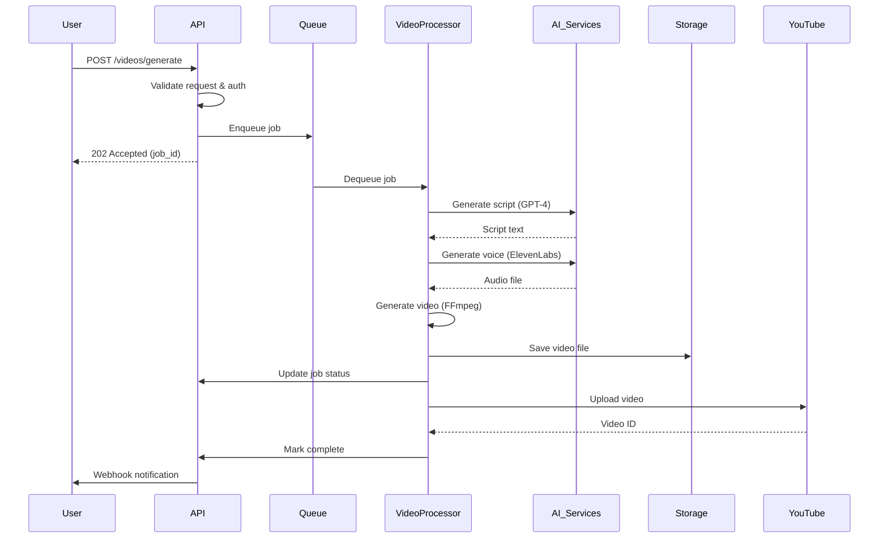

# YTEMPIRE API Specification & Architecture Document
**Version 1.0 | January 2025**  
**Owner: Backend Team Lead**  
**Security Review: Security Engineer**  
**Status: Ready for Implementation**

---

## Executive Summary

This document provides the complete API specification and service architecture for YTEMPIRE's MVP implementation. It defines all endpoints, authentication mechanisms, service communication patterns, and data flow requirements necessary for the Security Engineer and Platform Operations team to implement secure, scalable infrastructure.

---

## 1. API Architecture Overview

### 1.1 Service Architecture

```yaml
service_architecture:
  api_gateway:
    type: "Kong Gateway"
    port: 8000
    responsibilities:
      - Rate limiting
      - Authentication
      - Request routing
      - SSL termination
      
  backend_services:
    main_api:
      framework: "FastAPI"
      port: 8001
      database: "PostgreSQL"
      cache: "Redis"
      
    video_processor:
      framework: "Python + Celery"
      port: 8002
      queue: "Redis Queue"
      gpu_enabled: true
      
    analytics_service:
      framework: "FastAPI"
      port: 8003
      database: "PostgreSQL"
      time_series: "TimescaleDB"
      
    webhook_handler:
      framework: "FastAPI"
      port: 8004
      queue: "Redis Queue"
```

### 1.2 Authentication & Authorization

```python
# Security-first authentication implementation
class AuthenticationSchema:
    """JWT-based authentication with refresh tokens"""
    
    JWT_CONFIG = {
        'algorithm': 'RS256',  # Asymmetric for security
        'access_token_expire': 3600,  # 1 hour
        'refresh_token_expire': 604800,  # 7 days
        'issuer': 'ytempire.com',
        'audience': ['api.ytempire.com']
    }
    
    OAUTH_PROVIDERS = {
        'google': {
            'client_id': 'env:GOOGLE_CLIENT_ID',
            'scopes': ['youtube.upload', 'youtube.readonly']
        },
        'youtube': {
            'client_id': 'env:YOUTUBE_CLIENT_ID',
            'scopes': ['channel.manage', 'analytics.readonly']
        }
    }
    
    RBAC_ROLES = {
        'admin': ['all'],
        'user': ['channels:read', 'channels:write', 'videos:all'],
        'viewer': ['channels:read', 'videos:read'],
        'service': ['internal:all']  # For service-to-service
    }
```

---

## 2. API Endpoints Specification

### 2.1 Authentication Endpoints

```yaml
authentication_endpoints:
  POST /api/v1/auth/register:
    description: "Register new user"
    rate_limit: "5 requests per hour per IP"
    request_body:
      email: "string, required, unique"
      password: "string, min 12 chars, complexity rules"
      full_name: "string, required"
      company: "string, optional"
    response:
      201:
        user_id: "uuid"
        email: "string"
        verification_required: "boolean"
      400: "Validation error"
      409: "Email already exists"
    security_notes: "Password hashed with bcrypt, cost factor 12"
    
  POST /api/v1/auth/login:
    description: "User login"
    rate_limit: "10 requests per minute per IP"
    request_body:
      email: "string, required"
      password: "string, required"
      mfa_code: "string, optional"
    response:
      200:
        access_token: "JWT"
        refresh_token: "UUID"
        expires_in: "3600"
        user: "UserObject"
      401: "Invalid credentials"
      429: "Too many attempts"
    security_notes: "Implement account lockout after 5 failed attempts"
    
  POST /api/v1/auth/refresh:
    description: "Refresh access token"
    rate_limit: "20 requests per minute per user"
    request_body:
      refresh_token: "UUID, required"
    response:
      200:
        access_token: "JWT"
        expires_in: "3600"
      401: "Invalid refresh token"
    security_notes: "Refresh tokens stored in Redis with TTL"
    
  POST /api/v1/auth/logout:
    description: "Logout user"
    authorization: "Bearer token required"
    request_body:
      refresh_token: "UUID"
    response:
      200: "Successfully logged out"
    security_notes: "Blacklist tokens in Redis"
    
  POST /api/v1/auth/oauth/{provider}:
    description: "OAuth authentication"
    providers: ["google", "youtube"]
    rate_limit: "20 requests per minute"
    request_body:
      code: "OAuth authorization code"
      state: "CSRF token"
    response:
      200:
        access_token: "JWT"
        refresh_token: "UUID"
        oauth_tokens: "encrypted"
    security_notes: "OAuth tokens encrypted at rest"
```

### 2.2 Channel Management Endpoints

```yaml
channel_endpoints:
  GET /api/v1/channels:
    description: "List user's channels"
    authorization: "Bearer token required"
    query_params:
      page: "integer, default 1"
      limit: "integer, max 100, default 20"
      status: "enum: active, paused, disabled"
    response:
      200:
        channels: "Array<Channel>"
        pagination: "PaginationMeta"
    cache: "60 seconds"
    
  POST /api/v1/channels:
    description: "Create new channel"
    authorization: "Bearer token required"
    rate_limit: "10 channels per user"
    request_body:
      name: "string, required, max 100"
      niche: "string, required"
      youtube_channel_id: "string, optional"
      settings:
        auto_publish: "boolean, default true"
        videos_per_day: "integer, 1-10, default 1"
        publish_times: "Array<time>"
        language: "enum: en, es, fr, de"
    response:
      201:
        channel: "ChannelObject"
        setup_tasks: "Array<Task>"
    validation: "Verify YouTube channel ownership"
    
  GET /api/v1/channels/{channel_id}:
    description: "Get channel details"
    authorization: "Bearer token required"
    response:
      200:
        channel: "ChannelObject"
        statistics: "ChannelStats"
        recent_videos: "Array<Video>"
      404: "Channel not found"
    cache: "30 seconds"
    
  PUT /api/v1/channels/{channel_id}:
    description: "Update channel"
    authorization: "Bearer token required"
    request_body:
      name: "string, optional"
      settings: "ChannelSettings, optional"
      status: "enum: active, paused"
    response:
      200:
        channel: "UpdatedChannelObject"
    audit_log: "Track all changes"
    
  DELETE /api/v1/channels/{channel_id}:
    description: "Delete channel (soft delete)"
    authorization: "Bearer token required"
    confirmation: "Required confirmation token"
    response:
      200: "Channel deleted"
    retention: "30 days before hard delete"
    
  POST /api/v1/channels/{channel_id}/connect-youtube:
    description: "Connect YouTube account"
    authorization: "Bearer token required"
    request_body:
      youtube_channel_id: "string"
      oauth_tokens: "encrypted"
    response:
      200: "YouTube connected"
    security: "Tokens encrypted with AES-256"
```

### 2.3 Video Generation Endpoints

```yaml
video_endpoints:
  POST /api/v1/videos/generate:
    description: "Generate new video"
    authorization: "Bearer token required"
    rate_limit: "100 videos per day per user"
    request_body:
      channel_id: "uuid, required"
      topic: "string, optional"
      style: "enum: educational, entertainment, news"
      length: "enum: short, medium, long"
      voice: "enum: male1, female1, ai_clone"
      manual_script: "string, optional"
    response:
      202:
        job_id: "uuid"
        estimated_time: "seconds"
        queue_position: "integer"
    async: "Processed via Celery queue"
    
  GET /api/v1/videos:
    description: "List videos"
    authorization: "Bearer token required"
    query_params:
      channel_id: "uuid, optional"
      status: "enum: processing, completed, failed, published"
      date_from: "ISO date"
      date_to: "ISO date"
      page: "integer"
      limit: "integer, max 100"
    response:
      200:
        videos: "Array<Video>"
        pagination: "PaginationMeta"
    
  GET /api/v1/videos/{video_id}:
    description: "Get video details"
    authorization: "Bearer token required"
    response:
      200:
        video: "VideoObject"
        processing_logs: "Array<Log>"
        costs: "CostBreakdown"
      404: "Video not found"
    
  PUT /api/v1/videos/{video_id}:
    description: "Update video metadata"
    authorization: "Bearer token required"
    request_body:
      title: "string, max 100"
      description: "string, max 5000"
      tags: "Array<string>, max 500 total chars"
      thumbnail: "base64 or URL"
    response:
      200:
        video: "UpdatedVideoObject"
    
  POST /api/v1/videos/{video_id}/publish:
    description: "Publish video to YouTube"
    authorization: "Bearer token required"
    request_body:
      schedule_time: "ISO datetime, optional"
      privacy: "enum: public, unlisted, private"
    response:
      200:
        youtube_video_id: "string"
        youtube_url: "string"
        published_at: "ISO datetime"
    
  DELETE /api/v1/videos/{video_id}:
    description: "Delete video"
    authorization: "Bearer token required"
    response:
      200: "Video deleted"
    note: "Also deletes from YouTube if published"
    
  GET /api/v1/videos/{video_id}/status:
    description: "Get processing status"
    authorization: "Bearer token required"
    response:
      200:
        status: "enum"
        progress: "0-100"
        current_step: "string"
        errors: "Array<Error>"
    websocket_alternative: "ws://api/videos/{video_id}/status"
```

### 2.4 Analytics Endpoints

```yaml
analytics_endpoints:
  GET /api/v1/analytics/overview:
    description: "Dashboard overview"
    authorization: "Bearer token required"
    query_params:
      period: "enum: today, week, month, year"
    response:
      200:
        total_views: "integer"
        total_revenue: "decimal"
        total_videos: "integer"
        growth_rate: "percentage"
        top_channels: "Array<ChannelSummary>"
    cache: "5 minutes"
    
  GET /api/v1/analytics/channels/{channel_id}:
    description: "Channel analytics"
    authorization: "Bearer token required"
    query_params:
      date_from: "ISO date"
      date_to: "ISO date"
      metrics: "Array<enum: views, revenue, engagement>"
    response:
      200:
        metrics: "TimeSeriesData"
        summary: "ChannelAnalyticsSummary"
        recommendations: "Array<Recommendation>"
    
  GET /api/v1/analytics/videos/{video_id}:
    description: "Video analytics"
    authorization: "Bearer token required"
    response:
      200:
        views: "integer"
        watch_time: "minutes"
        engagement: "EngagementMetrics"
        revenue: "RevenueBreakdown"
        performance_score: "0-100"
    
  GET /api/v1/analytics/costs:
    description: "Cost analytics"
    authorization: "Bearer token required"
    query_params:
      period: "enum: day, week, month"
      breakdown: "enum: service, channel, video"
    response:
      200:
        total_cost: "decimal"
        breakdown: "CostBreakdown"
        cost_per_video: "decimal"
        roi: "percentage"
    
  POST /api/v1/analytics/export:
    description: "Export analytics data"
    authorization: "Bearer token required"
    request_body:
      format: "enum: csv, excel, pdf"
      date_range: "DateRange"
      metrics: "Array<string>"
    response:
      202:
        export_id: "uuid"
        estimated_time: "seconds"
    async: "Processed and emailed"
```

### 2.5 Webhook Endpoints

```yaml
webhook_endpoints:
  POST /api/v1/webhooks:
    description: "Register webhook"
    authorization: "Bearer token required"
    request_body:
      url: "https URL, required"
      events: "Array<enum: video.completed, channel.updated>"
      secret: "string, min 32 chars"
      active: "boolean"
    response:
      201:
        webhook_id: "uuid"
        verification_token: "string"
    security: "HMAC signature validation"
    
  GET /api/v1/webhooks:
    description: "List webhooks"
    authorization: "Bearer token required"
    response:
      200:
        webhooks: "Array<Webhook>"
    
  DELETE /api/v1/webhooks/{webhook_id}:
    description: "Delete webhook"
    authorization: "Bearer token required"
    response:
      200: "Webhook deleted"
    
  POST /api/v1/webhooks/{webhook_id}/test:
    description: "Test webhook"
    authorization: "Bearer token required"
    response:
      200:
        status: "success or failed"
        response_code: "HTTP status"
        response_time: "milliseconds"
```

### 2.6 Admin Endpoints (Platform Ops Access)

```yaml
admin_endpoints:
  GET /api/v1/admin/health:
    description: "System health check"
    authorization: "Service token"
    response:
      200:
        status: "healthy"
        services: "ServiceHealthMap"
        database: "ConnectionStatus"
        cache: "ConnectionStatus"
        queue_depth: "integer"
    no_cache: true
    
  GET /api/v1/admin/metrics:
    description: "Prometheus metrics"
    authorization: "Service token"
    response:
      200: "Prometheus format metrics"
    
  POST /api/v1/admin/users/{user_id}/impersonate:
    description: "Impersonate user (support)"
    authorization: "Admin role required"
    audit_log: "Required"
    response:
      200:
        impersonation_token: "JWT"
        expires_in: "1800"
    security: "Audit all actions"
    
  POST /api/v1/admin/maintenance:
    description: "Toggle maintenance mode"
    authorization: "Admin role required"
    request_body:
      enabled: "boolean"
      message: "string"
      estimated_time: "minutes"
    response:
      200: "Maintenance mode updated"
```

---

## 3. Service Communication Patterns

### 3.1 Internal Service Authentication

```python
class ServiceAuthentication:
    """Service-to-service authentication"""
    
    def __init__(self):
        self.service_tokens = {
            'video_processor': self.generate_service_token('video_processor'),
            'analytics_service': self.generate_service_token('analytics'),
            'webhook_handler': self.generate_service_token('webhooks'),
            'n8n_automation': self.generate_service_token('n8n')
        }
    
    def generate_service_token(self, service_name: str) -> str:
        """Generate JWT for service"""
        payload = {
            'sub': f'service:{service_name}',
            'iss': 'ytempire-platform',
            'aud': ['internal-api'],
            'exp': datetime.utcnow() + timedelta(days=365),
            'permissions': ['internal:all']
        }
        return jwt.encode(payload, PRIVATE_KEY, algorithm='RS256')
    
    def validate_service_token(self, token: str) -> bool:
        """Validate service token"""
        try:
            payload = jwt.decode(
                token, 
                PUBLIC_KEY, 
                algorithms=['RS256'],
                audience='internal-api'
            )
            return payload['sub'].startswith('service:')
        except jwt.InvalidTokenError:
            return False
```

### 3.2 Message Queue Patterns

```yaml
queue_patterns:
  video_generation_queue:
    broker: "Redis"
    queue_name: "video:generate"
    priority_levels: 3
    message_format:
      job_id: "uuid"
      user_id: "uuid"
      channel_id: "uuid"
      priority: "integer 1-3"
      payload: "VideoGenerationRequest"
      retry_count: "integer"
      created_at: "ISO datetime"
    dead_letter_queue: "video:generate:failed"
    max_retries: 3
    
  analytics_processing:
    broker: "Redis"
    queue_name: "analytics:process"
    batch_size: 100
    processing_interval: "5 minutes"
    
  webhook_delivery:
    broker: "Redis"
    queue_name: "webhooks:deliver"
    retry_strategy:
      attempts: 5
      backoff: "exponential"
      max_delay: "1 hour"
```

### 3.3 API Gateway Configuration

```nginx
# Kong Gateway configuration for security
upstream backend_api {
    server localhost:8001 max_fails=3 fail_timeout=30s;
    server localhost:8011 backup;  # Backup instance
}

upstream video_processor {
    server localhost:8002 max_fails=3 fail_timeout=30s;
}

# Rate limiting by tier
limit_req_zone $binary_remote_addr zone=auth:10m rate=5r/m;
limit_req_zone $http_authorization zone=api:10m rate=100r/m;
limit_req_zone $http_authorization zone=video:10m rate=10r/m;

server {
    listen 443 ssl http2;
    server_name api.ytempire.com;
    
    # SSL configuration
    ssl_certificate /etc/ssl/certs/ytempire.crt;
    ssl_certificate_key /etc/ssl/private/ytempire.key;
    ssl_protocols TLSv1.2 TLSv1.3;
    ssl_ciphers HIGH:!aNULL:!MD5;
    
    # Security headers
    add_header X-Frame-Options "DENY" always;
    add_header X-Content-Type-Options "nosniff" always;
    add_header X-XSS-Protection "1; mode=block" always;
    add_header Content-Security-Policy "default-src 'self'" always;
    
    # Authentication endpoints - strict rate limiting
    location /api/v1/auth {
        limit_req zone=auth burst=5 nodelay;
        proxy_pass http://backend_api;
        proxy_set_header X-Real-IP $remote_addr;
        proxy_set_header X-Forwarded-For $proxy_add_x_forwarded_for;
    }
    
    # API endpoints - standard rate limiting
    location /api/v1 {
        limit_req zone=api burst=20 nodelay;
        proxy_pass http://backend_api;
        
        # JWT validation
        auth_request /auth;
        auth_request_set $auth_status $upstream_status;
    }
    
    # Video generation - lower rate limit
    location /api/v1/videos/generate {
        limit_req zone=video burst=2 nodelay;
        proxy_pass http://video_processor;
        proxy_read_timeout 300s;  # Long timeout for processing
    }
    
    # Internal auth validation
    location = /auth {
        internal;
        proxy_pass http://backend_api/api/v1/auth/validate;
        proxy_pass_request_body off;
        proxy_set_header Content-Length "";
        proxy_set_header X-Original-URI $request_uri;
    }
}
```

---

## 4. Data Flow Architecture

### 4.1 Video Generation Flow



### 4.2 Request/Response Flow

```python
class RequestFlow:
    """Security-focused request flow"""
    
    def process_request(self, request):
        # 1. Rate limiting check
        if not self.rate_limiter.check(request.ip):
            raise RateLimitExceeded()
        
        # 2. Authentication
        token = self.extract_token(request)
        user = self.authenticate(token)
        
        # 3. Authorization
        if not self.authorize(user, request.endpoint):
            raise Unauthorized()
        
        # 4. Input validation
        validated_data = self.validate_input(request.data)
        
        # 5. Business logic
        result = self.execute_business_logic(validated_data)
        
        # 6. Audit logging
        self.audit_log(user, request, result)
        
        # 7. Response formatting
        response = self.format_response(result)
        
        # 8. Caching (if applicable)
        if request.method == 'GET':
            self.cache.set(request.cache_key, response)
        
        return response
```

---

## 5. Error Handling & Status Codes

### 5.1 Standard Error Response Format

```json
{
  "error": {
    "code": "VALIDATION_ERROR",
    "message": "Validation failed",
    "details": [
      {
        "field": "email",
        "message": "Invalid email format"
      }
    ],
    "request_id": "uuid",
    "timestamp": "2025-01-15T10:00:00Z"
  }
}
```

### 5.2 Error Codes

```yaml
error_codes:
  authentication:
    AUTH_REQUIRED: "Authentication required"
    INVALID_TOKEN: "Invalid or expired token"
    INVALID_CREDENTIALS: "Invalid email or password"
    ACCOUNT_LOCKED: "Account locked due to multiple failed attempts"
    
  authorization:
    INSUFFICIENT_PERMISSIONS: "Insufficient permissions"
    RESOURCE_NOT_OWNED: "Resource not owned by user"
    
  validation:
    VALIDATION_ERROR: "Input validation failed"
    MISSING_FIELD: "Required field missing"
    INVALID_FORMAT: "Invalid format"
    
  rate_limiting:
    RATE_LIMIT_EXCEEDED: "Too many requests"
    QUOTA_EXCEEDED: "Daily quota exceeded"
    
  business:
    CHANNEL_LIMIT_REACHED: "Maximum channels reached"
    INSUFFICIENT_CREDITS: "Insufficient credits"
    VIDEO_GENERATION_FAILED: "Video generation failed"
    
  system:
    INTERNAL_ERROR: "Internal server error"
    SERVICE_UNAVAILABLE: "Service temporarily unavailable"
    MAINTENANCE_MODE: "System under maintenance"
```

---

## 6. Security Considerations

### 6.1 API Security Checklist

```yaml
security_requirements:
  transport:
    - TLS 1.2+ only
    - Certificate pinning for mobile apps
    - HSTS headers
    
  authentication:
    - JWT with RS256
    - Token rotation
    - Refresh token strategy
    - MFA support
    
  authorization:
    - RBAC implementation
    - Resource-level permissions
    - API key scoping
    
  input_validation:
    - Schema validation
    - SQL injection prevention
    - XSS prevention
    - File upload restrictions
    
  rate_limiting:
    - Per-endpoint limits
    - User-based quotas
    - DDoS protection
    
  monitoring:
    - Failed auth attempts
    - Unusual patterns
    - API abuse detection
    
  data_protection:
    - Encryption at rest
    - PII handling
    - GDPR compliance
    - Secure deletion
```

### 6.2 Security Headers

```python
SECURITY_HEADERS = {
    'X-Content-Type-Options': 'nosniff',
    'X-Frame-Options': 'DENY',
    'X-XSS-Protection': '1; mode=block',
    'Strict-Transport-Security': 'max-age=31536000; includeSubDomains',
    'Content-Security-Policy': "default-src 'self'",
    'Referrer-Policy': 'strict-origin-when-cross-origin',
    'Permissions-Policy': 'geolocation=(), microphone=(), camera=()'
}
```

---

## 7. Performance Requirements

### 7.1 SLA Targets

```yaml
performance_sla:
  response_times:
    GET_endpoints:
      p50: <100ms
      p95: <500ms
      p99: <1000ms
    POST_endpoints:
      p50: <200ms
      p95: <800ms
      p99: <2000ms
    video_generation:
      average: <10 minutes
      maximum: <30 minutes
      
  availability:
    api_gateway: 99.99%
    backend_services: 99.9%
    video_processing: 99.5%
    
  throughput:
    requests_per_second: 1000
    concurrent_connections: 10000
    videos_per_hour: 500
```

---

## Document Control

- **Version**: 1.0
- **Created**: January 2025
- **Owner**: Backend Team Lead
- **Security Review**: Required by Security Engineer
- **Next Review**: After MVP implementation

**Approval Required From:**
1. Security Engineer - API security validation
2. Platform Ops Lead - Infrastructure alignment
3. CTO - Technical architecture approval

---