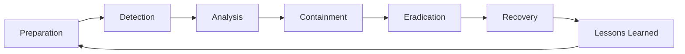
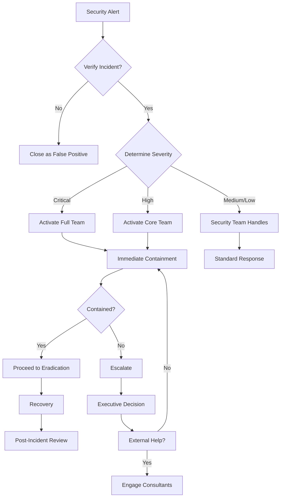

# YTEMPIRE Security Incident Response Playbook

**Version**: 1.0  
**Date**: January 2025  
**Classification**: Internal - Security Team  
**Owner**: Security Engineering Team  
**Last Drill**: [To be scheduled]

---

## Table of Contents

1. [Incident Response Overview](#1-incident-response-overview)
2. [Incident Classification](#2-incident-classification)
3. [Response Team Structure](#3-response-team-structure)
4. [Detection & Analysis](#4-detection--analysis)
5. [Containment Strategies](#5-containment-strategies)
6. [Eradication & Recovery](#6-eradication--recovery)
7. [Post-Incident Activities](#7-post-incident-activities)
8. [Incident Response Scenarios](#8-incident-response-scenarios)
9. [Appendix: Quick Reference](#9-appendix-quick-reference)

---

## 1. Incident Response Overview

### 1.1 Incident Response Lifecycle



### 1.2 Response Time Objectives

| Severity | Detection Time | Response Time | Containment Time | Recovery Time |
|----------|----------------|---------------|------------------|---------------|
| Critical | < 5 minutes | < 15 minutes | < 30 minutes | < 4 hours |
| High | < 15 minutes | < 30 minutes | < 2 hours | < 8 hours |
| Medium | < 1 hour | < 2 hours | < 4 hours | < 24 hours |
| Low | < 4 hours | < 8 hours | < 24 hours | < 48 hours |

### 1.3 Communication Protocol

```yaml
communication_matrix:
  critical:
    immediate:
      - CTO
      - Platform Ops Lead
      - Security Team (all)
    within_15_min:
      - CEO
      - Legal Counsel
      - PR Team (if external)
    within_1_hour:
      - All Engineering Leads
      - Customer Success (if impact)
      
  high:
    immediate:
      - Platform Ops Lead
      - Security Team Lead
    within_30_min:
      - CTO
      - Affected Team Leads
      
  medium:
    immediate:
      - Security Team
    within_2_hours:
      - Platform Ops Lead
      
  low:
    next_business_day:
      - Security Team
      - Relevant Team Lead
```

---

## 2. Incident Classification

### 2.1 Incident Severity Matrix

```python
class IncidentSeverity:
    """Incident severity classification"""
    
    CRITICAL = {
        "definition": "Complete system compromise or data breach",
        "examples": [
            "Ransomware attack",
            "Customer data exfiltration",
            "Complete service outage due to security",
            "Admin account compromise"
        ],
        "indicators": [
            "Unauthorized admin access",
            "Mass data download",
            "System encryption",
            "Service unavailable"
        ]
    }
    
    HIGH = {
        "definition": "Significant security impact with potential breach",
        "examples": [
            "SQL injection discovered",
            "API key compromise",
            "Suspicious privileged access",
            "DDoS attack"
        ],
        "indicators": [
            "Unusual database queries",
            "Spike in API errors",
            "Failed authentication surge",
            "Traffic anomalies"
        ]
    }
    
    MEDIUM = {
        "definition": "Security issue requiring immediate attention",
        "examples": [
            "Vulnerability scan findings",
            "Phishing attempt",
            "Misconfiguration detected",
            "Unusual user behavior"
        ],
        "indicators": [
            "Security scan alerts",
            "User reports",
            "Log anomalies",
            "Policy violations"
        ]
    }
    
    LOW = {
        "definition": "Security issue with minimal immediate impact",
        "examples": [
            "Failed security scan",
            "Minor policy violation",
            "Security update available",
            "Documentation issue"
        ],
        "indicators": [
            "Automated alerts",
            "Routine scan results",
            "Update notifications",
            "Best practice deviations"
        ]
    }
```

### 2.2 Incident Types

```yaml
incident_categories:
  unauthorized_access:
    description: "Unauthorized system or data access"
    initial_response:
      - Disable compromised accounts
      - Reset credentials
      - Review access logs
      - Check for persistence
      
  data_breach:
    description: "Confirmed or suspected data exfiltration"
    initial_response:
      - Identify affected data
      - Block egress points
      - Preserve evidence
      - Notify legal/compliance
      
  malware:
    description: "Malicious software detected"
    initial_response:
      - Isolate affected systems
      - Capture memory/disk image
      - Identify malware type
      - Check for spread
      
  denial_of_service:
    description: "Service availability attack"
    initial_response:
      - Enable DDoS protection
      - Scale resources
      - Block attack sources
      - Implement rate limiting
      
  insider_threat:
    description: "Malicious insider activity"
    initial_response:
      - Suspend user access
      - Preserve all logs
      - Legal consultation
      - Covert monitoring
```

---

## 3. Response Team Structure

### 3.1 Incident Response Team Roles

```yaml
incident_response_team:
  incident_commander:
    responsibilities:
      - Overall incident coordination
      - Strategic decisions
      - External communication
      - Resource allocation
    assigned_to: Platform Ops Lead or CTO
    
  security_lead:
    responsibilities:
      - Technical investigation
      - Forensics coordination
      - Threat analysis
      - Mitigation strategy
    assigned_to: Senior Security Engineer
    
  technical_lead:
    responsibilities:
      - System changes
      - Service restoration
      - Performance monitoring
      - Infrastructure modifications
    assigned_to: Senior DevOps Engineer
    
  communications_lead:
    responsibilities:
      - Internal updates
      - Customer communication
      - Status page updates
      - Media relations
    assigned_to: Designated Manager
    
  scribe:
    responsibilities:
      - Document timeline
      - Record decisions
      - Track actions
      - Prepare report
    assigned_to: Available Team Member
```

### 3.2 On-Call Rotation

```python
# incident_response/on_call.py
class OnCallRotation:
    """Security on-call management"""
    
    def __init__(self):
        self.rotation_schedule = {
            "primary": {
                "week_1": "security_engineer_1",
                "week_2": "security_engineer_2",
                "week_3": "security_engineer_1",
                "week_4": "security_engineer_2"
            },
            "secondary": {
                "week_1": "platform_ops_lead",
                "week_2": "platform_ops_lead",
                "week_3": "platform_ops_lead",
                "week_4": "platform_ops_lead"
            },
            "escalation": "cto"
        }
        
    def get_current_on_call(self) -> Dict[str, str]:
        """Get current on-call personnel"""
        
        current_week = self._get_current_week()
        
        return {
            "primary": self.rotation_schedule["primary"][f"week_{current_week}"],
            "secondary": self.rotation_schedule["secondary"][f"week_{current_week}"],
            "escalation": self.rotation_schedule["escalation"],
            "contact_info": self._get_contact_info(current_week)
        }
    
    def _get_current_week(self) -> int:
        """Calculate current week of month"""
        return (datetime.now().day - 1) // 7 + 1
    
    def _get_contact_info(self, week: int) -> Dict:
        """Get contact information for on-call"""
        # Returns phone and Slack handles
        return CONTACT_DATABASE[week]

---

## 4. Detection & Analysis

### 4.1 Detection Sources

```yaml
detection_sources:
  automated:
    security_tools:
      - Prometheus alerts (threshold-based)
      - ELK Stack (pattern matching)
      - Falco (runtime security)
      - OSSEC (host intrusion)
      - Custom security monitors
      
    monitoring_alerts:
      - API rate limit violations
      - Authentication failures
      - Unusual data access patterns
      - Network anomalies
      - Resource consumption spikes
      
  manual:
    reports:
      - User security reports
      - Bug bounty submissions
      - Internal team observations
      - Third-party notifications
      - Vendor security advisories
      
    reviews:
      - Log analysis findings
      - Security audit results
      - Penetration test reports
      - Code review discoveries
```

### 4.2 Initial Analysis Checklist

```python
# incident_response/analysis.py
class IncidentAnalysis:
    """Initial incident analysis procedures"""
    
    def analyze_incident(self, alert_data: Dict) -> Dict:
        """Perform initial incident analysis"""
        
        analysis_results = {
            "incident_id": generate_incident_id(),
            "timestamp": datetime.utcnow(),
            "initial_classification": self._classify_incident(alert_data),
            "affected_systems": [],
            "indicators_of_compromise": [],
            "timeline": []
        }
        
        # 1. Verify the incident
        if not self._verify_incident(alert_data):
            analysis_results["status"] = "false_positive"
            return analysis_results
        
        # 2. Determine scope
        analysis_results["scope"] = self._determine_scope(alert_data)
        
        # 3. Identify affected systems
        analysis_results["affected_systems"] = self._identify_affected_systems(alert_data)
        
        # 4. Collect indicators
        analysis_results["indicators_of_compromise"] = self._collect_iocs(alert_data)
        
        # 5. Build timeline
        analysis_results["timeline"] = self._build_timeline(alert_data)
        
        # 6. Assess impact
        analysis_results["impact_assessment"] = self._assess_impact(analysis_results)
        
        return analysis_results
    
    def _collect_iocs(self, alert_data: Dict) -> List[Dict]:
        """Collect Indicators of Compromise"""
        
        iocs = []
        
        # IP addresses
        suspicious_ips = self._extract_suspicious_ips(alert_data)
        for ip in suspicious_ips:
            iocs.append({
                "type": "ip",
                "value": ip,
                "context": "Suspicious connection",
                "first_seen": self._get_first_seen(ip)
            })
        
        # File hashes
        malicious_files = self._extract_file_hashes(alert_data)
        for file_hash in malicious_files:
            iocs.append({
                "type": "file_hash",
                "value": file_hash,
                "hash_type": "sha256",
                "context": "Potential malware"
            })
        
        # URLs
        malicious_urls = self._extract_urls(alert_data)
        for url in malicious_urls:
            iocs.append({
                "type": "url",
                "value": url,
                "context": "Command and control"
            })
        
        return iocs
```

### 4.3 Evidence Collection

```bash
#!/bin/bash
# evidence_collection.sh - Automated evidence collection

INCIDENT_ID=$1
EVIDENCE_DIR="/secure/incidents/${INCIDENT_ID}/evidence"
mkdir -p $EVIDENCE_DIR

echo "Starting evidence collection for incident ${INCIDENT_ID}"

# 1. System information
echo "Collecting system information..."
date > $EVIDENCE_DIR/collection_start.txt
uname -a > $EVIDENCE_DIR/system_info.txt
ps aux > $EVIDENCE_DIR/processes.txt
netstat -tulpn > $EVIDENCE_DIR/network_connections.txt
ss -tulpn >> $EVIDENCE_DIR/network_connections.txt

# 2. Memory dump (if critical)
if [ "$2" == "critical" ]; then
    echo "Capturing memory dump..."
    sudo dd if=/dev/mem of=$EVIDENCE_DIR/memory.dump bs=1M
fi

# 3. Log collection
echo "Collecting logs..."
tar czf $EVIDENCE_DIR/logs_system.tar.gz /var/log/
docker logs $(docker ps -q) > $EVIDENCE_DIR/docker_logs.txt 2>&1
kubectl logs --all-namespaces --since=24h > $EVIDENCE_DIR/k8s_logs.txt 2>&1

# 4. Network capture
echo "Starting network capture (30 seconds)..."
timeout 30 tcpdump -i any -w $EVIDENCE_DIR/network_capture.pcap

# 5. Configuration snapshots
echo "Capturing configurations..."
iptables-save > $EVIDENCE_DIR/iptables_rules.txt
docker inspect $(docker ps -q) > $EVIDENCE_DIR/docker_configs.json
kubectl get all --all-namespaces -o yaml > $EVIDENCE_DIR/k8s_resources.yaml

# 6. Hash all evidence
echo "Hashing evidence files..."
find $EVIDENCE_DIR -type f -exec sha256sum {} \; > $EVIDENCE_DIR/evidence_hashes.txt

echo "Evidence collection complete"
date > $EVIDENCE_DIR/collection_end.txt
```

---

## 5. Containment Strategies

### 5.1 Short-term Containment

```python
# incident_response/containment.py
class ContainmentStrategies:
    """Immediate containment actions"""
    
    def __init__(self):
        self.containment_actions = {
            "network": self.contain_network_threat,
            "account": self.contain_account_compromise,
            "malware": self.contain_malware,
            "data": self.contain_data_breach,
            "api": self.contain_api_abuse
        }
    
    async def contain_network_threat(self, threat_data: Dict) -> Dict:
        """Network-level containment"""
        
        actions_taken = []
        
        # 1. Block malicious IPs
        for ip in threat_data.get("malicious_ips", []):
            await self._block_ip_address(ip)
            actions_taken.append(f"Blocked IP: {ip}")
        
        # 2. Update WAF rules
        waf_rule = self._generate_waf_rule(threat_data)
        await self._deploy_waf_rule(waf_rule)
        actions_taken.append(f"Deployed WAF rule: {waf_rule['id']}")
        
        # 3. Isolate affected segments
        if threat_data.get("severity") == "critical":
            affected_subnet = threat_data.get("affected_subnet")
            await self._isolate_network_segment(affected_subnet)
            actions_taken.append(f"Isolated subnet: {affected_subnet}")
        
        return {
            "containment_type": "network",
            "actions": actions_taken,
            "timestamp": datetime.utcnow(),
            "status": "contained"
        }
    
    async def contain_account_compromise(self, account_data: Dict) -> Dict:
        """Account compromise containment"""
        
        user_id = account_data["user_id"]
        actions_taken = []
        
        # 1. Disable account immediately
        await self._disable_user_account(user_id)
        actions_taken.append(f"Disabled account: {user_id}")
        
        # 2. Revoke all sessions
        sessions_revoked = await self._revoke_all_sessions(user_id)
        actions_taken.append(f"Revoked {sessions_revoked} sessions")
        
        # 3. Reset API keys
        await self._reset_api_keys(user_id)
        actions_taken.append("Reset all API keys")
        
        # 4. Check for persistence
        persistence_found = await self._check_persistence_mechanisms(user_id)
        if persistence_found:
            await self._remove_persistence(user_id)
            actions_taken.append("Removed persistence mechanisms")
        
        return {
            "containment_type": "account",
            "user_id": user_id,
            "actions": actions_taken,
            "timestamp": datetime.utcnow()
        }
```

### 5.2 Long-term Containment

```yaml
long_term_containment:
  system_hardening:
    - Apply security patches
    - Update firewall rules
    - Implement additional monitoring
    - Deploy honeypots
    - Enable advanced threat detection
    
  access_control:
    - Review all privileged accounts
    - Implement temporary MFA requirement
    - Reduce permission scopes
    - Enable just-in-time access
    - Audit third-party access
    
  network_segmentation:
    - Isolate critical systems
    - Implement micro-segmentation
    - Deploy internal firewalls
    - Enable east-west inspection
    - Create quarantine networks
    
  enhanced_monitoring:
    - Deploy EDR solutions
    - Increase log retention
    - Enable detailed auditing
    - Implement behavior analytics
    - Create custom alerts
```

---

## 6. Eradication & Recovery

### 6.1 Eradication Procedures

```python
# incident_response/eradication.py
class IncidentEradication:
    """Remove threats and vulnerabilities"""
    
    async def eradicate_threat(self, incident_data: Dict) -> Dict:
        """Complete threat eradication"""
        
        eradication_results = {
            "incident_id": incident_data["incident_id"],
            "actions": [],
            "verification": {}
        }
        
        # 1. Remove malware/backdoors
        if incident_data.get("malware_present"):
            removal_result = await self._remove_malware(incident_data)
            eradication_results["actions"].append(removal_result)
        
        # 2. Patch vulnerabilities
        vulnerabilities = incident_data.get("exploited_vulnerabilities", [])
        for vuln in vulnerabilities:
            patch_result = await self._patch_vulnerability(vuln)
            eradication_results["actions"].append(patch_result)
        
        # 3. Update security controls
        control_updates = await self._update_security_controls(incident_data)
        eradication_results["actions"].extend(control_updates)
        
        # 4. Verify eradication
        eradication_results["verification"] = await self._verify_eradication(incident_data)
        
        return eradication_results
    
    async def _remove_malware(self, incident_data: Dict) -> Dict:
        """Remove malware from systems"""
        
        affected_systems = incident_data["affected_systems"]
        removal_actions = []
        
        for system in affected_systems:
            # Isolate system
            await self._isolate_system(system)
            
            # Run malware removal
            scan_result = await self._run_malware_scan(system, mode="aggressive")
            
            if scan_result["threats_found"]:
                # Clean infected files
                await self._clean_infected_files(system, scan_result["threats"])
                
                # Remove persistence
                await self._remove_persistence_mechanisms(system)
                
                # Rebuild if necessary
                if scan_result["severity"] == "critical":
                    await self._mark_for_rebuild(system)
            
            removal_actions.append({
                "system": system,
                "threats_removed": scan_result["threats_found"],
                "action": "cleaned" if scan_result["threats_found"] else "verified_clean"
            })
        
        return {
            "action": "malware_removal",
            "systems_cleaned": len(affected_systems),
            "details": removal_actions
        }
```

### 6.2 Recovery Procedures

```yaml
recovery_procedures:
  validation_steps:
    - Verify threat elimination
    - Confirm system integrity
    - Validate security controls
    - Test functionality
    - Monitor for recurrence
    
  restoration_order:
    priority_1:  # Critical services
      - Authentication services
      - Database servers
      - API gateways
      - Load balancers
      
    priority_2:  # Core services
      - Application servers
      - Worker nodes
      - Cache servers
      - Message queues
      
    priority_3:  # Supporting services
      - Monitoring systems
      - Logging infrastructure
      - Development environments
      - Backup systems
      
  recovery_checklist:
    pre_restoration:
      - [ ] Verify clean backups
      - [ ] Test in isolated environment
      - [ ] Confirm eradication complete
      - [ ] Update security controls
      
    during_restoration:
      - [ ] Monitor for anomalies
      - [ ] Validate each service
      - [ ] Check integrations
      - [ ] Verify performance
      
    post_restoration:
      - [ ] Full functionality test
      - [ ] Security validation scan
      - [ ] Performance benchmarks
      - [ ] User acceptance testing
```

### 6.3 Recovery Automation

```bash
#!/bin/bash
# recovery_automation.sh - Automated recovery procedures

INCIDENT_ID=$1
RECOVERY_LOG="/var/log/incident_recovery_${INCIDENT_ID}.log"

log() {
    echo "[$(date +'%Y-%m-%d %H:%M:%S')] $1" | tee -a $RECOVERY_LOG
}

log "Starting recovery for incident ${INCIDENT_ID}"

# 1. Validate system state
log "Validating system state..."
/opt/ytempire/scripts/validate_system_state.sh
if [ $? -ne 0 ]; then
    log "ERROR: System validation failed. Manual intervention required."
    exit 1
fi

# 2. Restore from clean backup
log "Restoring from verified clean backup..."
BACKUP_ID=$(cat /secure/incidents/${INCIDENT_ID}/clean_backup_id.txt)
/opt/ytempire/scripts/restore_backup.sh $BACKUP_ID

# 3. Apply security patches
log "Applying security patches..."
/opt/ytempire/scripts/apply_security_patches.sh

# 4. Restart services in order
log "Restarting services..."
for service in postgres redis api-gateway app-server worker-nodes; do
    log "Starting ${service}..."
    systemctl start ytempire-${service}
    sleep 10
    
    # Verify service health
    if ! systemctl is-active ytempire-${service}; then
        log "ERROR: ${service} failed to start"
        exit 1
    fi
done

# 5. Run security validation
log "Running security validation..."
/opt/ytempire/scripts/security_validation.sh

# 6. Enable monitoring
log "Re-enabling monitoring..."
/opt/ytempire/scripts/enable_monitoring.sh enhanced

log "Recovery complete for incident ${INCIDENT_ID}"
```

---

## 7. Post-Incident Activities

### 7.1 Post-Incident Report Template

```markdown
# Incident Report: [INCIDENT_ID]

## Executive Summary
- **Incident ID**: INC-2025-001
- **Severity**: Critical/High/Medium/Low
- **Duration**: [Start Time] - [End Time]
- **Impact**: [Brief description of impact]
- **Root Cause**: [Brief description]

## Timeline
| Time | Event | Action Taken | Owner |
|------|-------|--------------|-------|
| T+0 | Initial detection | Alert triggered | Security Monitor |
| T+5min | Incident declared | Response team activated | Security Lead |
| T+15min | Containment started | [Specific actions] | DevOps Team |
| ... | ... | ... | ... |

## Technical Details
### What Happened
[Detailed technical description]

### Root Cause Analysis
[5 Whys or similar analysis]

### Indicators of Compromise
- IP Addresses: [List]
- File Hashes: [List]
- URLs: [List]
- User Accounts: [List]

## Response Actions
### Immediate Actions
1. [Action 1]
2. [Action 2]

### Long-term Fixes
1. [Fix 1]
2. [Fix 2]

## Lessons Learned
### What Went Well
- [Item 1]
- [Item 2]

### What Could Be Improved
- [Item 1]
- [Item 2]

## Action Items
| Action | Owner | Due Date | Status |
|--------|-------|----------|--------|
| [Action 1] | [Name] | [Date] | Open |
| [Action 2] | [Name] | [Date] | Open |

## Appendices
- A. Full Technical Timeline
- B. Log Excerpts
- C. Network Diagrams
- D. Evidence Chain of Custody
```

### 7.2 Lessons Learned Process

```python
# incident_response/lessons_learned.py
class LessonsLearned:
    """Post-incident improvement process"""
    
    def conduct_review(self, incident_id: str) -> Dict:
        """Conduct lessons learned review"""
        
        review_data = {
            "incident_id": incident_id,
            "review_date": datetime.utcnow(),
            "participants": self._get_participants(incident_id),
            "findings": {},
            "improvements": []
        }
        
        # 1. Collect feedback
        feedback = self._collect_feedback(incident_id)
        
        # 2. Analyze response effectiveness
        effectiveness = self._analyze_effectiveness(incident_id)
        
        # 3. Identify gaps
        gaps = self._identify_gaps(incident_id, effectiveness)
        
        # 4. Generate improvements
        improvements = self._generate_improvements(gaps, feedback)
        
        # 5. Create action plan
        action_plan = self._create_action_plan(improvements)
        
        review_data.update({
            "feedback": feedback,
            "effectiveness": effectiveness,
            "gaps": gaps,
            "improvements": improvements,
            "action_plan": action_plan
        })
        
        return review_data
    
    def _analyze_effectiveness(self, incident_id: str) -> Dict:
        """Analyze incident response effectiveness"""
        
        metrics = self._get_incident_metrics(incident_id)
        
        return {
            "detection_time": {
                "actual": metrics["detection_time"],
                "target": metrics["detection_target"],
                "met": metrics["detection_time"] <= metrics["detection_target"]
            },
            "response_time": {
                "actual": metrics["response_time"],
                "target": metrics["response_target"],
                "met": metrics["response_time"] <= metrics["response_target"]
            },
            "containment_effectiveness": {
                "prevented_spread": metrics["spread_prevented"],
                "data_protected": metrics["data_loss_prevented"],
                "service_impact": metrics["service_downtime"]
            },
            "communication": {
                "stakeholder_updates": metrics["update_frequency"],
                "clarity_score": metrics["communication_clarity"],
                "timeliness": metrics["communication_timeliness"]
            }
        }
```

### 7.3 Continuous Improvement

```yaml
continuous_improvement:
  process_updates:
    - Review and update runbooks
    - Refine detection rules
    - Improve automation scripts
    - Update contact lists
    - Enhance monitoring
    
  training_needs:
    technical:
      - New attack techniques
      - Tool proficiency
      - Forensics skills
      - Cloud security
      
    soft_skills:
      - Incident communication
      - Stress management
      - Decision making
      - Team coordination
      
  tool_improvements:
    - Automate manual processes
    - Integrate security tools
    - Improve alerting accuracy
    - Enhance evidence collection
    - Streamline reporting
    
  metrics_tracking:
    - Mean time to detect (MTTD)
    - Mean time to respond (MTTR)
    - Mean time to contain (MTTC)
    - Mean time to recover (MTTR)
    - False positive rate
    - Incident recurrence rate
```

---

## 8. Incident Response Scenarios

### 8.1 Scenario: Ransomware Attack

```yaml
ransomware_playbook:
  detection:
    indicators:
      - File encryption activities
      - Ransom note files created
      - Unusual file extensions
      - Mass file modifications
      - Network scanning activity
      
  immediate_actions:
    1_minute:
      - Identify affected systems
      - Initiate network isolation
      - Alert incident commander
      
    5_minutes:
      - Complete network isolation
      - Stop all backup jobs
      - Preserve evidence
      - Activate response team
      
    15_minutes:
      - Assess spread and impact
      - Identify ransomware variant
      - Check backup integrity
      - Begin containment
      
  containment:
    - Disconnect affected systems
    - Block C2 communications
    - Isolate network segments
    - Disable file shares
    - Implement emergency firewall rules
    
  recovery:
    - Verify clean backups exist
    - Rebuild affected systems
    - Restore from backup
    - Validate system integrity
    - Monitor for reinfection
```

### 8.2 Scenario: Data Breach

```python
# scenarios/data_breach_response.py
class DataBreachResponse:
    """Data breach specific response procedures"""
    
    async def respond_to_data_breach(self, breach_alert: Dict) -> None:
        """Coordinate data breach response"""
        
        # 1. Immediate containment
        await self._contain_data_breach(breach_alert)
        
        # 2. Assess scope
        scope = await self._assess_breach_scope(breach_alert)
        
        # 3. Legal obligations
        if scope["records_affected"] > 0:
            await self._initiate_legal_response(scope)
        
        # 4. Preserve evidence
        await self._preserve_breach_evidence(breach_alert)
        
        # 5. Customer notification
        if self._requires_notification(scope):
            await self._prepare_breach_notification(scope)
    
    async def _assess_breach_scope(self, breach_alert: Dict) -> Dict:
        """Determine breach scope and impact"""
        
        scope_analysis = {
            "data_types": [],
            "records_affected": 0,
            "users_affected": [],
            "time_window": {},
            "exfiltration_confirmed": False
        }
        
        # Query logs for data access
        access_logs = await self._query_data_access_logs(
            start_time=breach_alert["first_seen"],
            end_time=breach_alert["detected_at"],
            suspicious_only=True
        )
        
        # Analyze what was accessed
        for log_entry in access_logs:
            data_type = self._classify_data_type(log_entry)
            scope_analysis["data_types"].append(data_type)
            scope_analysis["records_affected"] += log_entry["record_count"]
            scope_analysis["users_affected"].extend(log_entry["affected_users"])
        
        # Check for data exfiltration
        scope_analysis["exfiltration_confirmed"] = await self._check_data_exfiltration(
            breach_alert["source_ip"],
            breach_alert["timeframe"]
        )
        
        return scope_analysis
```

### 8.3 Scenario: Insider Threat

```yaml
insider_threat_playbook:
  detection_indicators:
    - Unusual access patterns
    - After-hours activity
    - Large data downloads
    - Accessing unrelated systems
    - Privilege escalation attempts
    - Policy circumvention
    
  response_approach:
    covert_phase:
      - Silent monitoring
      - Evidence collection
      - Pattern analysis
      - Legal consultation
      - HR coordination
      
    confrontation_phase:
      - Disable access
      - Secure devices
      - Conduct interview
      - Preserve evidence
      - Legal action
      
  special_considerations:
    - Maintain confidentiality
    - Coordinate with legal/HR
    - Preserve chain of custody
    - Document everything
    - Consider law enforcement
```

---

## 9. Appendix: Quick Reference

### 9.1 Emergency Contacts

```yaml
emergency_contacts:
  internal:
    cto:
      name: "[CTO Name]"
      phone: "+1-XXX-XXX-XXXX"
      slack: "@cto-handle"
      
    platform_ops_lead:
      name: "[Lead Name]"
      phone: "+1-XXX-XXX-XXXX"
      slack: "@ops-lead"
      
    security_team:
      primary: "+1-XXX-XXX-XXXX"
      secondary: "+1-XXX-XXX-XXXX"
      slack: "#security-incidents"
      
  external:
    aws_support:
      phone: "+1-800-XXX-XXXX"
      account_id: "XXXXXXXXXXXX"
      
    cloudflare_support:
      phone: "+1-XXX-XXX-XXXX"
      account_id: "XXXXXXXXXXXX"
      
    legal_counsel:
      firm: "[Law Firm Name]"
      contact: "[Lawyer Name]"
      phone: "+1-XXX-XXX-XXXX"
      
    cyber_insurance:
      company: "[Insurance Company]"
      policy: "XXXXXXXXXXXX"
      phone: "+1-XXX-XXX-XXXX"
```

### 9.2 Quick Commands

```bash
# Block IP immediately
sudo iptables -A INPUT -s <IP_ADDRESS> -j DROP

# Disable user account
kubectl exec -it api-pod -- python manage.py disable_user <USER_ID>

# Capture network traffic
tcpdump -i any -w /tmp/capture_$(date +%s).pcap host <IP_ADDRESS>

# Check for persistence
find / -name "*.sh" -mtime -7 -exec ls -la {} \;
crontab -l
systemctl list-units --type=service --state=active

# Emergency API shutdown
kubectl scale deployment api-deployment --replicas=0

# Force password reset for all users
kubectl exec -it api-pod -- python manage.py force_password_reset --all

# Export logs for investigation
docker logs <CONTAINER_ID> > /tmp/container_logs_$(date +%s).txt
journalctl --since "1 hour ago" > /tmp/system_logs_$(date +%s).txt
```

### 9.3 Decision Flow Chart



---

## Remember: Speed and Accuracy Matter

In incident response:
1. **Don't Panic** - Follow the playbook
2. **Communicate Often** - Over-communication is better
3. **Document Everything** - You'll need it later
4. **Preserve Evidence** - Think before you act
5. **Learn and Improve** - Every incident teaches us

**On-Call Phone**: Keep it charged and with you!

---

*This playbook is a living document. Update it after every incident and drill.*