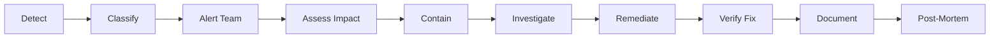

# 5. OPERATIONAL PROCEDURES

## 5.1 Incident Response

### Playbook & Procedures

#### Incident Classification
```yaml
Severity Levels:
  P0 - Critical:
    Definition: Complete platform outage or data breach
    Response Time: <15 minutes
    Escalation: Immediate to CTO
    Examples:
      - Platform completely down
      - Data breach detected
      - Payment system failure
      - YouTube API banned
  
  P1 - High:
    Definition: Major feature broken affecting many users
    Response Time: <30 minutes
    Escalation: Platform Ops Lead
    Examples:
      - Video generation failing
      - Authentication broken
      - Database performance critical
      - SSL certificate expired
  
  P2 - Medium:
    Definition: Feature degraded but workarounds exist
    Response Time: <2 hours
    Escalation: Team Lead
    Examples:
      - Slow dashboard loading
      - Individual channel errors
      - Non-critical API failures
      - Monitoring alerts failing
  
  P3 - Low:
    Definition: Minor issues with minimal impact
    Response Time: <8 hours
    Escalation: None required
    Examples:
      - UI cosmetic issues
      - Documentation errors
      - Non-critical log errors
      - Performance optimization
```

#### Incident Response Workflow


#### Initial Response Checklist
```markdown
## Incident Response Checklist

### DETECT (0-5 minutes)
- [ ] Alert received via monitoring/user report
- [ ] Acknowledge incident in PagerDuty/Slack
- [ ] Open incident channel #incident-YYYYMMDD-HHMM

### CLASSIFY (5-10 minutes)
- [ ] Determine severity (P0/P1/P2/P3)
- [ ] Identify affected systems
- [ ] Estimate user impact
- [ ] Assign Incident Commander

### CONTAIN (10-30 minutes)
- [ ] Implement immediate mitigation
- [ ] Isolate affected systems if needed
- [ ] Enable emergency mode if required
- [ ] Preserve evidence for investigation

### INVESTIGATE (30-60 minutes)
- [ ] Review logs and metrics
- [ ] Identify root cause
- [ ] Document timeline
- [ ] Develop fix strategy

### REMEDIATE (varies)
- [ ] Implement fix
- [ ] Test in staging if possible
- [ ] Deploy to production
- [ ] Monitor for stability

### VERIFY (post-fix)
- [ ] Confirm issue resolved
- [ ] Check for side effects
- [ ] Monitor for recurrence
- [ ] Update status page

### DOCUMENT (within 24 hours)
- [ ] Complete incident report
- [ ] Update runbooks
- [ ] Schedule post-mortem
- [ ] Communicate to stakeholders
```

### Team Roles & Escalation

#### Incident Response Team Structure
```yaml
Incident Commander (IC):
  Role: Overall incident coordination
  Responsibilities:
    - Decision making authority
    - Resource allocation
    - External communication
    - Status updates
  Assigned: Platform Ops Lead or delegate

Technical Lead:
  Role: Technical investigation and fix
  Responsibilities:
    - Root cause analysis
    - Solution implementation
    - Technical decisions
    - System changes
  Assigned: Security Engineer or DevOps

Communications Lead:
  Role: Stakeholder communication
  Responsibilities:
    - User notifications
    - Status page updates
    - Slack updates
    - Executive briefing
  Assigned: Team Lead or Product Owner

Scribe:
  Role: Documentation
  Responsibilities:
    - Timeline tracking
    - Decision logging
    - Action items
    - Report preparation
  Assigned: Available team member
```

#### Escalation Matrix
```yaml
Escalation Path:
  Level 1 (0-15 min):
    - On-call engineer
    - Automated alerts
    - Slack notification
  
  Level 2 (15-30 min):
    - Platform Ops Lead
    - Security Engineer
    - Relevant Team Lead
  
  Level 3 (30-60 min):
    - CTO/Technical Director
    - VP of AI (if AI-related)
    - Product Owner
  
  Level 4 (60+ min):
    - CEO/Founder
    - Legal (if data breach)
    - PR (if public impact)
```

### Communication Protocols

#### Internal Communication
```yaml
Slack Channels:
  #incident-response: Active incident coordination
  #platform-ops: Team coordination
  #engineering: General updates
  #executive: Executive briefing

Update Frequency:
  P0: Every 15 minutes
  P1: Every 30 minutes
  P2: Every hour
  P3: As needed

Template:
  "UPDATE [Time]: 
   - Current Status: [Investigating/Mitigating/Resolved]
   - Impact: [# users affected, services down]
   - Actions: [What we're doing]
   - ETA: [Expected resolution time]"
```

#### External Communication
```markdown
## Customer Communication Templates

### Initial Notification
Subject: [Service Name] - Experiencing Issues

We are currently experiencing issues with [affected service]. 
Our team is actively investigating and working on a resolution.

Impact: [Brief description of impact]
Started: [Time]
Updates: [Status page URL]

### Resolution Notification
Subject: [Service Name] - Issue Resolved

The issue affecting [service] has been resolved.

Duration: [Start time] to [End time]
Impact: [What was affected]
Resolution: [Brief description]

We apologize for any inconvenience.
```

### Post-Incident Reviews

#### Post-Mortem Template
```markdown
# Incident Post-Mortem: [INCIDENT-ID]

## Incident Summary
- **Date**: [YYYY-MM-DD]
- **Duration**: [X hours Y minutes]
- **Severity**: [P0/P1/P2/P3]
- **Impact**: [Users/revenue affected]

## Timeline
- **HH:MM** - Initial alert received
- **HH:MM** - Incident declared
- **HH:MM** - Root cause identified
- **HH:MM** - Fix deployed
- **HH:MM** - Incident resolved

## Root Cause Analysis

### What Happened
[Detailed description of the incident]

### Why It Happened
[Root cause analysis using 5 Whys]

### How It Was Fixed
[Description of the fix]

## Impact Analysis
- **Users Affected**: [Number]
- **Revenue Impact**: [$Amount]
- **Data Loss**: [Yes/No]
- **SLA Impact**: [Uptime percentage]

## Lessons Learned

### What Went Well
- [List positive aspects]

### What Could Be Improved
- [List areas for improvement]

## Action Items
| Action | Owner | Due Date | Status |
|--------|-------|----------|--------|
| [Action 1] | [Name] | [Date] | [Status] |

## Prevention Measures
[Long-term fixes to prevent recurrence]
```

---

## 5.2 Change Management

### Change Request Process

#### Change Categories
```yaml
Standard Changes:
  Definition: Pre-approved, low-risk, routine
  Approval: Automatic
  Examples:
    - Security patches
    - Log rotation
    - Certificate renewal
    - Backup verification
  
Normal Changes:
  Definition: Planned changes with standard risk
  Approval: Team Lead
  Lead Time: 24 hours
  Examples:
    - Feature deployments
    - Configuration updates
    - Database schema changes
    - Service upgrades

Emergency Changes:
  Definition: Urgent fixes for critical issues
  Approval: Verbal (documented later)
  Lead Time: Immediate
  Examples:
    - Security patches for zero-days
    - Critical bug fixes
    - Service restoration
    - Data corruption fixes
```

#### Change Request Template
```markdown
## Change Request #[CR-NUMBER]

### Change Details
- **Requestor**: [Name]
- **Date**: [YYYY-MM-DD]
- **Category**: [Standard/Normal/Emergency]
- **Priority**: [High/Medium/Low]

### Description
[What is being changed and why]

### Impact Analysis
- **Systems Affected**: [List systems]
- **User Impact**: [None/Minimal/Significant]
- **Downtime Required**: [Yes/No - Duration]
- **Risk Level**: [Low/Medium/High]

### Implementation Plan
1. [Step 1]
2. [Step 2]
3. [Step 3]

### Rollback Plan
[How to revert if issues occur]

### Testing Plan
- [ ] Unit tests pass
- [ ] Integration tests pass
- [ ] Staging validation
- [ ] User acceptance testing

### Approvals
- [ ] Technical Lead
- [ ] Security Review
- [ ] Platform Ops Lead
```

---

## 5.3 Backup & Recovery

### Backup Strategy

#### Backup Configuration
```yaml
Database Backups:
  Type: PostgreSQL pg_dump
  Schedule:
    Full: Daily at 2:00 AM
    Incremental: Every 6 hours
  Retention:
    Daily: 7 days
    Weekly: 4 weeks
    Monthly: 3 months
  Storage:
    Primary: External Drive 1 (8TB)
    Secondary: External Drive 2 (8TB)
    Offsite: Weekly to cloud storage

Application Backups:
  Type: File system snapshot
  Schedule: Daily at 3:00 AM
  Includes:
    - Application code
    - Configuration files
    - Docker volumes
    - Media assets
  Excludes:
    - Log files
    - Temporary files
    - Cache directories

Backup Verification:
  Automated Test: Weekly restore test
  Manual Test: Monthly full recovery drill
  Integrity Check: Daily SHA-256 verification
```

#### Backup Script
```bash
#!/bin/bash
# /opt/backup/backup.sh

# Configuration
BACKUP_DIR="/backup/$(date +%Y%m%d)"
DB_NAME="ytempire"
APP_DIR="/opt/ytempire"

# Create backup directory
mkdir -p $BACKUP_DIR

echo "Starting backup at $(date)"

# 1. Database backup
echo "Backing up database..."
docker exec postgres pg_dump -U ytempire $DB_NAME | \
    gzip > $BACKUP_DIR/database.sql.gz

# 2. Application backup
echo "Backing up application..."
tar -czf $BACKUP_DIR/application.tar.gz \
    --exclude='*.log' \
    --exclude='__pycache__' \
    --exclude='node_modules' \
    $APP_DIR

# 3. Media files backup
echo "Backing up media files..."
tar -czf $BACKUP_DIR/media.tar.gz /opt/ytempire/media

# 4. Configuration backup
echo "Backing up configuration..."
tar -czf $BACKUP_DIR/config.tar.gz \
    /etc/ytempire \
    /opt/ytempire/.env

# 5. Generate checksums
echo "Generating checksums..."
cd $BACKUP_DIR
sha256sum *.gz > checksums.txt

# 6. Sync to secondary drive
echo "Syncing to secondary drive..."
rsync -av $BACKUP_DIR /mnt/backup2/

# 7. Encrypt for offsite storage
echo "Encrypting for offsite..."
tar -czf - $BACKUP_DIR | \
    openssl enc -aes-256-cbc -salt -pass file:/etc/backup.key \
    > /tmp/backup_$(date +%Y%m%d).tar.gz.enc

# 8. Verify backup
echo "Verifying backup..."
if tar -tzf $BACKUP_DIR/database.sql.gz > /dev/null 2>&1; then
    echo "Backup successful"
    # Send success notification
    curl -X POST https://hooks.slack.com/services/xxx \
        -d '{"text":"Backup completed successfully"}'
else
    echo "Backup verification failed!"
    # Send failure alert
    curl -X POST https://hooks.slack.com/services/xxx \
        -d '{"text":"CRITICAL: Backup failed!"}'
    exit 1
fi

echo "Backup completed at $(date)"
```

### Recovery Procedures

#### Recovery Time Objectives
```yaml
RTO/RPO Targets:
  Database:
    RPO: 6 hours (max data loss)
    RTO: 1 hour (recovery time)
  
  Application:
    RPO: 24 hours
    RTO: 30 minutes
  
  Media Files:
    RPO: 24 hours
    RTO: 2 hours
  
  Full System:
    RPO: 6 hours
    RTO: 4 hours
```

#### Recovery Script
```bash
#!/bin/bash
# /opt/recovery/recover.sh

echo "=== System Recovery Procedure ==="
echo "WARNING: This will restore from backup. Current data will be lost."
read -p "Continue? (yes/no): " confirm

if [ "$confirm" != "yes" ]; then
    echo "Recovery cancelled"
    exit 1
fi

# 1. Stop services
echo "Stopping all services..."
docker-compose down

# 2. Select backup
echo "Available backups:"
ls -la /backup/
read -p "Enter backup date (YYYYMMDD): " BACKUP_DATE
BACKUP_DIR="/backup/$BACKUP_DATE"

# 3. Verify backup integrity
echo "Verifying backup integrity..."
cd $BACKUP_DIR
sha256sum -c checksums.txt || exit 1

# 4. Restore database
echo "Restoring database..."
docker-compose up -d postgres
sleep 10
gunzip < $BACKUP_DIR/database.sql.gz | \
    docker exec -i postgres psql -U ytempire

# 5. Restore application
echo "Restoring application files..."
tar -xzf $BACKUP_DIR/application.tar.gz -C /

# 6. Restore media
echo "Restoring media files..."
tar -xzf $BACKUP_DIR/media.tar.gz -C /

# 7. Restore configuration
echo "Restoring configuration..."
tar -xzf $BACKUP_DIR/config.tar.gz -C /

# 8. Start services
echo "Starting all services..."
docker-compose up -d

# 9. Verify services
echo "Verifying services..."
sleep 30
docker-compose ps
curl -f http://localhost:8000/health || echo "WARNING: Health check failed"

# 10. Post-recovery validation
echo "Running post-recovery checks..."
docker exec postgres psql -U ytempire -c "SELECT COUNT(*) FROM users;"
docker exec backend python manage.py check

echo "Recovery completed at $(date)"
echo "Please verify all services and data integrity"
```

---

## 5.4 Maintenance Windows

### Scheduled Maintenance

#### Maintenance Schedule
```yaml
Regular Maintenance:
  Daily:
    Time: 2:00 AM - 2:30 AM
    Activities:
      - Log rotation
      - Backup verification
      - Security scans
      - Metrics cleanup
    Impact: None (automated)
  
  Weekly:
    Time: Sunday 10:00 PM - 11:00 PM
    Activities:
      - System updates
      - Docker image updates
      - Certificate checks
      - Performance optimization
    Impact: Minimal (rolling updates)
  
  Monthly:
    Time: First Sunday 10:00 PM - 12:00 AM
    Activities:
      - Security patches
      - Database maintenance
      - Full backup test
      - Infrastructure updates
    Impact: 30 minutes downtime

Emergency Maintenance:
  Trigger: Critical security patches
  Notice: Minimum 2 hours (if possible)
  Communication: All channels
  Duration: As needed
```

#### Maintenance Procedures

##### Pre-Maintenance Checklist
```markdown
## Pre-Maintenance Checklist

### T-24 Hours
- [ ] Send maintenance notification to users
- [ ] Update status page with scheduled maintenance
- [ ] Prepare rollback plan
- [ ] Test changes in staging

### T-2 Hours
- [ ] Final reminder to users
- [ ] Verify backup completed
- [ ] Team members on standby
- [ ] Review maintenance plan

### T-30 Minutes
- [ ] Enable maintenance mode
- [ ] Stop accepting new jobs
- [ ] Complete running processes
- [ ] Final backup snapshot

### T-0 (Start)
- [ ] Post "Maintenance in Progress" banner
- [ ] Begin maintenance activities
- [ ] Monitor system status
- [ ] Document all changes
```

##### Maintenance Mode Script
```bash
#!/bin/bash
# /opt/maintenance/maintenance_mode.sh

ACTION=$1  # enable or disable

if [ "$ACTION" = "enable" ]; then
    echo "Enabling maintenance mode..."
    
    # 1. Update nginx to serve maintenance page
    cp /etc/nginx/maintenance.conf /etc/nginx/sites-enabled/default
    nginx -s reload
    
    # 2. Stop job processing
    docker exec backend celery control shutdown
    
    # 3. Wait for active jobs to complete
    echo "Waiting for active jobs to complete..."
    while [ $(docker exec redis redis-cli llen celery) -gt 0 ]; do
        echo "Jobs remaining: $(docker exec redis redis-cli llen celery)"
        sleep 5
    done
    
    # 4. Create maintenance flag
    touch /opt/ytempire/.maintenance
    
    echo "Maintenance mode enabled"
    
elif [ "$ACTION" = "disable" ]; then
    echo "Disabling maintenance mode..."
    
    # 1. Restore normal nginx config
    cp /etc/nginx/production.conf /etc/nginx/sites-enabled/default
    nginx -s reload
    
    # 2. Remove maintenance flag
    rm -f /opt/ytempire/.maintenance
    
    # 3. Restart job processing
    docker-compose restart backend
    
    # 4. Verify services
    sleep 10
    curl -f http://localhost:8000/health
    
    echo "Maintenance mode disabled"
else
    echo "Usage: $0 [enable|disable]"
    exit 1
fi
```

##### Maintenance Page HTML
```html
<!-- /var/www/maintenance/index.html -->
<!DOCTYPE html>
<html lang="en">
<head>
    <meta charset="UTF-8">
    <meta name="viewport" content="width=device-width, initial-scale=1.0">
    <title>YTEMPIRE - Scheduled Maintenance</title>
    <style>
        body {
            font-family: -apple-system, BlinkMacSystemFont, "Segoe UI", Roboto, sans-serif;
            background: linear-gradient(135deg, #667eea 0%, #764ba2 100%);
            color: white;
            display: flex;
            justify-content: center;
            align-items: center;
            height: 100vh;
            margin: 0;
        }
        .container {
            text-align: center;
            padding: 2rem;
            background: rgba(255, 255, 255, 0.1);
            border-radius: 10px;
            backdrop-filter: blur(10px);
        }
        h1 { font-size: 2.5rem; margin-bottom: 1rem; }
        p { font-size: 1.2rem; margin-bottom: 2rem; }
        .progress {
            width: 300px;
            height: 4px;
            background: rgba(255, 255, 255, 0.3);
            border-radius: 2px;
            overflow: hidden;
            margin: 0 auto;
        }
        .progress-bar {
            height: 100%;
            background: white;
            animation: progress 2s ease-in-out infinite;
        }
        @keyframes progress {
            0% { width: 0%; }
            50% { width: 100%; }
            100% { width: 0%; }
        }
    </style>
</head>
<body>
    <div class="container">
        <h1>🛠️ Scheduled Maintenance</h1>
        <p>We're improving YTEMPIRE to serve you better.</p>
        <p>Expected completion: <strong id="eta">11:00 PM</strong></p>
        <div class="progress">
            <div class="progress-bar"></div>
        </div>
        <p style="margin-top: 2rem; font-size: 0.9rem;">
            For updates, check our status page or Twitter @ytempire
        </p>
    </div>
    <script>
        // Auto-refresh every 30 seconds
        setTimeout(() => location.reload(), 30000);
    </script>
</body>
</html>
```

### Monitoring During Maintenance

#### Key Metrics to Watch
```yaml
During Maintenance:
  System Metrics:
    - CPU usage < 80%
    - Memory usage < 90%
    - Disk I/O < 80%
    - Network latency < 100ms
  
  Application Metrics:
    - Error rate < 1%
    - Response time < 2s
    - Queue depth < 100
    - Active connections < 1000
  
  Post-Maintenance:
    - All services healthy
    - No error spike
    - Performance baseline restored
    - User activity normal
```

#### Rollback Procedures
```bash
#!/bin/bash
# /opt/maintenance/rollback.sh

echo "=== EMERGENCY ROLLBACK ==="
echo "Rolling back to previous version..."

# 1. Stop current deployment
docker-compose down

# 2. Restore previous images
docker tag ytempire:backup ytempire:latest
docker tag ytempire-frontend:backup ytempire-frontend:latest

# 3. Restore previous configuration
cp /opt/backup/last_known_good/.env /opt/ytempire/.env

# 4. Restore database if needed
read -p "Restore database? (yes/no): " restore_db
if [ "$restore_db" = "yes" ]; then
    gunzip < /backup/pre_maintenance.sql.gz | \
        docker exec -i postgres psql -U ytempire
fi

# 5. Start services with previous version
docker-compose up -d

# 6. Verify rollback
sleep 30
curl -f http://localhost:8000/health || exit 1

echo "Rollback completed. Please verify all services."

# 7. Notify team
curl -X POST https://hooks.slack.com/services/xxx \
    -d '{"text":"ALERT: Emergency rollback completed"}'
```

### Communication Templates

#### Maintenance Notifications
```markdown
## 24-Hour Notice
Subject: Scheduled Maintenance - [Date] [Time]

Dear YTEMPIRE Users,

We will be performing scheduled maintenance on [Date] from [Start Time] to [End Time] [Timezone].

**What to Expect:**
- Platform will be temporarily unavailable
- Video generation will be paused
- Scheduled videos will be queued and processed after maintenance

**Duration:** Approximately [X] minutes

We apologize for any inconvenience. For real-time updates, visit our status page.

---

## 2-Hour Reminder
Subject: Reminder: Maintenance Starting in 2 Hours

Quick reminder that scheduled maintenance begins at [Time].

Please save any work in progress. Videos currently processing will complete before maintenance begins.

---

## Maintenance Complete
Subject: Maintenance Complete - All Services Restored

Good news! Our scheduled maintenance is complete and all services are fully operational.

**What we did:**
- [Brief summary of improvements]

Thank you for your patience. If you experience any issues, please contact support.
```

---

## Document Metadata

**Version**: 2.0  
**Last Updated**: January 2025  
**Owner**: Platform Operations Lead  
**Review Cycle**: Monthly  
**Distribution**: Operations Team, On-Call Engineers  

**Critical Updates**:
- Consolidated incident response procedures
- Added detailed backup/recovery scripts
- Included maintenance window procedures
- Created rollback procedures
- Added communication templates

**Training Requirements**:
- All engineers must complete incident response training
- Practice recovery procedures monthly
- Maintenance procedures walkthrough quarterly