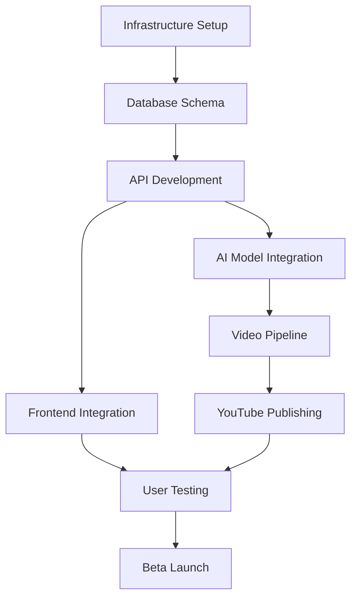

# 6. PROJECT MANAGEMENT

## 6.1 12-Week MVP Timeline

### Master Timeline Overview

#### Phase Structure
```yaml
MVP Development: 12 Weeks Total
  Phase 1 - Foundation (Weeks 1-2):
    Focus: Infrastructure setup, team onboarding
    Deliverable: Development environment ready
  
  Phase 2 - Core Development (Weeks 3-6):
    Focus: API, database, basic UI
    Deliverable: Basic working system
  
  Phase 3 - Integration (Weeks 7-9):
    Focus: External APIs, automation, security
    Deliverable: Fully integrated platform
  
  Phase 4 - Polish & Test (Weeks 10-11):
    Focus: Testing, optimization, documentation
    Deliverable: Production-ready system
  
  Phase 5 - Launch (Week 12):
    Focus: Beta user onboarding, monitoring
    Deliverable: 50 users successfully onboarded
```

### Week-by-Week Breakdown

#### Weeks 1-2: Foundation
```yaml
Week 1:
  Monday-Tuesday:
    - Team onboarding completed
    - Development environments setup
    - Server hardware installation
    - Network configuration
  
  Wednesday-Thursday:
    - Docker/Docker Compose setup
    - Database initialization
    - Git repositories created
    - CI/CD pipeline skeleton
  
  Friday:
    - First team retrospective
    - Infrastructure validation
    - Security baseline established
    - Documentation started

Week 2:
  Monday-Tuesday:
    - API framework setup
    - Database schema design
    - Frontend project initialization
    - Authentication system design
  
  Wednesday-Thursday:
    - Basic CRUD operations
    - JWT implementation
    - UI component library setup
    - Monitoring stack deployment
  
  Friday:
    - Integration testing
    - First deployment test
    - Sprint 1 review
    - Sprint 2 planning
```

#### Weeks 3-4: Core API Development
```yaml
Week 3:
  Deliverables:
    - User management API complete
    - Channel management endpoints
    - Basic video metadata system
    - Frontend authentication flow
  
  Key Milestones:
    - First successful API call
    - Database migrations working
    - Authentication functioning
    - Basic UI navigable

Week 4:
  Deliverables:
    - YouTube API integration started
    - Video generation pipeline design
    - Dashboard layout complete
    - Cost tracking system design
  
  Key Milestones:
    - YouTube OAuth working
    - First video metadata stored
    - Dashboard displaying data
    - Deployment pipeline active
```

#### Weeks 5-6: External Integrations
```yaml
Week 5:
  Deliverables:
    - OpenAI GPT-4 integration
    - ElevenLabs voice synthesis
    - Stripe payment integration
    - Analytics data pipeline
  
  Key Milestones:
    - First AI-generated script
    - First synthesized voice
    - Payment flow tested
    - Metrics flowing to dashboard

Week 6:
  Deliverables:
    - N8N automation workflows
    - Video compilation pipeline
    - Thumbnail generation system
    - Real-time updates via WebSocket
  
  Key Milestones:
    - End-to-end video generation
    - First automated workflow
    - Real-time dashboard updates
    - 70% backend complete
```

#### Weeks 7-8: Security & Quality
```yaml
Week 7:
  Security Focus:
    - HTTPS implementation
    - Security scanning automation
    - Penetration testing
    - Secrets management
    - Backup encryption
  
  Deliverables:
    - SSL certificates active
    - All endpoints secured
    - Security alerts configured
    - Incident response plan

Week 8:
  Quality Focus:
    - Test automation suite
    - Performance optimization
    - Error handling improvement
    - Documentation completion
  
  Deliverables:
    - 500+ tests running
    - <3 second page loads
    - Error reporting system
    - API documentation
```

#### Weeks 9-10: Integration & Polish
```yaml
Week 9:
  Full Integration:
    - All systems connected
    - End-to-end testing
    - Load testing (50 users)
    - Disaster recovery test
  
  Deliverables:
    - Complete user journey working
    - 50 concurrent users supported
    - Recovery procedures tested
    - Monitoring dashboards complete

Week 10:
  Polish & Optimization:
    - UI/UX improvements
    - Performance tuning
    - Bug fixes
    - Documentation finalization
  
  Deliverables:
    - All P0/P1 bugs fixed
    - <$3/video cost achieved
    - User guide completed
    - Training materials ready
```

#### Weeks 11-12: Pre-Launch & Launch
```yaml
Week 11:
  Pre-Launch Preparation:
    - Final security audit
    - Load testing at scale
    - Backup/recovery validation
    - Team training
  
  Deliverables:
    - Security sign-off
    - 95% uptime achieved
    - All procedures documented
    - Support process ready

Week 12:
  Beta Launch:
    - First 10 users onboarded (Monday)
    - Monitoring and fixes (Tuesday-Wednesday)
    - Next 20 users (Thursday)
    - Final 20 users (Friday)
  
  Success Criteria:
    - 50 beta users active
    - <5% error rate
    - <1 hour total downtime
    - NPS score >7
```

---

## 6.2 Sprint Structure & Ceremonies

### Sprint Configuration

#### Sprint Cadence
```yaml
Sprint Structure:
  Duration: 2 weeks
  Start Day: Monday
  End Day: Friday (week 2)
  
  Total Sprints: 6
    Sprint 1: Weeks 1-2 (Foundation)
    Sprint 2: Weeks 3-4 (Core Development)
    Sprint 3: Weeks 5-6 (Integrations)
    Sprint 4: Weeks 7-8 (Security & Quality)
    Sprint 5: Weeks 9-10 (Polish)
    Sprint 6: Weeks 11-12 (Launch)
```

### Ceremony Schedule

#### Daily Ceremonies
```yaml
Daily Standup:
  Time: 9:00 AM
  Duration: 15 minutes
  Format: Round-robin
  Questions:
    - What did you complete yesterday?
    - What will you work on today?
    - Any blockers?
  
  Team Order:
    1. Platform Ops (DevOps, Security, QA)
    2. Backend Team
    3. Frontend Team
    4. AI/ML Team
    5. Data Team
```

#### Sprint Ceremonies
```yaml
Sprint Planning (Monday Week 1):
  Duration: 4 hours
  Agenda:
    - 30 min: Sprint goal setting
    - 90 min: Story breakdown
    - 60 min: Task estimation
    - 30 min: Capacity planning
    - 30 min: Commitment
  
Sprint Review (Friday Week 2):
  Duration: 2 hours
  Agenda:
    - 15 min: Sprint metrics
    - 75 min: Demo (15 min per team)
    - 30 min: Stakeholder feedback
  
Sprint Retrospective (Friday Week 2):
  Duration: 1 hour
  Format:
    - What went well?
    - What could improve?
    - Action items
```

#### Weekly Ceremonies
```yaml
Technical Sync (Wednesdays):
  Time: 2:00 PM
  Duration: 1 hour
  Purpose: Cross-team technical coordination
  
Security Review (Mondays):
  Time: 2:00 PM
  Duration: 30 minutes
  Purpose: Security findings and updates

Architecture Review (Fridays):
  Time: 3:00 PM
  Duration: 1 hour
  Purpose: Design decisions and technical debt
```

### Sprint Metrics

#### Velocity Tracking
```yaml
Sprint Velocity Targets:
  Sprint 1: 80 story points (ramp-up)
  Sprint 2: 120 story points
  Sprint 3: 150 story points
  Sprint 4: 150 story points
  Sprint 5: 120 story points
  Sprint 6: 80 story points (launch focus)

Team Allocation:
  Backend: 35% of points
  Frontend: 25% of points
  Platform Ops: 20% of points
  AI/ML: 15% of points
  Data: 5% of points
```

#### Definition of Done
```markdown
## Definition of Done Checklist

### Code Complete
- [ ] Feature implements all acceptance criteria
- [ ] Code follows style guidelines
- [ ] No commented-out code
- [ ] No TODO comments for this feature

### Testing
- [ ] Unit tests written and passing (70% coverage)
- [ ] Integration tests passing
- [ ] Manual testing completed
- [ ] No regression issues

### Security
- [ ] Security review completed
- [ ] No vulnerable dependencies
- [ ] Input validation implemented
- [ ] Authentication/authorization checked

### Documentation
- [ ] API documentation updated
- [ ] README updated if needed
- [ ] Inline comments for complex logic
- [ ] User guide updated if user-facing

### Review
- [ ] Code review completed
- [ ] PR approved by 2 reviewers
- [ ] All review comments addressed
- [ ] Merged to main branch

### Deployment
- [ ] Deployed to staging
- [ ] Smoke tests passing
- [ ] Monitoring configured
- [ ] Feature flag configured (if applicable)
```

---

## 6.3 Dependencies & Milestones

### Critical Path Dependencies

#### Week 1-2 Dependencies
```yaml
Critical Dependencies:
  Hardware Delivery:
    Required By: Day 1
    Impact If Delayed: Blocks everything
    Mitigation: Use cloud temporarily
  
  Team Onboarding:
    Required By: Day 2
    Impact If Delayed: Reduced velocity
    Mitigation: Async onboarding
  
  Network Setup:
    Required By: Day 3
    Impact If Delayed: No external access
    Mitigation: Use 4G backup
```

#### Cross-Team Dependencies


#### Dependency Matrix
```yaml
Backend Team Needs:
  From Platform Ops:
    - Docker environment (Week 1)
    - Database access (Week 1)
    - CI/CD pipeline (Week 2)
    - SSL certificates (Week 7)
  
  From Data Team:
    - Schema design (Week 2)
    - Analytics pipeline (Week 5)

Frontend Team Needs:
  From Backend:
    - API contracts (Week 2)
    - Authentication endpoints (Week 3)
    - WebSocket support (Week 6)
  
  From Platform Ops:
    - Build pipeline (Week 2)
    - CDN setup (Week 5)

AI Team Needs:
  From Platform Ops:
    - GPU drivers (Week 1)
    - Container registry (Week 2)
  
  From Backend:
    - Queue system (Week 4)
    - API endpoints (Week 5)

Security Needs From All:
  - Code for review (Ongoing)
  - Deployment notifications (Ongoing)
  - Architecture decisions (Weekly)
```

### Major Milestones

#### Technical Milestones
```yaml
Week 2:
  ☑ Development environment operational
  ☑ All team members productive
  ☑ First code committed

Week 4:
  ☑ Basic API functional
  ☑ Database operational
  ☑ UI framework in place

Week 6:
  ☑ External APIs integrated
  ☑ First video generated
  ☑ Payment processing tested

Week 8:
  ☑ Security audit passed
  ☑ 70% test coverage achieved
  ☑ Performance targets met

Week 10:
  ☑ Full platform integration complete
  ☑ All features functional
  ☑ Documentation complete

Week 12:
  ☑ 50 beta users onboarded
  ☑ 95% uptime achieved
  ☑ <$3/video cost verified
```

#### Business Milestones
```yaml
Week 4: First Demo
  - Show working authentication
  - Display basic dashboard
  - Demonstrate API calls

Week 8: Investor Demo
  - Complete video generation flow
  - Show cost metrics
  - Demonstrate automation

Week 12: Beta Launch
  - 50 active users
  - 250 channels created
  - 500+ videos generated
  - First revenue generated
```

---

## 6.4 Success Metrics

### MVP Success Criteria

#### Quantitative Metrics
```yaml
Technical Metrics:
  Uptime: ≥95% over launch week
  Response Time: <2 seconds for dashboard
  Error Rate: <1% of API calls
  Video Generation: <5 minutes per video
  Cost Per Video: <$3.00 all-in
  Test Coverage: ≥70% for critical paths

User Metrics:
  Beta Users: 50 active users
  Channels: 5 channels per user average
  Videos: 1+ video per day per user
  Engagement: >60% daily active users
  
Business Metrics:
  Revenue: $500/user/month average
  Costs: <$150/user/month
  NPS Score: >7.0
  Support Tickets: <5 per day
```

#### Qualitative Metrics
```yaml
User Satisfaction:
  - Onboarding completion rate >90%
  - Feature satisfaction >4.0/5.0
  - Would recommend to others >70%
  
Team Performance:
  - Sprint commitments met >80%
  - Team morale positive
  - Knowledge sharing active
  
Code Quality:
  - Technical debt manageable
  - Architecture scalable
  - Security posture strong
```

### Tracking & Reporting

#### Dashboard Metrics
```yaml
Real-Time Dashboard:
  System Health:
    - Service status (all green/yellow/red)
    - Current error rate
    - Active users
    - Videos processing
  
  Daily Metrics:
    - New users
    - Videos generated
    - Revenue generated
    - Infrastructure cost
    - Error count
  
  Weekly Trends:
    - User growth
    - Video volume
    - Cost per video
    - Revenue per user
    - System performance
```

#### Reporting Schedule
```yaml
Daily Reports (9 AM):
  To: All Teams
  Content:
    - Previous day metrics
    - Overnight issues
    - Today's priorities
  
Weekly Reports (Monday):
  To: Leadership Team
  Content:
    - Week performance
    - Sprint progress
    - Risk assessment
    - Next week plan

Sprint Reports (Bi-weekly):
  To: All Stakeholders
  Content:
    - Sprint achievements
    - Velocity analysis
    - Upcoming milestones
    - Blockers and risks
```

### Risk Management

#### Risk Register
```yaml
High Priority Risks:
  API Rate Limits:
    Probability: Medium
    Impact: High
    Mitigation: Implement caching, queue management
  
  Hardware Failure:
    Probability: Low
    Impact: Critical
    Mitigation: Daily backups, spare components
  
  Key Person Dependency:
    Probability: Medium
    Impact: High
    Mitigation: Documentation, pair programming

Medium Priority Risks:
  Cost Overrun:
    Probability: Medium
    Impact: Medium
    Mitigation: Daily cost monitoring, alerts
  
  Security Incident:
    Probability: Low
    Impact: High
    Mitigation: Security monitoring, incident response plan
```

#### Risk Response Plan
```markdown
## Risk Response Procedures

### When Risk Materializes:
1. **Identify** - Confirm risk has occurred
2. **Assess** - Determine actual impact
3. **Respond** - Execute mitigation plan
4. **Communicate** - Inform stakeholders
5. **Document** - Record lessons learned

### Escalation Triggers:
- Any risk with Critical impact
- Multiple High risks occurring
- Mitigation plan failing
- Timeline impact >2 days
- Budget impact >$10,000
```

---

## Document Metadata

**Version**: 2.0  
**Last Updated**: January 2025  
**Owner**: Product Owner & CTO  
**Review Cycle**: Weekly during MVP  
**Distribution**: All Teams and Stakeholders  

**Critical Success Factors**:
- Clear weekly deliverables
- Daily cross-team communication
- Rapid issue resolution
- Continuous stakeholder alignment
- Flexible response to changes