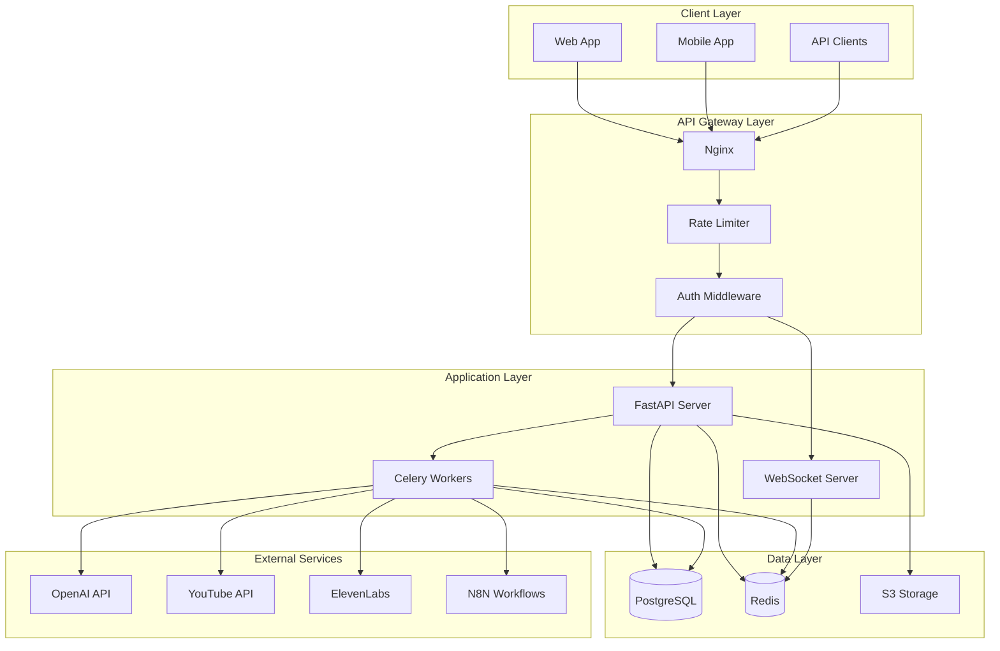

# API Service Architecture

**Owner**: Backend Team Lead  
**Created**: Day 1  
**Version**: 1.0

---

## System Architecture Overview



---

## API Design Principles

### 1. RESTful Design
- Resource-based URLs
- HTTP methods for actions (GET, POST, PUT, DELETE)
- Stateless communication
- JSON request/response format

### 2. Versioning Strategy
- URL versioning: `/api/v1/`, `/api/v2/`
- Backward compatibility for 2 versions
- Deprecation notices in headers
- Migration guides for breaking changes

### 3. Authentication & Authorization
- JWT-based authentication
- OAuth 2.0 for third-party services
- Role-based access control (RBAC)
- API key authentication for programmatic access

### 4. Error Handling
```json
{
  "error": {
    "code": "VALIDATION_ERROR",
    "message": "Invalid request parameters",
    "details": {
      "field": "email",
      "reason": "Invalid email format"
    },
    "timestamp": "2024-01-01T10:00:00Z",
    "request_id": "req_123456"
  }
}
```

### 5. Rate Limiting
- Default: 100 requests/minute per user
- Video generation: 10 requests/hour
- YouTube operations: 50 requests/hour
- Configurable per subscription tier

---

## API Endpoints Structure

### Authentication Domain
```
POST   /api/v1/auth/register          # User registration
POST   /api/v1/auth/login            # User login
POST   /api/v1/auth/logout           # User logout
POST   /api/v1/auth/refresh          # Token refresh
POST   /api/v1/auth/password-reset   # Password reset
GET    /api/v1/auth/verify-email     # Email verification
```

### User Domain
```
GET    /api/v1/users/me              # Current user profile
PATCH  /api/v1/users/me              # Update profile
GET    /api/v1/users/me/usage        # Usage statistics
DELETE /api/v1/users/me              # Delete account
GET    /api/v1/users/                # List users (admin)
```

### Channel Domain
```
GET    /api/v1/channels/             # List user's channels
POST   /api/v1/channels/             # Create channel
GET    /api/v1/channels/{id}         # Get channel details
PATCH  /api/v1/channels/{id}         # Update channel
DELETE /api/v1/channels/{id}         # Delete channel
POST   /api/v1/channels/{id}/connect # Connect to YouTube
GET    /api/v1/channels/{id}/stats   # Channel statistics
```

### Video Domain
```
POST   /api/v1/videos/generate       # Generate video
GET    /api/v1/videos/               # List videos
GET    /api/v1/videos/{id}           # Get video details
PATCH  /api/v1/videos/{id}           # Update video
DELETE /api/v1/videos/{id}           # Delete video
POST   /api/v1/videos/{id}/publish   # Publish to YouTube
POST   /api/v1/videos/{id}/retry     # Retry generation
GET    /api/v1/videos/{id}/cost      # Cost breakdown
```

### Analytics Domain
```
GET    /api/v1/analytics/dashboard   # Dashboard metrics
GET    /api/v1/analytics/channels/{id} # Channel analytics
GET    /api/v1/analytics/videos/{id}   # Video analytics
GET    /api/v1/analytics/costs         # Cost analytics
GET    /api/v1/analytics/trends        # Trend analysis
GET    /api/v1/analytics/reports/weekly # Weekly report
```

### Webhook Domain
```
POST   /api/v1/webhooks/n8n/video-complete  # N8N video completion
POST   /api/v1/webhooks/n8n/youtube-upload  # N8N upload trigger
POST   /api/v1/webhooks/n8n/cost-alert      # Cost threshold alert
POST   /api/v1/webhooks/youtube/callback    # YouTube callbacks
POST   /api/v1/webhooks/stripe/payment      # Payment webhooks
```

---

## Data Models

### User Model
```python
{
    "id": "integer",
    "email": "string",
    "username": "string",
    "full_name": "string",
    "subscription_tier": "enum[free, pro, enterprise]",
    "channels_limit": "integer",
    "daily_video_limit": "integer",
    "total_spent": "float",
    "monthly_budget": "float",
    "is_beta_user": "boolean",
    "created_at": "datetime",
    "updated_at": "datetime"
}
```

### Channel Model
```python
{
    "id": "integer",
    "user_id": "integer",
    "name": "string",
    "youtube_channel_id": "string",
    "niche": "string",
    "description": "string",
    "is_active": "boolean",
    "auto_publish": "boolean",
    "publish_schedule": "json",
    "total_videos": "integer",
    "total_cost": "float",
    "created_at": "datetime"
}
```

### Video Model
```python
{
    "id": "integer",
    "channel_id": "integer",
    "title": "string",
    "description": "string",
    "tags": "array[string]",
    "status": "enum[queued, processing, ready, published, failed]",
    "youtube_video_id": "string",
    "duration": "integer",
    "total_cost": "float",
    "quality_score": "float",
    "created_at": "datetime",
    "published_at": "datetime"
}
```

---

## Request/Response Examples

### Authentication Request
```http
POST /api/v1/auth/login
Content-Type: application/json

{
    "email": "user@example.com",
    "password": "securepassword123"
}
```

Response:
```json
{
    "access_token": "eyJhbGciOiJIUzI1NiIs...",
    "refresh_token": "eyJhbGciOiJIUzI1NiIs...",
    "token_type": "bearer",
    "expires_in": 3600,
    "user": {
        "id": 1,
        "email": "user@example.com",
        "username": "user123",
        "subscription_tier": "pro"
    }
}
```

### Video Generation Request
```http
POST /api/v1/videos/generate
Authorization: Bearer <token>
Content-Type: application/json

{
    "channel_id": 1,
    "topic": "Top 10 AI Tools for 2024",
    "style": "educational",
    "target_duration": 600,
    "keywords": ["AI", "tools", "productivity"],
    "auto_publish": true,
    "schedule_time": "2024-01-02T10:00:00Z"
}
```

Response:
```json
{
    "video_id": 123,
    "status": "queued",
    "estimated_completion": "2024-01-01T10:05:00Z",
    "estimated_cost": 2.45,
    "task_id": "celery-task-uuid-123",
    "message": "Video generation queued successfully"
}
```

---

## Security Considerations

### Authentication Security
- JWT tokens with 1-hour expiration
- Refresh tokens with 7-day expiration
- Token blacklisting on logout
- Rate limiting on auth endpoints

### Data Protection
- TLS 1.3 for all communications
- Encryption at rest for sensitive data
- PII data isolation
- Regular security audits

### API Security
- Input validation on all endpoints
- SQL injection prevention
- XSS protection
- CSRF tokens for state-changing operations

### Third-party Integration Security
- Secure credential storage (environment variables)
- OAuth 2.0 for YouTube
- API key rotation policy
- Webhook signature verification

---

## Performance Targets

### Response Time SLAs
- Authentication: <100ms
- CRUD Operations: <50ms
- Analytics Queries: <200ms
- Video Generation (queue): <150ms
- Search Operations: <300ms

### Throughput Targets
- 1000 requests/second overall
- 100 concurrent video generations
- 500 concurrent users
- 10,000 WebSocket connections

### Caching Strategy
- Redis for session data (15 min TTL)
- API response caching (5 min TTL)
- Static asset caching (24 hours)
- Database query caching (10 min TTL)

---

## Monitoring & Observability

### Metrics to Track
- Request rate by endpoint
- Response time percentiles (p50, p95, p99)
- Error rate by type
- Active users
- API usage by subscription tier

### Logging Strategy
- Structured JSON logging
- Request/response logging (excluding sensitive data)
- Error stack traces
- Performance timing logs
- Audit logs for sensitive operations

### Health Checks
```
GET /health          # Basic health check
GET /health/ready    # Readiness probe
GET /health/live     # Liveness probe
GET /metrics         # Prometheus metrics
```

---

## API Development Guidelines

### Code Organization
```
app/
├── api/
│   └── v1/
│       ├── endpoints/
│       ├── deps.py
│       └── api.py
├── core/
│   ├── config.py
│   ├── security.py
│   └── database.py
├── models/
├── schemas/
├── services/
└── main.py
```

### Testing Requirements
- Unit tests for all endpoints
- Integration tests for workflows
- Load testing for performance
- Security testing for vulnerabilities
- Contract testing for API compatibility

### Documentation Standards
- OpenAPI 3.0 specification
- Request/response examples
- Error code documentation
- Change logs for versions
- Migration guides

---

*Last Updated: Day 1*  
*Next Review: Day 5*