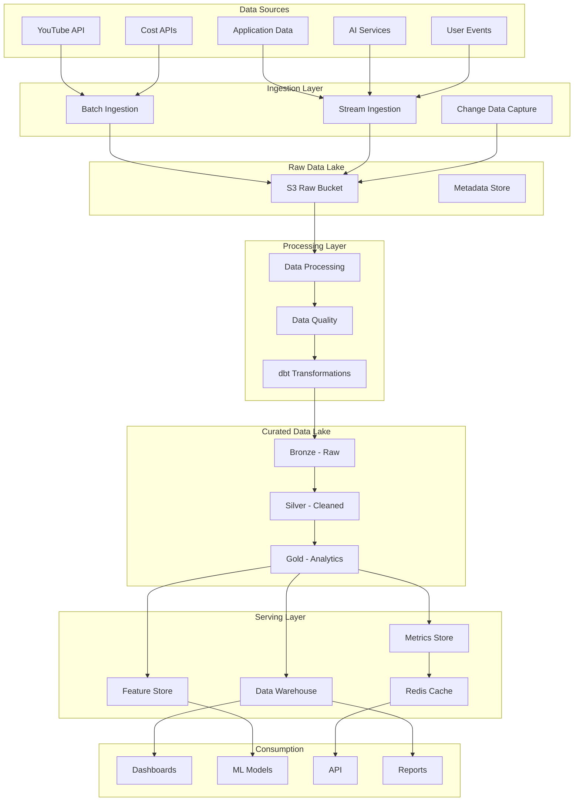

# Data Lake Architecture & Metrics Framework

**Owner**: Data Engineer & Analytics Engineer  
**Created**: Day 1  
**Version**: 1.0

---

## Data Lake Architecture Overview



---

## Data Layers Architecture

### 1. Bronze Layer (Raw Data)
- **Purpose**: Store raw, unprocessed data
- **Format**: Parquet files
- **Partitioning**: By date (YYYY/MM/DD)
- **Retention**: 90 days
- **Schema**: Minimal validation

### 2. Silver Layer (Cleaned Data)
- **Purpose**: Cleaned, standardized data
- **Format**: Delta tables
- **Processing**: Deduplication, type casting, null handling
- **Partitioning**: By date and source
- **Retention**: 180 days

### 3. Gold Layer (Business Data)
- **Purpose**: Business-ready aggregations
- **Format**: Optimized tables
- **Processing**: Aggregations, joins, calculations
- **Partitioning**: By business dimensions
- **Retention**: 2 years

---

## Core Business Metrics

### User Metrics
```yaml
Daily Active Users (DAU):
  definition: Unique users who performed any action
  calculation: COUNT(DISTINCT user_id) WHERE action_date = TODAY
  source: user_events
  frequency: Real-time

Monthly Active Users (MAU):
  definition: Unique users active in last 30 days
  calculation: COUNT(DISTINCT user_id) WHERE action_date >= TODAY - 30
  source: user_events
  frequency: Daily

User Retention Rate:
  definition: Users who return after first use
  calculation: (returning_users / total_users) * 100
  cohort: Weekly
  source: user_analytics
```

### Video Metrics
```yaml
Video Generation Rate:
  definition: Videos generated per day
  calculation: COUNT(video_id) WHERE status = 'completed'
  source: videos
  frequency: Hourly

Average Generation Time:
  definition: Time from request to completion
  calculation: AVG(completed_at - created_at)
  source: videos
  frequency: Real-time

Video Success Rate:
  definition: Successfully published videos
  calculation: (published / generated) * 100
  source: videos
  frequency: Daily

Average Views per Video:
  definition: Mean views across all videos
  calculation: AVG(view_count)
  source: video_analytics
  frequency: Hourly
```

### Cost Metrics
```yaml
Cost per Video:
  definition: Total cost to generate one video
  calculation: SUM(component_costs)
  components:
    - script_cost
    - voice_cost
    - image_cost
    - processing_cost
  source: cost_tracking
  threshold: $3.00
  alert: >$2.50

Daily Burn Rate:
  definition: Total costs per day
  calculation: SUM(total_cost) WHERE date = TODAY
  source: cost_tracking
  frequency: Real-time

Cost Efficiency:
  definition: Revenue per dollar spent
  calculation: revenue / total_cost
  source: financial_metrics
  target: >3.0
```

### Revenue Metrics
```yaml
Monthly Recurring Revenue (MRR):
  definition: Predictable monthly revenue
  calculation: SUM(subscription_amount)
  source: subscriptions
  frequency: Daily

Average Revenue Per User (ARPU):
  definition: Revenue divided by users
  calculation: total_revenue / active_users
  source: financial_metrics
  frequency: Monthly

Customer Lifetime Value (CLV):
  definition: Total value of customer
  calculation: ARPU * average_customer_lifetime_months
  source: user_analytics
  frequency: Monthly
```

### Performance Metrics
```yaml
API Response Time:
  definition: Time to respond to API calls
  calculation: PERCENTILE(response_time, 0.95)
  source: api_logs
  threshold: <200ms
  frequency: Real-time

System Uptime:
  definition: System availability
  calculation: (uptime_minutes / total_minutes) * 100
  source: monitoring
  target: 99.9%
  frequency: Real-time

Queue Processing Time:
  definition: Time in queue before processing
  calculation: AVG(processing_start - queue_time)
  source: celery_metrics
  threshold: <60s
```

---

## Data Pipeline Architecture

### Batch Processing Pipeline
```python
# Daily YouTube Analytics Pipeline
schedule: "0 2 * * *"  # 2 AM daily
steps:
  1. extract_youtube_data:
     - channels
     - videos
     - analytics
  2. validate_data:
     - schema validation
     - business rules
     - data quality checks
  3. transform_data:
     - standardize formats
     - calculate metrics
     - aggregate by dimension
  4. load_to_warehouse:
     - update fact tables
     - refresh dimensions
     - update metrics
```

### Streaming Pipeline
```python
# Real-time Event Processing
source: Kafka/Redis Streams
processing:
  1. event_ingestion:
     - user actions
     - video status updates
     - cost events
  2. stream_processing:
     - window aggregations (1min, 5min, 1hour)
     - alert detection
     - metric updates
  3. sink_to_stores:
     - metrics store
     - feature store
     - cache update
```

### ML Feature Pipeline
```python
# Feature Engineering Pipeline
schedule: "*/15 * * * *"  # Every 15 minutes
steps:
  1. extract_features:
     - user behavior features
     - content features
     - temporal features
  2. engineer_features:
     - aggregations
     - transformations
     - encoding
  3. update_feature_store:
     - versioning
     - validation
     - serving prep
```

---

## Data Schema Design

### Fact Tables

#### fact_video_generation
```sql
CREATE TABLE fact_video_generation (
    id BIGSERIAL PRIMARY KEY,
    video_id INTEGER NOT NULL,
    channel_id INTEGER NOT NULL,
    user_id INTEGER NOT NULL,
    
    -- Timestamps
    requested_at TIMESTAMP NOT NULL,
    started_at TIMESTAMP,
    completed_at TIMESTAMP,
    published_at TIMESTAMP,
    
    -- Metrics
    generation_time_seconds INTEGER,
    total_cost DECIMAL(10,4),
    quality_score DECIMAL(3,2),
    
    -- Dimensions
    status VARCHAR(50),
    video_type VARCHAR(50),
    niche VARCHAR(100),
    
    -- Costs breakdown
    script_cost DECIMAL(10,4),
    voice_cost DECIMAL(10,4),
    image_cost DECIMAL(10,4),
    processing_cost DECIMAL(10,4),
    
    -- Performance
    views INTEGER DEFAULT 0,
    likes INTEGER DEFAULT 0,
    comments INTEGER DEFAULT 0,
    retention_rate DECIMAL(5,2),
    
    -- Partitioning
    created_date DATE NOT NULL
) PARTITION BY RANGE (created_date);
```

#### fact_user_activity
```sql
CREATE TABLE fact_user_activity (
    id BIGSERIAL PRIMARY KEY,
    user_id INTEGER NOT NULL,
    activity_timestamp TIMESTAMP NOT NULL,
    
    -- Activity details
    activity_type VARCHAR(50),
    resource_type VARCHAR(50),
    resource_id INTEGER,
    
    -- Context
    session_id UUID,
    ip_address INET,
    user_agent TEXT,
    
    -- Metrics
    response_time_ms INTEGER,
    
    -- Partitioning
    activity_date DATE NOT NULL
) PARTITION BY RANGE (activity_date);
```

### Dimension Tables

#### dim_channel
```sql
CREATE TABLE dim_channel (
    channel_id INTEGER PRIMARY KEY,
    user_id INTEGER NOT NULL,
    
    -- Attributes
    channel_name VARCHAR(255),
    niche VARCHAR(100),
    youtube_channel_id VARCHAR(100),
    
    -- Settings
    is_active BOOLEAN,
    auto_publish BOOLEAN,
    
    -- Metrics (slowly changing)
    total_videos INTEGER,
    total_views BIGINT,
    subscriber_count INTEGER,
    
    -- Metadata
    created_at TIMESTAMP,
    updated_at TIMESTAMP,
    
    -- SCD Type 2 fields
    valid_from DATE,
    valid_to DATE,
    is_current BOOLEAN
);
```

#### dim_user
```sql
CREATE TABLE dim_user (
    user_id INTEGER PRIMARY KEY,
    
    -- Attributes
    email VARCHAR(255),
    username VARCHAR(100),
    subscription_tier VARCHAR(50),
    
    -- Limits
    channels_limit INTEGER,
    daily_video_limit INTEGER,
    monthly_budget DECIMAL(10,2),
    
    -- Metrics
    total_spent DECIMAL(10,2),
    videos_generated INTEGER,
    
    -- Metadata
    created_at TIMESTAMP,
    last_active_at TIMESTAMP,
    
    -- SCD Type 2 fields
    valid_from DATE,
    valid_to DATE,
    is_current BOOLEAN
);
```

---

## Data Quality Framework

### Quality Dimensions
1. **Completeness**: No critical fields are null
2. **Accuracy**: Data matches source systems
3. **Consistency**: Data is consistent across systems
4. **Timeliness**: Data is available when needed
5. **Validity**: Data conforms to business rules
6. **Uniqueness**: No unwanted duplicates

### Quality Rules
```yaml
Video Generation Rules:
  - cost_per_video < 3.00
  - generation_time < 600 seconds
  - quality_score >= 0.7
  - title IS NOT NULL
  - duration BETWEEN 60 AND 3600

User Activity Rules:
  - user_id EXISTS IN dim_user
  - activity_timestamp <= NOW()
  - session_duration < 86400 seconds
  - response_time_ms < 5000

Channel Rules:
  - youtube_channel_id IS UNIQUE
  - total_videos >= 0
  - subscriber_count >= 0
  - created_at <= updated_at
```

### Quality Monitoring
```python
# Data Quality Checks
checks = {
    "freshness": {
        "youtube_analytics": {"max_delay": "1 hour"},
        "user_events": {"max_delay": "5 minutes"},
        "cost_tracking": {"max_delay": "real-time"}
    },
    "volume": {
        "daily_videos": {"min": 10, "max": 1000},
        "daily_users": {"min": 1, "max": 10000}
    },
    "schema": {
        "enforce_types": True,
        "allow_schema_evolution": True
    }
}
```

---

## Data Versioning Strategy

### Schema Versioning
- Use semantic versioning (MAJOR.MINOR.PATCH)
- Backward compatibility for 2 versions
- Migration scripts for schema changes
- Documentation for all changes

### Data Versioning
- Partition by version for major changes
- Keep historical data for audit
- Version feature sets for ML
- Tag stable versions for production

---

## Data Retention Policy

| Data Type | Retention Period | Archive Strategy |
|-----------|-----------------|------------------|
| Raw Events | 90 days | S3 Glacier |
| Processed Data | 180 days | S3 Infrequent Access |
| Aggregated Metrics | 2 years | Active Storage |
| User PII | Until deletion request | Encrypted Storage |
| Cost Data | 3 years | Active Storage |
| ML Features | 90 days | S3 Standard |
| Logs | 30 days | Compressed Archive |

---

## Performance Optimization

### Indexing Strategy
```sql
-- Frequently queried columns
CREATE INDEX idx_video_user_date ON fact_video_generation(user_id, created_date);
CREATE INDEX idx_video_status ON fact_video_generation(status);
CREATE INDEX idx_channel_user ON dim_channel(user_id) WHERE is_current = true;
CREATE INDEX idx_activity_user_date ON fact_user_activity(user_id, activity_date);
```

### Partitioning Strategy
- Partition fact tables by date
- Sub-partition by user_id for large tables
- Monthly partitions for historical data
- Daily partitions for recent data

### Caching Strategy
- Cache aggregated metrics (5 min TTL)
- Cache user profiles (15 min TTL)
- Cache dashboard queries (1 min TTL)
- Invalidate on write for critical data

---

*Last Updated: Day 1*  
*Next Review: Day 3*