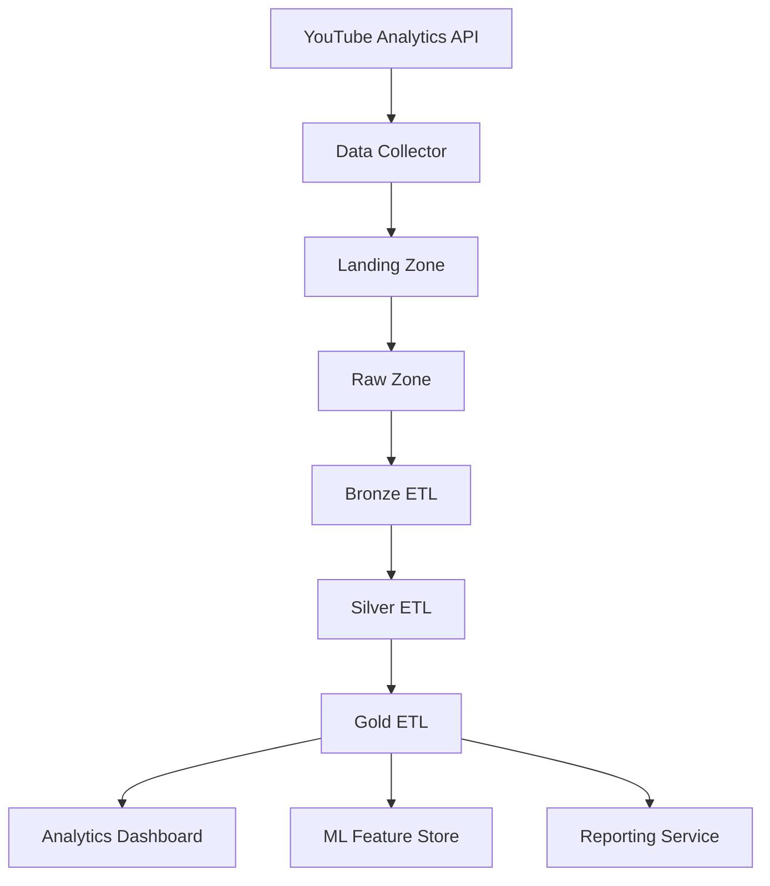
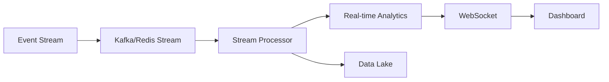

# YTEmpire Data Architecture Documentation

## Overview

YTEmpire implements a modern data lake architecture with multi-zone processing, designed to handle high-volume YouTube content data, analytics, and AI/ML workloads.

## Data Lake Architecture

### Zone-Based Architecture

```
┌─────────────────────────────────────────────────────────────┐
│                      DATA SOURCES                           │
│  YouTube API | AI Services | User Input | Analytics | Logs  │
└────────────────────┬────────────────────────────────────────┘
                     │
        ┌────────────▼────────────┐
        │    LANDING ZONE          │
        │  Raw data ingestion      │
        │  Format: JSON/CSV        │
        │  Retention: 7 days        │
        └────────────┬────────────┘
                     │
        ┌────────────▼────────────┐
        │     RAW ZONE             │
        │  Validated raw data      │
        │  Format: Parquet         │
        │  Retention: 30 days       │
        └────────────┬────────────┘
                     │
        ┌────────────▼────────────┐
        │    BRONZE ZONE           │
        │  Cleansed & deduplicated │
        │  Format: Parquet/Delta   │
        │  Retention: 90 days       │
        └────────────┬────────────┘
                     │
        ┌────────────▼────────────┐
        │    SILVER ZONE           │
        │  Transformed & enriched  │
        │  Format: Delta Lake      │
        │  Retention: 1 year        │
        └────────────┬────────────┘
                     │
        ┌────────────▼────────────┐
        │     GOLD ZONE            │
        │  Business-ready datasets │
        │  Format: Delta/Parquet   │
        │  Retention: 2 years       │
        └─────────────────────────┘
```

### Data Zone Specifications

#### Landing Zone
- **Purpose**: Initial data landing area
- **Format**: Raw format (JSON, CSV, XML)
- **Processing**: None
- **Retention**: 7 days
- **Access**: Write-only for ingestion services

#### Raw Zone
- **Purpose**: Validated raw data storage
- **Format**: Parquet
- **Processing**: Schema validation, type casting
- **Retention**: 30 days
- **Access**: Read for Bronze processing

#### Bronze Zone
- **Purpose**: Cleansed data storage
- **Format**: Parquet with Delta Lake
- **Processing**: Deduplication, null handling, basic cleansing
- **Retention**: 90 days
- **Partitioning**: By date (YYYY/MM/DD)

#### Silver Zone
- **Purpose**: Transformed business data
- **Format**: Delta Lake
- **Processing**: Joins, aggregations, feature engineering
- **Retention**: 1 year
- **Partitioning**: By date and category

#### Gold Zone
- **Purpose**: Analytics-ready datasets
- **Format**: Delta Lake / Parquet
- **Processing**: Business logic, KPIs, metrics
- **Retention**: 2 years
- **Optimization**: Z-ordered for query performance

## Data Schema Documentation

### Core Tables

#### 1. Videos Table (Silver/Gold Zone)
```sql
CREATE TABLE videos (
    video_id STRING PRIMARY KEY,
    channel_id STRING NOT NULL,
    title STRING NOT NULL,
    description TEXT,
    tags ARRAY<STRING>,
    category_id INTEGER,
    duration_seconds INTEGER,
    publish_date TIMESTAMP,
    
    -- Metrics
    view_count BIGINT,
    like_count BIGINT,
    comment_count BIGINT,
    
    -- AI Generated
    script_id STRING,
    voice_id STRING,
    thumbnail_url STRING,
    
    -- Costs
    generation_cost DECIMAL(10,4),
    
    -- Metadata
    created_at TIMESTAMP,
    updated_at TIMESTAMP,
    version INTEGER
)
PARTITIONED BY (publish_date)
CLUSTERED BY (channel_id) INTO 8 BUCKETS;
```

#### 2. Channels Table (Silver/Gold Zone)
```sql
CREATE TABLE channels (
    channel_id STRING PRIMARY KEY,
    channel_name STRING NOT NULL,
    channel_handle STRING UNIQUE,
    description TEXT,
    
    -- Stats
    subscriber_count BIGINT,
    video_count INTEGER,
    total_views BIGINT,
    
    -- Configuration
    upload_schedule JSON,
    category_focus ARRAY<STRING>,
    ai_voice_preference STRING,
    
    -- Metadata
    created_at TIMESTAMP,
    updated_at TIMESTAMP,
    is_active BOOLEAN
)
CLUSTERED BY (channel_id) INTO 4 BUCKETS;
```

#### 3. Analytics Table (Gold Zone)
```sql
CREATE TABLE analytics (
    analytics_id STRING PRIMARY KEY,
    video_id STRING NOT NULL,
    date DATE NOT NULL,
    
    -- Performance Metrics
    views INTEGER,
    watch_time_minutes DECIMAL(10,2),
    average_view_duration DECIMAL(10,2),
    impressions BIGINT,
    click_through_rate DECIMAL(5,4),
    
    -- Engagement Metrics
    likes INTEGER,
    dislikes INTEGER,
    comments INTEGER,
    shares INTEGER,
    
    -- Revenue Metrics
    estimated_revenue DECIMAL(10,2),
    ad_revenue DECIMAL(10,2),
    
    -- Demographics
    demographics JSON,
    traffic_sources JSON,
    
    FOREIGN KEY (video_id) REFERENCES videos(video_id)
)
PARTITIONED BY (date)
CLUSTERED BY (video_id) INTO 16 BUCKETS;
```

#### 4. Costs Table (Gold Zone)
```sql
CREATE TABLE costs (
    cost_id STRING PRIMARY KEY,
    resource_type STRING NOT NULL,
    resource_id STRING,
    
    -- Cost Details
    service_name STRING,
    operation STRING,
    quantity DECIMAL(10,4),
    unit_cost DECIMAL(10,6),
    total_cost DECIMAL(10,4),
    
    -- Time
    incurred_at TIMESTAMP,
    billing_period STRING,
    
    -- Attribution
    video_id STRING,
    channel_id STRING,
    user_id STRING
)
PARTITIONED BY (incurred_at)
CLUSTERED BY (service_name) INTO 4 BUCKETS;
```

## Data Flow Diagrams

### 1. Video Generation Flow

```mermaid
graph LR
    A[User Request] --> B[API Gateway]
    B --> C[Queue Service]
    C --> D[AI Script Generation]
    D --> E[Voice Generation]
    E --> F[Video Assembly]
    F --> G[YouTube Upload]
    G --> H[Data Lake Ingestion]
    H --> I[Landing Zone]
    I --> J[Bronze Processing]
    J --> K[Silver Processing]
    K --> L[Gold Analytics]
```


### 2. Analytics Pipeline Flow


### 3. Real-time Processing Flow


## Storage Requirements

### Capacity Planning

#### Current Storage Estimates (Monthly)
| Zone | Data Type | Volume | Format | Size |
|------|-----------|--------|--------|------|
| Landing | Raw JSON | 10GB | JSON | 10GB |
| Raw | Validated | 10GB | Parquet | 3GB |
| Bronze | Cleansed | 8GB | Parquet | 2.5GB |
| Silver | Transformed | 15GB | Delta | 5GB |
| Gold | Analytics | 5GB | Delta | 2GB |
| **Total** | | **48GB** | | **22.5GB** |

#### Projected Growth (Annual)
- Year 1: 270GB compressed (1TB uncompressed)
- Year 2: 810GB compressed (3TB uncompressed)
- Year 3: 2.4TB compressed (9TB uncompressed)

### Storage Configuration

#### MinIO/S3 Buckets
```
ytempire-landing/    # 7-day retention
ytempire-raw/        # 30-day retention
ytempire-bronze/     # 90-day retention
ytempire-silver/     # 1-year retention
ytempire-gold/       # 2-year retention
ytempire-archive/    # Long-term cold storage
```

#### Partitioning Strategy
- **Time-based**: YYYY/MM/DD for all zones
- **Category-based**: Additional partitioning in Silver/Gold
- **Channel-based**: For channel-specific analytics

#### Compression
- **Landing**: None (raw data)
- **Raw**: Snappy (balanced)
- **Bronze**: Snappy
- **Silver**: Zstandard (better compression)
- **Gold**: Zstandard

## Data Versioning Strategy

### Version Control System

#### 1. Schema Versioning
```python
SCHEMA_VERSIONS = {
    "videos": {
        "v1": "initial_schema",
        "v2": "added_ai_fields",
        "v3": "added_cost_tracking"
    },
    "channels": {
        "v1": "initial_schema",
        "v2": "added_configuration"
    }
}
```

#### 2. Data Versioning with Delta Lake
- **Time Travel**: Query data at any point in time
- **Rollback**: Revert to previous versions
- **Audit Trail**: Complete history of changes

```sql
-- Query historical data
SELECT * FROM videos VERSION AS OF 5;
SELECT * FROM videos TIMESTAMP AS OF '2024-01-01';

-- Rollback to previous version
RESTORE TABLE videos TO VERSION AS OF 3;
```

#### 3. Metadata Versioning
```sql
CREATE TABLE data_versions (
    version_id UUID PRIMARY KEY,
    dataset_id STRING NOT NULL,
    version_number INTEGER,
    schema_version STRING,
    created_at TIMESTAMP,
    created_by STRING,
    change_description TEXT,
    is_current BOOLEAN,
    checksum STRING
);
```

### Version Retention Policy
- **Production Data**: Keep last 10 versions
- **Development Data**: Keep last 5 versions
- **Archive**: Monthly snapshots for 2 years

## Data Quality Framework

### Quality Checks
1. **Completeness**: No critical fields missing
2. **Uniqueness**: No duplicate primary keys
3. **Validity**: Data types and ranges correct
4. **Consistency**: Referential integrity maintained
5. **Timeliness**: Data freshness within SLA

### Quality Metrics
```python
QUALITY_THRESHOLDS = {
    "completeness": 0.99,  # 99% complete
    "uniqueness": 1.0,     # 100% unique
    "validity": 0.98,      # 98% valid
    "consistency": 0.99,   # 99% consistent
    "timeliness": 0.95     # 95% on time
}
```

## Data Governance

### Access Control
- **Landing**: Write-only for services
- **Raw/Bronze**: Read for ETL processes
- **Silver**: Read for analytics teams
- **Gold**: Read for all authorized users

### Data Classification
- **Public**: Channel names, video titles
- **Internal**: Analytics, metrics
- **Confidential**: Revenue, costs
- **Restricted**: User PII, API keys

### Compliance
- GDPR compliance for EU users
- CCPA compliance for California users
- Data retention policies enforced
- Right to deletion implemented

## Monitoring & Alerting

### Key Metrics
- Data ingestion rate
- Processing latency
- Storage utilization
- Query performance
- Data quality scores

### Alerts
- Failed ingestion jobs
- Quality threshold breaches
- Storage capacity warnings
- Schema validation errors
- Version conflicts

---

*Last Updated: 2024*
*Version: 1.0*
*Maintained by: YTEmpire Data Team*